**Preface**

**About SunFounder**

SunFounder is a company focused on STEAM education with products like
open source robots, development boards, STEAM kit, modules, tools and
other smart devices distributed globally. In SunFounder, we strive to
help elementary and middle school students as well as hobbyists, through
STEAM education, strengthen their hands-on practices and problem-solving
abilities. In this way, we hope to disseminate knowledge and provide
skill training in a full-of-joy way, thus fostering your interest in
programming and making, and exposing you to a fascinating world of
science and engineering. To embrace the future of artificial
intelligence, it is urgent and meaningful to learn abundant STEAM
knowledge.

**About Sensor Kit V2.0**

This sensor kit is suitable for the Raspberry Pi model B+, 2 model B, 3
model B, 3 model B+ and 4 Model B. It includes dozens of different
modules for you to learn and we provide corresponding lessons which are
simple and useful for better understanding. Hope you can learn their
applications quickly and use them in your own projects!

In this book, we will show you circuits with both realistic
illustrations and schematic diagrams. You can go to our official website
`www.sunfounder.com <http://www.sunfounder.com>`__ to view the PDF user
manual by clicking **Learn** -> **Raspberry Pi**.

**Free Support**

   |image1|\ If you have any **TECHNICAL questions**, add a topic under
   **Community** -> **Forum** section on our website and we'll reply as
   soon as possible.

   |image2|\ For **NON-TECH questions** like order and shipment issues,
   please **send an email to**
   `service@sunfounder.com <mailto:support@sunfounder.com>`__. You're
   also welcomed to share your projects on FORUM.

 **Contents**
============

Component List 1

`What We Need? 9 <\l>`__

`Required Components 9 <\l>`__

`Optional Components   10 <\l>`__

`Preparation 11 <\l>`__

`If You Have No Screen 18 <\l>`__

`Required Components 18 <\l>`__

`Installing System 18 <\l>`__

`Connect the Raspberry Pi to the Internet 20 <\l>`__

`Start SSH 22 <\l>`__

`Get the IP Address 22 <\l>`__

`Use the SSH Remote Control 23 <\l>`__

`Remote Desktop 27 <\l>`__

`GPIO Extension Board 34 <\l>`__

`Libraries 36 <\l>`__

`RPi.GPIO 36 <\l>`__

`WiringPi 37 <\l>`__

`Download the Code 39 <\l>`__

`Lesson 1 Dual-Color LED 40 <\l>`__

`Lesson 2 RGB LED Module 43 <\l>`__

`Lesson 3 7-Color Auto-flash LED 47 <\l>`__

`Lesson 4 Relay Module 49 <\l>`__

`Lesson 5 Laser Emitter Module 53 <\l>`__

`Lesson 6 Button Module 56 <\l>`__

`Lesson 7 Tilt-Switch Module 59 <\l>`__

`Lesson 8 Vibration Switch 62 <\l>`__

`Lesson 9 IR Receiver Module 65 <\l>`__

`Lesson 10 Buzzer Module 68 <\l>`__

`Lesson 11 Reed Switch 73 <\l>`__

`Lesson 12 Photo-interrupter 77 <\l>`__

`Lesson 13 PCF8591 80 <\l>`__

`Lesson 14 Rain Detection Module 85 <\l>`__

`Lesson 15 Joystick PS2 88 <\l>`__

`Lesson 16 Potentiometer Module 91 <\l>`__

`Lesson 17 Hall Sensor 95 <\l>`__

`Lesson 18 Temperature Sensor 101 <\l>`__

`Lesson 19 Sound Sensor 108 <\l>`__

`Lesson 20 Photoresistor Module 112 <\l>`__

`Lesson 21 Flame Sensor 115 <\l>`__

`Lesson 22 Gas Sensor 118 <\l>`__

`Lesson 23 IR Remote Control 122 <\l>`__

`Lesson 24 Touch Switch 129 <\l>`__

`Lesson 25 Ultrasonic Ranging Module 132 <\l>`__

`Lesson 26 DS18B20 Temperature Sensor 135 <\l>`__

`Lesson 27 Rotary Encoder Module 139 <\l>`__

`Lesson 28 Humiture Sensor 143 <\l>`__

`Lesson 29 IR Obstacle Avoidance Module 146 <\l>`__

`Lesson 30 I2C LCD1602 149 <\l>`__

`Lesson 31 Barometer-BMP180 Module 152 <\l>`__

`Lesson 32 MPU6050 Gyro Acceleration Sensor 155 <\l>`__

`Lesson 33 RTC DS1302 158 <\l>`__

`Lesson 34 Tracking Sensor 162 <\l>`__

`Lesson 35 Intelligent Temperature Measurement System 165 <\l>`__

`Appendix: I2C Configuration 170 <\l>`__

Component List
==============

+----+----------------------+--------+---------------------------------+
| N  | Name                 | Qty    | Component                       |
| o. |                      |        |                                 |
+----+----------------------+--------+---------------------------------+
| 1  | Dual-Color LED       | 1      | |C:\                            |
|    |                      |        | Users\sunfounder\Desktop\sensor |
|    |                      |        | pisd 抠图\Dual Color            |
|    |                      |        | LED.pngDual Color LED|          |
+----+----------------------+--------+---------------------------------+
| 2  | RGB LED              | 1      | |C:\                            |
|    |                      |        | Users\sunfounder\Desktop\sensor |
|    |                      |        | pisd 抠图\RGB LED.pngRGB LED|   |
+----+----------------------+--------+---------------------------------+
| 3  | Auto Flash LED       | 1      | |C:\                            |
|    |                      |        | Users\sunfounder\Desktop\sensor |
|    |                      |        | pisd 抠图\Auto Flash            |
|    |                      |        | LED.pngAuto Flash LED|          |
+----+----------------------+--------+---------------------------------+
| 4  | Relay Module         | 1      | |C:\                            |
|    |                      |        | Users\sunfounder\Desktop\sensor |
|    |                      |        | pisd 抠图\Relay Module.pngRelay |
|    |                      |        | Module|                         |
+----+----------------------+--------+---------------------------------+
| 5  | Laser Emitter        | 1      | |C:\                            |
|    |                      |        | Users\sunfounder\Desktop\sensor |
|    |                      |        | pisd 抠图\Laser                 |
|    |                      |        | Emitter.pngLaser Emitter|       |
+----+----------------------+--------+---------------------------------+
| 6  | Button               | 1      | |C:\                            |
|    |                      |        | Users\sunfounder\Desktop\sensor |
|    |                      |        | pisd 抠图\Button.pngButton|     |
+----+----------------------+--------+---------------------------------+
| 7  | Tilt-Switch          | 1      | |C:\                            |
|    |                      |        | Users\sunfounder\Desktop\sensor |
|    |                      |        | pisd 抠图\Tilt Swich.pngTilt    |
|    |                      |        | Swich|                          |
+----+----------------------+--------+---------------------------------+
| 8  | Vibration Switch     | 1      | |C:\                            |
|    |                      |        | Users\sunfounder\Desktop\sensor |
|    |                      |        | pisd 抠图\Vibration             |
|    |                      |        | Switch.pngVibration Switch|     |
+----+----------------------+--------+---------------------------------+
| 9  | IR Receiver          | 1      | |C:\                            |
|    |                      |        | Users\sunfounder\Desktop\sensor |
|    |                      |        | pisd 抠图\IR Receiver.pngIR     |
|    |                      |        | Receiver|                       |
+----+----------------------+--------+---------------------------------+
| 10 | Active Buzzer        | 1      | |C:\                            |
|    |                      |        | Users\sunfounder\Desktop\sensor |
|    |                      |        | pisd 抠图\Active                |
|    |                      |        | Buzzer.pngActive Buzzer|        |
+----+----------------------+--------+---------------------------------+
| 11 | Passive Buzzer       | 1      | |C:\                            |
|    |                      |        | Users\sunfounder\Desktop\sensor |
|    |                      |        | pisd 抠图\Passive               |
|    |                      |        | Buzzer.pngPassive Buzzer|       |
+----+----------------------+--------+---------------------------------+
| 12 | Reed Switch          | 1      | |C:\                            |
|    |                      |        | Users\sunfounder\Desktop\sensor |
|    |                      |        | pisd 抠图\Reed Switch.pngReed   |
|    |                      |        | Switch|                         |
+----+----------------------+--------+---------------------------------+
| 13 | Photo-interrupter    | 1      | |C:\                            |
|    |                      |        | Users\sunfounder\Desktop\sensor |
|    |                      |        | pisd                            |
|    |                      |        | 抠图\Photo-in                   |
|    |                      |        | terrupter.pngPhoto-interrupter| |
+----+----------------------+--------+---------------------------------+
| 14 | AD/DA Converter      | 1      | |C:\                            |
|    |                      |        | Users\sunfounder\Desktop\sensor |
|    | PCF8591              |        | pisd 抠图\AD-DA                 |
|    |                      |        | Converter.pngAD-DA Converter|   |
+----+----------------------+--------+---------------------------------+
| 15 | Raindrop Sensor      | 1      | |C:\                            |
|    |                      |        | Users\sunfounder\Desktop\sensor |
|    |                      |        | pisd 抠图\Raindrop              |
|    |                      |        | Sensor.pngRaindrop              |
|    |                      |        | Sensor|\ |C:\                   |
|    |                      |        | Users\sunfounder\Desktop\sensor |
|    |                      |        | pisd 抠图\Raindrop Sensor -     |
|    |                      |        | .pngRaindrop Sensor -|          |
+----+----------------------+--------+---------------------------------+
| 16 | Joystick PS2         | 1      | |C:\                            |
|    |                      |        | Users\sunfounder\Desktop\sensor |
|    |                      |        | pisd 抠图\Joystick              |
|    |                      |        | PS2.pngJoystick PS2|            |
+----+----------------------+--------+---------------------------------+
| 17 | Potentiometer        | 1      | |C:\                            |
|    |                      |        | Users\sunfounder\Desktop\sensor |
|    |                      |        | pisd                            |
|    |                      |        | 抠图\                           |
|    |                      |        | Potentiometer.pngPotentiometer| |
+----+----------------------+--------+---------------------------------+
| 18 | Analog Hall Sensor   | 1      | |C:\                            |
|    |                      |        | Users\sunfounder\Desktop\sensor |
|    |                      |        | pisd 抠图\Analog Hall           |
|    |                      |        | Sensor.pngAnalog Hall Sensor|   |
+----+----------------------+--------+---------------------------------+
| 19 | Hall Switch Sensor   | 1      | |C:\                            |
|    |                      |        | Users\sunfounder\Desktop\sensor |
|    |                      |        | pisd 抠图\Hall Switch.pngHall   |
|    |                      |        | Switch|                         |
+----+----------------------+--------+---------------------------------+
| 20 | Analog Temperature   | 1      | |C:\                            |
|    | Sensor               |        | Users\sunfounder\Desktop\sensor |
|    |                      |        | pisd 抠图\Analog Temperature    |
|    |                      |        | Sensor.pngAnalog Temperature    |
|    |                      |        | Sensor|                         |
+----+----------------------+--------+---------------------------------+
| 21 | Thermistor           | 1      | |C:\                            |
|    |                      |        | Users\sunfounder\Desktop\sensor |
|    |                      |        | pisd                            |
|    |                      |        | 抠图\Thermistor.pngThermistor|  |
+----+----------------------+--------+---------------------------------+
| 22 | Sound Sensor         | 1      | |C:\                            |
|    |                      |        | Users\sunfounder\Desktop\sensor |
|    |                      |        | pisd 抠图\Sound Sensor.pngSound |
|    |                      |        | Sensor|                         |
+----+----------------------+--------+---------------------------------+
| 23 | Photoresistor        | 1      | |C:\                            |
|    |                      |        | Users\sunfounder\Desktop\sensor |
|    |                      |        | pisd                            |
|    |                      |        | 抠图\                           |
|    |                      |        | Photoresistor.pngPhotoresistor| |
+----+----------------------+--------+---------------------------------+
| 24 | Flame Sensor         | 1      | |C:\                            |
|    |                      |        | Users\sunfounder\Desktop\sensor |
|    |                      |        | pisd 抠图\Flame Sensor.pngFlame |
|    |                      |        | Sensor|                         |
+----+----------------------+--------+---------------------------------+
| 25 | Gas Sensor           | 1      | |C:\                            |
|    |                      |        | Users\sunfounder\Desktop\sensor |
|    |                      |        | pisd 抠图\Gas Sensor.pngGas     |
|    |                      |        | Sensor|                         |
+----+----------------------+--------+---------------------------------+
| 26 | Remote Control       | 1      | |C:\                            |
|    |                      |        | Users\sunfounder\Desktop\sensor |
|    |                      |        | pisd 抠图\Remote                |
|    |                      |        | Control.pngRemote Control|      |
+----+----------------------+--------+---------------------------------+
| 27 | Touch Switch         | 1      | |C:\                            |
|    |                      |        | Users\sunfounder\Desktop\sensor |
|    |                      |        | pisd 抠图\Touch Switch.pngTouch |
|    |                      |        | Switch|                         |
+----+----------------------+--------+---------------------------------+
| 28 | Ultrasonic           | 1      | |C:\                            |
|    |                      |        | Users\sunfounder\Desktop\sensor |
|    |                      |        | pisd                            |
|    |                      |        | 抠图\Ultrasonic.pngUltrasonic|  |
+----+----------------------+--------+---------------------------------+
| 29 | Temperature Sensor   | 1      | |C:\                            |
|    | DS18B20              |        | Users\sunfounder\Desktop\sensor |
|    |                      |        | pisd 抠图\Temperature           |
|    |                      |        | sensor.pngTemperature sensor|   |
+----+----------------------+--------+---------------------------------+
| 30 | Rotary Encoder       | 1      | |C:\                            |
|    |                      |        | Users\sunfounder\Desktop\sensor |
|    |                      |        | pisd 抠图\_Rotary               |
|    |                      |        | Encoder.png_Rotary Encoder|     |
+----+----------------------+--------+---------------------------------+
| 31 | Humiture Sensor      | 1      | |C:\                            |
|    |                      |        | Users\sunfounder\Desktop\sensor |
|    |                      |        | pisd 抠图\Humiture              |
|    |                      |        | Sensor.pngHumiture Sensor|      |
+----+----------------------+--------+---------------------------------+
| 32 | IR Obstacle Module   | 1      | |C:\                            |
|    |                      |        | Users\sunfounder\Desktop\sensor |
|    |                      |        | pisd 抠图\IR Obstacle           |
|    |                      |        | Module.pngIR Obstacle Module|   |
+----+----------------------+--------+---------------------------------+
| 33 | I2C LCD1602 Module   | 1      | |C:\                            |
|    |                      |        | Users\sunfounder\Desktop\sensor |
|    |                      |        | pisd 抠图\LCD 1602.pngLCD 1602| |
+----+----------------------+--------+---------------------------------+
| 34 | Barometer-BMP180     | 1      | |IMG_256|                       |
+----+----------------------+--------+---------------------------------+
| 35 | MPU6050 Module       | 1      | |C:\                            |
|    |                      |        | Users\sunfounder\Desktop\sensor |
|    |                      |        | pisd 抠图\MPU6050               |
|    |                      |        | Module.pngMPU6050 Module|       |
+----+----------------------+--------+---------------------------------+
| 36 | RTC-DS1302 Module    | 1      | |C:\                            |
|    |                      |        | Users\sunfounder\Desktop\sensor |
|    |                      |        | pisd 抠图\RTC-DS1302            |
|    |                      |        | Module.pngRTC-DS1302 Module|    |
+----+----------------------+--------+---------------------------------+
| 37 | Tracking Sensor      | 1      | |C:\                            |
|    |                      |        | Users\sunfounder\Desktop\sensor |
|    |                      |        | pisd 抠图\Tracking              |
|    |                      |        | Sensor.pngTracking Sensor|      |
+----+----------------------+--------+---------------------------------+
| 38 | Breadboard           | 1      | |\_MG_7704_副本.jpg|            |
+----+----------------------+--------+---------------------------------+
| 39 | T-Cobbler            | 1      | |D:\Raspberry                   |
|    |                      |        | Pi\图片\_MG_6473.jpg|           |
+----+----------------------+--------+---------------------------------+
| 40 | 40-pin Ribbon Cable  | 1      | |image3|                        |
|    | for T-Cobbler        |        |                                 |
+----+----------------------+--------+---------------------------------+
| 41 | 2-Pin Anti-reverse   | 2      | |F:\SunFounder\Kit\Sensor Kit   |
|    | Cable                |        | for                             |
|    |                      |        | Rpi2\图2015-7-3\2015-7-3\小零件 |
|    |                      |        | 裁剪\_MG_0601.JPG|              |
+----+----------------------+--------+---------------------------------+
| 42 | 3-Pin Anti-reverse   | 5      | |F:\SunFounder\Kit\Sensor Kit   |
|    | Cable                |        | for                             |
|    |                      |        | Rpi2\图2015-7-3\2015-7-3\小零件 |
|    |                      |        | 裁剪\_MG_9999.JPG|              |
+----+----------------------+--------+---------------------------------+
| 43 | 4-Pin Anti-reverse   | 5      | |F:\SunFounder\Kit\Sensor Kit   |
|    | Cable                |        | for                             |
|    |                      |        | Rpi2\图2015-7-3\2015-7-3\小零件 |
|    |                      |        | 裁剪\_MG_9996.JPG|              |
+----+----------------------+--------+---------------------------------+
| 44 | 5-Pin Anti-reverse   | 5      | |F:\SunFounder\Kit\Sensor Kit   |
|    | Cable                |        | for                             |
|    |                      |        | Rpi2\图2015-7-3\2015-7-3\小零件 |
|    |                      |        | 裁剪\_MG_0002.JPG|              |
+----+----------------------+--------+---------------------------------+
| 45 | Jumper wires         | 20     | |image4|                        |
|    |                      |        |                                 |
|    | (Male to Female)     |        |                                 |
+----+----------------------+--------+---------------------------------+
| 46 | Jumper wires         | 10     | |C:\Users\Admin                 |
|    |                      |        | istrator\Desktop\树莓派全部文档 |
|    | (Male to Male)       |        | 2.18\_MG_7478.png|              |
+----+----------------------+--------+---------------------------------+

What We Need?
=============

**Required Components**
-----------------------

**Raspberry Pi**

The Raspberry Pi is a low cost, credit-card sized computer that plugs
into a computer monitor or TV, and uses a standard keyboard and mouse.
It is a capable little device that enables people of all ages to explore
computing, and to learn how to program in languages like Scratch and
Python.

Our kit applies to the following versions of the product of Raspberry Pi
:

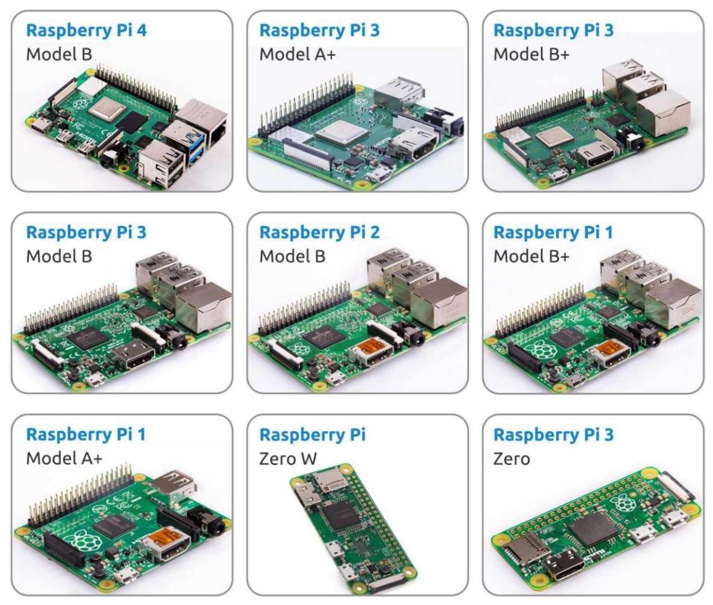

**Power Adapter**

To connect to a power socket, the Raspberry Pi has a micro USB port (the
same found on many mobile phones). You will need a power supply which
provides at least 2.5 amps.

**Micro SD Card**

Your Raspberry Pi needs an SD card to store all its files and the
Raspberry Pi OS. You will need a micro SD card with a capacity of at
least 8 GB.

**
**

**Optional Components  **
-------------------------

**Screen**

To view the desktop environment of Raspberry Pi, you need to use the
screen that can be a TV screen or a computer monitor. If the screen has
built-in speakers, the Pi plays sounds via them.

**Mouse & Keyboard**

When you use a screen , a USB keyboard and a USB mouse are also needed.

**HDMI**

The Raspberry Pi has a HDMI output port that is compatible with the HDMI
ports of most modern TV and computer monitors. If your screen has only
DVI or VGA ports, you will need to use the appropriate conversion line.

**Case**

You can put the Raspberry Pi in a case; by this means, you can protect
your device.

**Sound or Earphone**

The Raspberry Pi is equipped with an audio port about 3.5 mm that can be
used when your screen has no built-in speakers or when there is no
screen operation.

**
**

Preparation
===========

In this chapter, we firstly learn to start up Raspberry Pi.

Depending on the different devices you use, you can start up the
Raspberry Pi in different methods. We have two situations: having a
screen or no screen, and you can refer to relevant tutorials
respectively. If your Raspberry Pi is set up, you can skip the chapter
and go into the next chapter.

**If You Have a Screen**
------------------------

If you have a screen, you can use the NOOBS (New Out Of Box System) to
install the Raspberry Pi OS.

.. _required-components-1:

**Required Components**
~~~~~~~~~~~~~~~~~~~~~~~

+-----------------------------------+----------------------------------+
| Any Raspberry Pi                  | 1 \* Power Adapter               |
+-----------------------------------+----------------------------------+
| 1 \* Monitor                      | 1 \* Monitor Power Adapter       |
+-----------------------------------+----------------------------------+
| 1 \* HDMI cable                   | 1 \* Mirco SD card               |
+-----------------------------------+----------------------------------+
| 1 \* Mouse                        | 1 \* Keyboard                    |
+-----------------------------------+----------------------------------+
| 1 \* Personal Computer            |                                  |
+-----------------------------------+----------------------------------+

**Procedures**
~~~~~~~~~~~~~~

**Step 1**

To download NOOBS from your PC, you can choose **NOOBS** or **NOOBS LITE
-** the only difference is that there is a built-in offline Raspberry Pi
OS installer in **NOOBS**, while the **NOOBS LITE** can only be operated
online. Here, you are suggested to use the former.

Here is the download address of Noobs:
https://www.raspberrypi.org/downloads/noobs/

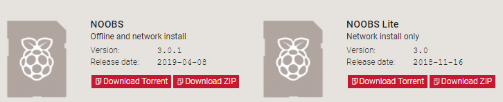

**Step 2**

Plug in the Micro SD reader and format the Micro SD card with the SD
Formatter (https://www.sdcard.org/downloads/formatter/index.html). If
there are some important files in the Micro SD card, please backup them
first.

**Step 3**

Next, you will need to extract the files from the NOOBS zip archive you
downloaded from the Raspberry Pi website.

-  Find the downloaded archive — by default, it should be in your
   Downloads folder.

-  Double-click on it to extract the files, and keep the resulting
   Explorer/Finder window open.

Finally Select all the files in the NOOBS folder and copy them to the SD
card.

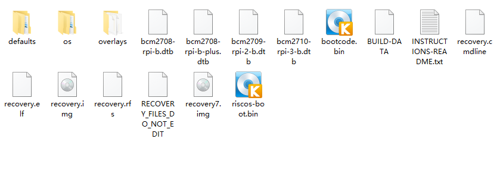

**Step 4**

All the files transferred, the SD card pops up.

**Step 5**

Insert the SD card into the Raspberry Pi. In addition, connect the
screen, and mouse to it. Finally power up the Raspberry Pi with a power
adapter.

**Step 6**

It will go to the NOOBS interface after starting up. If you use NOOBS
LITE, you need to select Wi-Fi networks (w) first. Tick the checkbox of
the Raspbian and click Install in the top left corner. The NOOBS will
help to conduct the installation automatically. This process will take a
few minutes.

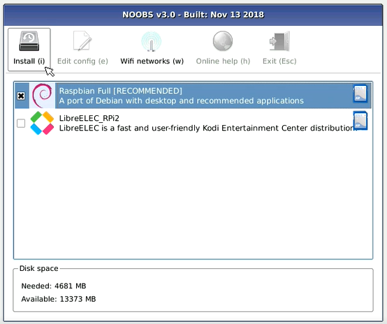

**Step 7**

When the installation is done, the system will restart automatically and
the desktop of the system will appear.

.. image:: media/image56.png
   :alt: IMG_261
   :width: 5.91736in
   :height: 3.31319in

**Step 8**

If you run Raspberry Pi for the first time, the application of “Welcome
to Raspberry Pi”  pops up and guides you to perform the initial setup.

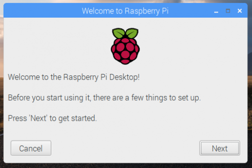

**Step 9**

Set country/region, language and time zone, and then click “next” again.

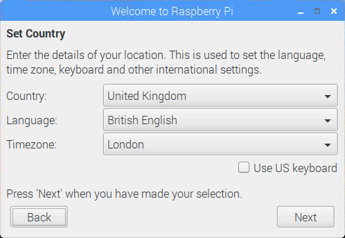

**
**

**Step 10**

Input the new password of Raspberry Pi and click “Next”.

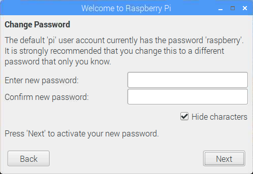

**Step 11**

Connect the Raspberry Pi to WIFI and click "Next".

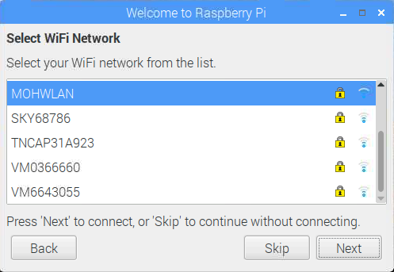

**
**

**Step 12**

Retrieve update.

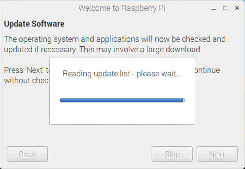

**Step 13**

Click "Done" to complete the Settings.

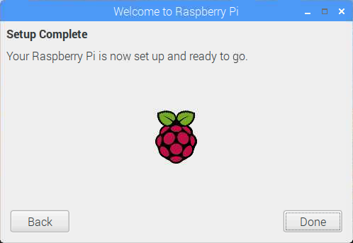

**Step 14**

Click the Terminal icon on the top left corner.

.. image:: media/image56.png
   :alt: IMG_261
   :width: 6.74653in
   :height: 2.94306in

**Step 15**

Then you can input the commands on the Terminal.

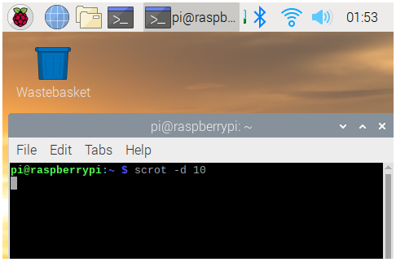

Note: You can check the complete tutorial of NOOBS on the official
website of the Raspberry
Pi: https://www.raspberrypi.org/help/noobs-setup/.

**
**

**If You Have No Screen**
-------------------------

If we don't have a screen, we can directly write the Raspberry Pi OS
system to the Micro SD card and we can control the Raspberry Pi on PC
remotely by directly modifying the configuration file of the network
settings in the Micro SD card.

.. _required-components-2:

Required Components
~~~~~~~~~~~~~~~~~~~

+----------------------------------+-----------------------------------+
| Any Raspberry Pi                 | 1 \* Power Adapter                |
+----------------------------------+-----------------------------------+
| 1 \* Micro SD card               | 1 \* Personal computer            |
+----------------------------------+-----------------------------------+

Installing System
~~~~~~~~~~~~~~~~~

There are 2 ways to install the system, **Using Raspberry Pi Imager** or
**Using Raspberry Pi OS**. **Using Raspberry Pi Imager** is a kind of
method recommended by Raspberry Pi official website for beginners with
which you can directly write the Raspberry Pi OS into SD card after
downloading Raspberry Pi Imager. However, each time the system is
reinstalled, this method can take several hours.

In the later method, you need to download Raspberry Pi OS image at
first, then use the tool to write it to your SD card, which can be
confusing. But once you successfully finish the flashing at the first
time, it only takes about 10 minutes to flash again.

-  **Using Raspberry Pi Imager**

Raspberry Pi have developed a graphical SD card writing tool that works
on Mac OS, Ubuntu 18.04 and Windows, and is the easiest option for most
users as it will download the image and install it automatically to the
SD card.

1) Download the latest version of `Raspberry Pi
   Imager <https://www.raspberrypi.org/downloads/>`__\ (https://www.raspberrypi.org/downloads/) and
   install it.

2) Connect an SD card reader with the SD card inside.

3) Open Raspberry Pi Imager and choose **Raspberry Pi OS (other) ->
   Raspberry Pi OS Full (32-bit)**.

   |微信截图_20200628104259| |微信截图_20200628104336|

4) Choose the SD card you wish to write your image to.

5) Review your selections and click 'WRITE' to begin writing data to the
   SD card.

**Note:** If using the Raspberry Pi Imager on Windows 10 with Controlled
Folder Access enabled, you will need to explicitly allow the Raspberry
Pi Imager permission to write the SD card. If this is not done,
Raspberry Pi Imager will fail with a "failed to write" error.

-  **Using Raspberry Pi OS**

**Step 1:** Prepare the tool of image burning. Here we use the
**balenaEtcher**. You can download the software from the link:
https://www.balena.io/etcher/

**Step 2:** Download the complete image on the official website by
clicking this link:
https://www.raspberrypi.org/downloads/raspberry-pi-os/. There are three
different kinds of Raspberry Pi OS system available, You are recommend
to install the version：\ **Raspberry Pi OS with desktop and recommended
software**.

**Step 3:** Unzip the package downloaded and you will see the *.img*
file inside.

**Note:** The Raspberry Pi OS with desktop image contained in the ZIP
archive is over 4GB in size and uses
the `ZIP64 <https://en.wikipedia.org/wiki/Zip_(file_format)#ZIP64>`__ format.
To uncompress the archive, a unzip tool that supports ZIP64 is required.
The following zip tools support ZIP64: 7-Zip (Windows), The Unarchiver
(Mac) and Unzip (Linux).

**Step 4:** Plug the USB card reader into the computer, then you can
burn the **.img** file with the Etcher.

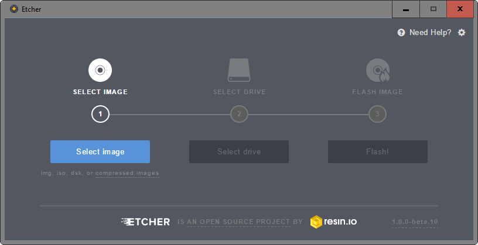

At this point, Raspberry Pi OS is installed. **Keep the USB card reader
plug in your computer**. If you want to apply it, next you need to
complete the settings accordingly.

Connect the Raspberry Pi to the Internet
~~~~~~~~~~~~~~~~~~~~~~~~~~~~~~~~~~~~~~~~

There are two methods to help get the Raspberry Pi connected to the
network: the first one is using a network cable, the other way is using
WIFI. We will talk in detail about how to connect via WIFI as below.

Since the 3B and above version of the product, Raspberry Pi has a
built-in Wifi function. If what you use is the early version of
Raspberry Pi, a USB WIFI Adapter is needed. Log in the website,
https://elinux.org/RPi_USB_Wi-Fi_Adapters for more.

.. image:: media/image67.jpeg
   :alt: IMG_270
   :width: 3.98056in
   :height: 2.21736in

If you want to use the WIFI function, you need to modify a WIFI
configuration file wpa_supplicant.conf in the SD card by your PC that is
located in the directory /etc/wpa_supplicant/.

If your personal computer is working on a linux system, you can access
the directory directly to modify the configuration file; however, if
your PC use Windows system, then you can't access the directory and what
you need next is to go to the directory, */boot/*  to create a new file
with the same name, **wpa_supplicant.conf**.

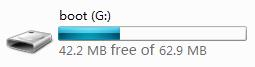

Input the following content in the file.

ctrl_interface=DIR=/var/run/wpa_supplicant GROUP=netdev

update_config=1

country=COUNTRY

network={

ssid="SSID"

psk="PASSWORD"

key_mgmt=WPA-PSK

priority=1

}

**COUNTRY** should be set the two-letter `ISO/IEC alpha2
code <https://en.wikipedia.org/wiki/ISO_3166-1_alpha-2#Officially_assigned_code_elements>`__ for
the country in which you are using your Raspberry Pi, please refer to
the following link:

https://en.wikipedia.org/wiki/ISO_3166-1_alpha-2#Officially_assigned_code_elements

You need to replace “\ **SSID**\ ” with your custom name of WiFi and
“\ **PASSWORD**\ ” with your password.

By doing these, the Raspberry Pi OS will move this file to the target
directory automatically to overwrite the original WIFI configuration
file when it runs next time.

Start SSH
~~~~~~~~~

To use the function of remote control of the Raspberry Pi, you need to
start SSH firstly that is a more reliable protocol providing security
for remote login sessions and other network services. Generally, SSH of
Raspberry Pi is in a disabled state. Additionally, if you want to run
it, you need to create a file named SSH under directory /boot/.

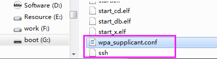

Now, the Raspberry Pi OS is configured. When the SD card is inserted
into the Raspberry Pi, you can use it immediately.

Get the IP Address
~~~~~~~~~~~~~~~~~~

After the Raspberry Pi is connected to WIFI, we need to get the IP
address of it. There are many ways to know the IP address, and two of
them are listed as follows.

**1. Checking via the router**

If you have permission to log in the router(such as a home network), you
can check the addresses assigned to Raspberry Pi on the admin interface
of router.

The default hostname of the Raspberry Pi OS is **raspberrypi**, and you
need to find it. (If you are using ArchLinuxARM system, please find
alarmpi.)

**2. Network Segment Scanning**

You can also use network scanning to look up the IP address of Raspberry
Pi. You can apply the software, Advanced IP scanner and so on.

Scan the IP range set, and the name of all connected devices will be
displayed. Similarly, the default hostname of the Raspberry Pi OS is
**raspberrypi**, now you need to find the hostname.

Use the SSH Remote Control
~~~~~~~~~~~~~~~~~~~~~~~~~~

We can open the Bash Shell of Raspberry Pi by applying SSH. Bash is the
standard default shell of Linux. The Shell itself is a program written
in C that is the bridge linking the customers and Unix/Linux. Moreover,
it can help to complete most of the work needed.

**For Linux or/Mac OS X Users**
^^^^^^^^^^^^^^^^^^^^^^^^^^^^^^^

**Step 1**

Go to **Applications**->\ **Utilities**, find the **Terminal**, and open
it.

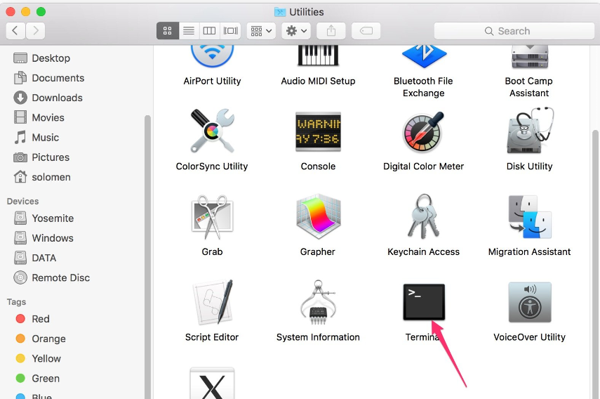

**Step 2**

Type in **ssh pi@ip_address** . “pi”is your username and “ip_address” is
your IP address. For example:

   ssh pi\ **@**\ 192\ **.**\ 168\ **.**\ 18\ **.**\ 197

**Step 3**

Input ”yes”.

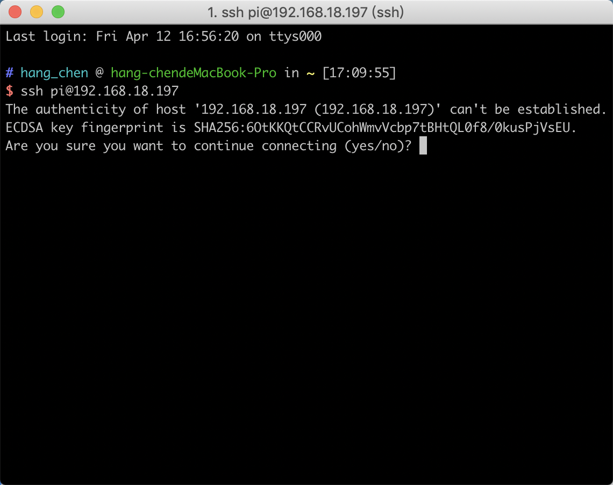

**Step 4**

Input the passcode and the default password is **raspberry**.

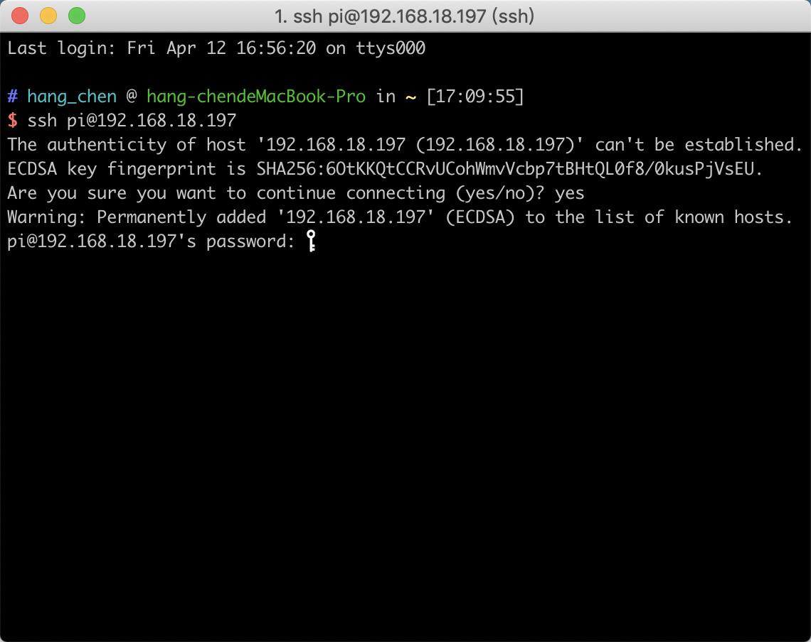

**Step 5**

We now get the Raspberry Pi connected and are ready to go to the next
step.

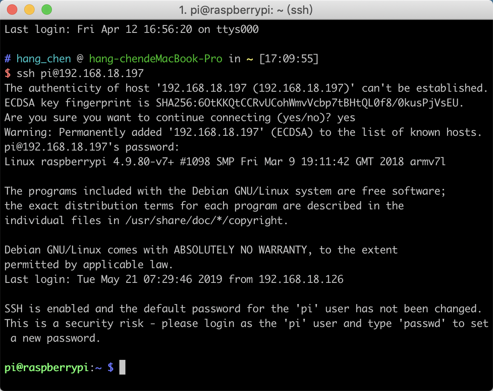

**Note**: When you input the password, the characters do not display on
window accordingly, which is normal. What you need is to input the
correct passcode.

**
**

**For Windows Users**
^^^^^^^^^^^^^^^^^^^^^

If you're a Windows user, you can use SSH with the application of some
software. Here, we recommend PuTTY.

**Step 1**

Download PuTTY.

**Step 2**

Open PuTTY and click **Session** on the left tree-alike structure. Enter
the IP address of the RPi in the text box under **Host Name (or IP
address)** and 22 under **Port** (by default it is 22).

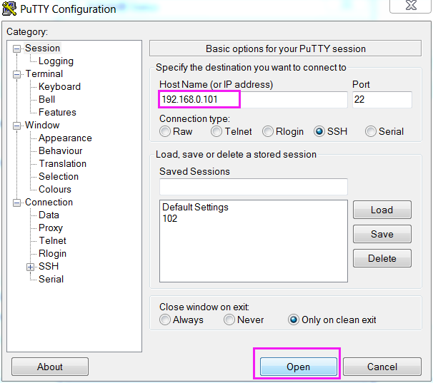

**Step 3**

Click **Open**. Note that when you first log in to the Raspberry Pi with
the IP address, there prompts a security reminder. Just click **Yes**.

**Step 4**

When the PuTTY window prompts “\ **login as:”**, type in
“\ **pi”**\ (the user name of the RPi), and **password: “**\ raspberry”
(the default one, if you haven't changed it).

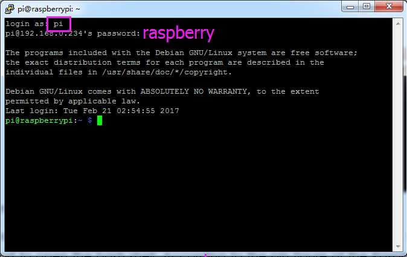

**Step 5**

Here, we get the Raspberry Pi connected and it is time to conduct the
next steps.

**Note**: When you input the password, the characters do not display on
window accordingly, which is normal. What you need is to input the
correct password.

**
**

Remote Desktop
~~~~~~~~~~~~~~

If you are not satisfied with using the command window to control the
Raspberry Pi, you can also use the remote desktop function, which can
help us manage the files in the Raspberry Pi easily. There are two ways
to control the desktop of the Raspberry Pi remotely : **VNC** and
**XRDP**.

**VNC** 
^^^^^^^

You can use the function of remote desktop through VNC.

**Enable VNC service**

The VNC service has been installed in the system. By default, VNC is
disabled. You need to enable it in config.

**Step 1**

Input the following command:

sudo raspi-config

**Step 2**

On the config interface, select “\ **Interfacing Options**\ ” by the
forward and backward keys.

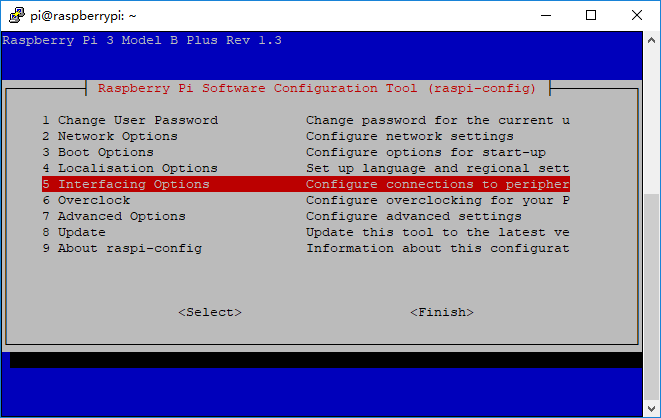

**
**

**Step 3**

Select **VNC**.

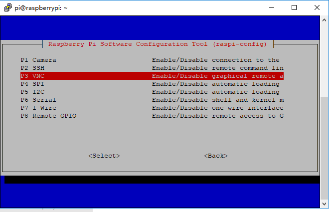

**Step 4**

Select **Yes -> OK -> Finish** to exit the configuration.

.. image:: media/image78.png
   :alt: IMG_283
   :width: 5.03125in
   :height: 3.34583in

**
**

**Login to VNC**

**Step 1**

You need to install the VNC Viewer on personal computer. After the
installation is done, open it.

**Step 2**

Then select “\ **New connection**\ ”.

   .. image:: media/image79.png
      :alt: IMG_285
      :width: 3.67708in
      :height: 1.66667in

**Step 3**

Input IP address of Raspberry Pi and any **name**.

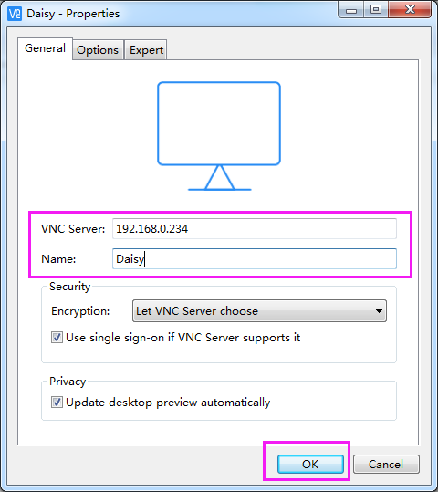

**Step 4**

Double click the **connection** just created:

.. image:: media/image81.png
   :alt: IMG_287
   :width: 4.57292in
   :height: 2.98958in

**Step 5**

Enter Username (**pi**) and Password (**raspberry** by default).

.. image:: media/image82.png
   :alt: IMG_288
   :width: 5.20833in
   :height: 3.75in

**Step 6**

Now you can see the desktop of the Raspberry Pi:

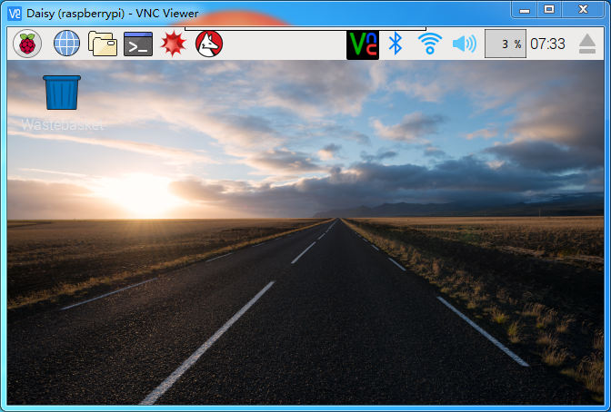

**XRDP**
^^^^^^^^

xrdp provides a graphical login to remote machines using RDP (Microsoft
Remote Desktop Protocol).

**Install XRDP**

**Step 1**

Login to Raspberry Pi by using SSH.

**Step 2**

Input the following instructions to install XRDP.

  sudo apt-get update

  sudo apt-get install xrdp

**Step 3**

Later, the installation starts.

Enter "Y", press key “Enter” to confirm.

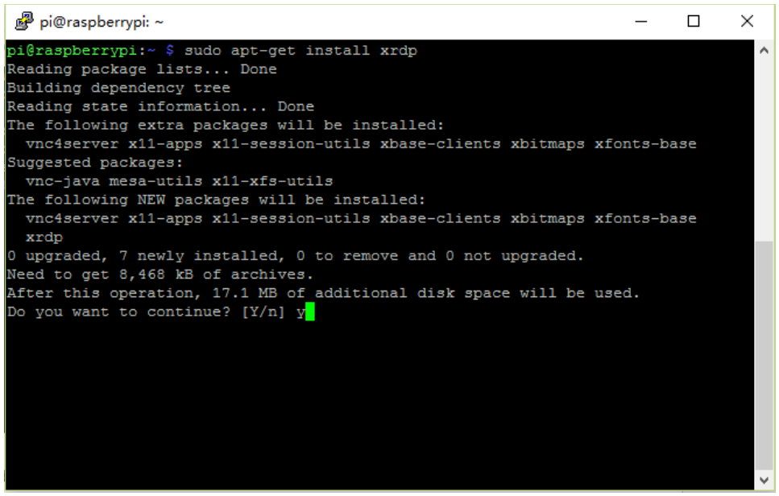

**Step 4**

After the installation is completed, you can use Windows remote desktop
applications to login to your RPi.

**Login to XRDP**

**Step 1**

If you are a Windows user, you can use the Remote Desktop feature that
comes with Windows. If you are a Mac user, you can download and use
Microsoft Remote Desktop from the APP Store, and there is not much
difference between the two. The next example is Windows remote desktop.

**Step 2**

Type in“mstsc” in Run (WIN+R) to open the Remote Desktop Connection, and
input the IP address of Raspberry Pi, then click on “Connect”.

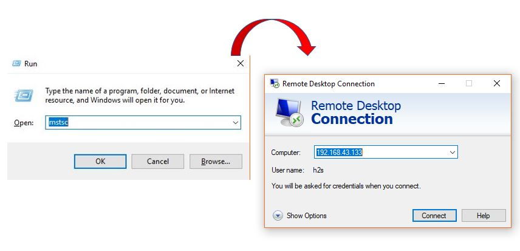

**Step 3**

There will be xrdp login screen. Enter the user name and password of RPi
and click OK. By default, the user name of Raspberry Pi is **“pi”** and
the password is **“raspberry”**.

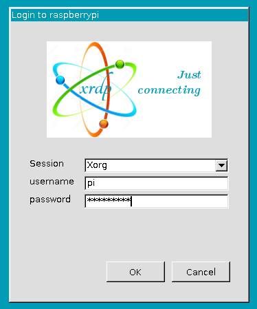

**Step 4**

Here, you successfully login to RPi by using the remote desktop.

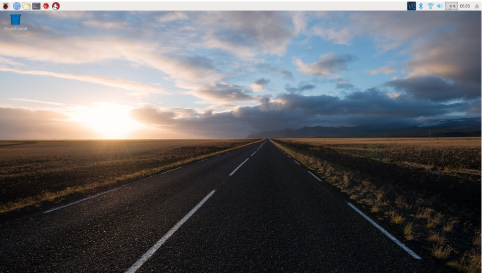

GPIO Extension Board
====================

**Connect to Raspberry Pi**

Before starting to learn the commands, you first need to know more about
the pins of the Raspberry Pi, which is key to the subsequent study.

We can easily lead out pins of the Raspberry Pi to breadboard by GPIO
Extension Board to avoid GPIO damage caused by frequent plugging in or
out. This is our 40-pin GPIO Extension Board and GPIO cable for
Raspberry Pi model B+, 2 model B and 3, 4 model B.

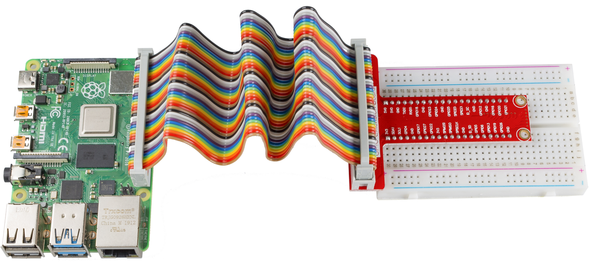

**Pin Number**

| The pins of Raspberry Pi have three kinds of ways to name and they are
  wiringPi, BCM and Board. Among these naming methods, 40-pin GPIO
  Extension board uses the naming method, BCM. But for some special
  pins, such as I2C port and SPI port, they use the Name that comes with
  themselves. The following table shows us the naming methods of
  WiringPi, Board and the intrinsic Name of each pin on GPIO Extension
  board. For example, for the GPIO17, the Board naming method of it is
  11, the wiringPi naming method is 0, and the intrinsic naming method
  of it is GPIO0.
| Note:
| 1）In C Language, what is used is the naming method WiringPi.
| 2）In Python Language, the applied naming methods are Board and BCM,
  and the function GPIO.setmode() is used to set them.

+--------+-------+-------+------+-------+-------+--------+---------+
| **     | **    | **Bo  | **B  |       | **Bo  | **Wiri | *       |
| Name** | Wirin | ard** | CM** |       | ard** | ngPi** | *Name** |
|        | gPi** |       |      |       |       |        |         |
+--------+-------+-------+------+-------+-------+--------+---------+
|        |       | *     |      |       |       |        |         |
|        |       | *GPIO |      |       |       |        |         |
|        |       | Exte  |      |       |       |        |         |
|        |       | ntion |      |       |       |        |         |
|        |       | Bo    |      |       |       |        |         |
|        |       | ard** |      |       |       |        |         |
+--------+-------+-------+------+-------+-------+--------+---------+
| 3.3V   | 3V3   | 1     | 3V3  | 5.0V  | 2     | 5.0V   | 5V      |
+--------+-------+-------+------+-------+-------+--------+---------+
| SDA    | 8     | 3     | SDA  | 5.0V  | 4     | 5.0V   | 5V      |
+--------+-------+-------+------+-------+-------+--------+---------+
| SCL    | 9     | 5     | SCL  | GND   | 6     | GND    | 0V      |
+--------+-------+-------+------+-------+-------+--------+---------+
| GPIO7  | 7     | 7     | G    | TXD   | 8     | 15     | TXD     |
|        |       |       | PIO4 |       |       |        |         |
+--------+-------+-------+------+-------+-------+--------+---------+
| 0V     | GND   | 9     | GND  | RXD   | 10    | 16     | RXD     |
+--------+-------+-------+------+-------+-------+--------+---------+
| GPIO0  | 0     | 11    | GP   | G     | 12    | 1      | GPIO1   |
|        |       |       | IO17 | PIO18 |       |        |         |
+--------+-------+-------+------+-------+-------+--------+---------+
| GPIO2  | 2     | 13    | GP   | GND   | 14    | GND    | 0V      |
|        |       |       | IO27 |       |       |        |         |
+--------+-------+-------+------+-------+-------+--------+---------+
| GPIO3  | 3     | 15    | GP   | G     | 16    | 4      | GPIO4   |
|        |       |       | IO22 | PIO23 |       |        |         |
+--------+-------+-------+------+-------+-------+--------+---------+
| 3.3V   | 3.3V  | 17    | 3.3V | G     | 18    | 5      | GPIO5   |
|        |       |       |      | PIO24 |       |        |         |
+--------+-------+-------+------+-------+-------+--------+---------+
| MOSI   | 12    | 19    | MOSI | GND   | 20    | GND    | 0V      |
+--------+-------+-------+------+-------+-------+--------+---------+
| MISO   | 13    | 21    | MISO | G     | 22    | 6      | GPIO6   |
|        |       |       |      | PIO25 |       |        |         |
+--------+-------+-------+------+-------+-------+--------+---------+
| SCLK   | 14    | 23    | SCLK | CE0   | 24    | 10     | CEO     |
+--------+-------+-------+------+-------+-------+--------+---------+
| 0V     | GND   | 25    | GND  | CE1   | 26    | 11     | CE1     |
+--------+-------+-------+------+-------+-------+--------+---------+
| IN_SDA | 30    | 27    | EED  | EEC   | 28    | 31     | ID_SCL  |
+--------+-------+-------+------+-------+-------+--------+---------+
| GPIO21 | 21    | 29    | G    | GND   | 30    | GND    | 0V      |
|        |       |       | PIO5 |       |       |        |         |
+--------+-------+-------+------+-------+-------+--------+---------+
| GPIO22 | 22    | 31    | G    | G     | 32    | 26     | GPIO26  |
|        |       |       | PIO6 | PIO12 |       |        |         |
+--------+-------+-------+------+-------+-------+--------+---------+
| GPIO23 | 23    | 33    | GP   | GND   | 34    | GND    | 0V      |
|        |       |       | IO13 |       |       |        |         |
+--------+-------+-------+------+-------+-------+--------+---------+
| GPIO24 | 24    | 35    | GP   | G     | 36    | 27     | GPIO27  |
|        |       |       | IO19 | PIO16 |       |        |         |
+--------+-------+-------+------+-------+-------+--------+---------+
| GPIO25 | 25    | 37    | GP   | G     | 38    | 28     | GPIO28  |
|        |       |       | IO26 | PIO20 |       |        |         |
+--------+-------+-------+------+-------+-------+--------+---------+
| 0V     | GND   | 39    | GND  | G     | 40    | 29     | GPIO29  |
|        |       |       |      | PIO21 |       |        |         |
+--------+-------+-------+------+-------+-------+--------+---------+

Libraries
=========

Two important libraries are used in programming with Raspberry Pi, and
they are wiringPi and RPi.GPIO. The Raspberry Pi OS image of Raspberry
Pi installs them by default, so you can use them directly.

**RPi.GPIO**
------------

If you are a Python user, you can program GPIOs with API provided by
RPi.GPIO.

RPi.GPIO is a module to control Raspberry Pi GPIO channels. This package
provides a class to control the GPIO on a Raspberry Pi. For examples and
documents, visit
http://sourceforge.net/p/raspberry-gpio-python/wiki/Home/

Test whether RPi.GPIO is installed or not, type in python:

python

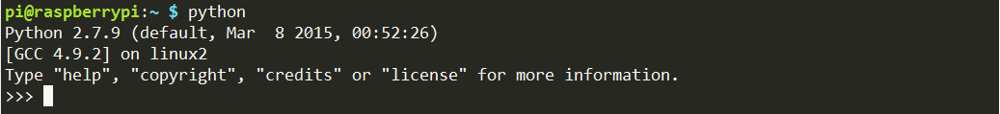

In Python CLI, input “import RPi.GPIO”, If no error prompts, it means
RPi.GPIO is installed.

import RPi.GPIO

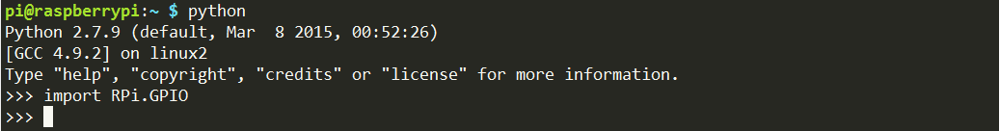

If you want to quit python CLI, type in:

exit()

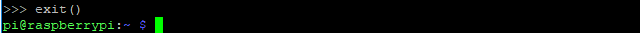

**
**

**WiringPi** 
------------

wiringPi is a C language GPIO library applied to the Raspberry Pi
platform. It complies with GUN Lv3. The functions in wiringPi are
similar to those in the wiring system of Arduino. They enable the users
familiar with Arduino to use wiringPi more easily.

wiringPi includes lots of GPIO commands which enable you to control all
kinds of interfaces on Raspberry Pi. You can test whether the wiringPi
library is installed successfully or not by the following instructions.

gpio -v

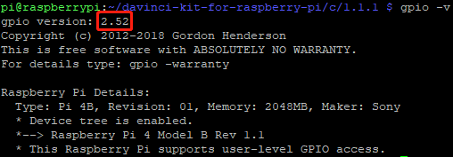

**Note:**

If you are using Raspberry Pi 4B, but the GPIO version is **2.50**, it
will cause no response after the C language code is running, that is,
GPIO pins do not work. At this time, you need to manually update to
version **2.52**, the update steps are as follows :

cd /tmp

wget https://project-downloads.drogon.net/wiringpi-latest.deb

sudo dpkg -i wiringpi-latest.deb

Check with:

gpio -v

and make sure it’s version 2.52.

gpio readall

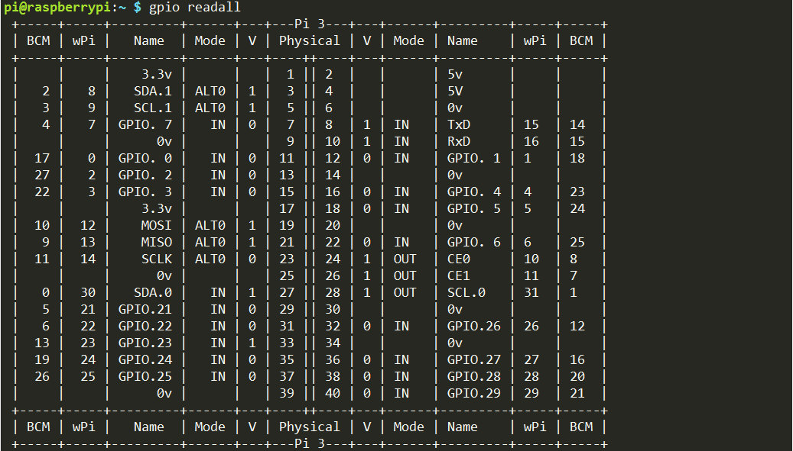

For more details about wiringPi, you can refer to:
http://wiringpi.com/download-and-install/

Download the Code
=================

Change directory to */home/pi*

cd **/**\ home\ **/**\ pi\ **/**

**Note**: cd, short for change directory is to change to the intended
directory from the current path. Informally, here is to go to the path
*/home/pi/.*

Clone the repository from github (C code and python code)

git clone
https\ **://**\ github.com\ **/**\ sunfounder\ **/**\ SunFounder_SensorKit_for_RPi2

The advantage of this method is that, you can download the latest code
any time you want, and then place the code under the path */home/pi/*.
But in case of incorrect typing which is possible especially when you're
strange to the commands, you can just enter *github.com/sunfounder* at
the address bar of a web browser, and on the page directed find the code
for Sensor Kit.

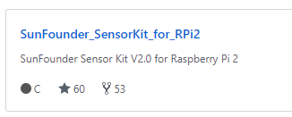

Click on the repository. On the page directed, click **Clone or
download** on the right side.

After download, transfer the package to */home/pi/*.

Now you can start the experiments. Let's rock!

Lesson 1 Dual-Color LED
=======================

**Introduction**

A dual-color light emitting diode (LED) is capable of emitting two
different colors of light, typically red and green, rather than only one
color. It is housed in a 3mm or 5mm epoxy package. It has 3 leads;
common cathode or common anode is available. A dual-color LED features
two LED terminals, or pins, arranged in the circuit in anti-parallel and
connected by a cathode/anode. Positive voltage can be directed towards
one of the LED terminals, causing that terminal to emit light of the
corresponding color; when the direction of the voltage is reversed, the
light of the other color is emitted. In a dual-color LED, only one of
the pins can receive voltage at a time. As a result, this type of LED
frequently functions as indicator lights for a variety of devices,
including televisions, digital cameras, and remote controls.

   LED.pngDual Color LED
   :width: 1.70486in
   :height: 1.36319in

**Required Components**

- 1 \* Raspberry Pi

- 1 \* Breadboard

- Several Jumper wires

- 1 \* Dual-color LED module

- 1 \* 3-Pin anti-reverse cable

**Experimental Principle**

Connect pin R and G to GPIOs of Raspberry Pi, program the Raspberry Pi
to change the color of the LED from red to green, and then use PWM to
mix into other colors.

The schematic diagram of the module is as shown below:

.. image:: media/image97.emf
   :width: 4.09514in
   :height: 1.65069in

**
**

**Experimental Procedures**

**Step 1:** Build the circuit.

+----------------------+-----------------------+-----------------------+
| **Raspberry Pi**     | **GPIO Extension      | **Dual-Color LED      |
|                      | Board**               | Module**              |
+----------------------+-----------------------+-----------------------+
| **GPIO0**            | **GPIO17**            | **R**                 |
+----------------------+-----------------------+-----------------------+
| **GND**              | **GND**               | **GND**               |
+----------------------+-----------------------+-----------------------+
| **GPIO1**            | **GPIO18**            | **G**                 |
+----------------------+-----------------------+-----------------------+

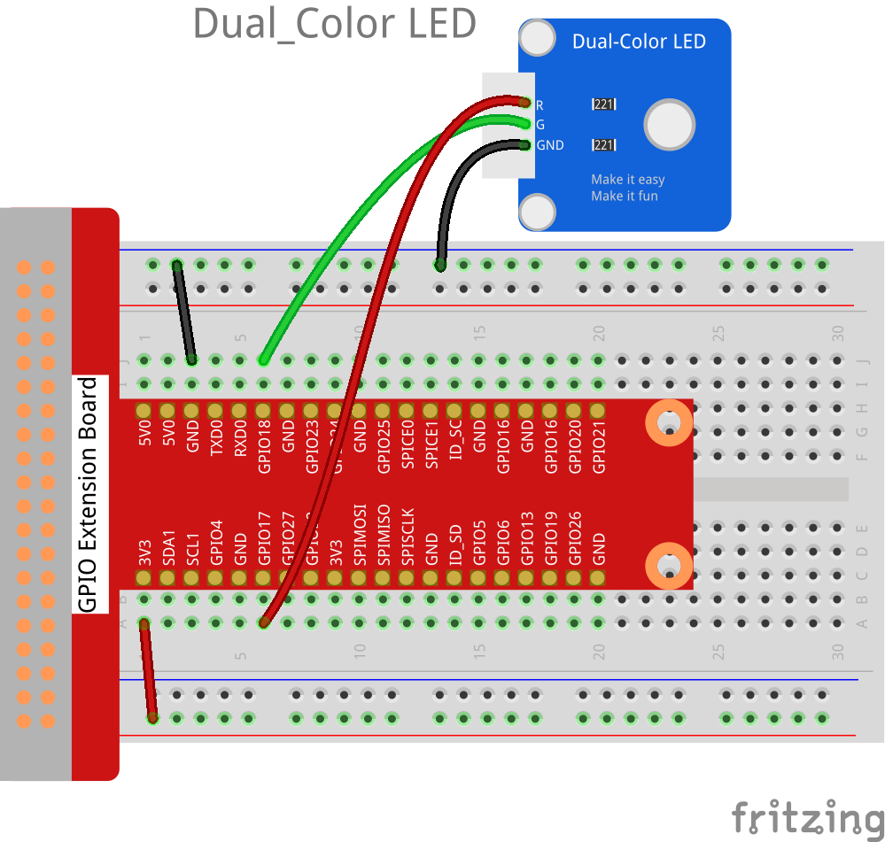

   **For C Users:**

   **Step 2:** Change directory.

cd
**/**\ home\ **/**\ pi\ **/**\ SunFounder_SensorKit_for_RPi2\ **/**\ C\ **/**\ 01_dule_color_led\ **/**

**Step 3:** Compile.

gcc dule_color_led.c -lwiringPi **-**\ lpthread

**Step 4:** Run.

sudo **./**\ a.out

   **
   **

**For Python Users:**

   **Step 2:** Change directory.

cd
**/**\ home\ **/**\ pi\ **/**\ SunFounder_SensorKit_for_RPi2\ **/**\ Python\ **/**

**Step 3:** Run.

sudo python3 01_dule_color_led.py

You can see the dual-color LED render green, red, and mixed colors.

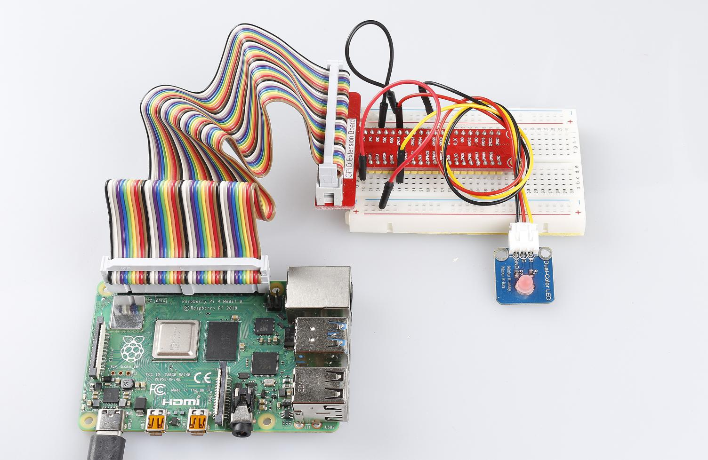

Lesson 2 RGB LED Module
=======================

**Introduction**

RGB LED modules can emit various colors of light. Three LEDs of red,
green, and blue are packaged into a transparent or semitransparent
plastic shell with four pins led out. The three primary colors of red,
green, and blue can be mixed and compose all kinds of colors by
brightness, so you can make an RGB LED emit colorful light by
controlling the circuit.

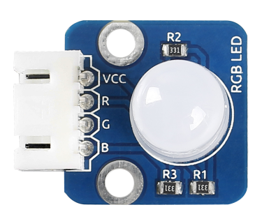

**Required Components**

- 1 \* Raspberry Pi

- 1 \* Breadboard

- Several Jumper wires

- 1 \* RGB LED module

- 1 \* 4-Pin anti-reverse cable

**Experimental Principle**

In this experiment, we will use PWM technology to control the brightness
of RGB.

Pulse Width Modulation, or PWM, is a technique for getting analog
results with digital means. Digital control is used to create a square
wave, a signal switched between on and off. This on-off pattern can
simulate voltages in between full on (5 Volts) and off (0 Volts) by
changing the portion of the time the signal spends on versus the time
that the signal spends off. The duration of "on time" is called the
pulse width. To get varying analog values, you change, or modulate, that
pulse width. If you repeat this on-off pattern fast enough with an LED
for example, the result is as if the signal is a steady voltage between
0 and 5v controlling the brightness of the LED.

.. image:: media/image101.emf
   :width: 3.92083in
   :height: 2.46875in

We can see from the top oscillogram that the amplitude of DC voltage
output is 5V. However, the actual voltage output is only 3.75V through
PWM, for the high level only takes up 75% of the total voltage within a
period.

Here are the three basic parameters of PWM:

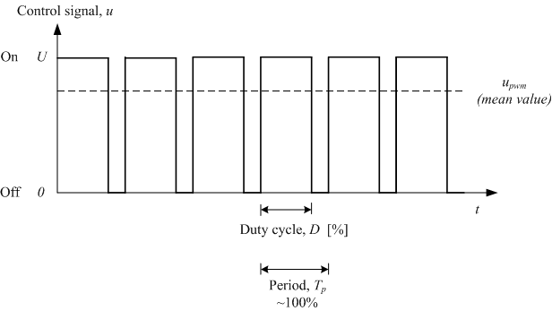

1. The term **duty cycle** describes the proportion of "on" time to the
regular interval or "period" of time

2. **Period** describes the reciprocal of pulses in one second.

3. The voltage amplitude here is 0V-5V.

Here we input any value between 0 and 255 to the three pins of the RGB
LED to make it display different colors.

RGB LEDs can be categorized into common anode LED and common cathode
LED. In this experiment, we use a common cathode RGB LED.

The schematic diagram of the module is as shown below:

.. image:: media/image103.emf
   :width: 4.53611in
   :height: 2.33056in

**Experimental Procedures**

**Step 1:** Build the circuit according to the following method.

+-----------------------+----------------------+----------------------+
| **Raspberry Pi**      | **GPIO Extension     | **RGB LED Module**   |
|                       | Board**              |                      |
+-----------------------+----------------------+----------------------+
| **3.3V**              | **3V3**              | **VCC**              |
+-----------------------+----------------------+----------------------+
| **GPIO0**             | **GPIO17**           | **R**                |
+-----------------------+----------------------+----------------------+
| **GPIO1**             | **GPIO18**           | **G**                |
+-----------------------+----------------------+----------------------+
| **GPIO2**             | **GPIO27**           | **B**                |
+-----------------------+----------------------+----------------------+

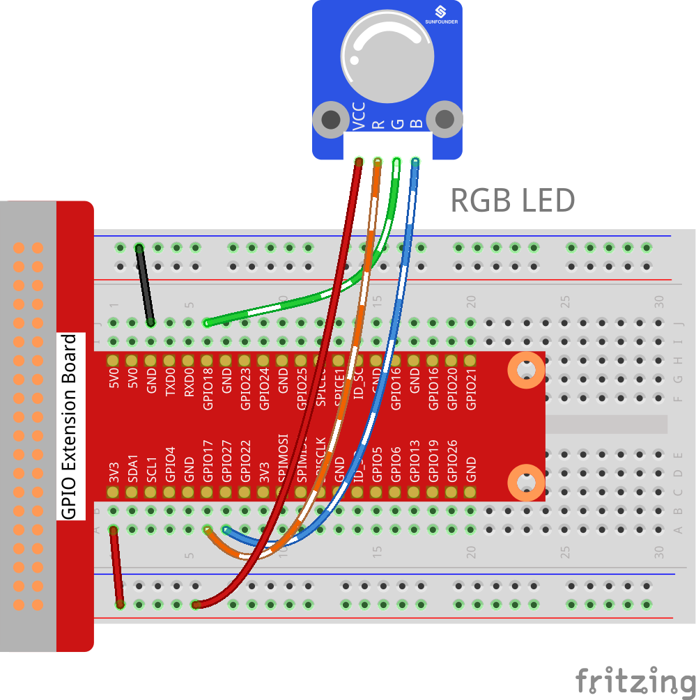

   **For C Users:**

   **Step 2:** Change directory.

cd
**/**\ home\ **/**\ pi\ **/**\ SunFounder_SensorKit_for_RPi2\ **/**\ C\ **/**\ 02_rgb_led\ **/**

**Step 3:** Compile.

gcc rgb_led.c -lwiringPi

**Step 4:** Run.

sudo **./**\ a.out

**For Python Users:**

   **Step 2:** Change directory.

cd
**/**\ home\ **/**\ pi\ **/**\ SunFounder_SensorKit_for_RPi2\ **/**\ Python\ **/**

**Step 3:** Run.

sudo python3 02_rgb_led.py

You will see the RGB LED light up, and display different colors in turn.

.. image:: media/image105.jpeg
   :alt: \_MG_2187
   :width: 5.75833in
   :height: 4.67986in

Lesson 3 7-Color Auto-flash LED
===============================

**Introduction**

On the 7-Color Auto-flash LED module, the LED can automatically flash
built-in colors after power on. It can be used to make quite fascinating
light effects.

.. image:: media/image106.png
   :alt: C:\Users\sunfounder\Desktop\sensor pisd 抠图\Auto Flash
   LED.pngAuto Flash LED
   :width: 1.65556in
   :height: 1.35972in

**Required Components**

- 1 \* Raspberry Pi

- 1 \* Breadboard

- 1 \* 7-color auto-flash LED module

- 1 \* 3-Pin anti-reverse cable

**Experimental Principle**

When it is power on, the 7-color auto-flash LED will flash built-in
colors.

The schematic diagram of the module is as shown below:

.. image:: media/image107.emf
   :width: 2.28056in
   :height: 1.85208in

**Experimental Procedures**

Build the circuit.

+-----------------------+----------------------+----------------------+
| **Raspberry Pi**      | **GPIO Extension     | **Auto-flash LED     |
|                       | Board**              | Module**             |
+-----------------------+----------------------+----------------------+
| **GND**               | **GND**              | **GND**              |
+-----------------------+----------------------+----------------------+
| **3.3V**              | **3V3**              | **VCC**              |
+-----------------------+----------------------+----------------------+

.. image:: media/image108.png
   :alt: C:\Users\Daisy\Desktop\Fritzing(英语)\03_AutoFlashLED_bb.png03_AutoFlashLED_bb
   :width: 5.17639in
   :height: 4.40833in

**Note:**

There are two “GND” pins on the module. You only need to connect one of
them.

Now, you will see 7-color auto-flash LED flashing seven colors.

.. image:: media/image109.jpeg
   :alt: \_MG_2264
   :width: 5.42847in
   :height: 4.08403in

**Lesson 4** **Relay Module**

**Introduction**

Relay is a device which is used to provide connection between two or
more points or devices in response to the input signal applied. It is
suitable for driving high power electric equipment, such as light bulbs,
electric fans and air conditioning. You can use a relay to control high
voltage with low voltage by connecting it to Raspberry Pi.

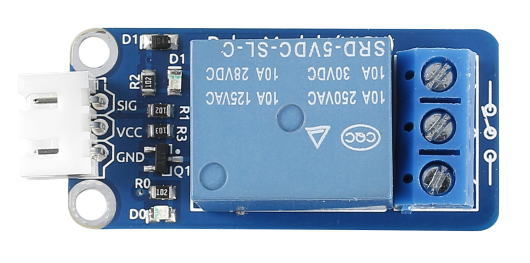
   Module.pngRelay Module
   :width: 2.40764in
   :height: 1.19583in

**Required Components**

- 1 \* Raspberry Pi

- 1 \* Breadboard

- Several Jumper wires

- 1 \* Relay module

- 1 \* Dual-color LED module

- 2 \* 3-Pin anti-reverse cable

**Experimental Principle**

**Relay**

– There are 5 parts in every relay:

1. **Electromagnet** – It consists of an iron core wounded by coil of
wires. When electricity is passed through, it becomes magnetic.
Therefore, it is called electromagnet.

2. **Armature** – The movable magnetic strip is known as armature. When
current flows through them, the coil is it energized thus producing a
magnetic field which is used to make or break the normally open (N/O) or
normally close (N/C) points. And the armature can be moved with direct
current (DC) as well as alternating current (AC).

3. **Spring** – When no currents flow through the coil on the
electromagnet, the spring pulls the armature away so the circuit cannot
be completed.

4. Set of electrical **contacts** – There are two contact points:

-  Normally open - connected when the relay is activated, and
   disconnected when it is inactive.

-  Normally close – not connected when the relay is activated, and
   connected when it is inactive.

5. Molded frame – Relays are covered with plastic for protection.

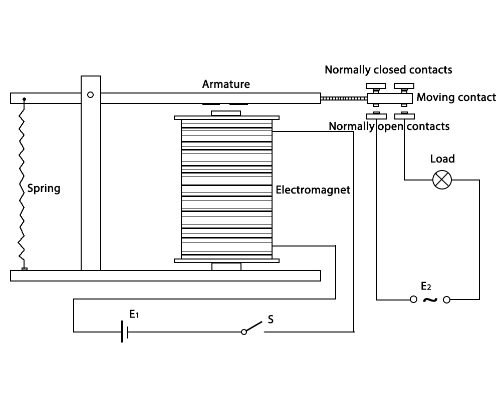

Connect the SIG pin of this module to GPIO pin. When we make GPIO pin
output high level (3.3V) by programming, the transistor will conduct
because of current saturation. The normally open contact of the relay
will be closed, while the normally closed contact of the relay will be
broken; when we make it output low level (0V), the transistor will be
cut off, and the relay will recover to initial state.

The schematic diagram of the module is as shown below:

**Experimental Procedures**

**Step 1:** Build the circuit.

+-----------------------+----------------------+----------------------+
| **Raspberry Pi**      | **GPIO Extension     | **Relay Module**     |
|                       | Board**              |                      |
+-----------------------+----------------------+----------------------+
| **GPIO0**             | **GPIO17**           | **SIG**              |
+-----------------------+----------------------+----------------------+
| **3.3V**              | **3V3**              | **VCC**              |
+-----------------------+----------------------+----------------------+
| **GND**               | **GND**              | **GND**              |
+-----------------------+----------------------+----------------------+
| **3.3V**              | **3V3**              | **COM**              |
+-----------------------+----------------------+----------------------+

+----------------------+-----------------------+----------------------+
| **Dual-color LED     | **GPIO Extension      | **Relay Module**     |
| Module**             | Board**               |                      |
+----------------------+-----------------------+----------------------+
| **R**                | **\***                | **Normal Open**      |
+----------------------+-----------------------+----------------------+
| **GND**              | **GND**               | **\***               |
+----------------------+-----------------------+----------------------+
| **G**                | **\***                | **Normal Close**     |
+----------------------+-----------------------+----------------------+

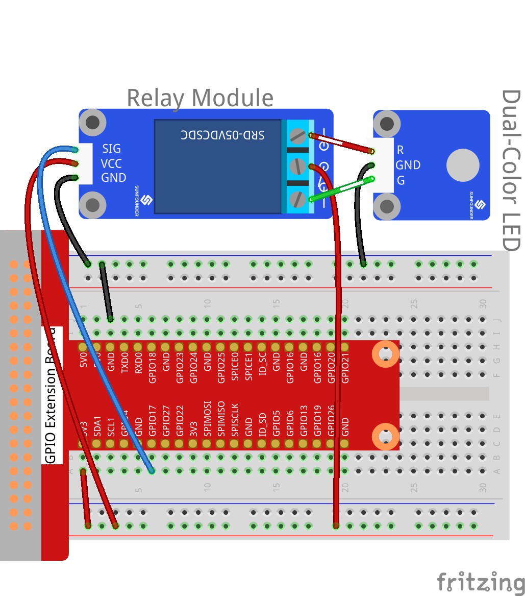

**
**

   **For C Users:**

   **Step 2:** Change directory.

cd
**/**\ home\ **/**\ pi\ **/**\ SunFounder_SensorKit_for_RPi2\ **/**\ C\ **/**\ 04_relay\ **/**

**Step 3**: Compile.

gcc relay.c -lwiringPi

**Step 4**: Run.

sudo **./**\ a.out

**For Python Users:**

   **Step 2:** Change directory.

cd
**/**\ home\ **/**\ pi\ **/**\ SunFounder_SensorKit_for_RPi2\ **/**\ Python\ **/**

**Step 3:** Run.

sudo python3 04_relay.py

Now, you may hear the ticktock. That's the normally closed contact
opened and the normally open contact closed. You can attach a high
voltage device you want to control, like a 220V bulb, to the output port
of the relay. Then the relay will act as an automatic switch.

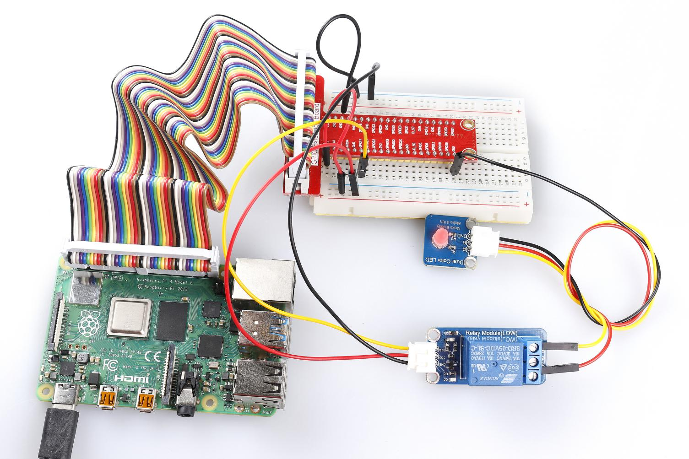

Lesson 5 Laser Emitter Module
=============================

**Introduction**

Laser is widely used in medical treatment, military, and other fields
due to its good directivity and energy concentration.

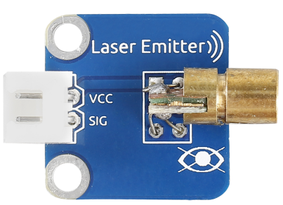
   Emitter.pngLaser Emitter
   :width: 1.83264in
   :height: 1.33194in

**Required Components**

- 1 \* Raspberry Pi

- 1 \* Breadboard

- 1 \* Laser Emitter module

- 1 \* 2-Pin anti-reverse cable

**Experimental Principle**

A laser is a device that emits light through a process of optical
amplification based on the stimulated emission of electromagnetic
radiation. Lasers differ from other sources of light because they emit
light coherently.

Spatial coherence allows a laser to be focused to a tight spot, enabling
applications like laser cutting and lithography, and a laser beam to
stay narrow over long distances (collimation), enabling applications
like laser pointers. Lasers can also have high temporal coherence which
allows them to have a very narrow spectrum, i.e., they only emit light
of a single color. And its temporal coherence can be used to produce
pulses of light—as short as a femtosecond.

The schematic diagram of the module is as shown below:

.. image:: media/image116.emf
   :width: 3.85417in
   :height: 1.85in

**
**

**Experimental Procedures**

**Step 1:** Build the circuit.

+----------------------+-----------------------+-----------------------+
| **Raspberry Pi**     | **GPIO Extension      | **Laser Emitter       |
|                      | Board**               | Module**              |
+----------------------+-----------------------+-----------------------+
| **3.3V**             | **3V3**               | **VCC**               |
+----------------------+-----------------------+-----------------------+
| **GPIO0**            | **GPIO17**            | **SIG**               |
+----------------------+-----------------------+-----------------------+

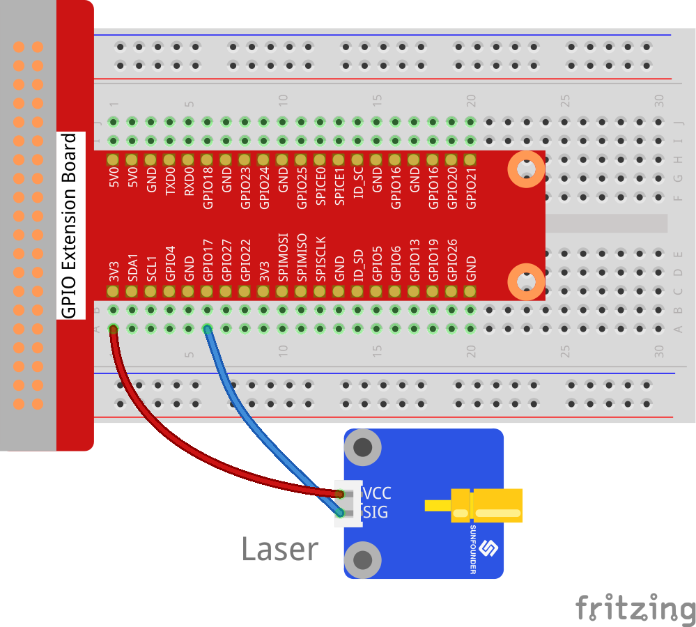

   **For C Users:**

   **Step 2:** Change directory.

cd
**/**\ home\ **/**\ pi\ **/**\ SunFounder_SensorKit_for_RPi2\ **/**\ C\ **/**\ 05_laser\ **/**

**Step 3:** Compile.

gcc laser.c -lwiringPi

**Step 4:** Run.

sudo **./**\ a.out

**For Python Users:**

**Step 2:** Change directory.

cd
**/**\ home\ **/**\ pi\ **/**\ SunFounder_SensorKit_for_RPi2\ **/**\ Python\ **/**

**Step 3:** Run.

sudo python3 05_laser.py

Now you can see the module send out Morse signals.

Note: DO NOT look directly at the laser head. It can cause great harm to
your eyes. You can point the laser beam to the table and see the light
spot flashing on the table.

| |\_MG_2263|

Lesson 6 Button Module
======================

**Introduction**

In this lesson, we will use button module to control a dual-color LED
module.

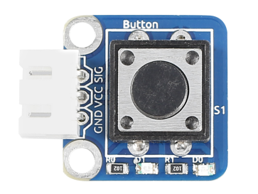

**Required Components**

- 1 \* Raspberry Pi

- 1 \* Breadboard

- Several Jumper wires

- 1 \* Button module

- 1 \* Dual-color LED module

- 2 \* 3-Pin anti-reverse cable

**Experimental Principle**

Use a normally open button as an input device of Raspberry Pi. When the
button is pressed, the General Purpose Input/Output (GPIO) connected to
the button will change to low level (0V). You can detect the state of
the GPIO through programming. That is, if the GPIO turns into low level,
it means the button is pressed, so you can run the corresponding code.
In this experiment, we will print a string on the screen and control an
LED.

The schematic diagram of the module is as shown below:

.. image:: media/image120.emf
   :width: 3.3375in
   :height: 2.69306in

**Experimental Procedures**

**Step 1:** Build the circuit.

+----------------------+----------------------+------------------------+
| **Raspberry Pi**     | **GPIO Extension     | **Button Module**      |
|                      | Board**              |                        |
+----------------------+----------------------+------------------------+
| **GPIO0**            | **GPIO17**           | **SIG**                |
+----------------------+----------------------+------------------------+
| **3.3V**             | **3V3**              | **VCC**                |
+----------------------+----------------------+------------------------+
| **GND**              | **GND**              | **GND**                |
+----------------------+----------------------+------------------------+

+----------------------+----------------------+------------------------+
| **Raspberry Pi**     | **GPIO Extension     | **Dual-Color LED       |
|                      | Board**              | Module**               |
+----------------------+----------------------+------------------------+
| **GPIO1**            | **GPIO18**           | **R**                  |
+----------------------+----------------------+------------------------+
| **GND**              | **GND**              | **GND**                |
+----------------------+----------------------+------------------------+
| **GPIO2**            | **GPIO27**           | **G**                  |
+----------------------+----------------------+------------------------+

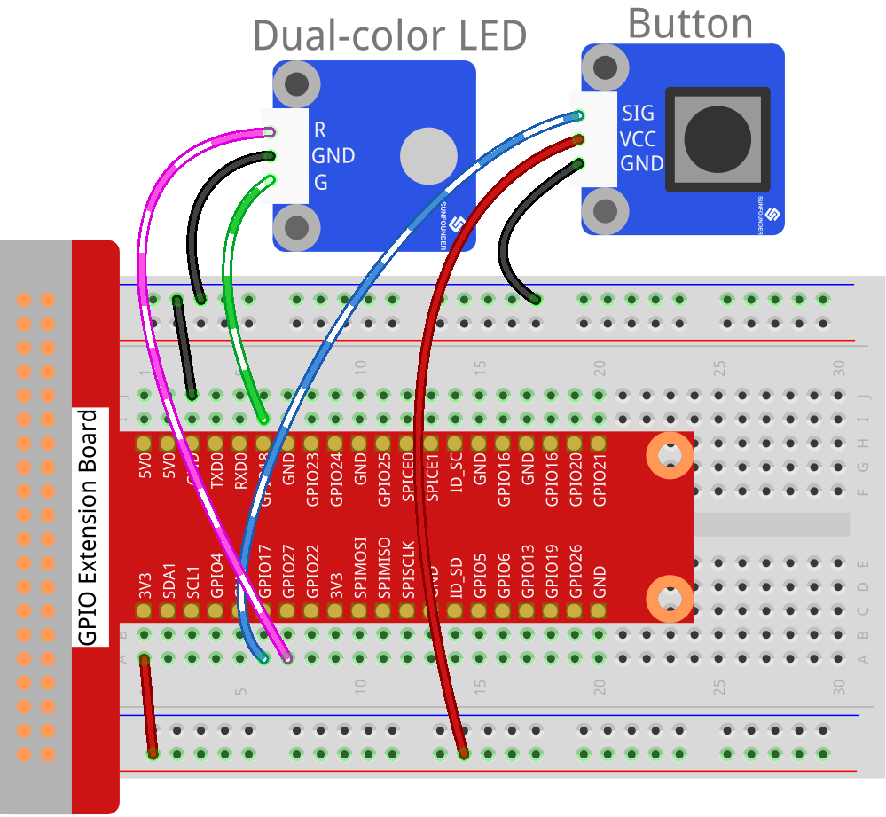

**
**

   **For C Users:**

   **Step 2:** Change directory.

cd
**/**\ home\ **/**\ pi\ **/**\ SunFounder_SensorKit_for_RPi2\ **/**\ C\ **/**\ 06_button\ **/**

**Step 3:** Compile.

gcc button.c **-**\ lwiringPi

**Step 4:** Run.

sudo **./**\ a.out

**For Python Users:**

   **Step 2:** Change directory.

cd
**/**\ home\ **/**\ pi\ **/**\ SunFounder_SensorKit_for_RPi2\ **/**\ Python\ **/**

**Step 3:** Run.

sudo python3 06_button.py

The LED on the module will emit green light. If you press the button,
"Button pressed" will be printed on the screen and the LED will emit red
light. If you release the button, "Button released" will be printed on
the screen and the LED will flash green again.

| |\_MG_2212|

Lesson 7 Tilt-Switch Module
===========================

**Introduction**

The tilt-switch module (as shown below) in this kit is a ball
tilt-switch with a metal ball inside. It is used to detect inclinations
of a small angle.

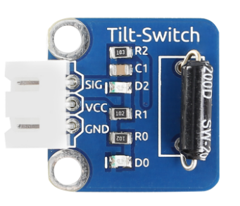
   Swich
   :width: 1.54931in
   :height: 1.33403in

**Required Components**

- 1 \* Raspberry Pi

**-** 1 \* Breadboard

- 1 \* Dual-color LED module

- 1 \* Tilt-switch module

- 2 \* 3-Pin anti-reverse cable

**Experimental Principle**

The principle is very simple. The ball in the tilt-switch changes with
different angle of inclination to trigger the circuit. When the ball in
tilt switch runs from one end to the other end due to shaking caused by
external force, the tilt switch will conduct and the LED will emit red
light, otherwise it will break and the LED will emit green light.

The schematic diagram of the module is as shown below:

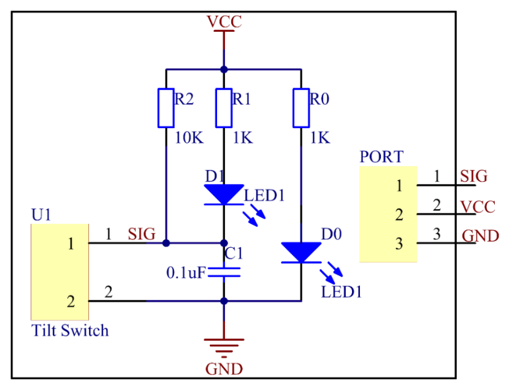

**Experimental Procedures**

**Step 1:** Build the circuit.

+----------------------+-----------------------+-----------------------+
| **Raspberry Pi**     | **GPIO Extension      | **Tilt Switch         |
|                      | Board**               | Module**              |
+----------------------+-----------------------+-----------------------+
| **GPIO0**            | **GPIO17**            | **SIG**               |
+----------------------+-----------------------+-----------------------+
| **3.3V**             | **3V3**               | **VCC**               |
+----------------------+-----------------------+-----------------------+
| **GND**              | **GND**               | **GND**               |
+----------------------+-----------------------+-----------------------+

+----------------------+-----------------------+-----------------------+
| **Raspberry Pi**     | **GPIO Extension      | **Dual-Color LED      |
|                      | Board**               | Module**              |
+----------------------+-----------------------+-----------------------+
| **GPIO1**            | **GPIO18**            | **R**                 |
+----------------------+-----------------------+-----------------------+
| **GND**              | **GND**               | **GND**               |
+----------------------+-----------------------+-----------------------+
| **GPIO2**            | **GPIO27**            | **G**                 |
+----------------------+-----------------------+-----------------------+


**
**

   **For C Users:**

   **Step 2:** Change directory.

cd
**/**\ home\ **/**\ pi\ **/**\ SunFounder_SensorKit_for_RPi2\ **/**\ C\ **/**\ 07_tilt_switch\ **/**

   **Step 3:** Compile.

gcc tilt_switch.c -lwiringPi

   **Step 4:** Run.

sudo **./**\ a.out

**For Python Users:**

   **Step 2:** Change directory.

cd
**/**\ home\ **/**\ pi\ **/**\ SunFounder_SensorKit_for_RPi2\ **/**\ Python\ **/**

   **Step 3:** Run.

sudo python3 07_tilt_switch.py

Place the tilt switch module horizontally, and the LED will flash green.
If you tilt it, "Tilt!" will be printed on the screen and the LED will
change to red. Place it horizontally again, and the LED will flash green
again.

| |\_MG_2218|

Lesson 8 Vibration Switch 
=========================

**Introduction**

|image5|\ A vibration switch, also called spring switch or shock sensor,
is an electronic switch which induces shock force and transfers the
result to a circuit device thus triggering it to work. It contains the
following parts: conductive vibration spring, switch body, trigger pin,
and packaging agent.

**Required Components**

- 1 \* Raspberry Pi

- 1 \* Breadboard

- 1 \* Dual-color LED module

- 1 \* Vibration switch module

- 2 \* 3-Pin anti-reverse cable

**Experimental Principle**

In a vibration switch module, the conductive vibration spring and
trigger pin are precisely placed in the switch and fixed by adhesive.
Normally, the spring and the trigger pin are separated. Once the sensor
detects shock, the spring will vibrate and contact with the trigger pin,
thus conducting and generating trigger signals.

In this experiment, connect a dual-color LED module to the Raspberry Pi
to indicate the changes. When you knock or tap the vibration sensor, it
will get turned on and the dual-color LED will flash red. Tap it again
and the LED will change to green – just between the two colors for each
tap or knock. The schematic diagram:

.. image:: media/image128.emf
   :width: 4.20278in
   :height: 3.21944in

**Experimental Procedures**

**Step 1:** Build the circuit.

+-----------------------+----------------------+-----------------------+
| **Raspberry Pi**      | **GPIO Extension     | **Vibration Switch    |
|                       | Board**              | Module**              |
+-----------------------+----------------------+-----------------------+
| **GPIO0**             | **GPIO17**           | **SIG**               |
+-----------------------+----------------------+-----------------------+
| **3.3V**              | **3V3**              | **VCC**               |
+-----------------------+----------------------+-----------------------+
| **GND**               | **GND**              | **GND**               |
+-----------------------+----------------------+-----------------------+

+-----------------------+----------------------+----------------------+
| **Raspberry Pi**      | **GPIO Extension     | **Dual-Color LED     |
|                       | Board**              | Module**             |
+-----------------------+----------------------+----------------------+
| **GPIO1**             | **GPIO18**           | **R**                |
+-----------------------+----------------------+----------------------+
| **GND**               | **GND**              | **GND**              |
+-----------------------+----------------------+----------------------+
| **GPIO2**             | **GPIO27**           | **G**                |
+-----------------------+----------------------+----------------------+


   Switch_bb.png08_Vibration Switch_bb
   :width: 5.2375in
   :height: 5.07778in

**
**

   **For C Users:**

   **Step 2:** Change directory.

cd
**/**\ home\ **/**\ pi\ **/**\ SunFounder_SensorKit_for_RPi2\ **/**\ C\ **/**\ 08_vibration_switch\ **/**

**Step 3:** Compile.

gcc vibration_switch.c -lwiringPi

**Step 4:** Run.

sudo **./**\ a.out

**For Python Users:**

   **Step 2:** Change directory.

cd
**/**\ home\ **/**\ pi\ **/**\ SunFounder_SensorKit_for_RPi2\ **/**\ Python\ **/**

**Step 3:** Run.

sudo python3 08_vibration_switch.py

Now tap or knock the module and you can see the dual-color LED flash
red. Tap the sensor again, and the LED will change to green. Each tap or
knock would make it change between red and green.


Lesson 9 IR Receiver Module
===========================

**Introduction**

An infrared-receiver (as shown below) is a component which receives
infrared signals and can independently receive infrared rays and output
signals compatible with TTL level. It is similar with a normal
plastic-packaged transistor in size and is suitable for all kinds of
infrared remote control and infrared transmission.


**Required Components**

**-** 1 \* Raspberry Pi

**-** 1 \* Breadboard

- 1 \* IR receiver module

- 1 \* IR Remote Controller

- 1 \* 3-Pin anti-reverse cable

**Experimental Principle**

In this experiment, send signals to IR receiver by pressing buttons on
the IR remote controller. The counter will add 1 every time it receives
signals; in other words, the increased number indicates IR signals are
received.

The schematic diagram of the module is as shown below:

.. image:: media/image131.emf
   :width: 4.02986in
   :height: 2.98819in

**Experimental Procedures**

**Step 1:** Build the circuit.

+-----------------------+----------------------+----------------------+
| **Raspberry Pi**      | **GPIO Extension     | **IR Receiver        |
|                       | Board**              | Module**             |
+-----------------------+----------------------+----------------------+
| **GPIO0**             | **GPIO17**           | **SIG**              |
+-----------------------+----------------------+----------------------+
| **3.3V**              | **3V3**              | **VCC**              |
+-----------------------+----------------------+----------------------+
| **GND**               | **GND**              | **GND**              |
+-----------------------+----------------------+----------------------+


   Receiver.svg_bb.png09_IR Receiver.svg_bb
   :width: 5.67292in
   :height: 5.01042in

   **For C Users:**

   **Step 2:** Change directory.

cd
**/**\ home\ **/**\ pi\ **/**\ SunFounder_SensorKit_for_RPi2\ **/**\ C\ **/**\ 09_ir_receiver\ **/**

**Step 3:** Compile.

gcc ir_receiver.c -lwiringPi

**Step 4:** Run.

sudo **./**\ a.out

**For Python Users:**

   **Step 2:** Change directory.

cd
**/**\ home\ **/**\ pi\ **/**\ SunFounder_SensorKit_for_RPi2\ **/**\ Python\ **/**

**Step 3:** Run.

sudo python3 09_ir_receiver.py

Press any key of the remote. Then you can see the LED on the module
blinking, and "Received infrared. cnt = xxx" printed on the screen.
""xxx" means the time you pressed the key(s).


**
**

Lesson 10 Buzzer Module
=======================

**Introduction**

Buzzers can be categorized as active and passive ones (See the following
picture).

|image6| |image7|

**Required Components**

- 1 \* Raspberry Pi

- 1 \* Breadboard

- 1 \* Passive buzzer module

- 1 \* Active buzzer module

- 1 \* 3-Pin anti-reverse cable

**Experimental Principle**

Place the pins of two buzzers face up and you can see the one with a
green circuit board is a passive buzzer, while the other with a black
tape, instead of a board, is an active buzzer.


**Active buzzer Passive buzzer**

The difference between an active buzzer and a passive buzzer is:

An active buzzer has a built-in oscillating source, so it will make
sounds when electrified. But a passive buzzer does not have such source,
so it will not beep if DC signals are used; instead, you need to use
square waves whose frequency is between 2K and 5K to drive it. The
active buzzer is often more expensive than the passive one because of
multiple built-in oscillating circuits.

The schematic diagram of the module is as shown below:

.. image:: media/image137.emf
   :width: 4.19861in
   :height: 2.77708in

**Experimental Procedures**

**Active Buzzer**

**Note:**

The active buzzer has built-in oscillating source, so it will beep as
long as it is wired up, but it can only beep with fixed frequency.

**Step 1:** Build the circuit.


   Buzzer_bb.png10_Active Buzzer_bb
   :width: 5.33611in
   :height: 4.45625in

   **For C Users:**

   **Step 2:** Change directory.

cd
**/**\ home\ **/**\ pi\ **/**\ SunFounder_SensorKit_for_RPi2\ **/**\ C\ **/**\ 10_active_buzzer\ **/**

**Step 3:** Compile.

gcc active_buzzer.c -lwiringPi

**Step 4:** Run.

sudo **./**\ a.out

**For Python Users:**

   **Step 2:** Change directory.

cd
**/**\ home\ **/**\ pi\ **/**\ SunFounder_SensorKit_for_RPi2\ **/**\ Python\ **/**

**Step 3:** Run.

sudo python3 10_active_buzzer.py

Now you can hear the active buzzer beeping.

.. image:: media/image139.jpeg
   :alt: \_MG_2230
   :width: 6.29931in
   :height: 4.74167in

**
**

**Passive Buzzer**

**Step 1:** Build the circuit.

+-----------------------+----------------------+----------------------+
| **Raspberry Pi**      | **GPIO Extension     | **Passive Buzzer     |
|                       | Board**              | Module**             |
+-----------------------+----------------------+----------------------+
| **GPIO0**             | **GPIO17**           | **SIG**              |
+-----------------------+----------------------+----------------------+
| **3.3V**              | **3V3**              | **VCC**              |
+-----------------------+----------------------+----------------------+
| **GND**               | **GND**              | **GND**              |
+-----------------------+----------------------+----------------------+


   Buzzer_bb.png10_Passive Buzzer_bb
   :width: 6.21111in
   :height: 5.09375in

   **For C Users:**

   **Step 2:** Change directory.

cd
**/**\ home\ **/**\ pi\ **/**\ SunFounder_SensorKit_for_RPi2\ **/**\ C\ **/**\ 10_passive_buzzer\ **/**

**Step 3:** Compile.

gcc passive_buzzer.c -lwiringPi

**Step 4:** Run.

sudo **./**\ a.out

   **For Python Users:**

   **Step 2:** Change directory.

cd
**/**\ home\ **/**\ pi\ **/**\ SunFounder_SensorKit_for_RPi2\ **/**\ Python\ **/**

**Step 3:** Run.

sudo python3 10_passive_buzzer.py

Now you can hear the passive buzzer playing music.

.. image:: media/image139.jpeg
   :alt: \_MG_2230
   :width: 6.38125in
   :height: 4.88681in

**Lesson 11 Reed Switch**

**Introduction**

A reed switch (as shown below) is used to detect the magnetic field.
Hall sensors are generally used to measure the speed of intelligent
vehicles and count in assembly lines, while reed switches are often used
to detect the existence of a magnetic field.

   Switch.pngReed Switch
   :width: 2.26667in
   :height: 1.76458in

**Required Components**

- 1 \* Raspberry Pi

- 1 \* Breadboard

- 1 \* Reed switch module

- 1 \* Dual-color LED module

- 2 \* 3-Pin anti-reverse cable

- 1 \* Magnet (Self provided)

**Experimental Principle**

A reed switch is a type of line switch component that realizes control
by magnetic signals. It induces by a magnet. The “switch" here means dry
reed pipe, which is a kind of contact passive electronic switch
component with the advantage of simple structure, small size, and
convenient control. The shell of a reed switch is commonly a sealed
glass pipe in which two iron elastic reed electroplates are equipped and
inert gases are filled. Normally, the two reeds made of special
materials in the glass tube are separated. However, when a magnetic
substance approaches the glass tube, the two reeds in the glass tube are
magnetized to attract each other and contact under the function of
magnetic field lines. As a result, the two reeds will pull together to
connect the circuit connected with the nodes.

After external magnetic force disappears, the two reeds will be
separated with each other because they have the same magnetism, so the
circuit is also disconnected. Therefore, as a line switch component
controlling by magnetic signals, the dry reed pipe can be used as a
sensor to count, limit positions and so on. At the same time, it is
widely used in a variety of communication devices.

The schematic diagram of the module is as shown below:

.. image:: media/image142.emf
   :width: 3.66667in
   :height: 3.28125in

**Experimental Procedures**

**Step 1:** Build the circuit

+-----------------------+----------------------+----------------------+
| **Raspberry Pi**      | **GPIO Extension     | **Reed Switch        |
|                       | Board**              | Module**             |
+-----------------------+----------------------+----------------------+
| **GPIO0**             | **GPIO17**           | **SIG**              |
+-----------------------+----------------------+----------------------+
| **3.3V**              | **3V3**              | **VCC**              |
+-----------------------+----------------------+----------------------+
| **GND**               | **GND**              | **GND**              |
+-----------------------+----------------------+----------------------+

+-----------------------+----------------------+----------------------+
| **Raspberry Pi**      | **GPIO Extension     | **Dual-color LED     |
|                       | Board**              | Module**             |
+-----------------------+----------------------+----------------------+
| **GPIO1**             | **GPIO18**           | **R**                |
+-----------------------+----------------------+----------------------+
| **GND**               | **GND**              | **GND**              |
+-----------------------+----------------------+----------------------+
| **GPIO2**             | **GPIO27**           | **G**                |
+-----------------------+----------------------+----------------------+


   switch_bb.png11_Reed switch_bb
   :width: 5.91389in
   :height: 5.52986in

   **For C Users:**

   **Step 2:** Change directory.

cd
**/**\ home\ **/**\ pi\ **/**\ SunFounder_SensorKit_for_RPi2\ **/**\ C\ **/**\ 11_reed_switch\ **/**

**Step 3:** Compile.

gcc reed_switch.c -lwiringPi

**Step 4:** Run.

sudo **./**\ a.out

**For Python Users:**

   **Step 2:** Change directory.

cd
**/**\ home\ **/**\ pi\ **/**\ SunFounder_SensorKit_for_RPi2\ **/**\ Python\ **/**

**Step 3:** Run.

sudo python3 11_reed_switch.py

Then the LED will flash green. Place a magnet near the reed switch,
"Detected Magnetic Material!" will be printed on the screen and the LED
will change to red. Move away the magnet, the LED will turn green again.


Lesson 12 Photo-interrupter
===========================

**Introduction**

|image8|\ A photo-interrupter (as shown below) is a sensor with a
light-emitting component and light-receiving component packaged and
placed on face-to-face. It applies the principle that light is
interrupted when an object passes through the sensor. Therefore,
photo-interrupters are widely used in speed measurement.

**Required Components**

- 1 \* Raspberry Pi

- 1 \* Breadboard

- 1 \* Dual-color LED module

- 1 \* Photo-interrupter module

- 2 \* 3-Pin anti-reverse cable

**Experimental Principle**

Basically a photo-interrupter consists of two parts: transmitter and
receiver. The transmitter (e.g., an LED or a laser) emits light and then
the light goes to the receiver. If that light beam between the
transmitter and receiver is interrupted by an obstacle, the receiver
will detect no incident light even for a moment and the output level
will change. In this experiment, we will turn an LED on or off by using
this change. The schematic diagram:

.. image:: media/image146.emf
   :width: 3.97222in
   :height: 3.26944in

**Experimental Procedures**

**Step 1:** Build the circuit.

+-----------------------+----------------------+-----------------------+
| **Raspberry Pi**      | **GPIO Extension     | **Photo-interrupter   |
|                       | Board**              | Module**              |
+-----------------------+----------------------+-----------------------+
| **GPIO0**             | **GPIO17**           | **SIG**               |
+-----------------------+----------------------+-----------------------+
| **3.3V**              | **3V3**              | **VCC**               |
+-----------------------+----------------------+-----------------------+
| **GND**               | **GND**              | **GND**               |
+-----------------------+----------------------+-----------------------+

+-----------------------+----------------------+----------------------+
| **Raspberry Pi**      | **GPIO Extension     | **Dual-color LED     |
|                       | Board**              | Module**             |
+-----------------------+----------------------+----------------------+
| **GPIO1**             | **GPIO18**           | **R**                |
+-----------------------+----------------------+----------------------+
| **GND**               | **GND**              | **GND**              |
+-----------------------+----------------------+----------------------+
| **GPIO2**             | **GPIO27**           | **G**                |
+-----------------------+----------------------+----------------------+

.. image:: media/image147.png
   :alt: C:\Users\Daisy\Desktop\Fritzing(英语)\12_Photo
   interrupter_bb.png12_Photo interrupter_bb
   :width: 6.47847in
   :height: 5.89583in

**
**

   **For C Users:**

   **Step 2:** Change directory.

cd
**/**\ home\ **/**\ pi\ **/**\ SunFounder_SensorKit_for_RPi2\ **/**\ C\ **/**\ 12_photo_interrupter\ **/**

**Step 3:** Compile.

gcc photo_interrupter.c -lwiringPi

**Step 4:** Run.

sudo **./**\ a.out

   **For Python Users:**

   **Step 2:** Change directory.

cd
**/**\ home\ **/**\ pi\ **/**\ SunFounder_SensorKit_for_RPi2\ **/**\ Python\ **/**

**Step 3:** Run.

sudo python3 12_photo_interrupter.py

Now the LED will light up green. Stick a piece of paper in the gap of
photo interrupter. Then "Light was blocked" will be printed on the
screen and the LED will flash red. Remove the paper, and the LED will
turn green again.

.. image:: media/image148.jpeg
   :alt: \_MG_2272
   :width: 6.30417in
   :height: 4.62569in

**Lesson 13 PCF8591**

**Introduction**

The PCF8591 is a single-chip, single-supply low-power 8-bit CMOS data
acquisition device with four analog inputs, one analog output and a
serial I2C-bus interface. Three address pins A0, A1 and A2 are used for
programming the hardware address, allowing the use of up to eight
devices connected to the I2C-bus without additional hardware. Address,
control and data to and from the device are transferred serially via the
two-line bidirectional I2C-bus.

The functions of the device include analog input multiplexing, on-chip
track and hold function, 8-bit analog-to-digital conversion and an 8-bit
digital-to-analog conversion. The maximum conversion rate is given by
the maximum speed of the I2C-bus.


   Converter.pngAD-DA Converter
   :width: 1.78958in
   :height: 1.5375in

**Required Components**

- 1 \* Raspberry Pi

- 1 \* Breadboard

- Several Jumper wires

- 1 \* PCF8591 module

- 1 \* Dual-Color LED module

- 1 \* 3-Pin anti-reverse cable

**Experimental Principle**

**Addressing:**

Each PCF8591 device in an I2C-bus system is activated by sending a valid
address to the device. The address consists of a fixed part and a
programmable part. The programmable part must be set according to the
address pins A0, A1 and A2. The address always has to be sent as the
first byte after the start condition in the I2C-bus protocol. The last
bit of the address byte is the read/write-bit which sets the direction
of the following data transfer (see as below).


**Control byte:**

The second byte sent to a PCF8591 device will be stored in its control
register and is required to control the device function. The upper
nibble of the control register is used for enabling the analog output,
and for programming the analog inputs as single-ended or differential
inputs. The lower nibble selects one of the analog input channels
defined by the upper nibble (see Fig.5). If the auto-increment flag is
set, the channel number is incremented automatically after each A/D
conversion. See the figure below.


In this experiment, the AIN0 (Analog Input 0) port is used to receive
analog signals from the potentiometer module, and AOUT (Analog Output)
is used to output analog signals to the dual-color LED module so as to
change the luminance of the LED.

The schematic diagram:

.. image:: media/image152.emf
   :width: 6.73194in
   :height: 3.03125in

**Experimental Procedures**

**Step 1:** Build the circuit.

+-----------------------+----------------------+----------------------+
| **Raspberry Pi**      | **GPIO Extension     | **PCF8591 Module**   |
|                       | Board**              |                      |
+-----------------------+----------------------+----------------------+
| **SDA**               | **SDA1**             | **SDA**              |
+-----------------------+----------------------+----------------------+
| **SCL**               | **SCL1**             | **SCL**              |
+-----------------------+----------------------+----------------------+
| **3.3V**              | **3V3**              | **VCC**              |
+-----------------------+----------------------+----------------------+
| **GND**               | **GND**              | **GND**              |
+-----------------------+----------------------+----------------------+

+----------------------+-----------------------+-----------------------+
| **Dual-Color         | **GPIO Extension      | **PCF8591 Module**    |
| Module**             | Board**               |                       |
+----------------------+-----------------------+-----------------------+
| **R**                | **\***                | **AOUT**              |
+----------------------+-----------------------+-----------------------+
| **GND**              | **GND**               | **GND**               |
+----------------------+-----------------------+-----------------------+
| **G**                | **\***                | **\***                |
+----------------------+-----------------------+-----------------------+

**Note:**

Connect the two pins next to the potentiometer of the PCF8591 module
with the jumper cap attached.


**Step 2:** Setup I2C (see **Appendix**. If you have set I2C, skip this
step.)

**For C Users:**

**Step 3:** Change directory.

cd
**/**\ home\ **/**\ pi\ **/**\ SunFounder_SensorKit_for_RPi2\ **/**\ C\ **/**\ 13_pcf8591\ **/**

**Step 4:** Compile.

gcc pcf8591.c **-**\ lwiringPi

**Step 5:** Run.

sudo **./**\ a.out

   **For Python Users:**

   **Step 3:** Change directory.

cd
**/**\ home\ **/**\ pi\ **/**\ SunFounder_SensorKit_for_RPi2\ **/**\ Python\ **/**

**Step 4:** Run.

sudo python3 13_pcf8591.py

Now, turn the knob of the potentiometer on PCF8591, and you can see the
luminance of the LED change and a value between 0 and 255 printed on the
screen.


Lesson 14 Rain Detection Module
===============================

**Introduction**

The rain detection module detects rain on the board. Place the rain
detection board in the open air. When it is raining, the rain detection
module will sense the raindrops and send signals to the Raspberry Pi.

|image9| |image10|

**Required Components**

**-** 1 \* Raspberry Pi

**-** 1 \* Breadboard

- 1 \* Rain Detection module

- 1 \* PCF8591

- 1 \* LM393

- 1 \* 2-Pin ribbon cable

- 1 \* 4-Pin anti-reverse cable

- Several Jumper wires

**Experimental Principle**

There are two metal wires that are close to each other but do not cross
on the rain detection board. When rain drops on the board, the two metal
wires will conduct, thus there is a voltage between the two metal wires.
The schematic diagram:

.. image:: media/image157.emf
   :width: 5.03819in
   :height: 2.75625in

**Experimental Procedures**

**Step 1:** Build the circuit.

+----------------------+-----------------------+----------------------+
| **Raspberry Pi**     | **GPIO Extension      | **PCF8591 Module**   |
|                      | Board**               |                      |
+----------------------+-----------------------+----------------------+
| **SDA**              | **SDA1**              | **SDA**              |
+----------------------+-----------------------+----------------------+
| **SCL**              | **SCL1**              | **SCL**              |
+----------------------+-----------------------+----------------------+
| **3.3V**             | **3V3**               | **VCC**              |
+----------------------+-----------------------+----------------------+
| **GND**              | **GND**               | **GND**              |
+----------------------+-----------------------+----------------------+

+----------------------+-----------------------+-----------------------+
| **LM393**            | **GPIO Extension      | **PCF8591 Module**    |
|                      | Board**               |                       |
+----------------------+-----------------------+-----------------------+
| **DO**               | **GPIO17**            | **\***                |
+----------------------+-----------------------+-----------------------+
| **AO**               | **\***                | **AIN0**              |
+----------------------+-----------------------+-----------------------+
| **VCC**              | **3V3**               | **VCC**               |
+----------------------+-----------------------+-----------------------+
| **GND**              | **GND**               | **GND**               |
+----------------------+-----------------------+-----------------------+

**Note:** The two pins on the rain detection board are exactly the same.
You can connect them to pin IN and GND on LM393.


   Detection_bb.png14_Rain Detection_bb
   :width: 6.68958in
   :height: 5.08264in

   **For C Users:**

   **Step 2:** Change directory.

cd
**/**\ home\ **/**\ pi\ **/**\ SunFounder_SensorKit_for_RPi2\ **/**\ C\ **/**\ 14_rain_detector\ **/**

**Step 3:** Compile.

gcc rain_detector.c -lwiringPi

**Step 4:** Run.

sudo **./**\ a.out

   **For Python Users:**

   **Step 2:** Change directory.

cd
**/**\ home\ **/**\ pi\ **/**\ SunFounder_SensorKit_for_RPi2\ **/**\ Python\ **/**

**Step 3:** Run.

sudo python3 14_rain_detector.py

Now drop some water onto the rain detection board until "**raining**"
displayed on the screen. You can adjust the potentiometer on LM393 to
detect the threshold of rainfall.


Lesson 15 Joystick PS2
======================

**Introduction**

There are five operation directions for joystick PS2: up, down, left,
right and press-down.


   PS2.pngJoystick PS2
   :width: 1.62778in
   :height: 1.01458in

**Required Components**

- 1 \* Raspberry Pi

- 1 \* Breadboard

- 1 \* PCF8591

- 1 \* Joystick PS2 module

- 1 \* 5-Pin anti-reverse cable

- Several Jumper wires

**Experimental Principle**

This module has two analog outputs (corresponding to X and Y
coordinates) and one digital output representing whether it is pressed
on Z axis.

In this experiment, we connect pin X and Y to the analog input ports of
the A/D convertor so as to convert analog quantities into digital ones.
Then program on Raspberry Pi to detect the moving direction of the
Joystick. The schematic diagram:

.. image:: media/image161.emf
   :width: 5.15556in
   :height: 3.24792in

**Experimental Procedures**

**Step 1:** Build the circuit.

+----------------------+-----------------------+-----------------------+
| **Raspberry Pi**     | **GPIO Extension      | **PCF8591 Module**    |
|                      | Board**               |                       |
+----------------------+-----------------------+-----------------------+
| **SDA**              | **SDA1**              | **SDA**               |
+----------------------+-----------------------+-----------------------+
| **SCL**              | **SCL1**              | **SCL**               |
+----------------------+-----------------------+-----------------------+
| **3.3V**             | **3V3**               | **VCC**               |
+----------------------+-----------------------+-----------------------+
| **GND**              | **GND**               | **GND**               |
+----------------------+-----------------------+-----------------------+

+----------------------+-----------------------+-----------------------+
| **Joystick PS2**     | **GPIO Extension      | **PCF8591 Module**    |
|                      | Board**               |                       |
+----------------------+-----------------------+-----------------------+
| **Y**                | **\***                | **AIN0**              |
+----------------------+-----------------------+-----------------------+
| **X**                | **\***                | **AIN1**              |
+----------------------+-----------------------+-----------------------+
| **Bt**               | **\***                | **AIN2**              |
+----------------------+-----------------------+-----------------------+
| **VCC**              | **3V3**               | **VCC**               |
+----------------------+-----------------------+-----------------------+
| **GND**              | **GND**               | **GND**               |
+----------------------+-----------------------+-----------------------+


   **
   **

   **For C Users:**

   **Step 2:** Change directory.

cd
**/**\ home\ **/**\ pi\ **/**\ SunFounder_SensorKit_for_RPi2\ **/**\ C\ **/**\ 15_joystick_PS2\ **/**

**Step 3:** Compile.

gcc joystick_PS2.c -lwiringPi

**Step 4:** Run.

sudo **./**\ a.out

   **For Python Users:**

   **Step 2:** Change directory.

cd
**/**\ home\ **/**\ pi\ **/**\ SunFounder_SensorKit_for_RPi2\ **/**\ Python\ **/**

**Step 3:** Run.

sudo python3 15_joystick_PS2.py

Now push the rocker upwards, and a string "**up**" will be printed on
the screen; push it downwards, and "**down**" will be printed; if you
push it left, "**Left**" will be printed on; If you push it right, and
"**Right**" will be printed; If you press down the cap, "**Button
Pressed**" will be printed on the screen.


**Lesson 16 Potentiometer Module**

**Introduction**

A potentiometer is a device which is used to vary the resistance in an
electrical circuit without interrupting the circuit.

   抠图\Potentiometer.pngPotentiometer
   :width: 1.91111in
   :height: 1.63403in

**Required Components**

**-** 1 \* Raspberry Pi

**-** 1 \* Breadboard

- 1 \* Potentiometer module

- 1 \* Dual-Color LED module

- 2 \* 3-Pin anti-reverse cable

- Several Jumper wires

**Experimental Principle**

An analog potentiometer is an analog electronic component. What’s the
difference between an analog one and a digital one? Simply put, a
digital potentiometer refers to just two states like on/off, high/low
levels, i.e. either 0 or 1, while a digital one supports analog signals
like a number from 1 to 1000. The signal value changes over time instead
of keeping an exact number. Analog signals include light intensity,
humidity, temperature, and so on.

In this experiment, PCF8591 is used to read the analog value of the
potentiometer and output the value to LED. Connect pin SIG of the
potentiometer to pin AIN0 of PCF8591. Connect pin R or Pin G of the
Dual-Color LED to pin AOUT of PCF8591 to observe the change of LED.

The schematic diagram of the module is as shown below:

.. image:: media/image165.emf
   :width: 3.72222in
   :height: 3.30208in

**Experimental Procedures**

**Step 1:** Build the circuit.

+-----------------------+----------------------+----------------------+
| **Raspberry Pi**      | **GPIO Extension     | **PCF8591 Module**   |
|                       | Board**              |                      |
+-----------------------+----------------------+----------------------+
| **SDA**               | **SDA1**             | **SDA**              |
+-----------------------+----------------------+----------------------+
| **SCL**               | **SCL1**             | **SCL**              |
+-----------------------+----------------------+----------------------+
| **3.3V**              | **3V3**              | **VCC**              |
+-----------------------+----------------------+----------------------+
| **GND**               | **GND**              | **GND**              |
+-----------------------+----------------------+----------------------+

+-----------------------+----------------------+----------------------+
| **Potentiometer**     | **GPIO Extension     | **PCF8591 Module**   |
|                       | Board**              |                      |
+-----------------------+----------------------+----------------------+
| **SIG**               | **\***               | **AIN0**             |
+-----------------------+----------------------+----------------------+
| **VCC**               | **3V3**              | **VCC**              |
+-----------------------+----------------------+----------------------+
| **GND**               | **GND**              | **GND**              |
+-----------------------+----------------------+----------------------+

+----------------------+-----------------------+-----------------------+
| **Dual-Color         | **GPIO Extension      | **PCF8591 Module**    |
| Module**             | Board**               |                       |
+----------------------+-----------------------+-----------------------+
| **R**                | **\***                | **AOUT**              |
+----------------------+-----------------------+-----------------------+
| **GND**              | **GND**               | **GND**               |
+----------------------+-----------------------+-----------------------+
| **G**                | **\***                | **\***                |
+----------------------+-----------------------+-----------------------+


   **For C Users:**

   **Step 2:** Change directory.

cd
**/**\ home\ **/**\ pi\ **/**\ SunFounder_SensorKit_for_RPi2\ **/**\ C\ **/**\ 16_potentiometer\ **/**

**Step 3:** Compile.

gcc potentiometer.c **-**\ lwiringPi

**Step 4:** Run.

sudo **./**\ a.out

   **For Python Users:**

   **Step 2:** Change directory.

cd
**/**\ home\ **/**\ pi\ **/**\ SunFounder_SensorKit_for_RPi2\ **/**\ Python\ **/**

**Step 3:** Run.

sudo python3 16_potentiometer.py

Turn the knob of the potentiometer, and you can see the value printed on
the screen change from 0 (minimum) to 255 (maximum).


Lesson 17 Hall Sensor
=====================

**Introduction**

Based on Hall Effect, a Hall sensor is a one that varies its output
voltage in response to a magnetic field. Hall sensors are used for
proximity switching, positioning, speed detection, and current sensing
applications.

Hall sensors can be categorized into linear (analog) Hall sensors and
switch Hall sensors. A switch Hall sensor consists of voltage regulator,
Hall element, differential amplifier, Schmitt trigger, and output
terminal and it outputs digital values. A linear Hall sensor consists of
Hall element, linear amplifier, and emitter follower and it outputs
analog values. If you add a comparator to a linear (analog) Hall sensor
it will be able to output both analog and digital signals.

|image11| |image12|

**Required Components**

**-** 1 \* Raspberry Pi

**-** 1 \* Breadboard

- 1 \* Analog Hall Switch module

- 1 \* Dual-color LED module

- 1 \* Switch hall module

- 1 \* PCF8591

- 2 \* 3-Pin anti-reverse cable

- 1 \* 4-Pin anti-reverse cable

- Several Jumper wires

**Experimental Principles**

**Hall Effect**

Hall Effect is a kind of electromagnetic effect. It was discovered by
Edwin Hall in 1879 when he was researching conductive mechanism about
metals. The effect is seen when a conductor is passed through a uniform
magnetic field. The natural electron drift of the charge carriers causes
the magnetic field to apply a Lorentz force (the force exerted on a
charged particle in an electromagnetic field) to these charge carriers.
The result is what is seen as a charge separation, with a buildup of
either positive or negative charges on the bottom or on the top of the
plate.


**Hall sensor**

A Hall sensor is a kind of magnetic field sensor based on it.

Electricity carried through a conductor will produce a magnetic field
that varies with current, and a Hall sensor can be used to measure the
current without interrupting the circuit. Typically, the sensor is
integrated with a wound core or permanent magnet that surrounds the
conductor to be measured.

The schematic diagram of the analog Hall sensor module:

.. image:: media/image171.emf
   :width: 4.08889in
   :height: 2.66111in

The schematic diagram of the Switch hall module:

.. image:: media/image172.emf
   :width: 3.65903in
   :height: 2.4625in

**Experimental Procedures**

For switch Hall sensor, take the following steps.

**Step 1:** Build the circuit.

+-----------------------+----------------------+----------------------+
| **Raspberry Pi**      | **GPIO Extension     | **Switch Hall        |
|                       | Board**              | Module**             |
+-----------------------+----------------------+----------------------+
| **GPIO0**             | **GPIO17**           | **SIG**              |
+-----------------------+----------------------+----------------------+
| **3.3V**              | **3V3**              | **VCC**              |
+-----------------------+----------------------+----------------------+
| **GND**               | **GND**              | **GND**              |
+-----------------------+----------------------+----------------------+

+-----------------------+----------------------+----------------------+
| **Raspberry Pi**      | **GPIO Extension     | **Dual-color LED     |
|                       | Board**              | Module**             |
+-----------------------+----------------------+----------------------+
| **GPIO1**             | **GPIO18**           | **R**                |
+-----------------------+----------------------+----------------------+
| **GND**               | **GND**              | **GND**              |
+-----------------------+----------------------+----------------------+
| **GPIO2**             | **GPIO27**           | **G**                |
+-----------------------+----------------------+----------------------+


**
**

   **For C Users:**

   **Step 2:** Change directory.

cd
**/**\ home\ **/**\ pi\ **/**\ SunFounder_SensorKit_for_RPi2\ **/**\ C\ **/**\ 17_switch_hall\ **/**

**Step 3:** Compile.

gcc switch_hall.c -lwiringPi

**Step 4:** Run.

sudo **./**\ a.out

   **For Python Users:**

   **Step 2:** Change directory.

cd
**/**\ home\ **/**\ pi\ **/**\ SunFounder_SensorKit_for_RPi2\ **/**\ Python\ **/**

**Step 3:** Run.

sudo python3 17_switch_hall.py

Put a magnet close to the Switch Hall sensor. Then a string
“\ **Detected magnetic materials**\ ” will be printed on the screen and
the LED will light up.


For **Analog Hall Switch**, take the following steps.

**Step 1:** Build the circuit.

+-----------------------+----------------------+----------------------+
| **Raspberry Pi**      | **GPIO Extension     | **PCF8591 module**   |
|                       | Board**              |                      |
+-----------------------+----------------------+----------------------+
| **SDA**               | **SDA1**             | **SDA**              |
+-----------------------+----------------------+----------------------+
| **SCL**               | **SCL1**             | **SCL**              |
+-----------------------+----------------------+----------------------+
| **3.3V**              | **3V3**              | **VCC**              |
+-----------------------+----------------------+----------------------+
| **GND**               | **GND**              | **GND**              |
+-----------------------+----------------------+----------------------+

+----------------------+-----------------------+-----------------------+
| **Analog Hall        | **GPIO Extension      | **PCF8591 module**    |
| Switch**             | Board**               |                       |
+----------------------+-----------------------+-----------------------+
| **DO**               | **GPIO17**            | **\***                |
+----------------------+-----------------------+-----------------------+
| **AO**               | **\***                | **AIN0**              |
+----------------------+-----------------------+-----------------------+
| **VCC**              | **3V3**               | **VCC**               |
+----------------------+-----------------------+-----------------------+
| **GND**              | **GND**               | **GND**               |
+----------------------+-----------------------+-----------------------+


   **
   **

   **For C Users:**

   **Step 2:** Change directory.

cd
**/**\ home\ **/**\ pi\ **/**\ SunFounder_SensorKit_for_RPi2\ **/**\ C\ **/**\ 17_analog_hall_switch\ **/**

**Step 3:** Compile.

gcc analog_hall_switch.c -lwiringPi

**Step 4:** Run.

sudo **./**\ a.out

   **For Python Users:**

   **Step 2:** Change directory.

cd
**/**\ home\ **/**\ pi\ **/**\ SunFounder_SensorKit_for_RPi2\ **/**\ Python\ **/**

**Step 3:** Run.

sudo python3 17_analog_hall_switch.py

Now "Current intensity of magnetic field : xxx " will be displayed on
the screen. Put the magnet close to the analog Hall sensor, with the
north magnetic pole towards the sensor, and then " Magnet: North." will
be displayed. Move the magnet away, and " Magnet: None." will be
printed. If the magnet approaches the sensor with the south magnetic
pole towards it, " Magnet: South." will be printed on the screen.

**Note:** Pin D0 of the Analog Hall Sensor will output "0" only when the
south pole of the magnet approaches it, otherwise it will output "1".


**Lesson 18 Temperature Sensor**

**Introduction**

A temperature sensor is a component that senses temperature and converts
it into output signals. By material and component features, temperature
sensors can be divided into two types: thermal resistor and
thermocouple. Thermistor is one kind of the former type. It is made of
semiconductor materials; most thermistors are negative temperature
coefficient (NTC) ones, the resistance of which decreases with rising
temperature. Since their resistance changes acutely with temperature
changes, thermistors are the most sensitive temperature sensors.

There are two kinds of thermistor module in this kit (as shown below).

|image13| |image14|

Analog temperature sensor Thermistor

**Required Components**

- 1 \* Raspberry Pi

- 1 \* Breadboard

- 1 \* Analog-temperature Sensor module

- 1 \* Thermistor module

- 1 \* PCF8591

- 1 \* 3-Pin anti-reverse cable

- 1 \* 4-Pin anti-reverse cable

- Several Jumper wires

**Experimental Principle**

This module is based on the principle of the thermistor, whose
resistance varies significantly with ambient temperature. When the
ambient temperature increases, the resistance of the thermistor
decreases; when decreases, it increases. It can detect surrounding
temperature changes in a real-time manner.

In this experiment, we use an analog-digital converter PCF8591 to
convert analog signals into digital ones.

The schematic diagram for analog temperature sensor:

.. image:: media/image179.emf
   :width: 5.19792in
   :height: 3.48889in

The schematic diagram for the thermistor module:

.. image:: media/image180.emf
   :width: 3.13056in
   :height: 2.98889in

**Experimental Procedures**

**Step 1:** Build the circuit.

+-----------------------+----------------------+----------------------+
| **Raspberry Pi**      | **GPIO Extension     | **PCF8591 Module**   |
|                       | Board**              |                      |
+-----------------------+----------------------+----------------------+
| **SDA**               | **SDA1**             | **SDA**              |
+-----------------------+----------------------+----------------------+
| **SCL**               | **SCL1**             | **SCL**              |
+-----------------------+----------------------+----------------------+
| **3.3V**              | **3V3**              | **VCC**              |
+-----------------------+----------------------+----------------------+
| **GND**               | **GND**              | **GND**              |
+-----------------------+----------------------+----------------------+

**
**

**For thermistor module:**

+-----------------------+----------------------+----------------------+
| **Thermistor Module** | **GPIO Extension     | **PCF8591 Module**   |
|                       | Board**              |                      |
+-----------------------+----------------------+----------------------+
| **SIG**               | **\***               | **AIN0**             |
+-----------------------+----------------------+----------------------+
| **VCC**               | **3V3**              | **VCC**              |
+-----------------------+----------------------+----------------------+
| **GND**               | **GND**              | **GND**              |
+-----------------------+----------------------+----------------------+


**
**

**For analog temperature sensor module：**

+------------------------+---------------------+----------------------+
| **Analog Temperature   | **GPIO Extension    | **PCF8591 Module**   |
| Module**               | Board**             |                      |
+------------------------+---------------------+----------------------+
| **DO**                 | **GPIO17**          | **\***               |
+------------------------+---------------------+----------------------+
| **AO**                 | **\***              | **AIN0**             |
+------------------------+---------------------+----------------------+
| **VCC**                | **3V3**             | **VCC**              |
+------------------------+---------------------+----------------------+
| **GND**                | **GND**             | **GND**              |
+------------------------+---------------------+----------------------+


   **For C Users:**

   **Step 2:** Change directory.

cd
**/**\ home\ **/**\ pi\ **/**\ SunFounder_SensorKit_for_RPi2\ **/**\ C\ **/**\ 18_thermistor\ **/**

   **Step 3:** Compile.

gcc thermistor.c -lwiringPi **-**\ lm

   **Step 4:** Run.

sudo **./**\ a.out

**For Python Users:**

   **Step 2:** Change directory.

cd
**/**\ home\ **/**\ pi\ **/**\ SunFounder_SensorKit_for_RPi2\ **/**\ Python\ **/**

   **Step 3:** Run.

sudo python3 18_thermistor.py

Now touch the thermistor and you can see the value of current
temperature printed on the screen change accordingly.

Temperature alarm setting:

If you use the **Analog Temperature Sensor** module, uncomment the line
under **1**:

**For C language:**

55 *// For a threshold, uncomment one of the code for*

56 *// which module you use. DONOT UNCOMMENT BOTH!*

57 *//-----------------------------------------*

58 *// 1. For Analog Temperature module(with DO)*

59 tmp **=** digitalRead\ **(**\ DO\ **);**

60

61 *// 2. For Thermister module(with sig pin)*

62 *// if (temp > 33) tmp = 0;*

63 *// else if (temp < 31) tmp = 1;*

**For Python**

41 #################################################

42 *# 1. For Analog Temperature module(with DO)*

43 tmp **=** GPIO\ **.**\ input\ **(**\ DO\ **);**

44

45 *# 2. For Thermister module(with sig pin)*

46 *#if temp > 33:*

47 *# tmp = 0;*

48 *#elif temp < 31:*

49 *# tmp = 1;*

50 #################################################

If you use the **Thermistor module**, uncomment the lIne under **2**:

**For C language:**

55 *// For a threshold, uncomment one of the code for*

56 *// which module you use. DONOT UNCOMMENT BOTH!*

57 *//-------------------------------------------*

58 *// 1. For Analog Temperature module(with DO)*

59 *// tmp = digitalRead(DO);*

60

61 *// 2. For Thermister module(with sig pin)*

62 if **(**\ temp **>** 33\ **)** tmp **=** 0\ **;**

63 else if **(**\ temp **<** 31\ **)** tmp **=** 1\ **;**

64 *//------------------------------------------*

**For Python**

41 #################################################

42 *# 1. For Analog Temperature module(with DO)*

43 *#tmp = GPIO.input(DO);*

44 *#*

45 *# 2. For Thermister module(with sig pin)*

46 if temp **>** 33\ **:**

47 tmp **=** 0\ **;**

48 elif temp **<** 31\ **:**

49 tmp **=** 1\ **;**

50 #################################################

After editing the code, repeat step 2, 3, and 4 (or step 2, 3 for Python
users).

You can still see temperature value printed on the screen constantly. If
you pinch the thermistor for a while, its temperature will rise slowly.
"Too Hot!" will be printed on the screen. Release your fingers, and let
it stay in the open air for a while, or blow on the module. When the
temperature drops down slowly, "Better" will be printed.

**Note:** The analog temperature sensor adjusts alarm temperature by the
potentiometer on the module. The thermistor changes the alarm
temperature by program.

The physical picture for analog temperature sensor:


The physical picture for thermistor module:


Lesson 19 Sound Sensor
======================

**Introduction**

Sound sensor is a component that receives sound waves and converts them
into electrical signal. It detects the sound intensity in ambient
environment like a microphone.


   Sensor.pngSound Sensor
   :width: 1.87014in
   :height: 1.62569in

**Required Components**

- 1 \* Raspberry Pi

- 1 \* Breadboard

- 1 \* PCF8591

- 1 \* Sound sensor module

- 1 \* 3-Pin anti-reverse cable

- Several Jumper wires

**Experimental Principle**

The microphone on the sensor module can convert audio signals into
electrical signals (analog quantity), then convert analog quantity into
digital quantity by PCF8591 and transfer them to MCU.

LM358 is a dual-channel operational amplifier. It contains two
independent, high gain, and internally compensated amplifiers, but we
will only use one of them in this experiment. The microphone transforms
sound signals into electrical signals and then sends out the signals to
pin 2 of LM358 and outputs them to pin 1 (that's, pin SIG of the module)
via the external circuit. Then use PCF8591 to read analog values.

PCF8591 is an 8-bit resolution, 4-channel A/D，1-channel D/A conversion
chip. We connect the output terminal (SIG) to AIN0 of PCF8591 so as to
detect the strength of voice signal in a real-time manner.

The schematic diagram of the module is as shown below:

.. image:: media/image186.emf
   :width: 6.73403in
   :height: 3.66667in

**Experimental Procedures**

**Step 1:** Build the circuit according to the following method.

+-----------------------+----------------------+----------------------+
| **Raspberry Pi**      | **GPIO Extension     | **PCF8591 Module**   |
|                       | Board**              |                      |
+-----------------------+----------------------+----------------------+
| **SDA**               | **SDA1**             | **SDA**              |
+-----------------------+----------------------+----------------------+
| **SCL**               | **SCL1**             | **SCL**              |
+-----------------------+----------------------+----------------------+
| **3.3V**              | **3V3**              | **VCC**              |
+-----------------------+----------------------+----------------------+
| **GND**               | **GND**              | **GND**              |
+-----------------------+----------------------+----------------------+

+----------------------+-----------------------+-----------------------+
| **Sound Sensor       | **GPIO Extension      | **PCF8591 Module**    |
| Module**             | Board**               |                       |
+----------------------+-----------------------+-----------------------+
| **SIG**              | **\***                | **AIN0**              |
+----------------------+-----------------------+-----------------------+
| **VCC**              | **3V3**               | **VCC**               |
+----------------------+-----------------------+-----------------------+
| **GND**              | **GND**               | **GND**               |
+----------------------+-----------------------+-----------------------+


   Sensor_bb.png19_Sound Sensor_bb
   :width: 5.33125in
   :height: 5.45347in

   **For C Users:**

   **Step 2:** Change directory.

cd
**/**\ home\ **/**\ pi\ **/**\ SunFounder_SensorKit_for_RPi2\ **/**\ C\ **/**\ 19_sound_sensor\ **/**

**Step 3:** Compile.

gcc sound_sensor.c -lwiringPi

**Step 4:** Run.

sudo **./**\ a.out

   **For Python Users:**

   **Step 2:** Change directory.

cd
**/**\ home\ **/**\ pi\ **/**\ SunFounder_SensorKit_for_RPi2\ **/**\ Python\ **/**

**Step 3:** Run.

sudo python3 19_sound_sensor.py

Now, speak close to or blow to the microphone, and you can see “Voice
In!! \***” printed on the screen.


**Lesson 20 Photoresistor Module**

**Introduction**

A photoresistor is a light-controlled variable resistor.
The resistance of a photoresistor decreases with increasing incident
light intensity.


   抠图\Photoresistor.pngPhotoresistor
   :width: 1.82847in
   :height: 1.45in

**Required Components**

- 1 \* Raspberry Pi

- 1 \* Breadboard

- 1 \* PCF8591

- 1 \* Photoresistor module

- 1 \* 3-Pin anti-reverse cable

- Several Jumper wires

**Experimental Principle**

With light intensity increasing, the resistance of a photoresistor will
decrease. Thus the output voltage changes. Analog signals collected by
the photoresistor are converted to digital signals through PCF8591. Then
these digital signals are transmitted to Raspberry Pi and printed on the
screen. The schematic diagram:

.. image:: media/image190.emf
   :width: 3.34931in
   :height: 3.14306in

**
**

**Experimental Procedures**

**Step 1:** Build the circuit.

+-----------------------+----------------------+----------------------+
| **Raspberry Pi**      | **GPIO Extension     | **PCF8591 Module**   |
|                       | Board**              |                      |
+-----------------------+----------------------+----------------------+
| **SDA**               | **SDA1**             | **SDA**              |
+-----------------------+----------------------+----------------------+
| **SCL**               | **SCL1**             | **SCL**              |
+-----------------------+----------------------+----------------------+
| **3.3V**              | **3V3**              | **VCC**              |
+-----------------------+----------------------+----------------------+
| **GND**               | **GND**              | **GND**              |
+-----------------------+----------------------+----------------------+

+-----------------------+----------------------+----------------------+
| **Photoresistor**     | **GPIO Extension     | **PCF8591 Module**   |
|                       | Board**              |                      |
+-----------------------+----------------------+----------------------+
| **SIG**               | **\***               | **AIN0**             |
+-----------------------+----------------------+----------------------+
| **VCC**               | **3V3**              | **VCC**              |
+-----------------------+----------------------+----------------------+
| **GND**               | **GND**              | **GND**              |
+-----------------------+----------------------+----------------------+


   **
   **

   **For C Users:**

   **Step 2:** Change directory.

cd
**/**\ home\ **/**\ pi\ **/**\ SunFounder_SensorKit_for_RPi2\ **/**\ C\ **/**\ 20_photoresistor\ **/**

**Step 3:** Compile.

gcc photoresistor.c -lwiringPi

**Step 4:** Run.

sudo **./**\ a.out

   **For Python Users:**

   **Step 2:** Change directory.

cd
**/**\ home\ **/**\ pi\ **/**\ SunFounder_SensorKit_for_RPi2\ **/**\ Python\ **/**

**Step 3:** Run.

sudo python3 20_photoresistor.py

Now, change light intensity (e.g. cover the module with a pad), and the
value printed on the screen will change accordingly.


**Lesson 21 Flame Sensor**

|image15|\ **Introduction**

A flame sensor (as shown below) performs detection by capturing infrared
rays with specific wavelengths from flame. It can be used to detect and
warn of flames.

**Required Components**

- 1 \* Raspberry Pi

- 1 \* Breadboard

- 1 \* Flame sensor module

- 1 \* PCF8591

- 1 \* 4-Pin anti-reverse cable

- Several Jumper wires

**Experimental Principle**

There are several types of flame sensors. In this experiment, we will
use a far-infrared flame sensor. It can detect infrared rays with
wavelength ranging from 700nm to 1000nm. A far-infrared flame probe
converts the strength changes of external infrared light into current
changes. And then it convert analog quantities into digital ones. In
this experiment, connect pin D0 of the Flame Sensor module to a GPIO of
Raspberry Pi to detect by programming whether any flame exists. The
schematic diagram:

.. image:: media/image194.emf
   :width: 6.65972in
   :height: 3.43611in

**
**

**Experimental Procedures**

**Step 1:** Build the circuit.

+-----------------------+----------------------+----------------------+
| **Raspberry Pi**      | **GPIO Extension     | **PCF8591 Module**   |
|                       | Board**              |                      |
+-----------------------+----------------------+----------------------+
| **SDA**               | **SDA1**             | **SDA**              |
+-----------------------+----------------------+----------------------+
| **SCL**               | **SCL1**             | **SCL**              |
+-----------------------+----------------------+----------------------+
| **3.3V**              | **3V3**              | **VCC**              |
+-----------------------+----------------------+----------------------+
| **GND**               | **GND**              | **GND**              |
+-----------------------+----------------------+----------------------+

+----------------------+-----------------------+-----------------------+
| **Flame Sensor**     | **GPIO Extension      | **PCF8591 Module**    |
|                      | Board**               |                       |
+----------------------+-----------------------+-----------------------+
| **DO**               | **GPIO17**            | **\***                |
+----------------------+-----------------------+-----------------------+
| **AO**               | **\***                | **AIN0**              |
+----------------------+-----------------------+-----------------------+
| **VCC**              | **3V3**               | **VCC**               |
+----------------------+-----------------------+-----------------------+
| **GND**              | **GND**               | **GND**               |
+----------------------+-----------------------+-----------------------+


   **
   **

   **For C Users:**

   **Step 2:** Change directory.

cd
**/**\ home\ **/**\ pi\ **/**\ SunFounder_SensorKit_for_RPi2\ **/**\ C\ **/**\ 21_flame_sensor\ **/**

**Step 3:** Compile.

gcc flame_sensor.c **-**\ lwiringPi

**Step 4:** Run.

sudo **./**\ a.out

   **For Python Users:**

   **Step 2:** Change directory.

cd
**/**\ home\ **/**\ pi\ **/**\ SunFounder_SensorKit_for_RPi2\ **/**\ Python\ **/**

**Step 3:** Run.

sudo python3 21_flame_sensor.py

Now, ignite a lighter near the sensor, within the range of 80cm, and
"Fire!" will be displayed on the screen. If you put out the lighter or
just move the flames away from the flame sensor, "Safe~" will be
displayed then.


**Lesson 22 Gas Sensor**

**Introduction**

Gas Sensor MQ-2 is a sensor for flammable gas and smoke by detecting the
concentration of combustible gas in the air. They are used in gas
detecting equipment for smoke and flammable gasses in household,
industry or automobile.

   Sensor
   :width: 2.39028in
   :height: 1.45833in

**Required Components**

- 1 \* Raspberry Pi

- 1 \* Breadboard

- 1 \* Active Buzzer module

- 1 \* PCF8591

- 1 \* Gas sensor module

- 1 \* 3-Pin anti-reverse cable

- 1 \* 4-Pin anti-reverse cable

- Several Jumper wires

**Experimental Principle**

MQ-2 gas sensor is a kind of surface ion type and N-type semiconductors,
which uses tin oxide semiconductor gas sensitive material. When ambient
temperature is in 200 ~ 300℃, tin oxide will adsorb oxygen in the air
and form oxygen anion adsorption to decrease electron density in
semiconductor so as to increase its resistance. When in contact with the
smoke, if grain boundary barrier is modulated by the smoke and changed,
it could cause surface conductivity change. So you can gain the
information of the smoke existence, The higher the smoke concentration
is, the more conductive the material becomes, thus the lower the output
resistance is.

In this experiment, if harmful gases reach a certain concentration, the
buzzer will beep to warn.

The schematic diagram of the module is as shown below:

.. image:: media/image198.emf
   :width: 6.73611in
   :height: 3.39583in

**Experimental Procedures**

**Step 1:** Build the circuit.

+-----------------------+----------------------+----------------------+
| **Raspberry Pi**      | **GPIO Extension     | **PCF8591 Module**   |
|                       | Board**              |                      |
+-----------------------+----------------------+----------------------+
| **SDA**               | **SDA1**             | **SDA**              |
+-----------------------+----------------------+----------------------+
| **SCL**               | **SCL1**             | **SCL**              |
+-----------------------+----------------------+----------------------+
| **3.3V**              | **3V3**              | **VCC**              |
+-----------------------+----------------------+----------------------+
| **GND**               | **GND**              | **GND**              |
+-----------------------+----------------------+----------------------+

+----------------------+-----------------------+-----------------------+
| **Gas Sensor         | **GPIO Extension      | **PCF8591 Module**    |
| Module**             | Board**               |                       |
+----------------------+-----------------------+-----------------------+
| **DO**               | **GPIO17**            | **\***                |
+----------------------+-----------------------+-----------------------+
| **AO**               | **\***                | **AIN0**              |
+----------------------+-----------------------+-----------------------+
| **VCC**              | **3V3**               | **\***                |
+----------------------+-----------------------+-----------------------+
| **GND**              | **GND**               | **GND**               |
+----------------------+-----------------------+-----------------------+

+-----------------------+----------------------+----------------------+
| **Raspberry Pi**      | **GPIO Extension     | **Active Buzzer      |
|                       | Board**              | Module**             |
+-----------------------+----------------------+----------------------+
| **GPIO1**             | **GPIO18**           | **SIG**              |
+-----------------------+----------------------+----------------------+
| **3.3V**              | **3V3**              | **VCC**              |
+-----------------------+----------------------+----------------------+
| **GND**               | **GND**              | **GND**              |
+-----------------------+----------------------+----------------------+


   **For C Users:**

   **Step 2:** Change directory.

cd
**/**\ home\ **/**\ pi\ **/**\ SunFounder_SensorKit_for_RPi2\ **/**\ C\ **/**\ 22_gas_sensor\ **/**

**Step 3:** Compile.

gcc gas_sensor.c -lwiringPi

**Step 4:** Run.

sudo **./**\ a.out

**For Python Users:**

   **Step 2:** Change directory.

cd
**/**\ home\ **/**\ pi\ **/**\ SunFounder_SensorKit_for_RPi2\ **/**\ Python\ **/**

**Step 3:** Run.

sudo python3 22_gas_sensor.py

Place a lighter close to the MQ-2 gas sensor, and press the switch to
release gasses. A value between 0 and 255 will be displayed on the
screen. If harmful gases reach a certain concentration, the buzzer will
beep, and “Danger Gas!” will be printed on the screen.

You can also turn the shaft of the potentiometer on the module to raise
or reduce the concentration threshold.

The MQ-2 gas sensor needs to be heated up for a while. Wait until the
value printed on screen stays steady and the sensor gets warm, which
means it can work normally and sensitively at that time.

**Note:** It is normal that the gas sensor generates heat. Actually, the
higher the temperature is, the sensor is more sensitive.


**Lesson 23 IR Remote Control**

**Introduction**

Each button of an IR remote control (as shown below) has a string of
specific encoding. When a button is pressed, the IR transmitter in the
remote control will send out the corresponding IR encoding signals. On
the other side, when the IR receiver receives certain encoding signals,
it will decode them to identify which button is pressed.

**Required Components**

- 1 \* Raspberry Pi

- 1 \* Breadboard

- 1 \* IR Receiver

- 1 \* RGB LED module

- 1 \* IR Remote Control

- 1 \* 3-Pin anti-reverse cable

- 1 \* 4-Pin anti-reverse cable

**Experimental Principle**

In this experiment, we use the lirc library to read infrared signals
returned by buttons of the remote control and translate them to button
values. Then use liblircclient-dev (C) and pylirc (Python) to simplify
the process for reading values from the remote control. In this
experiment use 9 buttons on the top of the remote to control the color
of the RGB LED module. Each row represents one color, and each column
represents the brightness.

+-------------------------+----------------+------------+------------+
|                         | OFF            | Dark       | Bright     |
+-------------------------+----------------+------------+------------+
| Red                     | |              |            |            |
|                         | C:\Users\Admin |            |            |
|                         | istrator\Deskt |            |            |
|                         | op\remote.png| |            |            |
+-------------------------+----------------+------------+------------+
| Green                   |                |            |            |
+-------------------------+----------------+------------+------------+
| Blue                    |                |            |            |
+-------------------------+----------------+------------+------------+

**
**

**Experimental Procedures**

**Step 1:** Build the circuit.

+-----------------------+----------------------+----------------------+
| **Raspberry Pi**      | **GPIO Extension     | **IR Receiver        |
|                       | Board**              | Module**             |
+-----------------------+----------------------+----------------------+
| **GPIO4**             | **GPIO23**           | **SIG**              |
+-----------------------+----------------------+----------------------+
| **3.3V**              | **3V3**              | **VCC**              |
+-----------------------+----------------------+----------------------+
| **GND**               | **GND**              | **GND**              |
+-----------------------+----------------------+----------------------+

+-----------------------+----------------------+----------------------+
| **Raspberry Pi**      | **GPIO Extension     | **RGB LED Module**   |
|                       | Board**              |                      |
+-----------------------+----------------------+----------------------+
| **3.3V**              | **3V3**              | **VCC**              |
+-----------------------+----------------------+----------------------+
| **GPIO0**             | **GPIO17**           | **R**                |
+-----------------------+----------------------+----------------------+
| **GPIO1**             | **GPIO18**           | **G**                |
+-----------------------+----------------------+----------------------+
| **GPIO2**             | **GPIO27**           | **B**                |
+-----------------------+----------------------+----------------------+


   control_bb.png23_IR remote control_bb
   :width: 4.68125in
   :height: 4.37986in

**Step 2:** Upgrade.

sudo su -c "grep '^deb ' /etc/apt/sources.list \| sed 's/^deb/deb-src/g'
> /etc/apt/sources.list.d/deb-src.list"

sudo apt update

sudo apt install devscripts

**Step 3:** **Installing with a patch for gpio-ir in Raspbian Buster or
higher version.**

sudo apt install dh-exec doxygen expect libasound2-dev libftdi1-dev
libsystemd-dev libudev-dev libusb-1.0-0-dev libusb-dev man2html-base
portaudio19-dev socat xsltproc python3-yaml dh-python libx11-dev
python3-dev python3-setuptools

mkdir build

cd build

apt source lirc

wget
https://raw.githubusercontent.com/neuralassembly/raspi/master/lirc-gpio-ir-0.10.patch

patch -p0 -i lirc-gpio-ir-0.10.patch

cd lirc-0.10.1

debuild -uc -us -b

cd ..

sudo apt install ./liblirc0_0.10.1-5.2_armhf.deb
./liblircclient0_0.10.1-5.2_armhf.deb ./lirc_0.10.1-5.2_armhf.deb

**Installing with a patch for gpio-ir in Raspbian Stretch:**

sudo apt build-dep lirc

mkdir build

cd build

apt source lirc

wget
https://raw.githubusercontent.com/neuralassembly/raspi/master/lirc-gpio-ir.patch

patch -p0 -i lirc-gpio-ir.patch

cd lirc-0.9.4c

debuild -uc -us -b

cd ..

sudo apt install ./liblirc0_0.9.4c-9_armhf.deb
./liblirc-client0_0.9.4c-9_armhf.deb ./lirc_0.9.4c-9_armhf.deb

If you encounter problems during the installation process, please try a
few more times. The final install command will fail. Then please
configure the files shown below first, i.e., /boot/config.txt and
/etc/lirc/lirc_options.conf. After that, please try the final install
command again. Then the install will success.

**Step 4:** Set up lirc.

Open your */boot/config.txt* file:

sudo nano **/**\ boot\ **/**\ config.txt

Add this to the file:

# Uncomment this to enable the lirc-rpi module

#dtoverlay=lirc-rpi

dtoverlay=gpio-ir,gpio_pin=23

dtoverlay=gpio-ir-tx,gpio_pin=22

Press Ctrl +O and Ctrl +X, save and exit .

**Step 5:** When you are using Raspbian Buster, first, please execute
the following command.

sudo mv /etc/lirc/lirc_options.conf.dist /etc/lirc/lirc_options.conf

sudo mv /etc/lirc/lircd.conf.dist /etc/lirc/lircd.conf

**Step 6:** edit /etc/lirc/lirc_options.conf.

Open the /etc/lirc/lirc_options.conf

sudo nano /etc/lirc/lirc_options.conf

Modify the file as below:

driver = default

device = /dev/lirc1

**Step** 7: Run install command again.

sudo apt install ./liblirc0_0.10.1-5.2_armhf.deb
./liblircclient0_0.10.1-5.2_armhf.deb ./lirc_0.10.1-5.2_armhf.deb

**Step 8:** Copy the configuration file to/home/pi and /etc/lirc:

cd /home/pi/SunFounder_SensorKit_for_RPi2

cp lircd.conf **/**\ home\ **/**\ pi

sudo cp lircd.conf **/**\ etc\ **/**\ lirc\ **/**

**Step 9:** Reboot the Raspberry Pi after the change.

sudo reboot

**Step 10:** Test the IR receiver.

Check if lirc module is loaded:

ls /dev/li\*

You should see this:

/dev/lirc0 /dev/lirc1

**Step 11:** Run the command to start outputting raw data from the IR
receiver:

irw

When you press a button on the remote, you can see the button name
printed on the screen.

pi\ **@**\ raspberrypi\ **:~** $ irw

0000000000000001 00 KEY_CHANNELDOWN ./lircd.conf

0000000000000003 00 KEY_CHANNELUP ./lircd.conf

0000000000000002 00 KEY_CHANNEL ./lircd.conf

0000000000000004 00 KEY_PREVIOUS ./lircd.conf

0000000000000005 00 KEY_NEXT ./lircd.conf

0000000000000006 00 KEY_PLAYPAUSE ./lircd.conf

0000000000000008 00 KEY_VOLUMEDOWN ./lircd.conf

0000000000000007 00 KEY_VOLUMEUP ./lircd.conf

0000000000000009 00 KEY_EQUAL ./lircd.conf

0000000000000015 00 BTN_1 ./lircd.conf

0000000000000014 00 BTN_0 ./lircd.conf

000000000000000a 00 KEY_NUMERIC_0 ./lircd.conf

000000000000000b 00 KEY_NUMERIC_1 ./lircd.conf

If it does not appear, somewhere may be incorrectly configured. Check
again that you’ve connected everything and haven’t crossed any wires.

**For C Users:**

**Step 5:** Download LIRC client library:

sudo apt-get install liblircclient-dev

**Step 6:** Change directory.

cd
**/**\ home\ **/**\ pi\ **/**\ SunFounder_SensorKit_for_RPi2\ **/**\ C\ **/**\ 23_ircontrol\ **/**

**Step** **7**: Copy the *lircrc* file to */etc/lirc/lirc/*:

sudo cp lircrc **/**\ etc\ **/**\ lirc/

**Step 8:** Compile.

gcc ircontrol.c **-**\ lwiringPi **-**\ llirc_client

**Step 9:** Run.

sudo **./**\ a.out

**For Python Users:**

**Step 5:** Download and install pylirc:

Pylirc is LIRC Python wrapper and it's required to access LIRC from
Python programs. To install Pylirc you should complete the following
steps.

Install Pylirc dependencies:

sudo apt-get install python3-dev

sudo apt-get install liblircclient-dev

Install Pylirc:

wget
https://files.pythonhosted.org/packages/a9/e1/a19ed9cac5353ec07294be7b1aefc8f89985987b356e916e2c39b5b03d9a/pylirc2-0.1.tar.gz

tar xvf pylirc2-0.1.tar.gz

cd pylirc2-0.1

**Step 6:** Replace file pylircmodule.c:

rm pylircmodule.c

wget
https://raw.githubusercontent.com/project-owner/Peppy.doc/master/files/pylircmodule.c

**Step 7:** Install Pylirc (assuming that Python 3.7 is in use):

sudo python3 setup.py install

sudo mv
/usr/local/lib/python3.7/dist-packages/pylircmodule.cpython-37m-arm-linux-gnueabihf.so
/usr/local/lib/python3.7/dist-packages/pylirc.cpython-37m-arm-linux-gnueabihf.so

   **Step 8:** Change directory:

cd
**/**\ home\ **/**\ pi\ **/**\ SunFounder_SensorKit_for_RPi2\ **/**\ Python\ **/**

**Step 9:** Run.

sudo python3 23_ircontrol.py

Each of the top three rows of buttons on the remote control represents a
kind of color, i.e. red, green, and blue, top to bottom. Each column
represents off, light, and dark. For example, press the second button
(light) on the first row (red), and the LED will flash light red. You
can use the remote to generate 27 colors in total (including all the
LEDs off). Try to change the color of the RGB LED with the 9 buttons!


**Lesson 24 Touch Switch**

**Introduction**

A touch sensor operate with the conductivity of human body. When you
touch the metal on the base electrode of the transistor, the level of
pin SIG will turn over.

.. image:: media/image204.png
   :alt: C:\Users\sunfounder\Desktop\sensor pisd 抠图\Touch
   Switch.pngTouch Switch
   :width: 1.44653in
   :height: 1.2in

**Required Components**

- 1 \* Raspberry Pi

- 1 \* Breadboard

- 1 \* Touch sensor module

- 1 \* Dual-Color LED module

- 2 \* 3-Pin anti-reverse cable

**Experimental Principle**

In this experiment, touch the base electrode of the transistor by
fingers to make it conduct as human body itself is a kind of conductor
and an antenna that can receive electromagnetic waves in the air. These
electromagnetic wave signals collected from the human body are amplified
by the transistor and processed by the comparator on the module to
output steady signals. The schematic diagram:

.. image:: media/image205.emf
   :width: 5.02153in
   :height: 3.22361in

**Experimental Procedures**

**Step 1:** Build the circuit.

+-----------------------+----------------------+----------------------+
| **Raspberry Pi**      | **GPIO Extension     | **Touch Sensor       |
|                       | Board**              | Module**             |
+-----------------------+----------------------+----------------------+
| **GPIO0**             | **GPIO17**           | **SIG**              |
+-----------------------+----------------------+----------------------+
| **3.3V**              | **3V3**              | **VCC**              |
+-----------------------+----------------------+----------------------+
| **GND**               | **GND**              | **GND**              |
+-----------------------+----------------------+----------------------+

+-----------------------+----------------------+----------------------+
| **Raspberry Pi**      | **GPIO Extension     | **Dual-Color LED     |
|                       | Board**              | Module**             |
+-----------------------+----------------------+----------------------+
| **GPIO1**             | **GPIO18**           | **R**                |
+-----------------------+----------------------+----------------------+
| **GND**               | **GND**              | **GND**              |
+-----------------------+----------------------+----------------------+
| **GPIO2**             | **GPIO27**           | **G**                |
+-----------------------+----------------------+----------------------+

..

   .. image:: media/image206.png
      :alt: C:\Users\Daisy\Desktop\Fritzing(英语)\24_Touch_Switch_bb.png24_Touch_Switch_bb
      :width: 6.31597in
      :height: 5.46875in

   **For C Users:**

   **Step 2:** Change directory.

cd
**/**\ home\ **/**\ pi\ **/**\ SunFounder_SensorKit_for_RPi2\ **/**\ C\ **/**\ 24_touch_switch\ **/**

**Step 3:** Compile.

gcc touch_switch.c **-**\ lwiringPi

**Step 4:** Run.

sudo **./**\ a.out

**For Python Users:**

   **Step 2:** Change directory.

cd
**/**\ home\ **/**\ pi\ **/**\ SunFounder_SensorKit_for_RPi2\ **/**\ Python\ **/**

**Step 3:** Run.

sudo python3 24_touch_switch.py

Now, touch the metal disk, you can see the LED change its colors and
"ON" and "OFF" printed on the screen.

.. image:: media/image207.jpeg
   :alt: \_MG_2343
   :width: 6.47569in
   :height: 4.68333in

**Lesson 25 Ultrasonic Ranging Module**

**Introduction**

The ultrasonic sensor uses sound to accurately detect objects and
measure distances. It sends out ultrasonic waves and converts them into
electronic signals.


   抠图\Ultrasonic.pngUltrasonic
   :width: 2.35347in
   :height: 1.50903in

**Required Components**

**-** 1 \* Raspberry Pi

**-** 1 \* Breadboard

- 1 \* Ultrasonic ranging module

- 1 \* 4-Pin anti-reverse cable

**Experimental Principle**

This sensor works by sending a sound wave out and calculating the time
it takes for the sound wave to get back to the ultrasonic sensor. By
doing this, it can tell us how far away objects are relative to the
ultrasonic sensor.

Test distance = (high level time \* velocity of sound (340M/S)) / 2 (in
meters)

**Experimental Procedures**

**Step 1**: Build the circuit.

+-----------------------+---------------------+------------------------+
| **Raspberry Pi**      | **GPIO Extension    | **Ultrasonic Ranging   |
|                       | Board**             | Module**               |
+-----------------------+---------------------+------------------------+
| **3.3V**              | **3V3**             | **VCC**                |
+-----------------------+---------------------+------------------------+
| **GPIO0**             | **GPIO17**          | **Trig**               |
+-----------------------+---------------------+------------------------+
| **GPIO1**             | **GPIO18**          | **Echo**               |
+-----------------------+---------------------+------------------------+
| **GND**               | **GND**             | **GND**                |
+-----------------------+---------------------+------------------------+


   **For C Users:**

   **Step 2:** Change directory.

cd
**/**\ home\ **/**\ pi\ **/**\ SunFounder_SensorKit_for_RPi2\ **/**\ C\ **/**\ 25_ultrasonic_ranging\ **/**

**Step 3:** Compile.

gcc ultrasonic_ranging.c **-**\ lwiringPi

**Step 4:** Run.

sudo **./**\ a.out

**For Python Users:**

   **Step 2:** Change directory.

cd
**/**\ home\ **/**\ pi\ **/**\ SunFounder_SensorKit_for_RPi2\ **/**\ Python\ **/**

**Step 3:** Run.

sudo python3 25_ultrasonic_ranging.py

Now you can see the distance between the ultrasonic ranging module and
the obstacle (like your palm) in front on the screen. Sway your hand
over the ultrasonic ranging module slowly and observe the distance
printed on the screen.


**Lesson 26 DS18B20 Temperature Sensor**

|image16|\ **Introduction**

Temperature Sensor DS18B20 is a commonly used digital temperature sensor
featured with small size, low-cost hardware, strong anti-interference
capability and high precision. The digital temperature sensor is easy to
wire and can be applied a various occasions after packaging. Different
from conventional AD collection temperature sensors, it uses a 1-wire
bus and can directly output temperature data.

**Required Components**

- 1 \* Raspberry Pi

- 1 \* Breadboard

- 1 \* DS18B20 Temperature Sensor module

- 1 \* 3-Pin anti-reverse cable

**Experimental Principle**

With a unique single-wire interface, DS18B20 requires only one pin for a
two-way communication with a microprocessor. It supports multi-point
networking to measure multi-point temperatures. Eight sensors can be
connected at most, because it will consume too much power supply and
cause low voltage thus harming the stability of transmission.

When using the DS18B20, you need to connect a 10KΩ resistor to the
middle pin DQ to pull up the level. The schematic diagram of the module
is as shown below:

.. image:: media/image211.emf
   :width: 3.24931in
   :height: 2.99722in

**Experimental Procedures**

**Step 1:** Build the circuit according to the following method.

+----------------------+---------------------+------------------------+
| **Raspberry Pi**     | **GPIO Extension    | **DS18B20 Temperature  |
|                      | Board**             | Sensor**               |
+----------------------+---------------------+------------------------+
| **GPIO7**            | **GPIO4**           | **SIG**                |
+----------------------+---------------------+------------------------+
| **3.3V**             | **3V3**             | **VCC**                |
+----------------------+---------------------+------------------------+
| **GND**              | **GND**             | **GND**                |
+----------------------+---------------------+------------------------+


**Step 2：**\ Upgrade your kernel.

sudo apt-get update

sudo apt-get upgrade

**Step 3：**\ You can edit that file with nano.

sudo nano **/**\ boot\ **/**\ config.txt

Then scroll to the bottom and type.

dtoverlay\ **=**\ w1-gpio

Then reboot with

sudo reboot

Mount the device drivers and confirm whether the device is effective or
not.

sudo modprobe w1-gpio

sudo modprobe w1-therm

cd **/**\ sys\ **/**\ bus\ **/**\ w1\ **/**\ devices\ **/**

ls

The result is as follows:

root\ **@**\ rasberrypi\ **:/**\ sys\ **/**\ bus\ **/**\ w1\ **/**\ devices#
ls

28\ **-**\ 00000495db35 w1_bus_master1

28-00000495db35 is an external temperature sensor device, but it may
vary with every client. This is the serial number of your ds18b20.

**Step 4**\ ：Check the current temperature.

cd 28\ **-**\ 00000495db35

ls

The result is as follows:

root\ **@**\ rasberrypi\ **:/**\ sys\ **/**\ bus\ **/**\ w1\ **/**\ devices\ **/**\ 28\ **-**\ 00000495db35#
ls

driver id name power subsystem uevent w1_slave

cat w1_slave

The result is as follows:

root\ **@**\ raspberrypi\ **:/**\ sys\ **/**\ bus\ **/**\ w1_slave\ **/**\ 28\ **-**\ 00000495db35#
cat w1_slave

a3 01 4b 46 7f ff 0d 10 ce **:** crc\ **=**\ ce YES

a3 01 4b 46 7f ff 0d 10 ce t\ **=**\ 26187

The second line t=26187 is current temperature value. If you want to
convert it to degree Celsius, you can divide by 1000, that is, the
current temperature is 26187/1000=26.187 ℃.

   **For C Users:**

   **Step 2:** Change directory and edit.

cd
**/**\ home\ **/**\ pi\ **/**\ SunFounder_SensorKit_for_RPi2\ **/**\ C\ **/**\ 26_ds18b20\ **/**

nano ds18b20.c

Find the following line, replace "28\ **-**\ 00000495db35" with your
sensor address. Save and exit.

char\ **\*** addr **=**
"/sys/bus/w1/devices/28\ **-**\ 00000495db35/w1_slave"**;**

   **Step 6:** Compile.

gcc ds18b20.c -lwiringPi

   **Step 7:** Run.

sudo **./**\ a.out

**For Python Users:**

   **Step 5:** Change directory and edit.

cd
**/**\ home\ **/**\ pi\ **/**\ SunFounder_SensorKit_for_RPi2\ **/**\ Python\ **/**

nano 26_ds18b20.py

   **Step 6:** Run.

sudo python3 26_ds18b20.py

Now, you can see the current temperature value displayed on the screen.


**Lesson 27 Rotary Encoder Module**

**Introduction**

A rotary encoder is an electro-mechanical device that converts the
angular position or motion of a shaft or axle to analog or digital code.
Rotary encoders are usually placed at the side which is perpendicular to
the shaft. They act as sensors for detecting angle, speed, length,
position, and acceleration in automation field.


   Encoder.png_Rotary Encoder
   :width: 1.97361in
   :height: 1.54097in

**Required Components**

- 1 \* Raspberry Pi

- 1 \* Breadboard

- 1 \* Rotary Encoder module

- 1 \* 5-Pin anti-reverse cable

**Experimental Principle**

Most rotary encoders have 5 pins with three functions of turning left &
right and pressing down. Pin 1 and pin 2 are switch wiring terminals
used to press. They are similar to buttons previously mentioned, so we
will no longer discuss them in this experiment. Pin 4 is generally
connected to ground. Pin 3 and pin 5 are first connected to pull-up
resistor and then to the microprocessor. In this experiment, they are
connected to GPIO0 and GPIO1 of Raspberry Pi. When it is rotated left
and right, there will be pulse inputs in pin 1 and pin 3.


It shows that if output 1 is high and output 2 is high, then the switch
rotates clockwise; if output 1 is high and output 2 is low, then the
switch rotates counterclockwise. As a result, during SCM programming, if
output 1 is high, then you can tell whether the rotary encoder rotates
left or right as long as you know the state of output 2.

.. image:: media/image216.emf
   :width: 5.57778in
   :height: 3.71875in

**Experimental Procedures**

**Step 1:** Build the circuit.

+-----------------------+---------------------+------------------------+
| **Raspberry Pi**      | **GPIO Extension    | **Rotary Encoder       |
|                       | Board**             | Module**               |
+-----------------------+---------------------+------------------------+
| **GPIO0**             | **GPIO17**          | **CLK**                |
+-----------------------+---------------------+------------------------+
| **GPIO1**             | **GPIO18**          | **DT**                 |
+-----------------------+---------------------+------------------------+
| **GPIO2**             | **GPIO27**          | **SW**                 |
+-----------------------+---------------------+------------------------+
| **3.3V**              | **3V3**             | **VCC**                |
+-----------------------+---------------------+------------------------+
| **GND**               | **GND**             | **GND**                |
+-----------------------+---------------------+------------------------+


   Encode_bb.png27_Rotary Encode_bb
   :width: 5.98194in
   :height: 5.53403in

   **For C Users:**

   **Step 2:** Change directory.

cd
**/**\ home\ **/**\ pi\ **/**\ SunFounder_SensorKit_for_RPi2\ **/**\ C\ **/**\ 27_rotary_encoder\ **/**

**Step 3:** Compile.

gcc rotary_encoder.c **-**\ lwiringPi

**Step 4:** Run.

sudo **./**\ a.out

**For Python Users:**

   **Step 2:** Change directory.

cd
**/**\ home\ **/**\ pi\ **/**\ SunFounder_SensorKit_for_RPi2\ **/**\ Python\ **/**

**Step 3:** Run.

sudo python3 27_rotary_encoder.py

Now rotate the shaft of the rotary encoder, and the value printed on the
screen will change. Rotate the rotary encoder clockwise, the value will
increase; Rotate it counterclockwise, the value will decrease; Press the
rotary encoder, the value will be reset to 0.


**Lesson 28 Humiture Sensor**

**Introduction**

The digital temperature and humidity sensor DHT11 is a composite sensor
that contains a calibrated digital signal output of temperature and
humidity. The technology of a dedicated digital modules collection and
the temperature and humidity sensing technology are applied to ensure
that the product has high reliability and excellent long-term stability.

.. image:: media/image219.png
   :alt: C:\Users\sunfounder\Desktop\sensor pisd 抠图\Humiture
   Sensor.pngHumiture Sensor
   :width: 1.76111in
   :height: 1.47431in

**Required Components**

- 1 \* Raspberry Pi

- 1 \* Breadboard

- 1 \* Humiture module

- 1 \* 3-Pin anti-reverse cable

**Experimental Principle**

.. image:: media/image220.png
   :alt: DHT11_Pins
   :width: 2.70694in
   :height: 2.00069in

Only three pins are available for use: VCC, GND, and DATA. The
communication process begins with the DATA line sending start signal to
DHT11, and DHT11 receives the signal and returns an answer signal, then
the host receives the answer signal and begins to receive 40-bit
humiture data (8-bit humidity integer + 8-bit humidity decimal + 8-bit
temperature integer + 8-bit temperature decimal + 8-bit checksum). For
more information, please refer to the datasheet of DHT11.

.. image:: media/image221.emf
   :width: 3.93333in
   :height: 2.76597in

**Experimental Procedures**

**Step 1:** Build the circuit.

+-----------------------+---------------------+------------------------+
| **Raspberry Pi**      | **GPIO Extension    | **Humiture Module**    |
|                       | Board**             |                        |
+-----------------------+---------------------+------------------------+
| **GPIO0**             | **GPIO17**          | **SIG**                |
+-----------------------+---------------------+------------------------+
| **3.3V**              | **3V3**             | **VCC**                |
+-----------------------+---------------------+------------------------+
| **GND**               | **GND**             | **GND**                |
+-----------------------+---------------------+------------------------+


**For C Users:**

   **Step 2:** Change directory.

cd
**/**\ home\ **/**\ pi\ **/**\ SunFounder_SensorKit_for_RPi2\ **/**\ C\ **/**\ 28_humiture\ **/**

   **Step 3:** Compile.

gcc humiture.c **-**\ lwiringPi

   **Step 4:** Run.

sudo **./**\ a.out

**For Python Users:**

   **Step 2:** Change directory.

cd
**/**\ home\ **/**\ pi\ **/**\ SunFounder_SensorKit_for_RPi2\ **/**\ Python\ **/**

   **Step 3:** Run.

sudo python3 28_humiture.py

Now, you can see humidity and temperature value printed on the screen.


**Lesson 29 IR Obstacle Avoidance Module**

**Introduction**

An IR obstacle avoidance module (as shown below) is used in this Lesson.


   Module.pngIR Obstacle Module
   :width: 2.86319in
   :height: 1.75694in

**Required Components**

- 1 \* Raspberry Pi

- 1 \* Breadboard

- 1 \* IR Obstacle module

- 1 \* 3-Pin anti-reverse cable

**Experimental Principle**

An obstacle avoidance sensor mainly consists of an infrared-transmitter,
an infrared-receiver and a potentiometer. According to the reflecting
feature of an object, if there is no obstacle, emitted infrared ray will
weaken with the propagation distance and finally disappear. If there is
an obstacle, when infrared ray encounters an obstacle, it will be
reflected back to the infrared-receiver. Then the infrared-receiver
detects this signal and confirms an obstacle exists ahead.

**Note:** The detection distance of the infrared sensor is adjustable -
you may adjust it by the potentiometer.

The schematic diagram of the module is as shown below:

.. image:: media/image225.emf
   :width: 6.40625in
   :height: 4.08819in

**Experimental Procedures**

**Step 1:** Build the circuit.


   Obstacle_bb.png29_IR Obstacle_bb
   :width: 4.73542in
   :height: 4.70347in

   **For C Users:**

   **Step 2:** Change directory.

cd
**/**\ home\ **/**\ pi\ **/**\ SunFounder_SensorKit_for_RPi2\ **/**\ C\ **/**\ 30_ir_obstacle\ **/**

**Step 3:** Compile.

gcc ir_obstacle.c **-**\ lwiringPi

**Step 4:** Run.

sudo **./**\ a.out

**For Python Users:**

   **Step 2:** Change directory.

cd
**/**\ home\ **/**\ pi\ **/**\ SunFounder_SensorKit_for_RPi2\ **/**\ Python\ **/**

**Step 3:** Run.

sudo python3 30_ir_obstacle.py

Now, if there is an obstacle ahead, a string “Detected Barrier!” will be
printed on the screen.


**Lesson 30 I2C LCD1602**

**Introduction**

LCD1602 is a character type liquid crystal display, which can display 32
(16*2) characters at the same time. It has 16 pins, of which at least 7
would be used each time. You can use a PCF8574 I2C chip to expand I/O
ports so only two GPIO ports would be occupied.

   1602
   :width: 3.29167in
   :height: 1.49514in

**Required Components**

- 1 \* Raspberry Pi

- 1 \* Breadboard

- 1 \* I2C LCD1602

- Several jumper wires

**Experimental Principle**

In this experiment, I2C is used to configure LCD so that you can control
the LCD1602 to display characters. The I2C slave address of I2C LCD1602
here is 0x27.

**Experimental Procedures**

**Step 1:** Build the circuit.

+----------------------+----------------------+------------------------+
| **Raspberry Pi**     | **GPIO Extension     | **I2C LCD1602 Module** |
|                      | Board**              |                        |
+----------------------+----------------------+------------------------+
| **SCL**              | **SCL1**             | **SCL**                |
+----------------------+----------------------+------------------------+
| **SDA**              | **SDA1**             | **SDA**                |
+----------------------+----------------------+------------------------+
| **5V**               | **5V0**              | **VCC**                |
+----------------------+----------------------+------------------------+
| **GND**              | **GND**              | **GND**                |
+----------------------+----------------------+------------------------+


   LCD1602_bb.png30_I2C LCD1602_bb
   :width: 5.28611in
   :height: 5.03542in

**Step 2:** `Setup I2C <\l>`__ (see Appendix. If you have set I2C, skip
this step.)

   **For C Users:**

   **Step 3:** Change directory.

cd
**/**\ home\ **/**\ pi\ **/**\ SunFounder_SensorKit_for_RPi2\ **/**\ C\ **/**\ 30_i2c_lcd1602\ **/**

**Step 4:** Compile.

gcc i2c_lcd1602.c **-**\ lwiringPi

**Step 5:** Run.

sudo **./**\ a.out

**For Python Users:**

   **Step 3:** Change directory.

cd
**/**\ home\ **/**\ pi\ **/**\ SunFounder_SensorKit_for_RPi2\ **/**\ Python\ **/**

**Step 4:** Run.

sudo python3 30_i2c_lcd1602.py

Now you can see “Greetings! From SunFounder” displayed on the LCD.


Lesson 31 Barometer-BMP180 Module
=================================

**Introduction**

The BMP180 barometer is the new digital barometric pressure sensor, with
a very high performance, which enables applications in advanced mobile
devices, such as smart phones, tablets and sports devices. It complies
with the BMP085 but boasts many improvements, like a smaller size and
more digital interfaces.

.. image:: media/image231.jpeg
   :alt: IMG_256
   :width: 1.65903in
   :height: 1.33819in

**Required Components**

- 1 \* Raspberry Pi

- 1 \* Breadboard

- 1 \* Barometer module

- 1 \* 4-Pin anti-reverse cable

**Experimental Principle**

Use a barometer to measure air pressure and temperature. The schematic
diagram of the module is as follows:

.. image:: media/image232.png
   :alt: IMG_256
   :width: 4.94167in
   :height: 3.58264in

**Experimental Procedures**

**Step 1:** Build the circuit.

+----------------------+---------------------+------------------------+
| **Raspberry Pi**     | **GPIO Extension    | **Barometer**          |
|                      | Board**             |                        |
+----------------------+---------------------+------------------------+
| **SCL**              | **SCL1**            | **SCL**                |
+----------------------+---------------------+------------------------+
| **SDA**              | **SDA1**            | **SDA**                |
+----------------------+---------------------+------------------------+
| **3.3V**             | **3V3**             | **VCC**                |
+----------------------+---------------------+------------------------+
| **GND**              | **GND**             | **GND**                |
+----------------------+---------------------+------------------------+

.. image:: media/image233.png
   :alt: C:\Users\Daisy\Desktop\Fritzing(英语)\31_Barometer_bb.png31_Barometer_bb
   :width: 5.37083in
   :height: 4.78819in

**Step 2**: Setup I2C (see Appendix . If you have set I2C, skip this
step.)

**For C Users:**

**Step 3:** Download libi2c-dev.

sudo apt-get install libi2c-dev

**Step 4:** Change directory.

cd /home/pi/SunFounder_SensorKit_for_RPi2/C/31_barometer/

**Step 5:** Compile.

gcc barometer.c bmp180.c -lm -lwiringPi -lwiringPiDev

**Step 6:** Run.

sudo ./a.out

**For Python Users:**

**Step 3:** Install smbus for I2C.

sudo apt-get install python3-smbus i2c-tools

**Step 4:** We'll need to install some utilities for the Raspberry Pi to
communicate over I2C.

git clone https://github.com/adafruit/Adafruit_Python_BMP.git

cd Adafruit_Python_BMP

sudo python3 setup.py install

**Step 5:** Change directory.

cd
**/**\ home\ **/**\ pi\ **/**\ SunFounder_SensorKit_for_RPi2\ **/**\ Python\ **/**

**Step 6:** Run.

sudo python3 31_barometer.py

Now you can see the temperature and pressure value displayed on the
screen.

|\_MG_2367|\ **
**

Lesson 32 MPU6050 Gyro Acceleration Sensor
==========================================

**Introduction**

The MPU-6050 is the world’s first and only 6-axis motion tracking
devices designed for the low power, low cost, and high performance
requirements of smartphones, tablets and wearable sensors.

   Module.pngMPU6050 Module
   :width: 1.79861in
   :height: 1.87014in

**Required Components**

- 1 \* Raspberry Pi

- 1 \* Breadboard

- 1 \* MPU-6050 module

- Several Jumper wires

**Experimental Principle**

In this experiment, use I2C to obtain the values of the three-axis
acceleration sensor and three-axis gyroscope for MPU6050 and display
them on the screen.

**Experimental Procedures**

**Step 1**: Build the circuit.

+-----------------------+---------------------+------------------------+
| **Raspberry Pi**      | **GPIO Extension    | **MPU-6050 Module**    |
|                       | Board**             |                        |
+-----------------------+---------------------+------------------------+
| **SCL**               | **SCL1**            | **SCL**                |
+-----------------------+---------------------+------------------------+
| **SDA**               | **SDA1**            | **SDA**                |
+-----------------------+---------------------+------------------------+
| **3.3V**              | **3V3**             | **VCC**                |
+-----------------------+---------------------+------------------------+
| **GND**               | **GND**             | **GND**                |
+-----------------------+---------------------+------------------------+


**Step 2**: Setup I2C (see Appendix. If you have set I2C, skip this
step.)

   **For C Users:**

   **Step 3:** Change directory.

cd
**/**\ home\ **/**\ pi\ **/**\ SunFounder_SensorKit_for_RPi2\ **/**\ C\ **/**\ 32_mpu6050\ **/**

**Step 4:** Compile.

gcc 32_mpu6050.c -lwiringPi -lm

**Step 5:** Run.

sudo **./**\ a.out

**For Python Users:**

   **Step 3:** Change directory.

cd
**/**\ home\ **/**\ pi\ **/**\ SunFounder_SensorKit_for_RPi2\ **/**\ Python\ **/**

**Step 4:** Run.

sudo python3 32_mpu6050.py

Now you can see the values of the acceleration sensor, gyroscope, and
XY-axis rotation read by MPU6050 printed on the screen constantly.


Lesson 33 RTC DS1302
====================

**Introduction**

DS1302 is a trickle charging clock chip, launched by DALLAS in America.
With a built-in real-time clock/calendar and a 31-byte static RAM, it
can communicate with MCU through simple serial interfaces. The real-time
clock/calendar circuit provides information about second, minute, hour,
day, week, month, and year. DS1302 can automatically adjust the number
of days per month and days in leap year. You can determine to use a
24-hour or 12-hour system by AM/PM selection.

   Module.pngRTC-DS1302 Module
   :width: 2.78194in
   :height: 2.35417in

**Required Components**

- 1 \* Raspberry Pi

- 1 \* Breadboard

- 1 \* DS1302 RTC module

- 1 \* 5-Pin anti-reverse cable

**Experimental Principle**

Interfacing the DS1302 with a microprocessor is simplified by using
synchronous serial communication. Only three wires are required to
communicate with the clock/RAM: RST, serial data (SDA) and serial clock
(SCL). SDA can be transferred to and from the clock/RAM one byte at a
time or in a burst of up to 31 bytes.

After the time of the DS1302 is set manually, the MCU starts to read the
accurate time and date returned by DS1302.

The schematic diagram of the module is as shown below:

.. image:: media/image239.emf
   :width: 6.81458in
   :height: 4.96389in

**Experimental Procedures**

**Step 1:** Build the circuit.

+-----------------------+---------------------+------------------------+
| **Raspberry Pi**      | **GPIO Extension    | **RTC DS1302 Module**  |
|                       | Board**             |                        |
+-----------------------+---------------------+------------------------+
| **GPIO4**             | **GPIO23**          | **SCL**                |
+-----------------------+---------------------+------------------------+
| **GPIO5**             | **GPIO24**          | **I/O or SDA**         |
+-----------------------+---------------------+------------------------+
| **GPIO6**             | **GPIO25**          | **RST**                |
+-----------------------+---------------------+------------------------+
| **3.3V**              | **3V3**             | **VCC**                |
+-----------------------+---------------------+------------------------+
| **GND**               | **GND**             | **GND**                |
+-----------------------+---------------------+------------------------+


**For C Users:**

   **Step 2:** Change directory.

cd
**/**\ home\ **/**\ pi\ **/**\ SunFounder_SensorKit_for_RPi2\ **/**\ C\ **/**\ 33_ds1302\ **/**

**Step 3:** Compile:

gcc rtc_ds1302.c **-**\ lwiringPi **-**\ lwiringPiDev

**Step 4:** Set up time by:

sudo **./**\ a.out -sdsc

Set year, month, date as YYYYMMDD

Set hour, minute, second as HHMMSS(24-hour clock)

Set weekday (0 as Sunday)

**Step 5:** Run:

sudo **./**\ a.out

**
**

**For Python Users:**

   **Step 2:** Change directory.

cd
**/**\ home\ **/**\ pi\ **/**\ SunFounder_SensorKit_for_RPi2\ **/**\ Python\ **/**

**Step 3:** Run.

sudo python3 33_ds1302.py

Now you can see the time on the screen.


**Lesson 34 Tracking Sensor**

**Introduction**

The infrared tracking sensor uses a TRT5000 sensor. The blue LED of
TRT5000 is the emission tube and after electrified it emits infrared
light invisible to human eye. The black part of the sensor is for
receiving; the resistance of the resistor inside changes with the
infrared light received.


   Sensor.pngTracking Sensor
   :width: 2.46181in
   :height: 0.95903in

**Required Components**

- 1 \* Raspberry Pi

- 1 \* Breadboard

- 1 \* Tracking sensor module

- 1 \* 3-Pin anti-reverse cable

**Experimental Principle**

When the infrared transmitter emits rays to a piece of paper, if the
rays shine on a white surface, they will be reflected and received by
the receiver, and pin SIG will output low level; If the rays encounter
black lines, they will be absorbed, thus the receiver gets nothing, and
pin SIG will output high level. The schematic diagram of the module is
as shown below:

.. image:: media/image243.emf
   :width: 6.58611in
   :height: 3.16806in

**Experimental Procedures**

**Step 1**: Build the circuit.

+-----------------------+---------------------+------------------------+
| **Raspberry Pi**      | **GPIO Extension    | **Tracking Sensor      |
|                       | Board**             | Module**               |
+-----------------------+---------------------+------------------------+
| **GPIO0**             | **GPIO17**          | **SIG**                |
+-----------------------+---------------------+------------------------+
| **3.3V**              | **3V3**             | **VCC**                |
+-----------------------+---------------------+------------------------+
| **GND**               | **GND**             | **GND**                |
+-----------------------+---------------------+------------------------+


**For C Users:**

**Step 2**: Change directory.

cd
**/**\ home\ **/**\ pi\ **/**\ SunFounder_SensorKit_for_RPi2\ **/**\ C\ **/**\ 34_tracking\ **/**

**Step 3**: Compile.

gcc tracking.c **-**\ lwiringPi

**Step 4**: Run.

sudo **./**\ a.out

**For Python Users:**

**Step 2**: Change directory.

cd
**/**\ home\ **/**\ pi\ **/**\ SunFounder_SensorKit_for_RPi2\ **/**\ Python\ **/**

**Step 3**: Run.

sudo python3 34_tracking.py

When the tracking sensor encounters black lines, a string “Black Line is
detected” will be printed on the screen.


Lesson 35 Intelligent Temperature Measurement System
====================================================

**Introduction**

In this experiment, we will use some modules together to build an
intelligent temperature measurement system.

**Required Components**

- 1 \* Raspberry Pi

- 1 \* Breadboard

- 1 \* Active Buzzer

- 1 \* RGB LED Module

- 1 \* DS18B20 Temperature Sensor

- 1 \* PCF8591

- 1 \* Joystick PS2

- Several Jumper wires

**Experimental Principle**

It is similar with lesson 26. The only difference is that we can adjust
the lower limit and upper limit value by joystick PS2 when programming.

As mentioned previously, joystick PS2 has five operation directions: up,
down, left, right and press-down. Well, in this experiment, we will use
the left and right directions to control the upper limit value and
up/down direction to control the lower limit. If you press down the
joystick, the system will log out.

**Experimental Procedures**

**Step 1**: Build the circuit.

+---------------------+---------------------+-------------------------+
| **Raspberry Pi**    | **GPIO Extension    | **DS18B20 Module**      |
|                     | Board**             |                         |
+---------------------+---------------------+-------------------------+
| **GPIO7**           | **GPIO4**           | **SIG**                 |
+---------------------+---------------------+-------------------------+
| **3.3V**            | **3V3**             | **VCC**                 |
+---------------------+---------------------+-------------------------+
| **GND**             | **GND**             | **GND**                 |
+---------------------+---------------------+-------------------------+

+----------------------+---------------------+------------------------+
| **Raspberry Pi**     | **GPIO Extension    | **PCF8591 Module**     |
|                      | Board**             |                        |
+----------------------+---------------------+------------------------+
| **SDA**              | **SDA1**            | **SDA**                |
+----------------------+---------------------+------------------------+
| **SCL**              | **SCL1**            | **SCL**                |
+----------------------+---------------------+------------------------+
| **3.3V**             | **3V3**             | **VCC**                |
+----------------------+---------------------+------------------------+
| **GND**              | **GND**             | **GND**                |
+----------------------+---------------------+------------------------+

+----------------------+----------------------+------------------------+
| **Joystick PS2**     | **GPIO Extension     | **PCF8591 Module**     |
|                      | Board**              |                        |
+----------------------+----------------------+------------------------+
| **Y**                | **\***               | **AIN0**               |
+----------------------+----------------------+------------------------+
| **X**                | **\***               | **AIN1**               |
+----------------------+----------------------+------------------------+
| **Bt**               | **\***               | **AIN2**               |
+----------------------+----------------------+------------------------+
| **VCC**              | **3V3**              | **\***                 |
+----------------------+----------------------+------------------------+
| **GND**              | **GND**              | **\***                 |
+----------------------+----------------------+------------------------+

+----------------------+----------------------+------------------------+
| **Raspberry Pi**     | **GPIO Extension     | **RGB LED Module**     |
|                      | Board**              |                        |
+----------------------+----------------------+------------------------+
| **GPIO0**            | **GPIO17**           | **R**                  |
+----------------------+----------------------+------------------------+
| **GPIO1**            | **GPIO18**           | **G**                  |
+----------------------+----------------------+------------------------+
| **GPIO2**            | **GPIO27**           | **B**                  |
+----------------------+----------------------+------------------------+
| **3.3V**             | **3V3**              | **VCC**                |
+----------------------+----------------------+------------------------+

+----------------------+----------------------+------------------------+
| **Raspberry Pi**     | **GPIO Extension     | **Active Buzzer        |
|                      | Board**              | Module**               |
+----------------------+----------------------+------------------------+
| **GPIO3**            | **GPIO22**           | **SIG**                |
+----------------------+----------------------+------------------------+
| **3.3V**             | **3V3**              | **VCC**                |
+----------------------+----------------------+------------------------+
| **GND**              | **GND**              | **GND**                |
+----------------------+----------------------+------------------------+


**For C Users:**

**Step 2**: Check the address of your sensor.

ls **/**\ sys\ **/**\ bus\ **/**\ w1\ **/**\ devices\ **/**

It may be like this:

28\ **-**\ 031467805fff w1_bus_master1

Copy or write down 28-XXXXXXX. It is the address of your sensor.

Step 2: Change directory and edit.

cd
**/**\ home\ **/**\ pi\ **/**\ SunFounder_SensorKit_for_RPi2\ **/**\ C\ **/**\ 35_expand02\ **/**

nano temp_monitor.c

Find the function *float tempRead(void)*, and the line "fd =
open(XXXXXX)". Replace "28-031467805ff" with your sensor address.

float tempRead\ **(**\ void\ **)**

**{**

float temp\ **;**

int i\ **,** j\ **;**

int fd\ **;**

int ret\ **;**

char buf\ **[**\ BUFSIZE\ **];**

char tempBuf\ **[**\ 5\ **];**

fd **=** open\ **(**"/sys/bus/w1/devices/28-031467805fff/w1_slave"**,**
O_RDONLY\ **);**

if\ **(-**\ 1 **==** fd\ **){**

perror\ **(**"open device file error"**);**

return 1\ **;**

**}**

Save and exit.

**Step 4:** Compile.

gcc temp_monitor.c **-**\ lwiringPi

**Step 5:** Run.

sudo **./**\ a.out

**For Python Users:**

   **Step 2:** Change directory.

cd
**/**\ home\ **/**\ pi\ **/**\ SunFounder_SensorKit_for_RPi2\ **/**\ Python\ **/**

**Step 4**: Run.

sudo python3 35_temp_monitor.py

Now, you can pull the shaft of the joystick left and right to set the
upper limit value, and up and down to set the lower limit value. Then,
if the ambient temperature reaches the upper limit value or lower limit
value, the buzzer will beep in a different frequency to warn.


Appendix: I2C Configuration
===========================

**Step 1**: Enable the I2C port of your Raspberry Pi (If you have
enabled it, skip this; if you do not know whether you have done that or
not, please continue):

sudo raspi-config

**5 Interfacing options**


   V2\2017-04-07-074322_1280x800_scrot.png
   :width: 6.03333in
   :height: 3.36806in

**P5 I2C**


   V2\2017-04-07-074510_1280x800_scrot.png
   :width: 6.05069in
   :height: 3.51528in

**
**

**<Yes>**


**<Yes>**


**<Ok>**

.. image:: media/image252.png
   :width: 3.85139in
   :height: 2.64167in

**
**

**<Finish>**


   V2\2017-04-07-074439_1280x800_scrot.png
   :width: 4.59028in
   :height: 2.64306in

**<Yes>** (If you do not see this page, continue to the next step)


**Step 2:** Check that the i2c modules are loaded and active:

lsmod **\|** grep i2c

Then the following code will appear (the number may be different).

i2c_dev 6276 0

i2c_bcm2708 4121 0

**Step 3**: Install i2c-tools.

sudo apt-get install i2c-tools

**Step 4**: Check the address of the I2C device:

i2cdetect **-**\ y 1 *# For Raspberry Pi 2 and higher version*

i2cdetect **-**\ y 0 *# For Raspberry Pi 1*

pi\ **@**\ raspberrypi **~** $ i2cdetect **-**\ y 1

0 1 2 3 4 5 6 7 8 9 a b c d e f

00\ **:** **--** **--** **--** **--** **--** **--** **--** **--** **--**
**--** **--** **--** **--**

10\ **:** **--** **--** **--** **--** **--** **--** **--** **--** **--**
**--** **--** **--** **--** **--** **--** **--**

20\ **:** **--** **--** **--** **--** **--** **--** **--** **--** **--**
**--** **--** **--** **--** **--** **--** **--**

30\ **:** **--** **--** **--** **--** **--** **--** **--** **--** **--**
**--** **--** **--** **--** **--** **--** **--**

40\ **:** **--** **--** **--** **--** **--** **--** **--** **--** 48
**--** **--** **--** **--** **--** **--** **--**

50\ **:** **--** **--** **--** **--** **--** **--** **--** **--** **--**
**--** **--** **--** **--** **--** **--** **--**

60\ **:** **--** **--** **--** **--** **--** **--** **--** **--** **--**
**--** **--** **--** **--** **--** **--** **--**

70\ **:** **--** **--** **--** **--** **--** **--** **--** **--**

If there's an I2C device connected, the results will be similar as shown
above – since the address of the device is 0x48, 48 is printed.

**Step 5**:

**For C language users:** Install libi2c-dev.

sudo apt-get install libi2c-dev

**For Python users:** Install smbus for I2C.

sudo apt-get install python3-smbus

**Copyright Notice**

All contents including but not limited to texts, images, and code in
this manual are owned by the SunFounder Company. You should only use it
for personal study, investigation, enjoyment, or other non-commercial or
nonprofit purposes, under the related regulations and copyrights laws,
without infringing the legal rights of the author and relevant right
holders. For any individual or organization that uses these for
commercial profit without permission, the Company reserves the right to
take legal action.


.. |C:\Users\sunfounder\Desktop\sensor pisd 抠图\Photo-interrupter.pngPhoto-interrupter| image:: media/image17.png
   :width: 1.69306in
   :height: 1.35in
.. |C:\Users\sunfounder\Desktop\sensor pisd 抠图\AD-DA Converter.pngAD-DA Converter| image:: media/image18.png
   :width: 1.56528in
   :height: 1.34514in


.. |F:\SunFounder\Kit\Sensor Kit for Rpi2\图2015-7-3\2015-7-3\小零件 裁剪\_MG_9999.JPG| image:: media/image47.jpeg
   :width: 2.09167in
   :height: 1.78889in


