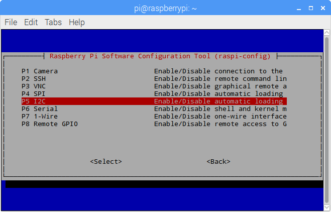
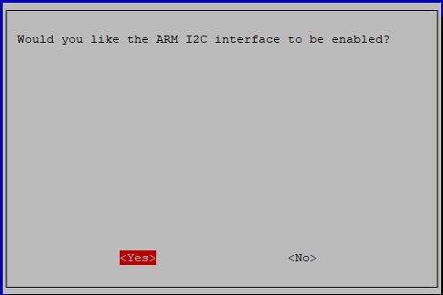

.. _i2c_config:

I2C Configuration
-----------------------

**Step 1**: Enable the I2C port of your Raspberry Pi (If you have
enabled it, skip this; if you do not know whether you have done that or
not, please continue).

.. raw:: html

    <run></run>
 
.. code-block:: 

    sudo raspi-config

**3 Interfacing options**

.. image:: media/image282.png
    :align: center

**P5 I2C**

**<Yes>, then <Ok> -> <Finish>**

**Step 2:** Check whether the i2c modules are loaded and active.

.. raw:: html

    <run></run>
 
.. code-block:: 

    lsmod | grep i2c

Then the following codes will appear (the number may be different).

.. code-block:: 

    i2c_dev                     6276    0
    i2c_bcm2708                 4121    0

**Step 3:** Install i2c-tools.

.. raw:: html

    <run></run>
 
.. code-block:: 

    sudo apt-get install i2c-tools

**Step 4:** Check the address of the I2C device.

.. raw:: html

    <run></run>

.. code-block:: 

    i2cdetect -y 1      # For Raspberry Pi 2 and higher version

.. raw:: html

   <run></run>

.. code-block:: 

    i2cdetect -y 0      # For Raspberry Pi 1

.. code-block:: 

    pi@raspberrypi ~ $ i2cdetect -y 1
        0  1  2  3   4  5  6  7  8  9   a  b  c  d  e  f
    00:           -- -- -- -- -- -- -- -- -- -- -- -- --
    10: -- -- -- -- -- -- -- -- -- -- -- -- -- -- -- --
    20: -- -- -- -- -- -- -- -- -- -- -- -- -- -- -- --
    30: -- -- -- -- -- -- -- -- -- -- -- -- -- -- -- --
    40: -- -- -- -- -- -- -- -- 48 -- -- -- -- -- -- --
    50: -- -- -- -- -- -- -- -- -- -- -- -- -- -- -- --
    60: -- -- -- -- -- -- -- -- -- -- -- -- -- -- -- --
    70: -- -- -- -- -- -- -- --

If there is an I2C device connected, the address of the device will be displayed.

**Step 5:**

**For C language users:** Install libi2c-dev.

.. raw:: html

    <run></run>
 
.. code-block:: 

    sudo apt-get install libi2c-dev 

**For Python users:** Install smbus for I2C.

.. raw:: html

    <run></run>
 
.. code-block:: 

    sudo pip3 install smbus2