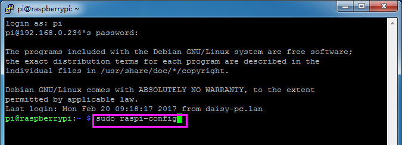
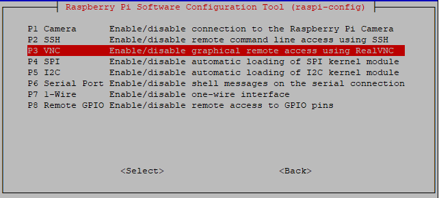
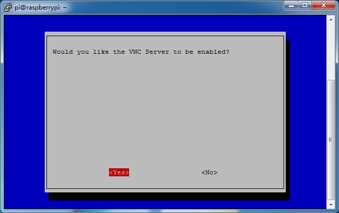
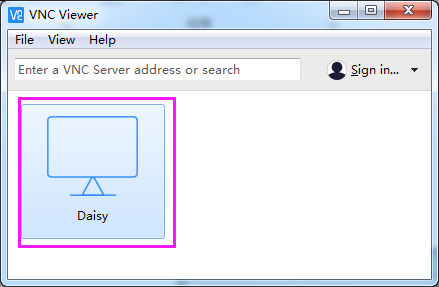
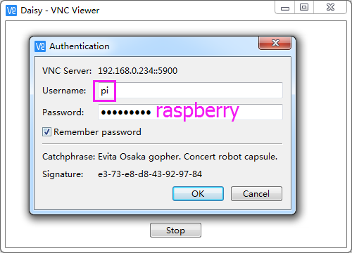
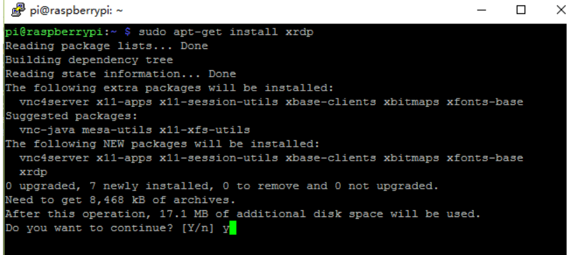

.. _remote_desktop:

Remote Desktop 
=====================

There are two ways to control the desktop of the Raspberry Pi remotely:

**VNC** and **XRDP**, you can use any of them.

VNC 
--------------

You can use the function of remote desktop through VNC.

**Enable VNC service**

The VNC service has been installed in the system. By default, VNC is
disabled. You need to enable it in config.

**Step 1**

Input the following command:

.. raw:: html

   <run></run>

.. code-block:: 

   sudo raspi-config

**Step 2**

Choose **3** **Interfacing Options** by press the down arrow key on your
keyboard, then press the **Enter** key.

.. image:: media/image282.png
   :align: center

**Step 3**

**P3 VNC**

**Step 4**

Select **Yes -> OK -> Finish** to exit the configuration.

**Login to VNC**

**Step 1**

You need to download and install the `VNC Viewer <https://www.realvnc.com/en/connect/download/viewer/>`_ on personal computer. After the installation is done, open it.

**Step 2**

Then select \"**New connection**\".

.. image:: media/image290.png
   :align: center

**Step 3**

Input IP address of Raspberry Pi and any **Name**.

.. image:: media/image291.png
   :align: center

**Step 4**

Double click the **connection** just created:

**Step 5**

Enter Username (**pi**) and Password (**raspberry** by default).

**Step 6**

Now you can see the desktop of the Raspberry Pi:

.. image:: media/image294.png
   :align: center

That's the end of the VNC part.

XRDP
-----------------------

Another method of remote desktop is XRDP, it provides a graphical login to remote machines using RDP (Microsoft
Remote Desktop Protocol).

**Install XRDP**

**Step 1**

Login to Raspberry Pi by using SSH.

**Step 2**

Input the following instructions to install XRDP.

.. raw:: html

   <run></run>

.. code-block:: 

   sudo apt-get update
   sudo apt-get install xrdp

**Step 3**

Later, the installation starts.

Enter \"Y\", press key \"Enter\" to confirm.

**Step 4**

Finished the installation, you should login to your Raspberry Pi by
using Windows remote desktop applications.

**Login to XRDP**

**Step 1**

If you are a Windows user, you can use the Remote Desktop feature that
comes with Windows. If you are a Mac user, you can download and use
Microsoft Remote Desktop from the APP Store, and there is not much
difference between the two. The next example is Windows remote desktop.

**Step 2**

Type in \"**mstsc**\" in Run (WIN+R) to open the Remote Desktop
Connection, and input the IP address of Raspberry Pi, then click on
\"Connect\".

.. image:: media/image296.png
   :align: center

**Step 3**

Then the xrdp login page pops out. Please type in your username and
password. After that, please click \"OK\". At the first time you log in,
your username is \"pi\" and the password is \"raspberry\".

.. image:: media/image297.png
   :align: center

**Step 4**

Here, you successfully login to RPi by using the remote desktop.

.. image:: media/image20.png
   :align: center

**Copyright Notice**

All contents including but not limited to texts, images, and code in
this manual are owned by the SunFounder Company. You should only use it
for personal study, investigation, enjoyment, or other non-commercial or
nonprofit purposes, under the related regulations and copyrights laws,
without infringing the legal rights of the author and relevant right
holders. For any individual or organization that uses these for
commercial profit without permission, the Company reserves the right to
take legal action.

