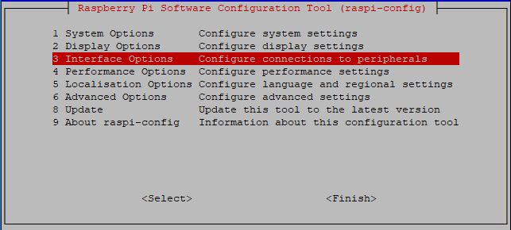
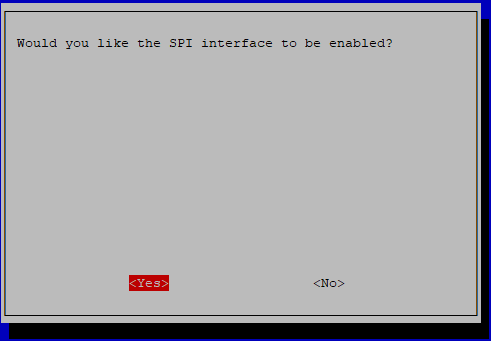

SPI Configuration
-----------------------

**Step 1**: Enable the SPI port of your Raspberry Pi (If you have
enabled it, skip this; if you do not know whether you have done that or
not, please continue).

.. raw:: html

    <run></run>

.. code-block:: 

    sudo raspi-config

**3 Interfacing options**

**P4 SPI**

.. image:: media/image285.png
   :align: center

**<YES>**, then click **<OK>** and **<Finish>**. Now you can use the ``sudo reboot`` command to reboot the Raspberry Pi.

**Step 2:** Check that the spi modules are loaded and active.

.. raw:: html

    <run></run>

.. code-block:: 

    ls /dev/sp*

Then the following codes will appear (the number may be different).

.. code-block:: 

    /dev/spidev0.0  /dev/spidev0.1

**Step 3:** Install Python module SPI-Py.

.. raw:: html

    <run></run>

.. code-block:: 

    git clone https://github.com/lthiery/SPI-Py.git
    cd SPI-Py
    sudo python3 setup.py install

.. note::

    This step is for python users, if you use C language, please skip.

