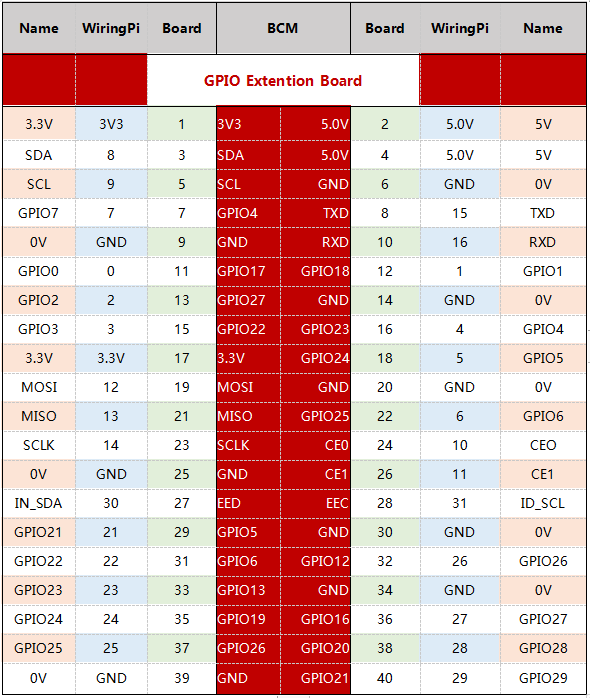

GPIO Extension Board
====================

**Connect to Raspberry Pi**

Before starting to learn the commands, you first need to know more about
the pins of the Raspberry Pi, which is key to the subsequent study.

We can easily lead out pins of the Raspberry Pi to breadboard by GPIO
Extension Board to avoid GPIO damage caused by frequent plugging in or
out. This is our 40-pin GPIO Extension Board and GPIO cable for
Raspberry Pi model B+, 2 model B and 3, 4 model B.

.. image:: media/image88.png
   :width: 6.83889in
   :height: 3.04583in

**Pin Number**

  The pins of Raspberry Pi have three kinds of ways to name and they are
  wiringPi, BCM and Board. Among these naming methods, 40-pin GPIO
  Extension board uses the naming method, BCM. But for some special
  pins, such as I2C port and SPI port, they use the Name that comes with
  themselves. The following table shows us the naming methods of
  WiringPi, Board and the intrinsic Name of each pin on GPIO Extension
  board. For example, for the GPIO17, the Board naming method of it is
  11, the wiringPi naming method is 0, and the intrinsic naming method
  of it is GPIO0.

.. note::

  1）In C Language, what is used is the naming method WiringPi.
  
  2）In Python Language, the applied naming methods are Board and BCM, and the function GPIO.setmode() is used to set them.

