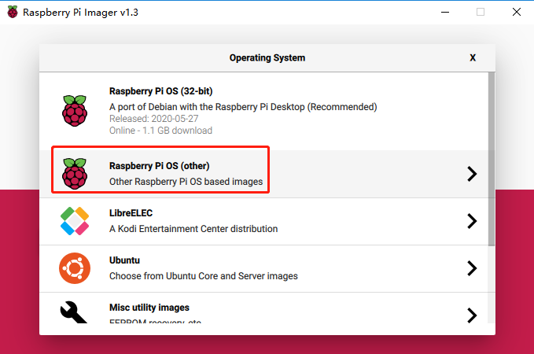
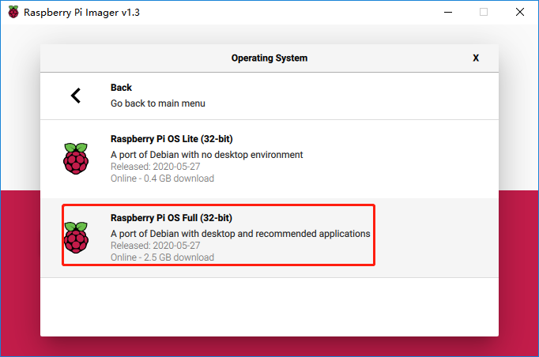

**If You Have No Screen**
-------------------------

If we don't have a screen, we can directly write the Raspberry Pi OS
system to the Micro SD card and we can control the Raspberry Pi on PC
remotely by directly modifying the configuration file of the network
settings in the Micro SD card.

.. _required-components-2:

Required Components
~~~~~~~~~~~~~~~~~~~

+----------------------------------+-----------------------------------+
| Any Raspberry Pi                 | 1 \* Power Adapter                |
+----------------------------------+-----------------------------------+
| 1 \* Micro SD card               | 1 \* Personal computer            |
+----------------------------------+-----------------------------------+

Installing System
~~~~~~~~~~~~~~~~~

There are 2 ways to install the system, **Using Raspberry Pi Imager** or
**Using Raspberry Pi OS**. **Using Raspberry Pi Imager** is a kind of
method recommended by Raspberry Pi official website for beginners with
which you can directly write the Raspberry Pi OS into SD card after
downloading Raspberry Pi Imager. However, each time the system is
reinstalled, this method can take several hours.

In the later method, you need to download Raspberry Pi OS image at
first, then use the tool to write it to your SD card, which can be
confusing. But once you successfully finish the flashing at the first
time, it only takes about 10 minutes to flash again.

-  **Using Raspberry Pi Imager**

Raspberry Pi have developed a graphical SD card writing tool that works
on Mac OS, Ubuntu 18.04 and Windows, and is the easiest option for most
users as it will download the image and install it automatically to the
SD card.

1) Download the latest version of `Raspberry Pi
   Imager <https://www.raspberrypi.org/downloads/>`__\ (https://www.raspberrypi.org/downloads/) and
   install it.

2) Connect an SD card reader with the SD card inside.

3) Open Raspberry Pi Imager and choose **Raspberry Pi OS (other) ->
   Raspberry Pi OS Full (32-bit)**.

   

4) Choose the SD card you wish to write your image to.

5) Review your selections and click 'WRITE' to begin writing data to the
   SD card.

.. note::
    If using the Raspberry Pi Imager on Windows 10 with Controlled
    Folder Access enabled, you will need to explicitly allow the Raspberry
    Pi Imager permission to write the SD card. If this is not done,
    Raspberry Pi Imager will fail with a \"failed to write\" error.

-  **Using Raspberry Pi OS**

**Step 1:** Prepare the tool of image burning. Here we use the
**balenaEtcher**. You can download the software from the link:
https://www.balena.io/etcher/

**Step 2:** Download the complete image on the official website by
clicking this link:
https://www.raspberrypi.org/downloads/raspberry-pi-os/. There are three
different kinds of Raspberry Pi OS system available, You are recommend
to install the version：\ **Raspberry Pi OS with desktop and recommended
software**.

**Step 3:** Unzip the package downloaded and you will see the *.img*
file inside.

.. note:: 
    The Raspberry Pi OS with desktop image contained in the ZIP
    archive is over 4GB in size and uses
    the `ZIP64 <https://en.wikipedia.org/wiki/Zip_(file_format)#ZIP64>`__ format.
    To uncompress the archive, a unzip tool that supports ZIP64 is required.
    The following zip tools support ZIP64: 7-Zip (Windows), The Unarchiver
    (Mac) and Unzip (Linux).

**Step 4:** Plug the USB card reader into the computer, then you can
burn the **.img** file with the Etcher.

.. image:: media/image66.png
   :alt: IMG_269
   :width: 6.52153in
   :height: 3.34861in

At this point, Raspberry Pi OS is installed. **Keep the USB card reader
plug in your computer**. If you want to apply it, next you need to
complete the settings accordingly.

Connect the Raspberry Pi to the Internet
~~~~~~~~~~~~~~~~~~~~~~~~~~~~~~~~~~~~~~~~

There are two methods to help get the Raspberry Pi connected to the
network: the first one is using a network cable, the other way is using
WIFI. We will talk in detail about how to connect via WIFI as below.

Since the 3B and above version of the product, Raspberry Pi has a
built-in Wifi function. If what you use is the early version of
Raspberry Pi, a USB WIFI Adapter is needed. Log in the website,
https://elinux.org/RPi_USB_Wi-Fi_Adapters for more.

.. image:: media/image67.jpeg
   :alt: IMG_270
   :width: 3.98056in
   :height: 2.21736in

If you want to use the WIFI function, you need to modify a WIFI
configuration file wpa_supplicant.conf in the SD card by your PC that is
located in the directory /etc/wpa_supplicant/.

If your personal computer is working on a linux system, you can access
the directory directly to modify the configuration file; however, if
your PC use Windows system, then you can't access the directory and what
you need next is to go to the directory, */boot/*  to create a new file
with the same name, **wpa_supplicant.conf**.

.. image:: media/image68.jpeg
   :width: 250

Input the following content in the file.

.. code-block::

    ctrl_interface=DIR=/var/run/wpa_supplicant GROUP=netdev
    update_config=1
    country=COUNTRY

    network={
	
    ssid="SSID"
    psk="PASSWORD"
    key_mgmt=WPA-PSK
    priority=1
	
    }

**COUNTRY** should be set the two-letter `ISO/IEC alpha2
code <https://en.wikipedia.org/wiki/ISO_3166-1_alpha-2#Officially_assigned_code_elements>`__ for
the country in which you are using your Raspberry Pi, please refer to
the following link:

https://en.wikipedia.org/wiki/ISO_3166-1_alpha-2#Officially_assigned_code_elements

You need to replace \"**SSID**\" with your custom name of WiFi and
\"**PASSWORD**\" with your password.

By doing these, the Raspberry Pi OS will move this file to the target
directory automatically to overwrite the original WIFI configuration
file when it runs next time.

Start SSH
~~~~~~~~~

To use the function of remote control of the Raspberry Pi, you need to
start SSH firstly that is a more reliable protocol providing security
for remote login sessions and other network services. Generally, SSH of
Raspberry Pi is in a disabled state. Additionally, if you want to run
it, you need to create a file named SSH under directory /boot/.

.. image:: media/image69.png
   :alt: IMG_272
   :width: 4.47917in
   :height: 1.22917in

Now, the Raspberry Pi OS is configured. When the SD card is inserted
into the Raspberry Pi, you can use it immediately.

Get the IP Address
~~~~~~~~~~~~~~~~~~

After the Raspberry Pi is connected to WIFI, we need to get the IP
address of it. There are many ways to know the IP address, and two of
them are listed as follows.

**1. Checking via the router**

If you have permission to log in the router(such as a home network), you
can check the addresses assigned to Raspberry Pi on the admin interface
of router.

The default hostname of the Raspberry Pi OS is **raspberrypi**, and you
need to find it. (If you are using ArchLinuxARM system, please find
alarmpi.)

**2. Network Segment Scanning**

You can also use network scanning to look up the IP address of Raspberry
Pi. You can apply the software, Advanced IP scanner and so on.

Scan the IP range set, and the name of all connected devices will be
displayed. Similarly, the default hostname of the Raspberry Pi OS is
**raspberrypi**, now you need to find the hostname.

Use the SSH Remote Control
~~~~~~~~~~~~~~~~~~~~~~~~~~

We can open the Bash Shell of Raspberry Pi by applying SSH. Bash is the
standard default shell of Linux. The Shell itself is a program written
in C that is the bridge linking the customers and Unix/Linux. Moreover,
it can help to complete most of the work needed.

**For Linux or/Mac OS X Users**
^^^^^^^^^^^^^^^^^^^^^^^^^^^^^^^

**Step 1**

Go to **Applications**->\ **Utilities**, find the **Terminal**, and open
it.

.. image:: media/image70.png
   :alt: IMG_274
   :width: 5.58472in
   :height: 3.25208in

**Step 2**

Type in **ssh pi@ip_address** . \"pi\" is your username and \"ip_address\" is
your IP address. For example:

.. code-block::

    ssh pi@192.168.18.197

**Step 3**

Input \"yes\".

.. image:: media/image71.png
   :width: 600

**Step 4**

Input the passcode and the default password is **raspberry**.

.. image:: media/image72.png
   :width: 600

**Step 5**

We now get the Raspberry Pi connected and are ready to go to the next
step.

.. image:: media/image73.png
   :alt: IMG_277
   :width: 5.74514in
   :height: 4.37153in

.. note:: 
    When you input the password, the characters do not display on
    window accordingly, which is normal. What you need is to input the
    correct passcode.

**For Windows Users**
^^^^^^^^^^^^^^^^^^^^^

If you're a Windows user, you can use SSH with the application of some
software. Here, we recommend PuTTY.

**Step 1**

Download PuTTY.

**Step 2**

Open PuTTY and click **Session** on the left tree-alike structure. Enter
the IP address of the RPi in the text box under **Host Name (or IP
address)** and 22 under **Port** (by default it is 22).

.. image:: media/image74.png
   :alt: IMG_278
   :width: 6.3125in
   :height: 5.59375in

**Step 3**

Click **Open**. Note that when you first log in to the Raspberry Pi with
the IP address, there prompts a security reminder. Just click **Yes**.

**Step 4**

When the PuTTY window prompts \"**login as:**\", type in
\"**pi**\" (the user name of the RPi), and **password:** \"raspberry\"
(the default one, if you haven't changed it).

.. image:: media/image75.png
   :alt: IMG_279
   :width: 6.67708in
   :height: 4.42708in

**Step 5**

Here, we get the Raspberry Pi connected and it is time to conduct the
next steps.

.. note:: 
    When you input the password, the characters do not display on
    window accordingly, which is normal. What you need is to input the
    correct password.

Remote Desktop
~~~~~~~~~~~~~~

If you are not satisfied with using the command window to control the
Raspberry Pi, you can also use the remote desktop function, which can
help us manage the files in the Raspberry Pi easily. There are two ways
to control the desktop of the Raspberry Pi remotely : **VNC** and
**XRDP**.

**VNC** 
^^^^^^^

You can use the function of remote desktop through VNC.

**Enable VNC service**

The VNC service has been installed in the system. By default, VNC is
disabled. You need to enable it in config.

**Step 1**

Input the following command:

.. code-block::

    sudo raspi-config

**Step 2**

On the config interface, select \"**Interfacing Options**\" by the
forward and backward keys.

.. image:: media/image76.png
   :width: 600

**Step 3**

Select **VNC**.

.. image:: media/image77.png
   :width: 600

**Step 4**

Select **Yes -> OK -> Finish** to exit the configuration.

.. image:: media/image78.png
   :alt: IMG_283
   :width: 5.03125in
   :height: 3.34583in

**Login to VNC**

**Step 1**

You need to install the VNC Viewer on personal computer. After the
installation is done, open it.

**Step 2**

Then select \"**New connection**\".

   .. image:: media/image79.png
      :alt: IMG_285
      :width: 3.67708in
      :height: 1.66667in

**Step 3**

Input IP address of Raspberry Pi and any **name**.

.. image:: media/image80.png
   :alt: IMG_286
   :width: 4.02569in
   :height: 4.52153in

**Step 4**

Double click the **connection** just created:

.. image:: media/image81.png
   :alt: IMG_287
   :width: 4.57292in
   :height: 2.98958in

**Step 5**

Enter Username (**pi**) and Password (**raspberry** by default).

.. image:: media/image82.png
   :alt: IMG_288
   :width: 5.20833in
   :height: 3.75in

**Step 6**

Now you can see the desktop of the Raspberry Pi:

.. image:: media/image83.png
   :width: 500

**XRDP**
^^^^^^^^

xrdp provides a graphical login to remote machines using RDP (Microsoft
Remote Desktop Protocol).

**Install XRDP**

**Step 1**

Login to Raspberry Pi by using SSH.

**Step 2**

Input the following instructions to install XRDP.

.. code-block::

    sudo apt-get update
    sudo apt-get install xrdp

**Step 3**

Later, the installation starts.

Enter \"Y\", press key \"Enter\" to confirm.

.. image:: media/image84.png
   :width: 600

**Step 4**

After the installation is completed, you can use Windows remote desktop
applications to login to your RPi.

**Login to XRDP**

**Step 1**

If you are a Windows user, you can use the Remote Desktop feature that
comes with Windows. If you are a Mac user, you can download and use
Microsoft Remote Desktop from the APP Store, and there is not much
difference between the two. The next example is Windows remote desktop.

**Step 2**

Type in \"mstsc\" in Run (WIN+R) to open the Remote Desktop Connection, and
input the IP address of Raspberry Pi, then click on \"Connect\".

.. image:: media/image85.png
   :width: 700

**Step 3**

There will be xrdp login screen. Enter the user name and password of RPi
and click OK. By default, the user name of Raspberry Pi is \"**pi**\" and
the password is \"**raspberry**\".

.. image:: media/image86.png
   :alt: IMG_292
   :width: 3.55in
   :height: 4.26181in

**Step 4**

Here, you successfully login to RPi by using the remote desktop.

.. image:: media/image87.png
   :width: 600