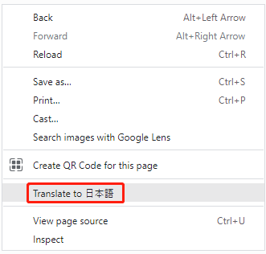
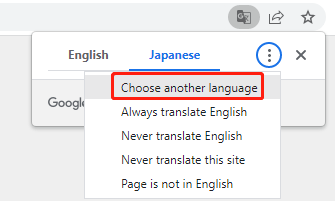
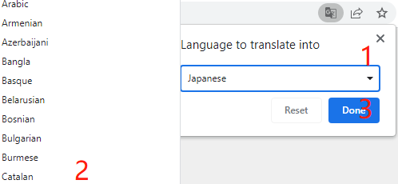

SunFounder Sensor Kit V2 for Raspberry Pi
==========================================

This sensor kit is suitable for the Raspberry Pi model B+, 2 model B, 3 model B, 3 model B+ and 4 Model B. It includes dozens of different modules for you to learn and we provide corresponding lessons which are simple and useful for better understanding. Hope you can learn their applications quickly and use them in your own projects! 

If you want to learn another projects which we don’t have, please feel free to send Email and we will update to our online tutorials as soon as possible, any suggestions are welcomed.

Here is the Email: cs@sunfounder.com.

**About the display language**

In addition to English, we are working on other languages for this course. Please contact service@sunfounder.com if you are interested in helping, and we will give you a free product in return. 
In the meantime, we recommend using Google Translate to convert English to the language you want to see.

The steps are as follows.

* In this course page, right-click and select **Translate to xx**. If the current language is not what you want, you can change it later.

* There will be a language popup in the upper right corner. Click on the menu button to **choose another language**.

* Select the language from the inverted triangle box, and then click **Done**.

.. toctree::
    :maxdepth: 2

    components
    preparation
    libraries
    gpio_extension_board
    download_the_code
    lessons
    appendix/appendix
    faq
    thank-learning

Copyright Notice
--------------------------

All contents including but not limited to texts, images, and code in this manual are owned by the SunFounder Company. You should only use it for personal study,investigation, enjoyment, or other non-commercial or nonprofit purposes, under therelated regulations and copyrights laws, without infringing the legal rights of the author and relevant right holders. For any individual or organization that uses these for commercial profit without permission, the Company reserves the right to take legal action.

