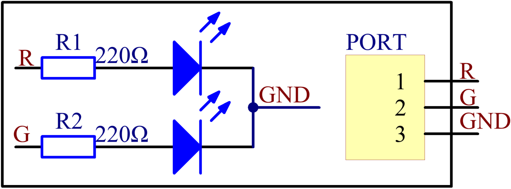

Lesson 1 Dual-Color LED
=======================

**Introduction**

A dual-color light emitting diode (LED) is capable of emitting two
different colors of light, typically red and green, rather than only one
color. It is housed in a 3mm or 5mm epoxy package. It has 3 leads;
common cathode or common anode is available. A dual-color LED features
two LED terminals, or pins, arranged in the circuit in anti-parallel and
connected by a cathode/anode. Positive voltage can be directed towards
one of the LED terminals, causing that terminal to emit light of the
corresponding color; when the direction of the voltage is reversed, the
light of the other color is emitted. In a dual-color LED, only one of
the pins can receive voltage at a time. As a result, this type of LED
frequently functions as indicator lights for a variety of devices,
including televisions, digital cameras, and remote controls.

.. image:: media/image96.png
   :width: 1.70486in
   :height: 1.36319in

**Required Components**

- 1 \* Raspberry Pi

- 1 \* Breadboard

- Several Jumper wires

- 1 \* Dual-color LED module

- 1 \* 3-Pin anti-reverse cable

**Experimental Principle**

Connect pin R and G to GPIOs of Raspberry Pi, program the Raspberry Pi
to change the color of the LED from red to green, and then use PWM to
mix into other colors.

The schematic diagram of the module is as shown below:

**Experimental Procedures**

**Step 1:** Build the circuit.

+----------------------+-----------------------+-----------------------+
| **Raspberry Pi**     | **GPIO Extension      | **Dual-Color LED      |
|                      | Board**               | Module**              |
+----------------------+-----------------------+-----------------------+
| **GPIO0**            | **GPIO17**            | **R**                 |
+----------------------+-----------------------+-----------------------+
| **GND**              | **GND**               | **GND**               |
+----------------------+-----------------------+-----------------------+
| **GPIO1**            | **GPIO18**            | **G**                 |
+----------------------+-----------------------+-----------------------+

.. image:: media/image98.png
   :width: 600

**For C Users:**

**Step 2:** Change directory.

.. code-block::

    cd /home/pi/SunFounder_SensorKit_for_RPi2/C/01_dule_color_led/

**Step 3:** Compile.

.. code-block::

    gcc dule_color_led.c -lwiringPi -lpthread

**Step 4:** Run.

.. code-block::

    sudo ./a.out

**Code**

.. code-block:: c

    #include <wiringPi.h>
    #include <softPwm.h>
    #include <stdio.h>

    #define uchar unsigned char

    #define LedPinRed    0
    #define LedPinGreen  1

    void ledInit(void)
    {
        softPwmCreate(LedPinRed,  0, 100);
        softPwmCreate(LedPinGreen,0, 100);
    }

    void ledColorSet(uchar r_val, uchar g_val)
    {
        softPwmWrite(LedPinRed,   r_val);
        softPwmWrite(LedPinGreen, g_val);
    }

    int main(void)
    {
        int i;

        if(wiringPiSetup() == -1){ //when initialize wiring failed,print messageto screen
            printf("setup wiringPi failed !");
            return 1; 
        }
        //printf("linker LedPin : GPIO %d(wiringPi pin)\n",LedPin); //when initialize wiring successfully,print message to screen

        ledInit();

        while(1){
            ledColorSet(0xff,0x00);   //red	
            delay(500);
            ledColorSet(0x00,0xff);   //green
            delay(500);
            ledColorSet(0xff,0x45);	
            delay(500);
            ledColorSet(0xff,0xff);	
            delay(500);
            ledColorSet(0x7c,0xfc);	
            delay(500);
        }

        return 0;
    }

**For Python Users:**

**Step 2:** Change directory.

.. code-block::

    cd /home/pi/SunFounder_SensorKit_for_RPi2/Python/

**Step 3:** Run.

.. code-block::

    sudo python3 01_dule_color_led.py

**Code**

.. code-block:: python

    #!/usr/bin/env python3
    import RPi.GPIO as GPIO
    import time

    colors = [0xFF00, 0x00FF, 0x0FF0, 0xF00F]
    pins = (11, 12)  # pins is a dict

    GPIO.setmode(GPIO.BOARD)       # Numbers GPIOs by physical location
    GPIO.setup(pins, GPIO.OUT)   # Set pins' mode is output
    GPIO.output(pins, GPIO.LOW)  # Set pins to LOW(0V) to off led

    p_R = GPIO.PWM(pins[0], 2000)  # set Frequece to 2KHz
    p_G = GPIO.PWM(pins[1], 2000)

    p_R.start(0)      # Initial duty Cycle = 0(leds off)
    p_G.start(0)

    def map(x, in_min, in_max, out_min, out_max):
        return (x - in_min) * (out_max - out_min) / (in_max - in_min) + out_min

    def setColor(col):   # For example : col = 0x1122
        R_val = col  >> 8
        G_val = col & 0x00FF
        
        R_val = map(R_val, 0, 255, 0, 100)
        G_val = map(G_val, 0, 255, 0, 100)
        
        p_R.ChangeDutyCycle(R_val)     # Change duty cycle
        p_G.ChangeDutyCycle(G_val)

    def loop():
        while True:
            for col in colors:
                setColor(col)
                time.sleep(0.5)

    def destroy():
        p_R.stop()
        p_G.stop()
        GPIO.output(pins, GPIO.LOW)    # Turn off all leds
        GPIO.cleanup()

    if __name__ == "__main__":
        try:
            loop()
        except KeyboardInterrupt:
            destroy()

You can see the dual-color LED render green, red, and mixed colors.

.. image:: media/image99.jpeg
   :width: 700
