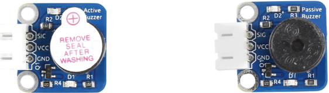
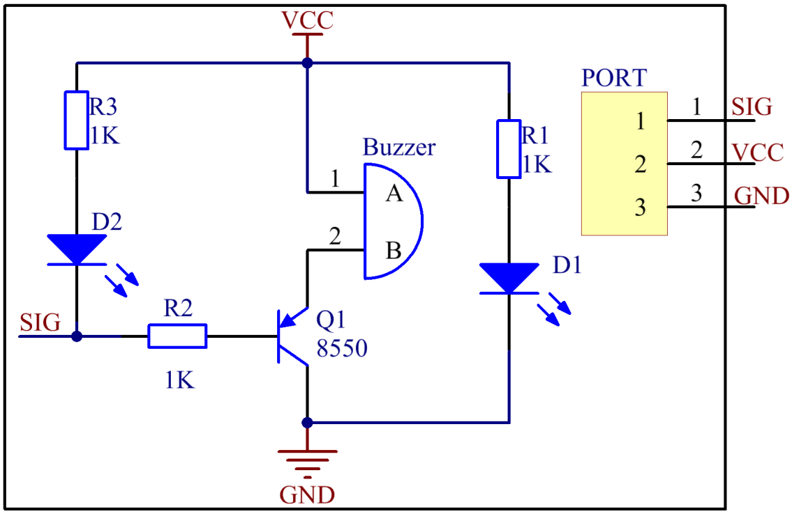

Lesson 10 Buzzer Module
=======================

**Introduction**

Buzzers can be categorized as active and passive ones (See the following
picture).

**Required Components**

- 1 \* Raspberry Pi

- 1 \* Breadboard

- 1 \* Passive buzzer module

- 1 \* Active buzzer module

- 1 \* 3-Pin anti-reverse cable

**Experimental Principle**

Place the pins of two buzzers face up and you can see the one with a
green circuit board is a passive buzzer, while the other with a black
tape, instead of a board, is an active buzzer.

.. image:: media/image136.png
   :width: 500

**Active buzzer Passive buzzer**

The difference between an active buzzer and a passive buzzer is:

An active buzzer has a built-in oscillating source, so it will make
sounds when electrified. But a passive buzzer does not have such source,
so it will not beep if DC signals are used; instead, you need to use
square waves whose frequency is between 2K and 5K to drive it. The
active buzzer is often more expensive than the passive one because of
multiple built-in oscillating circuits.

The schematic diagram of the module is as shown below:

**Experimental Procedures**

**Active Buzzer**

.. note::
    The active buzzer has built-in oscillating source, so it will beep as long as it is wired up, but it can only beep with fixed frequency.

**Step 1:** Build the circuit.

.. image:: media/image138.png
   :width: 5.33611in
   :height: 4.45625in

**For C Users:**

**Step 2:** Change directory.

.. raw:: html

    <run></run>

.. code-block::

    cd /home/pi/SunFounder_SensorKit_for_RPi2/C/10_active_buzzer/

**Step 3:** Compile.

.. raw:: html

    <run></run>

.. code-block::

    gcc active_buzzer.c -lwiringPi

**Step 4:** Run.

.. raw:: html

    <run></run>

.. code-block::

    sudo ./a.out

.. note::

   If it does not work after running, or there is an error prompt: \"wiringPi.h: No such file or directory\", please refer to :ref:`C code is not working?`.

**Code**

.. code-block:: c

    #include <wiringPi.h>
    #include <stdio.h>

    #define BuzzerPin      0

    int main(void)
    {
        if(wiringPiSetup() == -1){ //when initialize wiring failed,print messageto screen
            printf("setup wiringPi failed !");
            return 1; 
        }
    //	printf("linker LedPin : GPIO %d(wiringPi pin)\n",VoicePin); //when initialize wiring successfully,print message to screen
        
        pinMode(BuzzerPin,  OUTPUT);

        while(1){
                digitalWrite(BuzzerPin, HIGH);
                delay(100);
                digitalWrite(BuzzerPin, LOW);
                delay(100);	
        }

        return 0;
    }

**For Python Users:**

**Step 2:** Change directory.

.. raw:: html

    <run></run>

.. code-block::

    cd /home/pi/SunFounder_SensorKit_for_RPi2/Python/

**Step 3:** Run.

.. raw:: html

    <run></run>

.. code-block::

    sudo python3 10_active_buzzer.py

**Code**

.. raw:: html

    <run></run>

.. code-block:: python

    #!/usr/bin/env python3
    import RPi.GPIO as GPIO
    import time

    Buzzer = 11    # pin11

    def setup(pin):
        global BuzzerPin
        BuzzerPin = pin
        GPIO.setmode(GPIO.BOARD)       # Numbers GPIOs by physical location
        GPIO.setup(BuzzerPin, GPIO.OUT)
        GPIO.output(BuzzerPin, GPIO.HIGH)

    def on():
        GPIO.output(BuzzerPin, GPIO.LOW)

    def off():
        GPIO.output(BuzzerPin, GPIO.HIGH)

    def beep(x):
        on()
        time.sleep(x)
        off()
        time.sleep(x)

    def loop():
        while True:
            beep(0.5)

    def destroy():
        GPIO.output(BuzzerPin, GPIO.HIGH)
        GPIO.cleanup()                     # Release resource

    if __name__ == '__main__':     # Program start from here
        setup(Buzzer)
        try:
            loop()
        except KeyboardInterrupt:  # When 'Ctrl+C' is pressed, the child program destroy() will be  executed.
            destroy()

Now you can hear the active buzzer beeping.

.. image:: media/image139.jpeg

**Passive Buzzer**

**Step 1:** Build the circuit.

+-----------------------+----------------------+----------------------+
| **Raspberry Pi**      | **GPIO Extension     | **Passive Buzzer     |
|                       | Board**              | Module**             |
+-----------------------+----------------------+----------------------+
| **GPIO0**             | **GPIO17**           | **SIG**              |
+-----------------------+----------------------+----------------------+
| **3.3V**              | **3V3**              | **VCC**              |
+-----------------------+----------------------+----------------------+
| **GND**               | **GND**              | **GND**              |
+-----------------------+----------------------+----------------------+

.. image:: media/image140.png
   :width: 6.21111in
   :height: 5.09375in

**For C Users:**

**Step 2:** Change directory.

.. code-block::

    cd /home/pi/SunFounder_SensorKit_for_RPi2/C/10_passive_buzzer/

**Step 3:** Compile.

.. code-block::

    gcc passive_buzzer.c -lwiringPi

**Step 4:** Run.

.. code-block::

    sudo ./a.out

**Code**

.. code-block:: c

    #include <wiringPi.h>
    #include <softTone.h>
    #include <stdio.h>

    #define BuzPin    0

    #define  CL1  131
    #define  CL2  147
    #define  CL3  165
    #define  CL4  175
    #define  CL5  196
    #define  CL6  221
    #define  CL7  248

    #define  CM1  262
    #define  CM2  294
    #define  CM3  330
    #define  CM4  350
    #define  CM5  393
    #define  CM6  441
    #define  CM7  495

    #define  CH1  525
    #define  CH2  589
    #define  CH3  661
    #define  CH4  700
    #define  CH5  786
    #define  CH6  882
    #define  CH7  990

    int song_1[] = {CM3,CM5,CM6,CM3,CM2,CM3,CM5,CM6,CH1,CM6,CM5,CM1,CM3,CM2,
                    CM2,CM3,CM5,CM2,CM3,CM3,CL6,CL6,CL6,CM1,CM2,CM3,CM2,CL7,
                    CL6,CM1,CL5};

    int beat_1[] = {1,1,3,1,1,3,1,1,1,1,1,1,1,1,3,1,1,3,1,1,1,1,1,1,1,2,1,1,
                    1,1,1,1,1,1,3};

    int song_2[] = {CM1,CM1,CM1,CL5,CM3,CM3,CM3,CM1,CM1,CM3,CM5,CM5,CM4,CM3,CM2,
                    CM2,CM3,CM4,CM4,CM3,CM2,CM3,CM1,CM1,CM3,CM2,CL5,CL7,CM2,CM1
                    };

    int beat_2[] = {1,1,1,3,1,1,1,3,1,1,1,1,1,1,3,1,1,1,2,1,1,1,3,1,1,1,3,3,2,3};

    int main(void)
    {
        int i, j;

        if(wiringPiSetup() == -1){ //when initialize wiring failed,print messageto screen
            printf("setup wiringPi failed !");
            return 1; 
        }

        if(softToneCreate(BuzPin) == -1){
            printf("setup softTone failed !");
            return 1; 
        }

        while(1){
            printf("music is being played...\n");

            for(i=0;i<sizeof(song_1)/4;i++){
                softToneWrite(BuzPin, song_1[i]);	
                delay(beat_1[i] * 500);
            }

            for(i=0;i<sizeof(song_2)/4;i++){
                softToneWrite(BuzPin, song_2[i]);	
                delay(beat_2[i] * 500);
            }	
        }
        return 0;
    }

**For Python Users:**

**Step 2:** Change directory.

.. code-block::

    cd /home/pi/SunFounder_SensorKit_for_RPi2/Python/

**Step 3:** Run.

.. code-block::

    sudo python3 10_passive_buzzer.py

**Code**

.. code-block:: python

    #!/usr/bin/env python3
    import RPi.GPIO as GPIO
    import time

    Buzzer = 11

    CL = [0, 131, 147, 165, 175, 196, 211, 248]		# Frequency of Low C notes

    CM = [0, 262, 294, 330, 350, 393, 441, 495]		# Frequency of Middle C notes

    CH = [0, 525, 589, 661, 700, 786, 882, 990]		# Frequency of High C notes

    song_1 = [	CM[3], CM[5], CM[6], CM[3], CM[2], CM[3], CM[5], CM[6], # Notes of song1
                CH[1], CM[6], CM[5], CM[1], CM[3], CM[2], CM[2], CM[3], 
                CM[5], CM[2], CM[3], CM[3], CL[6], CL[6], CL[6], CM[1],
                CM[2], CM[3], CM[2], CL[7], CL[6], CM[1], CL[5]	]

    beat_1 = [	1, 1, 3, 1, 1, 3, 1, 1, 			# Beats of song 1, 1 means 1/8 beats
                1, 1, 1, 1, 1, 1, 3, 1, 
                1, 3, 1, 1, 1, 1, 1, 1, 
                1, 2, 1, 1, 1, 1, 1, 1, 
                1, 1, 3	]

    song_2 = [	CM[1], CM[1], CM[1], CL[5], CM[3], CM[3], CM[3], CM[1], # Notes of song2
                CM[1], CM[3], CM[5], CM[5], CM[4], CM[3], CM[2], CM[2], 
                CM[3], CM[4], CM[4], CM[3], CM[2], CM[3], CM[1], CM[1], 
                CM[3], CM[2], CL[5], CL[7], CM[2], CM[1]	]

    beat_2 = [	1, 1, 2, 2, 1, 1, 2, 2, 			# Beats of song 2, 1 means 1/8 beats
                1, 1, 2, 2, 1, 1, 3, 1, 
                1, 2, 2, 1, 1, 2, 2, 1, 
                1, 2, 2, 1, 1, 3 ]

    def setup():
        GPIO.setmode(GPIO.BOARD)		# Numbers GPIOs by physical location
        GPIO.setup(Buzzer, GPIO.OUT)	# Set pins' mode is output
        global Buzz						# Assign a global variable to replace GPIO.PWM 
        Buzz = GPIO.PWM(Buzzer, 440)	# 440 is initial frequency.
        Buzz.start(50)					# Start Buzzer pin with 50% duty ration

    def loop():
        while True:
            #    Playing song 1...
            for i in range(1, len(song_1)):		# Play song 1
                Buzz.ChangeFrequency(song_1[i])	# Change the frequency along the song note
                time.sleep(beat_1[i] * 0.5)		# delay a note for beat * 0.5s
            time.sleep(1)						# Wait a second for next song.

            #    Playing song 2...
            for i in range(1, len(song_2)):     # Play song 1
                Buzz.ChangeFrequency(song_2[i]) # Change the frequency along the song note
                time.sleep(beat_2[i] * 0.5)     # delay a note for beat * 0.5s

    def destory():
        Buzz.stop()					# Stop the buzzer
        GPIO.output(Buzzer, 1)		# Set Buzzer pin to High
        GPIO.cleanup()				# Release resource

    if __name__ == '__main__':		# Program start from here
        setup()
        try:
            loop()
        except KeyboardInterrupt:  	# When 'Ctrl+C' is pressed, the child program destroy() will be  executed.
            destory()

Now you can hear the passive buzzer playing music.

.. image:: media/image139.jpeg
