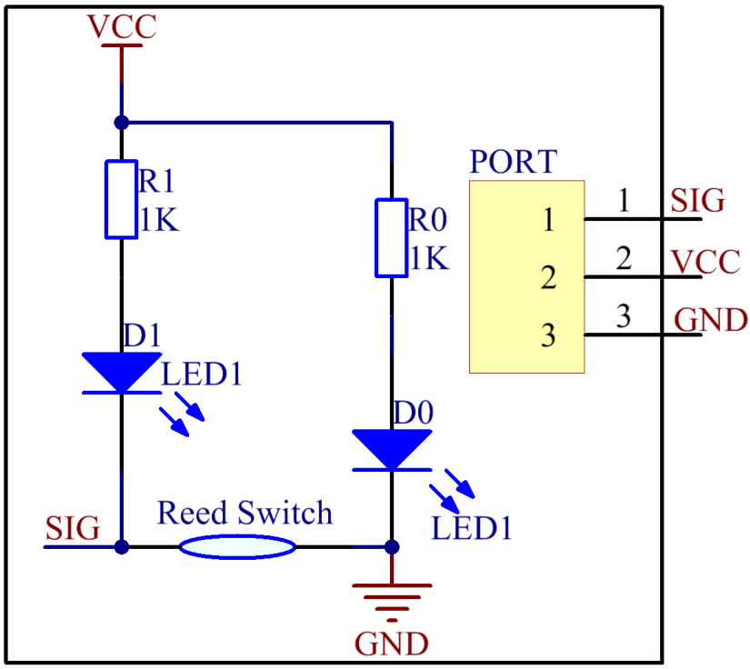

Lesson 11 Reed Switch
========================

**Introduction**

A reed switch (as shown below) is used to detect the magnetic field.
Hall sensors are generally used to measure the speed of intelligent
vehicles and count in assembly lines, while reed switches are often used
to detect the existence of a magnetic field.

.. image:: media/image141.png
   :width: 250

**Required Components**

- 1 \* Raspberry Pi

- 1 \* Breadboard

- 1 \* Reed switch module

- 1 \* Dual-color LED module

- 2 \* 3-Pin anti-reverse cable

- 1 \* Magnet (Self provided)

**Experimental Principle**

A reed switch is a type of line switch component that realizes control
by magnetic signals. It induces by a magnet. The \"switch\" here means dry
reed pipe, which is a kind of contact passive electronic switch
component with the advantage of simple structure, small size, and
convenient control. The shell of a reed switch is commonly a sealed
glass pipe in which two iron elastic reed electroplates are equipped and
inert gases are filled. Normally, the two reeds made of special
materials in the glass tube are separated. However, when a magnetic
substance approaches the glass tube, the two reeds in the glass tube are
magnetized to attract each other and contact under the function of
magnetic field lines. As a result, the two reeds will pull together to
connect the circuit connected with the nodes.

After external magnetic force disappears, the two reeds will be
separated with each other because they have the same magnetism, so the
circuit is also disconnected. Therefore, as a line switch component
controlling by magnetic signals, the dry reed pipe can be used as a
sensor to count, limit positions and so on. At the same time, it is
widely used in a variety of communication devices.

The schematic diagram of the module is as shown below:

**Experimental Procedures**

**Step 1:** Build the circuit

+-----------------------+----------------------+----------------------+
| **Raspberry Pi**      | **GPIO Extension     | **Reed Switch        |
|                       | Board**              | Module**             |
+-----------------------+----------------------+----------------------+
| **GPIO0**             | **GPIO17**           | **SIG**              |
+-----------------------+----------------------+----------------------+
| **3.3V**              | **3V3**              | **VCC**              |
+-----------------------+----------------------+----------------------+
| **GND**               | **GND**              | **GND**              |
+-----------------------+----------------------+----------------------+

+-----------------------+----------------------+----------------------+
| **Raspberry Pi**      | **GPIO Extension     | **Dual-color LED     |
|                       | Board**              | Module**             |
+-----------------------+----------------------+----------------------+
| **GPIO1**             | **GPIO18**           | **R**                |
+-----------------------+----------------------+----------------------+
| **GND**               | **GND**              | **GND**              |
+-----------------------+----------------------+----------------------+
| **GPIO2**             | **GPIO27**           | **G**                |
+-----------------------+----------------------+----------------------+

.. image:: media/image143.png
   :width: 5.91389in
   :height: 5.52986in

**For C Users:**

**Step 2:** Change directory.

.. raw:: html

    <run></run>

.. code-block::

    cd /home/pi/SunFounder_SensorKit_for_RPi2/C/11_reed_switch/

**Step 3:** Compile.

.. raw:: html

    <run></run>

.. code-block::

    gcc reed_switch.c -lwiringPi

.. note::

    If it does not work after running, or there is an error prompt ``wiringPi.h: No such file or directory``, please refer to :ref:`install_wiringpi` to install it.

**Step 4:** Run.

.. raw:: html

    <run></run>

.. code-block::

    sudo ./a.out

**Code**

.. code-block:: c

    #include <wiringPi.h>
    #include <stdio.h>

    #define ReedPin		0
    #define Gpin		2
    #define Rpin		1

    void LED(char* color)
    {
        pinMode(Gpin, OUTPUT);
        pinMode(Rpin, OUTPUT);
        if (color == "RED")
        {
            digitalWrite(Rpin, HIGH);
            digitalWrite(Gpin, LOW);
        }
        else if (color == "GREEN")
        {
            digitalWrite(Rpin, LOW);
            digitalWrite(Gpin, HIGH);
        }
        else
            printf("LED Error");
    }

    int main(void)
    {
        if(wiringPiSetup() == -1){ //when initialize wiring failed,print messageto screen
            printf("setup wiringPi failed !");
            return 1; 
        }

        pinMode(ReedPin, INPUT);
        LED("GREEN");
        
        while(1){
            if(0 == digitalRead(ReedPin)){
                delay(10);
                if(0 == digitalRead(ReedPin)){
                    LED("RED");	
                    printf("Detected Magnetic Material!\n");	
                }
            }
            else if(1 == digitalRead(ReedPin)){
                delay(10);
                if(1 == digitalRead(ReedPin)){
                    while(!digitalRead(ReedPin));
                    LED("GREEN");
                }
            }
        }
        return 0;
    }

**For Python Users:**

**Step 2:** Change directory.

.. raw:: html

    <run></run>

.. code-block::

    cd /home/pi/SunFounder_SensorKit_for_RPi2/Python/

**Step 3:** Run.

.. raw:: html

    <run></run>

.. code-block::

    sudo python3 11_reed_switch.py

**Code**

.. raw:: html

    <run></run>

.. code-block:: python

    #!/usr/bin/env python3
    import RPi.GPIO as GPIO

    ReedPin = 11
    Gpin    = 13
    Rpin    = 12

    def setup():
        GPIO.setmode(GPIO.BOARD)       # Numbers GPIOs by physical location
        GPIO.setup(Gpin, GPIO.OUT)     # Set Green Led Pin mode to output
        GPIO.setup(Rpin, GPIO.OUT)     # Set Red Led Pin mode to output
        GPIO.setup(ReedPin, GPIO.IN, pull_up_down=GPIO.PUD_UP)    # Set BtnPin's mode is input, and pull up to high level(3.3V)
        GPIO.add_event_detect(ReedPin, GPIO.BOTH, callback=detect, bouncetime=200)

    def Led(x):
        if x == 0:
            GPIO.output(Rpin, 1)
            GPIO.output(Gpin, 0)
        if x == 1:
            GPIO.output(Rpin, 0)
            GPIO.output(Gpin, 1)

    def detect(chn):
        Led(GPIO.input(ReedPin))

    def loop():
        while True:
            pass

    def destroy():
        GPIO.output(Gpin, GPIO.HIGH)       # Green led off
        GPIO.output(Rpin, GPIO.HIGH)       # Red led off
        GPIO.cleanup()                     # Release resource

    if __name__ == '__main__':     # Program start from here
        setup()
        try:
            loop()
        except KeyboardInterrupt:  # When 'Ctrl+C' is pressed, the child program destroy() will be  executed.
            destroy()

Then the LED will flash green. Place a magnet near the reed switch,
\"Detected Magnetic Material!\" will be printed on the screen and the LED
will change to red. Move away the magnet, the LED will turn green again.

.. image:: media/image144.jpeg
   :alt: \_MG_2433
   :width: 6.81458in
   :height: 4.94444in