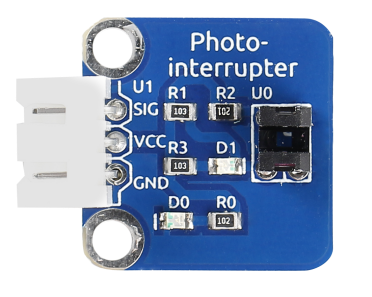
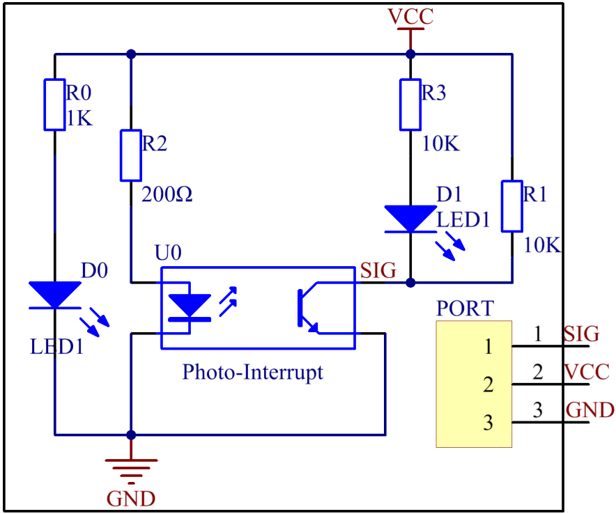
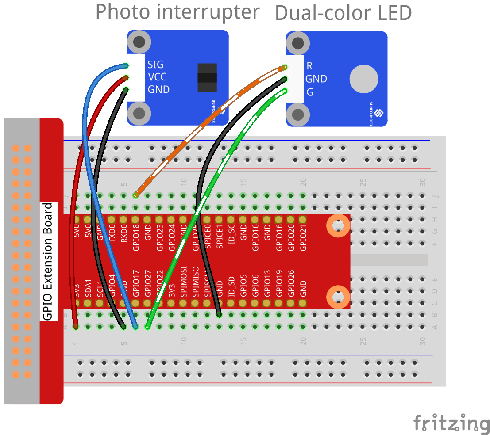
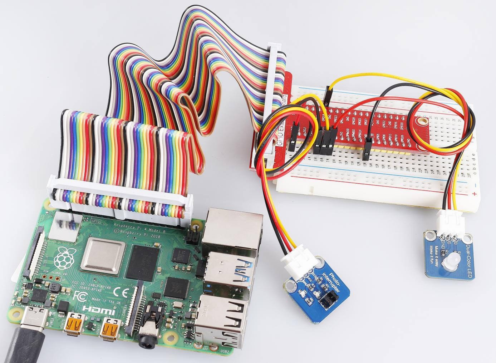

Lesson 12 Photo-interrupter
===========================

**Introduction**

A photo-interrupter (as shown below) is a sensor with a
light-emitting component and light-receiving component packaged and
placed on face-to-face. It applies the principle that light is
interrupted when an object passes through the sensor. Therefore,
photo-interrupters are widely used in speed measurement.

**Required Components**

- 1 \* Raspberry Pi

- 1 \* Breadboard

- 1 \* Dual-color LED module

- 1 \* Photo-interrupter module

- 2 \* 3-Pin anti-reverse cable

**Experimental Principle**

Basically a photo-interrupter consists of two parts: transmitter and
receiver. The transmitter (e.g., an LED or a laser) emits light and then
the light goes to the receiver. If that light beam between the
transmitter and receiver is interrupted by an obstacle, the receiver
will detect no incident light even for a moment and the output level
will change. In this experiment, we will turn an LED on or off by using
this change. The schematic diagram:

**Experimental Procedures**

**Step 1:** Build the circuit.

+-----------------------+----------------------+-----------------------+
| **Raspberry Pi**      | **GPIO Extension     | **Photo-interrupter   |
|                       | Board**              | Module**              |
+-----------------------+----------------------+-----------------------+
| **GPIO0**             | **GPIO17**           | **SIG**               |
+-----------------------+----------------------+-----------------------+
| **3.3V**              | **3V3**              | **VCC**               |
+-----------------------+----------------------+-----------------------+
| **GND**               | **GND**              | **GND**               |
+-----------------------+----------------------+-----------------------+

+-----------------------+----------------------+----------------------+
| **Raspberry Pi**      | **GPIO Extension     | **Dual-color LED     |
|                       | Board**              | Module**             |
+-----------------------+----------------------+----------------------+
| **GPIO1**             | **GPIO18**           | **R**                |
+-----------------------+----------------------+----------------------+
| **GND**               | **GND**              | **GND**              |
+-----------------------+----------------------+----------------------+
| **GPIO2**             | **GPIO27**           | **G**                |
+-----------------------+----------------------+----------------------+

**For C Users:**

**Step 2:** Change directory.

.. raw:: html

    <run></run>

.. code-block::

    cd /home/pi/SunFounder_SensorKit_for_RPi2/C/12_photo_interrupter/

**Step 3:** Compile.

.. raw:: html

    <run></run>

.. code-block::

    gcc photo_interrupter.c -lwiringPi

.. note::

    If it does not work after running, or there is an error prompt ``wiringPi.h: No such file or directory``, please refer to :ref:`install_wiringpi` to install it.

**Step 4:** Run.

.. raw:: html

    <run></run>

.. code-block::

    sudo ./a.out

**Code**

.. code-block:: c

    #include <wiringPi.h>
    #include <stdio.h>

    #define LBPin		0  // light break pin set to GPIO0
    #define Gpin		2
    #define Rpin		1

    void LED(int color)
    {
        pinMode(Gpin, OUTPUT);
        pinMode(Rpin, OUTPUT);
        if (color == 0){
            digitalWrite(Rpin, HIGH);
            digitalWrite(Gpin, LOW);
        }
        else if (color == 1){
            digitalWrite(Rpin, LOW);
            digitalWrite(Gpin, HIGH);
        }
    }

    void Print(int x){
        if ( x == 0 ){
            printf("Light was blocked\n");
        }
    }

    int main(void){

        if(wiringPiSetup() == -1){ //when initialize wiring failed,print messageto screen
            printf("setup wiringPi failed !");
            return 1; 
        }

        pinMode(LBPin, INPUT);
        int temp;
        while(1){
            //Reverse the input of LBPin
            if ( digitalRead(LBPin) == 0 ){  
                temp = 1;
            }
            if ( digitalRead(LBPin) == 1 ){
                temp = 0;
            }

            LED(temp);
            Print(temp);
            delay(100);
        }
        return 0;
    }

**For Python Users:**

**Step 2:** Change directory.

.. raw:: html

    <run></run>

.. code-block::

    cd /home/pi/SunFounder_SensorKit_for_RPi2/Python/

**Step 3:** Run.

.. raw:: html

    <run></run>

.. code-block::

    sudo python3 12_photo_interrupter.py

**Code**

.. raw:: html

    <run></run>

.. code-block:: python

    #!/usr/bin/env python3
    import RPi.GPIO as GPIO

    PIPin  = 11
    Gpin   = 13
    Rpin   = 12

    def setup():
        GPIO.setmode(GPIO.BOARD)       # Numbers GPIOs by physical location
        GPIO.setup(Gpin, GPIO.OUT)     # Set Green Led Pin mode to output
        GPIO.setup(Rpin, GPIO.OUT)     # Set Red Led Pin mode to output
        GPIO.setup(PIPin, GPIO.IN, pull_up_down=GPIO.PUD_UP)    # Set BtnPin's mode is input, and pull up to high level(3.3V)
        GPIO.add_event_detect(PIPin, GPIO.BOTH, callback=detect, bouncetime=200)

    def Led(x):
        if x == 0:
            GPIO.output(Rpin, 1)
            GPIO.output(Gpin, 0)
        if x == 1:
            GPIO.output(Rpin, 0)
            GPIO.output(Gpin, 1)
            print ('Light was blocked')
            
    def detect(chn):
        Led(GPIO.input(PIPin))

    def loop():
        while True:
            pass

    def destroy():
        GPIO.output(Gpin, GPIO.HIGH)       # Green led off
        GPIO.output(Rpin, GPIO.HIGH)       # Red led off
        GPIO.cleanup()                     # Release resource

    if __name__ == '__main__':     # Program start from here
        setup()
        try:
            loop()
        except KeyboardInterrupt:  # When 'Ctrl+C' is pressed, the child program destroy() will be  executed.
            destroy()

Now the LED will light up green. Stick a piece of paper in the gap of
photo interrupter. Then \"Light was blocked\" will be printed on the
screen and the LED will flash red. Remove the paper, and the LED will
turn green again.

