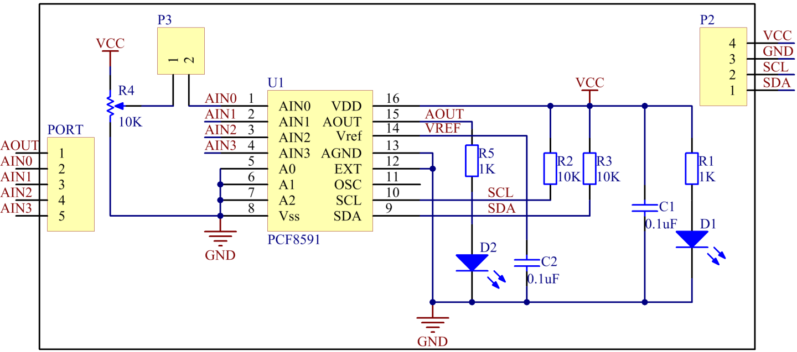

Lesson 13 PCF8591
====================

**Introduction**

The PCF8591 is a single-chip, single-supply low-power 8-bit CMOS data
acquisition device with four analog inputs, one analog output and a
serial I2C-bus interface. Three address pins A0, A1 and A2 are used for
programming the hardware address, allowing the use of up to eight
devices connected to the I2C-bus without additional hardware. Address,
control and data to and from the device are transferred serially via the
two-line bidirectional I2C-bus.

The functions of the device include analog input multiplexing, on-chip
track and hold function, 8-bit analog-to-digital conversion and an 8-bit
digital-to-analog conversion. The maximum conversion rate is given by
the maximum speed of the I2C-bus.

.. image:: media/image149.png
   :width: 200

**Required Components**

- 1 \* Raspberry Pi

- 1 \* Breadboard

- Several Jumper wires

- 1 \* PCF8591 module

- 1 \* Dual-Color LED module

- 1 \* 3-Pin anti-reverse cable

**Experimental Principle**

**Addressing:**

Each PCF8591 device in an I2C-bus system is activated by sending a valid
address to the device. The address consists of a fixed part and a
programmable part. The programmable part must be set according to the
address pins A0, A1 and A2. The address always has to be sent as the
first byte after the start condition in the I2C-bus protocol. The last
bit of the address byte is the read/write-bit which sets the direction
of the following data transfer (see as below).

.. image:: media/image150.png
   :width: 3.22708in
   :height: 1.06389in

**Control byte:**

The second byte sent to a PCF8591 device will be stored in its control
register and is required to control the device function. The upper
nibble of the control register is used for enabling the analog output,
and for programming the analog inputs as single-ended or differential
inputs. The lower nibble selects one of the analog input channels
defined by the upper nibble (see Fig.5). If the auto-increment flag is
set, the channel number is incremented automatically after each A/D
conversion. See the figure below.

.. image:: media/image151.png
   :width: 6.22639in
   :height: 6.46667in

In this experiment, the AIN0 (Analog Input 0) port is used to receive
analog signals from the potentiometer module, and AOUT (Analog Output)
is used to output analog signals to the dual-color LED module so as to
change the luminance of the LED.

The schematic diagram:

**Experimental Procedures**

**Step 1:** Build the circuit.

+-----------------------+----------------------+----------------------+
| **Raspberry Pi**      | **GPIO Extension     | **PCF8591 Module**   |
|                       | Board**              |                      |
+-----------------------+----------------------+----------------------+
| **SDA**               | **SDA1**             | **SDA**              |
+-----------------------+----------------------+----------------------+
| **SCL**               | **SCL1**             | **SCL**              |
+-----------------------+----------------------+----------------------+
| **3.3V**              | **3V3**              | **VCC**              |
+-----------------------+----------------------+----------------------+
| **GND**               | **GND**              | **GND**              |
+-----------------------+----------------------+----------------------+

+----------------------+-----------------------+-----------------------+
| **Dual-Color         | **GPIO Extension      | **PCF8591 Module**    |
| Module**             | Board**               |                       |
+----------------------+-----------------------+-----------------------+
| **R**                | **\***                | **AOUT**              |
+----------------------+-----------------------+-----------------------+
| **GND**              | **GND**               | **GND**               |
+----------------------+-----------------------+-----------------------+
| **G**                | **\***                | **\***                |
+----------------------+-----------------------+-----------------------+

.. note::
    Connect the two pins next to the potentiometer of the PCF8591 module with the jumper cap attached.

.. image:: media/image153.png
   :alt: C:\Users\Daisy\Desktop\Fritzing(英语)\13_PCF8591_bb.png13_PCF8591_bb
   :width: 6.11667in
   :height: 5.87083in

**Step 2:** Setup I2C (see **Appendix**. If you have set I2C, skip this
step.)

**For C Users:**

**Step 3:** Change directory.

.. raw:: html

    <run></run>

.. code-block::

    cd /home/pi/SunFounder_SensorKit_for_RPi2/C/13_pcf8591/

**Step 4:** Compile.

.. raw:: html

    <run></run>

.. code-block::

    gcc pcf8591.c -lwiringPi

.. note::

    If it does not work after running, or there is an error prompt ``wiringPi.h: No such file or directory``, please refer to :ref:`install_wiringpi` to install it.

**Step 5:** Run.

.. raw:: html

    <run></run>

.. code-block::

    sudo ./a.out

**Code**

.. code-block:: c

    #include <stdio.h>
    #include <wiringPi.h>
    #include <pcf8591.h>

    #define PCF       120

    int main (void)
    {
        int value ;
        wiringPiSetup () ;
        // Setup pcf8591 on base pin 120, and address 0x48
        pcf8591Setup (PCF, 0x48) ;
        while(1) // loop forever
        {
            value = analogRead  (PCF + 0) ;
            printf("%d\n", value);
            analogWrite (PCF + 0, value) ;
            delay (10) ;
        }
        return 0 ;
    }

**For Python Users:**

**Step 3:** Change directory.

.. raw:: html

    <run></run>

.. code-block::

    cd /home/pi/SunFounder_SensorKit_for_RPi2/Python/

**Step 4:** Run.

.. raw:: html

    <run></run>

.. code-block::

    sudo python3 13_pcf8591.py

.. note::
  * If you get the error ``FileNotFoundError: [Errno 2] No such file or directory: '/dev/i2c-1'``, you need to setup I2C (see :ref:`i2c_config`).
  * If you get ``ModuleNotFoundError: No module named 'smbus2'`` error, please run the command: ``sudo pip3 install smbus2``.
  * If the error ``OSError: [Errno 121] Remote I/O`` appears, it means the module is miswired or the module is broken.

**Code**

.. raw:: html

    <run></run>

.. code-block:: python

    #!/usr/bin/env python3
    import PCF8591 as ADC

    def setup():
        ADC.setup(0x48)

    def loop():
        while True:
            print (ADC.read(0))
            ADC.write(ADC.read(0))

    def destroy():
        ADC.write(0)

    if __name__ == "__main__":
        try:
            setup()
            loop()
        except KeyboardInterrupt:
            destroy()

Now, turn the knob of the potentiometer on PCF8591, and you can see the
luminance of the LED change and a value between 0 and 255 printed on the
screen.

.. image:: media/image154.jpeg
   :width: 800