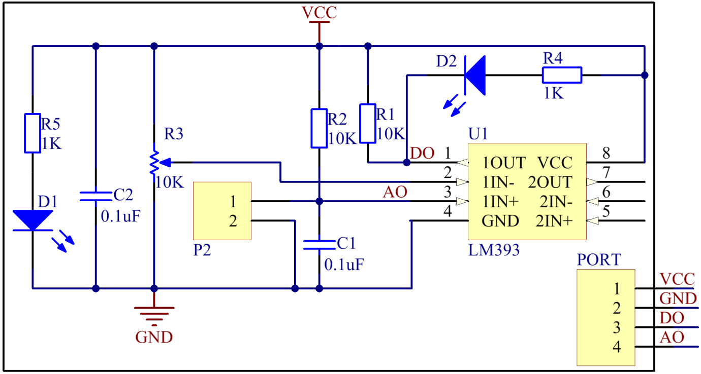

Lesson 14 Rain Detection Module
===============================

**Introduction**

The rain detection module detects rain on the board. Place the rain
detection board in the open air. When it is raining, the rain detection
module will sense the raindrops and send signals to the Raspberry Pi.

.. image:: media/9.png
  :width: 600

**Required Components**

- 1 \* Raspberry Pi

- 1 \* Breadboard

- 1 \* Rain Detection module

- 1 \* PCF8591

- 1 \* LM393

- 1 \* 2-Pin ribbon cable

- 1 \* 4-Pin anti-reverse cable

- Several Jumper wires

**Experimental Principle**

There are two metal wires that are close to each other but do not cross
on the rain detection board. When rain drops on the board, the two metal
wires will conduct, thus there is a voltage between the two metal wires.
The schematic diagram:

**Experimental Procedures**

**Step 1:** Build the circuit.

+----------------------+-----------------------+----------------------+
| **Raspberry Pi**     | **GPIO Extension      | **PCF8591 Module**   |
|                      | Board**               |                      |
+----------------------+-----------------------+----------------------+
| **SDA**              | **SDA1**              | **SDA**              |
+----------------------+-----------------------+----------------------+
| **SCL**              | **SCL1**              | **SCL**              |
+----------------------+-----------------------+----------------------+
| **3.3V**             | **3V3**               | **VCC**              |
+----------------------+-----------------------+----------------------+
| **GND**              | **GND**               | **GND**              |
+----------------------+-----------------------+----------------------+

+----------------------+-----------------------+-----------------------+
| **LM393**            | **GPIO Extension      | **PCF8591 Module**    |
|                      | Board**               |                       |
+----------------------+-----------------------+-----------------------+
| **DO**               | **GPIO17**            | **\***                |
+----------------------+-----------------------+-----------------------+
| **AO**               | **\***                | **AIN0**              |
+----------------------+-----------------------+-----------------------+
| **VCC**              | **3V3**               | **VCC**               |
+----------------------+-----------------------+-----------------------+
| **GND**              | **GND**               | **GND**               |
+----------------------+-----------------------+-----------------------+

.. note::
    The two pins on the rain detection board are exactly the same. You can connect them to pin IN and GND on LM393.

.. image:: media/image158.png
   :width: 6.68958in
   :height: 5.08264in

**For C Users:**

**Step 2:** Change directory.

.. code-block::

    cd /home/pi/SunFounder_SensorKit_for_RPi2/C/14_rain_detector/

**Step 3:** Compile.

.. code-block::

    gcc rain_detector.c -lwiringPi

**Step 4:** Run.

.. code-block::

    sudo ./a.out

**Code**

.. code-block:: c

    #include <stdio.h>
    #include <wiringPi.h>
    #include <pcf8591.h>
    #include <math.h>

    #define		PCF     120
    #define		DOpin	0

    void Print(int x)
    {
        switch(x)
        {
            case 1:
                printf("\n***************\n"  );
                printf(  "* Not Raining *\n"  );
                printf(  "***************\n\n");
            break;
            case 0:
                printf("\n*************\n"  );
                printf(  "* Raining!! *\n"  );
                printf(  "*************\n\n");
            break;
            default:
                printf("\n**********************\n"  );
                printf(  "* Print value error. *\n"  );
                printf(  "**********************\n\n");
            break;
        }
    }

    int main()
    {
        int analogVal;
        int tmp, status;

        if(wiringPiSetup() == -1){
            printf("setup wiringPi failed !");
            return 1;
        }
        // Setup pcf8591 on base pin 120, and address 0x48
        pcf8591Setup(PCF, 0x48);

        pinMode(DOpin, INPUT);

        status = 0;
        while(1) // loop forever
        {
            analogVal = analogRead(PCF + 0);
            printf("%d\n", analogVal);

            tmp = digitalRead(DOpin);

            if (tmp != status)
            {
                Print(tmp);
                status = tmp;
            }

            delay (200);
        }
        return 0;
    }

**For Python Users:**

**Step 2:** Change directory.

.. code-block::

    cd /home/pi/SunFounder_SensorKit_for_RPi2/Python/

**Step 3:** Run.

.. code-block::

    sudo python3 14_rain_detector.py

**Code**

.. code-block:: python

    #!/usr/bin/env python3
    import PCF8591 as ADC
    import RPi.GPIO as GPIO
    import time
    import math

    DO = 17
    GPIO.setmode(GPIO.BCM)

    def setup():
        ADC.setup(0x48)
        GPIO.setup(DO, GPIO.IN)

    def Print(x):
        if x == 1:
            print ('')
            print ('   ***************')
            print ('   * Not raining *')
            print ('   ***************')
            print ('')
        if x == 0:
            print ('')
            print ('   *************')
            print ('   * Raining!! *')
            print ('   *************')
            print ('')

    def loop():
        status = 1
        while True:
            print (ADC.read(0))
            
            tmp = GPIO.input(DO);
            if tmp != status:
                Print(tmp)
                status = tmp
            
            time.sleep(0.2)

    if __name__ == '__main__':
        try:
            setup()
            loop()
        except KeyboardInterrupt: 
            pass

Now drop some water onto the rain detection board until \"**raining**\"
displayed on the screen. You can adjust the potentiometer on LM393 to
detect the threshold of rainfall.

.. image:: media/image159.jpeg
   :alt: \_MG_2279
   :width: 6.40347in
   :height: 4.11111in