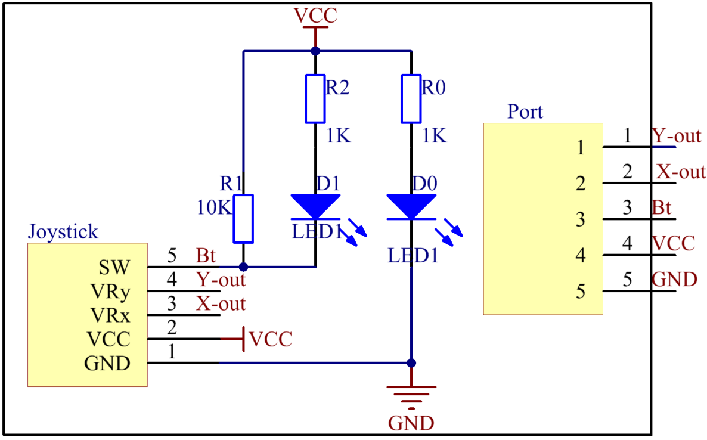

Lesson 15 Joystick PS2
======================

**Introduction**

There are five operation directions for joystick PS2: up, down, left,
right and press-down.

.. image:: media/image160.png
   :width: 200

**Required Components**

- 1 \* Raspberry Pi

- 1 \* Breadboard

- 1 \* PCF8591

- 1 \* Joystick PS2 module

- 1 \* 5-Pin anti-reverse cable

- Several Jumper wires

**Experimental Principle**

This module has two analog outputs (corresponding to X and Y
coordinates) and one digital output representing whether it is pressed
on Z axis.

In this experiment, we connect pin X and Y to the analog input ports of
the A/D convertor so as to convert analog quantities into digital ones.
Then program on Raspberry Pi to detect the moving direction of the
Joystick. The schematic diagram:

**Experimental Procedures**

**Step 1:** Build the circuit.

+----------------------+-----------------------+-----------------------+
| **Raspberry Pi**     | **GPIO Extension      | **PCF8591 Module**    |
|                      | Board**               |                       |
+----------------------+-----------------------+-----------------------+
| **SDA**              | **SDA1**              | **SDA**               |
+----------------------+-----------------------+-----------------------+
| **SCL**              | **SCL1**              | **SCL**               |
+----------------------+-----------------------+-----------------------+
| **3.3V**             | **3V3**               | **VCC**               |
+----------------------+-----------------------+-----------------------+
| **GND**              | **GND**               | **GND**               |
+----------------------+-----------------------+-----------------------+

+----------------------+-----------------------+-----------------------+
| **Joystick PS2**     | **GPIO Extension      | **PCF8591 Module**    |
|                      | Board**               |                       |
+----------------------+-----------------------+-----------------------+
| **Y**                | **\***                | **AIN0**              |
+----------------------+-----------------------+-----------------------+
| **X**                | **\***                | **AIN1**              |
+----------------------+-----------------------+-----------------------+
| **Bt**               | **\***                | **AIN2**              |
+----------------------+-----------------------+-----------------------+
| **VCC**              | **3V3**               | **VCC**               |
+----------------------+-----------------------+-----------------------+
| **GND**              | **GND**               | **GND**               |
+----------------------+-----------------------+-----------------------+

.. image:: media/image162.png
  :width: 500

**For C Users:**

**Step 2:** Change directory.

.. code-block::

    cd /home/pi/SunFounder_SensorKit_for_RPi2/C/15_joystick_PS2/

**Step 3:** Compile.

.. code-block::

    gcc joystick_PS2.c -lwiringPi

**Step 4:** Run.

.. code-block::

    sudo ./a.out

**Code**

.. code-block:: c

    #include <stdio.h>
    #include <wiringPi.h>
    #include <pcf8591.h>

    #define PCF       120
    #define uchar	unsigned char

    int AIN0 = PCF + 0;
    int AIN1 = PCF + 1;
    int AIN2 = PCF + 2;

    char *state[7] = {"home", "up", "down", "left", "right", "pressed"};

    int direction(){
        int x, y, b;
        int tmp=0;
        x = analogRead(AIN1);
        y = analogRead(AIN0);
        b = analogRead(AIN2);
        if (y <= 30)
            tmp = 1;		// up
        if (y >= 225)
            tmp = 2;		// down
        
        if (x >= 225)
            tmp = 3;		// left
        if (x <= 30)
            tmp = 4;		// right

        if (b <= 30)
            tmp = 5;		// button preesd
        if (x-125<15 && x-125>-15 && y-125<15 && y-125>-15 && b >= 60)
            tmp = 0;		// home position
        
        return tmp;
    }

    int main (void)
    {
        int tmp=0;
        int status = 0;
        wiringPiSetup ();
        // Setup pcf8591 on base pin 120, and address 0x48
        pcf8591Setup (PCF, 0x48);
        while(1) // loop forever
        {
            tmp = direction();
            if (tmp != status)
            {
                printf("%s\n", state[tmp]);
                status = tmp;
            }
        }
        return 0 ;
    }

**For Python Users:**

**Step 2:** Change directory.

.. code-block::

    cd /home/pi/SunFounder_SensorKit_for_RPi2/Python/

**Step 3:** Run.

.. code-block::

    sudo python3 15_joystick_PS2.py

**Code**

.. code-block:: python

    #!/usr/bin/env python3
    import PCF8591 as ADC 
    import time

    def setup():
        ADC.setup(0x48)					# Setup PCF8591
        global state

    def direction():	#get joystick result
        state = ['home', 'up', 'down', 'left', 'right', 'pressed']
        i = 0
        if ADC.read(0) <= 30:
            i = 1		#up
        if ADC.read(0) >= 225:
            i = 2		#down

        if ADC.read(1) >= 225:
            i = 3		#left
        if ADC.read(1) <= 30:
            i = 4		#right

        if ADC.read(2) <= 30:
            i = 5		# Button pressed

        if ADC.read(0) - 125 < 15 and ADC.read(0) - 125 > -15	and ADC.read(1) - 125 < 15 and ADC.read(1) - 125 > -15 and ADC.read(2) == 255:
            i = 0
        
        return state[i]

    def loop():
        status = ''
        while True:
            tmp = direction()
            if tmp != None and tmp != status:
                print (tmp)
                status = tmp

    def destroy():
        pass

    if __name__ == '__main__':		# Program start from here
        setup()
        try:
            loop()
        except KeyboardInterrupt:  	# When 'Ctrl+C' is pressed, the child program destroy() will be  executed.
            destroy()

Now push the rocker upwards, and a string \"**up**\" will be printed on
the screen; push it downwards, and \"**down**\" will be printed; if you
push it left, \"**Left**\" will be printed on; If you push it right, and
\"**Right**\" will be printed; If you press down the cap, \"**Button
Pressed**\" will be printed on the screen.

.. image:: media/image163.jpeg
   :alt: \_MG_2283
   :width: 6.175in
   :height: 4.38542in