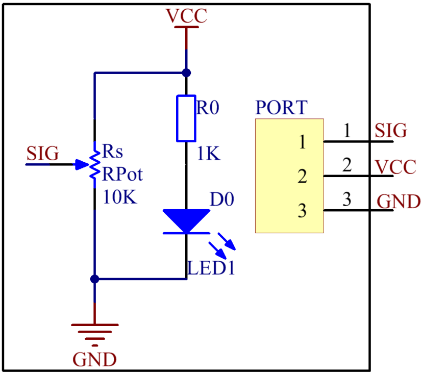

Lesson 16 Potentiometer Module
=================================

**Introduction**

A potentiometer is a device which is used to vary the resistance in an
electrical circuit without interrupting the circuit.

.. image:: media/image164.png
   :width: 1.91111in
   :height: 1.63403in

**Required Components**

- 1 \* Raspberry Pi

- 1 \* Breadboard

- 1 \* Potentiometer module

- 1 \* Dual-Color LED module

- 2 \* 3-Pin anti-reverse cable

- Several Jumper wires

**Experimental Principle**

An analog potentiometer is an analog electronic component. What’s the
difference between an analog one and a digital one? Simply put, a
digital potentiometer refers to just two states like on/off, high/low
levels, i.e. either 0 or 1, while a digital one supports analog signals
like a number from 1 to 1000. The signal value changes over time instead
of keeping an exact number. Analog signals include light intensity,
humidity, temperature, and so on.

In this experiment, PCF8591 is used to read the analog value of the
potentiometer and output the value to LED. Connect pin SIG of the
potentiometer to pin AIN0 of PCF8591. Connect pin R or Pin G of the
Dual-Color LED to pin AOUT of PCF8591 to observe the change of LED.

The schematic diagram of the module is as shown below:

**Experimental Procedures**

**Step 1:** Build the circuit.

+-----------------------+----------------------+----------------------+
| **Raspberry Pi**      | **GPIO Extension     | **PCF8591 Module**   |
|                       | Board**              |                      |
+-----------------------+----------------------+----------------------+
| **SDA**               | **SDA1**             | **SDA**              |
+-----------------------+----------------------+----------------------+
| **SCL**               | **SCL1**             | **SCL**              |
+-----------------------+----------------------+----------------------+
| **3.3V**              | **3V3**              | **VCC**              |
+-----------------------+----------------------+----------------------+
| **GND**               | **GND**              | **GND**              |
+-----------------------+----------------------+----------------------+

+-----------------------+----------------------+----------------------+
| **Potentiometer**     | **GPIO Extension     | **PCF8591 Module**   |
|                       | Board**              |                      |
+-----------------------+----------------------+----------------------+
| **SIG**               | **\***               | **AIN0**             |
+-----------------------+----------------------+----------------------+
| **VCC**               | **3V3**              | **VCC**              |
+-----------------------+----------------------+----------------------+
| **GND**               | **GND**              | **GND**              |
+-----------------------+----------------------+----------------------+

+----------------------+-----------------------+-----------------------+
| **Dual-Color         | **GPIO Extension      | **PCF8591 Module**    |
| Module**             | Board**               |                       |
+----------------------+-----------------------+-----------------------+
| **R**                | **\***                | **AOUT**              |
+----------------------+-----------------------+-----------------------+
| **GND**              | **GND**               | **GND**               |
+----------------------+-----------------------+-----------------------+
| **G**                | **\***                | **\***                |
+----------------------+-----------------------+-----------------------+

.. image:: media/image166.png
   :alt: C:\Users\Daisy\Desktop\Fritzing(英语)\16_Potentiometer_bb.png16_Potentiometer_bb
   :width: 5.38819in
   :height: 5.42569in

**For C Users:**

**Step 2:** Change directory.

.. code-block::

    cd /home/pi/SunFounder_SensorKit_for_RPi2/C/16_potentiometer/

**Step 3:** Compile.

.. code-block::

    gcc potentiometer.c -lwiringPi

**Step 4:** Run.

.. code-block::

    sudo ./a.out

**Code**

.. code-block:: c

    #include <stdio.h>
    #include <wiringPi.h>
    #include <pcf8591.h>

    #define PCF       120

    int main (void)
    {
        int value ;
        wiringPiSetup () ;
        // Setup pcf8591 on base pin 120, and address 0x48
        pcf8591Setup (PCF, 0x48) ;
        while(1) // loop forever
        {
            value = analogRead  (PCF + 0) ;
            printf("Value: %d\n", value);
            analogWrite (PCF + 0, value) ;
            delay (200) ;
        }
        return 0 ;
    }

**For Python Users:**

**Step 2:** Change directory.

.. code-block::

    cd /home/pi/SunFounder_SensorKit_for_RPi2/Python/

**Step 3:** Run.

.. code-block::

    sudo python3 16_potentiometer.py

**Code**

.. code-block:: python

    #!/usr/bin/env python3
    import PCF8591 as ADC
    import time

    def setup():
        ADC.setup(0x48)

    def loop():
        status = 1
        while True:
            print ('Value:', ADC.read(0))
            Value = ADC.read(0)
            outvalue = map(Value,0,255,120,255)
            ADC.write(outvalue)
            time.sleep(0.2)
    def destroy():
        ADC.write(0)

    def map(x, in_min, in_max, out_min, out_max):
            '''To map the value from arange to another'''
            return (x - in_min) * (out_max - out_min) / (in_max - in_min) + out_min

    if __name__ == '__main__':
        try:
            setup()
            loop()
        except KeyboardInterrupt: 
            destroy()

Turn the knob of the potentiometer, and you can see the value printed on
the screen change from 0 (minimum) to 255 (maximum).

.. image:: media/image167.jpeg
   :alt: \_MG_2288
   :width: 6.62778in
   :height: 4.56181in