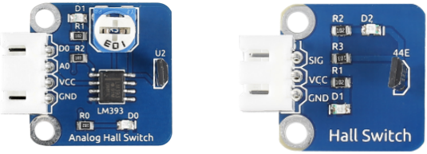
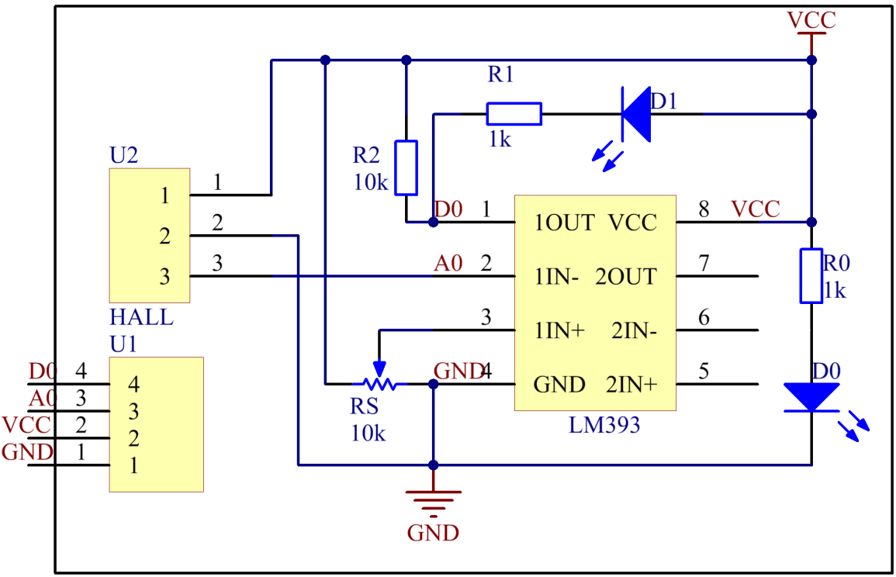
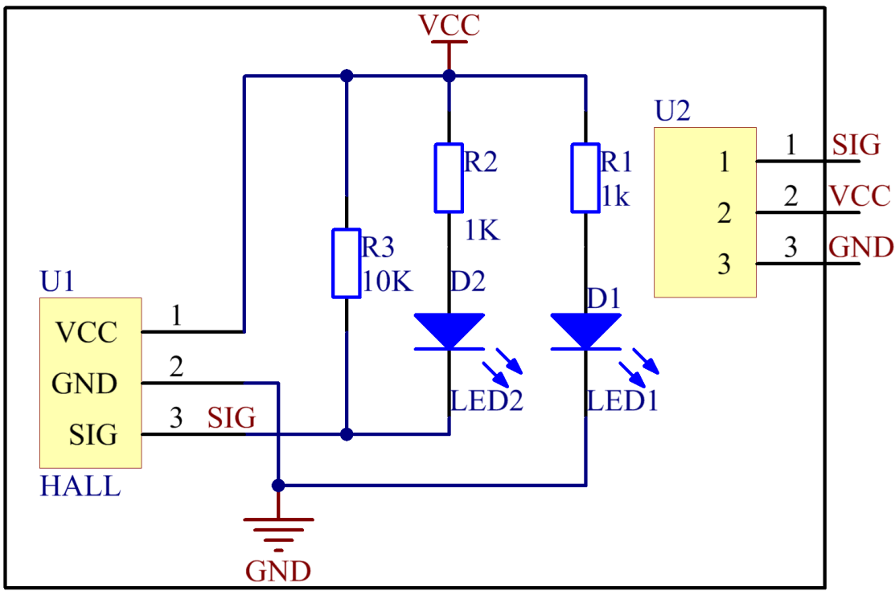

Lesson 17 Hall Sensor
=====================

**Introduction**

Based on Hall Effect, a Hall sensor is a one that varies its output
voltage in response to a magnetic field. Hall sensors are used for
proximity switching, positioning, speed detection, and current sensing
applications.

Hall sensors can be categorized into linear (analog) Hall sensors and
switch Hall sensors. A switch Hall sensor consists of voltage regulator,
Hall element, differential amplifier, Schmitt trigger, and output
terminal and it outputs digital values. A linear Hall sensor consists of
Hall element, linear amplifier, and emitter follower and it outputs
analog values. If you add a comparator to a linear (analog) Hall sensor
it will be able to output both analog and digital signals.

**Required Components**

- 1 \* Raspberry Pi

- 1 \* Breadboard

- 1 \* Analog Hall Switch module

- 1 \* Dual-color LED module

- 1 \* Switch hall module

- 1 \* PCF8591

- 2 \* 3-Pin anti-reverse cable

- 1 \* 4-Pin anti-reverse cable

- Several Jumper wires

**Experimental Principles**

**Hall Effect**

Hall Effect is a kind of electromagnetic effect. It was discovered by
Edwin Hall in 1879 when he was researching conductive mechanism about
metals. The effect is seen when a conductor is passed through a uniform
magnetic field. The natural electron drift of the charge carriers causes
the magnetic field to apply a Lorentz force (the force exerted on a
charged particle in an electromagnetic field) to these charge carriers.
The result is what is seen as a charge separation, with a buildup of
either positive or negative charges on the bottom or on the top of the
plate.

.. image:: media/image170.png
   :alt: hall
   :width: 3.12083in
   :height: 1.41111in

**Hall sensor**

A Hall sensor is a kind of magnetic field sensor based on it.

Electricity carried through a conductor will produce a magnetic field
that varies with current, and a Hall sensor can be used to measure the
current without interrupting the circuit. Typically, the sensor is
integrated with a wound core or permanent magnet that surrounds the
conductor to be measured.

The schematic diagram of the analog Hall sensor module:

The schematic diagram of the Switch hall module:

**Experimental Procedures**

For switch Hall sensor, take the following steps.

**Step 1:** Build the circuit.

+-----------------------+----------------------+----------------------+
| **Raspberry Pi**      | **GPIO Extension     | **Switch Hall        |
|                       | Board**              | Module**             |
+-----------------------+----------------------+----------------------+
| **GPIO0**             | **GPIO17**           | **SIG**              |
+-----------------------+----------------------+----------------------+
| **3.3V**              | **3V3**              | **VCC**              |
+-----------------------+----------------------+----------------------+
| **GND**               | **GND**              | **GND**              |
+-----------------------+----------------------+----------------------+

+-----------------------+----------------------+----------------------+
| **Raspberry Pi**      | **GPIO Extension     | **Dual-color LED     |
|                       | Board**              | Module**             |
+-----------------------+----------------------+----------------------+
| **GPIO1**             | **GPIO18**           | **R**                |
+-----------------------+----------------------+----------------------+
| **GND**               | **GND**              | **GND**              |
+-----------------------+----------------------+----------------------+
| **GPIO2**             | **GPIO27**           | **G**                |
+-----------------------+----------------------+----------------------+

.. image:: media/image173.png
   :alt: C:\Users\Daisy\Desktop\Fritzing(英语)\17_Switch_Hall.svg_bb.png17_Switch_Hall.svg_bb
   :width: 6.14167in
   :height: 5.79514in

**For C Users:**

**Step 2:** Change directory.

.. raw:: html

    <run></run>

.. code-block::

    cd /home/pi/SunFounder_SensorKit_for_RPi2/C/17_switch_hall/

**Step 3:** Compile.

.. raw:: html

    <run></run>

.. code-block::

    gcc switch_hall.c -lwiringPi

**Step 4:** Run.

.. raw:: html

    <run></run>

.. code-block::

    sudo ./a.out

.. note::

   If it does not work after running, please refer to :ref:`C code is not working?`

**Code**

.. code-block:: c

    #include <wiringPi.h>
    #include <stdio.h>

    #define HallPin		0
    #define Gpin		2
    #define Rpin		1

    void LED(char* color)
    {
        pinMode(Gpin, OUTPUT);
        pinMode(Rpin, OUTPUT);
        if (color == "RED")
        {
            digitalWrite(Rpin, HIGH);
            digitalWrite(Gpin, LOW);
        }
        else if (color == "GREEN")
        {
            digitalWrite(Rpin, LOW);
            digitalWrite(Gpin, HIGH);
        }
        else
            printf("LED Error");
    }

    int main(void)
    {
        if(wiringPiSetup() == -1){ //when initialize wiring failed,print messageto screen
            printf("setup wiringPi failed !");
            return 1; 
        }

        pinMode(HallPin, INPUT);
        LED("GREEN");
        
        while(1){
            if(0 == digitalRead(HallPin)){
                delay(10);
                if(0 == digitalRead(HallPin)){
                    LED("RED");	
                    printf("Detected magnetic materials \n");	
                }
            }
            else if(1 == digitalRead(HallPin)){
                delay(10);
                if(1 == digitalRead(HallPin)){
                    while(!digitalRead(HallPin));
                    LED("GREEN");
                }
            }
        }
        return 0;
    }

**For Python Users:**

**Step 2:** Change directory.

.. raw:: html

    <run></run>

.. code-block::

    cd /home/pi/SunFounder_SensorKit_for_RPi2/Python/

**Step 3:** Run.

.. raw:: html

    <run></run>

.. code-block::

    sudo python3 17_switch_hall.py

**Code**

.. raw:: html

    <run></run>

.. code-block:: python

    #!/usr/bin/env python3
    import RPi.GPIO as GPIO

    HallPin = 11
    Gpin   = 13
    Rpin   = 12

    def setup():
        GPIO.setmode(GPIO.BOARD)       # Numbers GPIOs by physical location
        GPIO.setup(Gpin, GPIO.OUT)     # Set Green Led Pin mode to output
        GPIO.setup(Rpin, GPIO.OUT)     # Set Red Led Pin mode to output
        GPIO.setup(HallPin, GPIO.IN, pull_up_down=GPIO.PUD_UP)    # Set BtnPin's mode is input, and pull up to high level(3.3V)
        GPIO.add_event_detect(HallPin, GPIO.BOTH, callback=detect, bouncetime=200)

    def Led(x):
        if x == 0:
            GPIO.output(Rpin, 1)
            GPIO.output(Gpin, 0)
        if x == 1:
            GPIO.output(Rpin, 0)
            GPIO.output(Gpin, 1)

    def Print(x):
        if x == 0:
            print ('    ***********************************')
            print ('    *   Detected magnetic materials   *')
            print ('    ***********************************')

    def detect(chn):
        Led(GPIO.input(HallPin))
        Print(GPIO.input(HallPin))

    def loop():
        while True:
            pass

    def destroy():
        GPIO.output(Gpin, GPIO.HIGH)       # Green led off
        GPIO.output(Rpin, GPIO.HIGH)       # Red led off
        GPIO.cleanup()                     # Release resource

    if __name__ == '__main__':     # Program start from here
        setup()
        try:
            loop()
        except KeyboardInterrupt:  # When 'Ctrl+C' is pressed, the child program destroy() will be  executed.
            destroy()

Put a magnet close to the Switch Hall sensor. Then a string
\"**Detected magnetic materials**\" will be printed on the screen and
the LED will light up.

.. image:: media/image174.jpeg
   :alt: \_MG_2328
   :width: 6.32431in
   :height: 4.93611in

For **Analog Hall Switch**, take the following steps.

**Step 1:** Build the circuit.

+-----------------------+----------------------+----------------------+
| **Raspberry Pi**      | **GPIO Extension     | **PCF8591 module**   |
|                       | Board**              |                      |
+-----------------------+----------------------+----------------------+
| **SDA**               | **SDA1**             | **SDA**              |
+-----------------------+----------------------+----------------------+
| **SCL**               | **SCL1**             | **SCL**              |
+-----------------------+----------------------+----------------------+
| **3.3V**              | **3V3**              | **VCC**              |
+-----------------------+----------------------+----------------------+
| **GND**               | **GND**              | **GND**              |
+-----------------------+----------------------+----------------------+

+----------------------+-----------------------+-----------------------+
| **Analog Hall        | **GPIO Extension      | **PCF8591 module**    |
| Switch**             | Board**               |                       |
+----------------------+-----------------------+-----------------------+
| **DO**               | **GPIO17**            | **\***                |
+----------------------+-----------------------+-----------------------+
| **AO**               | **\***                | **AIN0**              |
+----------------------+-----------------------+-----------------------+
| **VCC**              | **3V3**               | **VCC**               |
+----------------------+-----------------------+-----------------------+
| **GND**              | **GND**               | **GND**               |
+----------------------+-----------------------+-----------------------+

.. image:: media/image175.png
   :width: 800

**For C Users:**

**Step 2:** Change directory.

.. code-block::

    cd /home/pi/SunFounder_SensorKit_for_RPi2/C/17_analog_hall_switch/

**Step 3:** Compile.

.. code-block::

    gcc analog_hall_switch.c -lwiringPi

**Step 4:** Run.

.. code-block::

    sudo ./a.out

**Code**

.. code-block:: c

    #include <stdio.h>
    #include <wiringPi.h>
    #include <pcf8591.h>

    #define PCF       120

    int main (void)
    {
        int res, tmp, status;
        wiringPiSetup ();
        // Setup pcf8591 on base pin 120, and address 0x48
        pcf8591Setup (PCF, 0x48);
        status = 0;
        while(1) // loop forever
        {
            res = analogRead(PCF + 0);
            printf("Current intensity of magnetic field : %d\n", res);
            if (res - 133 < 5 || res - 133 > -5) 
                tmp = 0;
            if (res < 128) tmp = -1;
            if (res > 138) tmp =  1;
            if (tmp != status)
            {
                switch(tmp)
                {
                    case 0:
                        printf("\n*****************\n"  );
                        printf(  "* Magnet: None. *\n"  );
                        printf(  "*****************\n\n");
                        break;
                    case -1:
                        printf("\n******************\n"  );
                        printf(  "* Magnet: North. *\n"  );
                        printf(  "******************\n\n");
                        break;
                    case 1:
                        printf("\n******************\n"  );
                        printf(  "* Magnet: South. *\n"  );
                        printf(  "******************\n\n");
                        break;
                }
                status = tmp;
            }
            delay (200);
        }
        return 0 ;
    }

**For Python Users:**

**Step 2:** Change directory.

.. code-block::

    cd /home/pi/SunFounder_SensorKit_for_RPi2/Python/

**Step 3:** Run.

.. code-block::

    sudo python3 17_analog_hall_switch.py

**Code**

.. code-block:: python

    #/usr/bin/env python3
    import RPi.GPIO as GPIO
    import PCF8591 as ADC
    import time

    def setup():
        ADC.setup(0x48)

    def Print(x):
        if x == 0:
            print ('')
            print ('*************')
            print ('* No Magnet *')
            print ('*************')
            print ('')
        if x == 1:
            print ('')
            print ('****************')
            print ('* Magnet North *')
            print ('****************')
            print ('')
        if x == -1:
            print ('')
            print ('****************')
            print ('* Magnet South *')
            print ('****************')
            print ('')

    def loop():
        status = 0
        while True:
            res = ADC.read(0)
            print ('Current intensity of magnetic field : ', res)
            if res - 133 < 5 and res - 133 > -5:
                tmp = 0
            if res < 128:
                tmp = -1
            if res > 138:
                tmp = 1
            if tmp != status:
                Print(tmp)
                status = tmp
            time.sleep(0.2)

    if __name__ == '__main__':
        setup()
        loop()

Now \"Current intensity of magnetic field : xxx \" will be displayed on
the screen. Put the magnet close to the analog Hall sensor, with the
north magnetic pole towards the sensor, and then \" Magnet: North.\" will
be displayed. Move the magnet away, and \" Magnet: None.\" will be
printed. If the magnet approaches the sensor with the south magnetic
pole towards it, \" Magnet: South.\" will be printed on the screen.

.. note::
    Pin D0 of the Analog Hall Sensor will output \"0\" only when the south pole of the magnet approaches it, otherwise it will output "1".

.. image:: media/image176.jpeg
   :alt: \_MG_2293
   :width: 4.85625in
   :height: 3.55139in