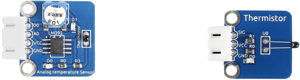
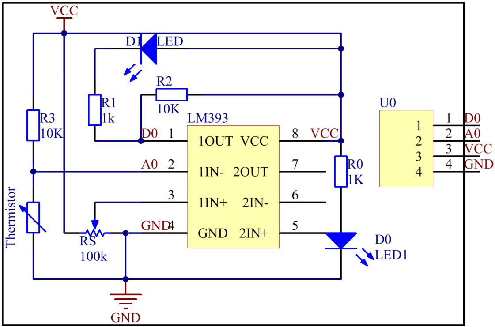
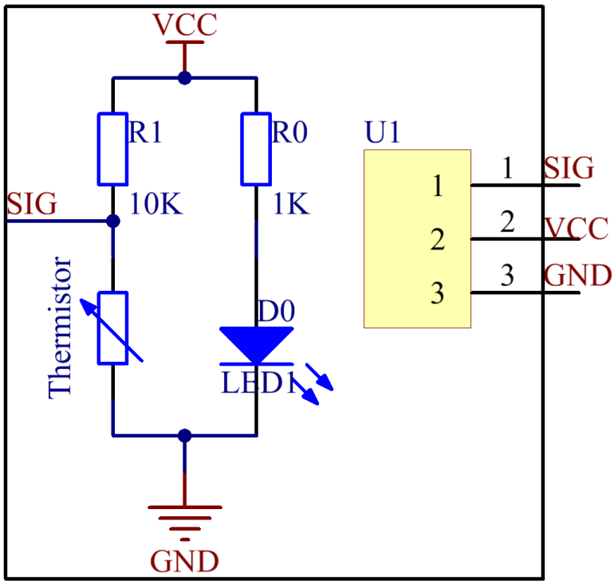

Lesson 18 Temperature Sensor
=============================

**Introduction**

A temperature sensor is a component that senses temperature and converts
it into output signals. By material and component features, temperature
sensors can be divided into two types: thermal resistor and
thermocouple. Thermistor is one kind of the former type. It is made of
semiconductor materials; most thermistors are negative temperature
coefficient (NTC) ones, the resistance of which decreases with rising
temperature. Since their resistance changes acutely with temperature
changes, thermistors are the most sensitive temperature sensors.

There are two kinds of thermistor module in this kit (as shown below).

**Required Components**

- 1 \* Raspberry Pi

- 1 \* Breadboard

- 1 \* Analog-temperature Sensor module

- 1 \* Thermistor module

- 1 \* PCF8591

- 1 \* 3-Pin anti-reverse cable

- 1 \* 4-Pin anti-reverse cable

- Several Jumper wires

**Experimental Principle**

This module is based on the principle of the thermistor, whose
resistance varies significantly with ambient temperature. When the
ambient temperature increases, the resistance of the thermistor
decreases; when decreases, it increases. It can detect surrounding
temperature changes in a real-time manner.

In this experiment, we use an analog-digital converter PCF8591 to
convert analog signals into digital ones.

The schematic diagram for analog temperature sensor:

The schematic diagram for the thermistor module:

**Experimental Procedures**

**Step 1:** Build the circuit.

+-----------------------+----------------------+----------------------+
| **Raspberry Pi**      | **GPIO Extension     | **PCF8591 Module**   |
|                       | Board**              |                      |
+-----------------------+----------------------+----------------------+
| **SDA**               | **SDA1**             | **SDA**              |
+-----------------------+----------------------+----------------------+
| **SCL**               | **SCL1**             | **SCL**              |
+-----------------------+----------------------+----------------------+
| **3.3V**              | **3V3**              | **VCC**              |
+-----------------------+----------------------+----------------------+
| **GND**               | **GND**              | **GND**              |
+-----------------------+----------------------+----------------------+

**For thermistor module:**

+-----------------------+----------------------+----------------------+
| **Thermistor Module** | **GPIO Extension     | **PCF8591 Module**   |
|                       | Board**              |                      |
+-----------------------+----------------------+----------------------+
| **SIG**               | **\***               | **AIN0**             |
+-----------------------+----------------------+----------------------+
| **VCC**               | **3V3**              | **VCC**              |
+-----------------------+----------------------+----------------------+
| **GND**               | **GND**              | **GND**              |
+-----------------------+----------------------+----------------------+

.. image:: media/image181.png
   :alt: C:\Users\Daisy\Desktop\Fritzing(英语)\18_Thermistor_bb.png18_Thermistor_bb
   :width: 6.07292in
   :height: 6.25069in

**For analog temperature sensor module：**

+------------------------+---------------------+----------------------+
| **Analog Temperature   | **GPIO Extension    | **PCF8591 Module**   |
| Module**               | Board**             |                      |
+------------------------+---------------------+----------------------+
| **DO**                 | **GPIO17**          | **\***               |
+------------------------+---------------------+----------------------+
| **AO**                 | **\***              | **AIN0**             |
+------------------------+---------------------+----------------------+
| **VCC**                | **3V3**             | **VCC**              |
+------------------------+---------------------+----------------------+
| **GND**                | **GND**             | **GND**              |
+------------------------+---------------------+----------------------+

.. image:: media/image182.png

**For C Users:**

**Step 2:** Change directory.

.. code-block::

    cd /home/pi/SunFounder_SensorKit_for_RPi2/C/18_thermistor/

**Step 3:** Compile.

.. code-block::

    gcc thermistor.c -lwiringPi -lm

**Step 4:** Run.

.. code-block::

    sudo ./a.out

**For Python Users:**

**Step 2:** Change directory.

.. code-block::

    cd /home/pi/SunFounder_SensorKit_for_RPi2/Python/

**Step 3:** Run.

.. code-block::

    sudo python3 18_thermistor.py

Now touch the thermistor and you can see the value of current
temperature printed on the screen change accordingly.

Temperature alarm setting:

If you use the **Analog Temperature Sensor** module, uncomment the line
under **1**:

**For C language:**

.. code-block::

    // For a threshold, uncomment one of the code for
    // which module you use. DONOT UNCOMMENT BOTH!
    //-----------------------------------------
    // 1. For Analog Temperature module(with DO)
    tmp = digitalRead(DO);
	
    // 2. For Thermister module(with sig pin)
    // if (temp > 33) tmp = 0;
    // else if (temp < 31) tmp = 1;

**For Python**

.. code-block::

    #################################################
    # 1. For Analog Temperature module(with DO)
    tmp = GPIO.input(DO);

    # 2. For Thermister module(with sig pin)
    #if temp > 33:
    # tmp = 0;
    #elif temp < 31:
    # tmp = 1;
    #################################################

If you use the **Thermistor module**, uncomment the lIne under **2**:

**For C language:**

.. code-block::

    // For a threshold, uncomment one of the code for
    // which module you use. DONOT UNCOMMENT BOTH!
    //-------------------------------------------
    // 1. For Analog Temperature module(with DO)
    // tmp = digitalRead(DO);

    // 2. For Thermister module(with sig pin)
    if (temp > 33) tmp = 0;
    else if (temp < 31) tmp = 1;
    //------------------------------------------

**For Python**

.. code-block::

    #################################################
    # 1. For Analog Temperature module(with DO)
    #tmp = GPIO.input(DO);
    #
    # 2. For Thermister module(with sig pin)
    if temp > 33:
        tmp = 0;
    elif temp < 31:
        tmp = 1;
    #################################################

After editing the code, repeat step 2, 3, and 4 (or step 2, 3 for Python
users).

You can still see temperature value printed on the screen constantly. If
you pinch the thermistor for a while, its temperature will rise slowly.
"Too Hot!" will be printed on the screen. Release your fingers, and let
it stay in the open air for a while, or blow on the module. When the
temperature drops down slowly, "Better" will be printed.

.. note:: 
    The analog temperature sensor adjusts alarm temperature by the
    potentiometer on the module. The thermistor changes the alarm
    temperature by program.

The physical picture for analog temperature sensor:

.. image:: media/image183.jpeg

The physical picture for thermistor module:

.. image:: media/image184.jpeg