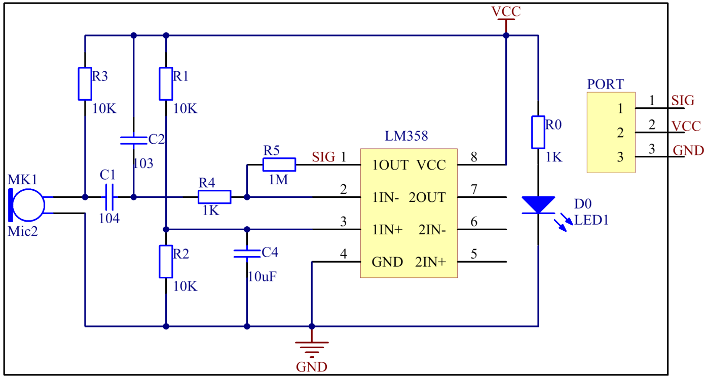

Lesson 19 Sound Sensor
======================

**Introduction**

Sound sensor is a component that receives sound waves and converts them
into electrical signal. It detects the sound intensity in ambient
environment like a microphone.

.. image:: media/image185.png
   :width: 1.87014in
   :height: 1.62569in

**Required Components**

- 1 \* Raspberry Pi

- 1 \* Breadboard

- 1 \* PCF8591

- 1 \* Sound sensor module

- 1 \* 3-Pin anti-reverse cable

- Several Jumper wires

**Experimental Principle**

The microphone on the sensor module can convert audio signals into
electrical signals (analog quantity), then convert analog quantity into
digital quantity by PCF8591 and transfer them to MCU.

LM358 is a dual-channel operational amplifier. It contains two
independent, high gain, and internally compensated amplifiers, but we
will only use one of them in this experiment. The microphone transforms
sound signals into electrical signals and then sends out the signals to
pin 2 of LM358 and outputs them to pin 1 (that's, pin SIG of the module)
via the external circuit. Then use PCF8591 to read analog values.

PCF8591 is an 8-bit resolution, 4-channel A/D，1-channel D/A conversion
chip. We connect the output terminal (SIG) to AIN0 of PCF8591 so as to
detect the strength of voice signal in a real-time manner.

The schematic diagram of the module is as shown below:

**Experimental Procedures**

**Step 1:** Build the circuit according to the following method.

+-----------------------+----------------------+----------------------+
| **Raspberry Pi**      | **GPIO Extension     | **PCF8591 Module**   |
|                       | Board**              |                      |
+-----------------------+----------------------+----------------------+
| **SDA**               | **SDA1**             | **SDA**              |
+-----------------------+----------------------+----------------------+
| **SCL**               | **SCL1**             | **SCL**              |
+-----------------------+----------------------+----------------------+
| **3.3V**              | **3V3**              | **VCC**              |
+-----------------------+----------------------+----------------------+
| **GND**               | **GND**              | **GND**              |
+-----------------------+----------------------+----------------------+

+----------------------+-----------------------+-----------------------+
| **Sound Sensor       | **GPIO Extension      | **PCF8591 Module**    |
| Module**             | Board**               |                       |
+----------------------+-----------------------+-----------------------+
| **SIG**              | **\***                | **AIN0**              |
+----------------------+-----------------------+-----------------------+
| **VCC**              | **3V3**               | **VCC**               |
+----------------------+-----------------------+-----------------------+
| **GND**              | **GND**               | **GND**               |
+----------------------+-----------------------+-----------------------+

.. image:: media/image187.png
   :width: 600

**For C Users:**

**Step 2:** Change directory.

.. code-block::

    cd /home/pi/SunFounder_SensorKit_for_RPi2/C/19_sound_sensor/

**Step 3:** Compile.

.. code-block::

    gcc sound_sensor.c -lwiringPi

**Step 4:** Run.

.. code-block::

    sudo ./a.out

**For Python Users:**

**Step 2:** Change directory.

.. code-block::

    cd /home/pi/SunFounder_SensorKit_for_RPi2/Python/

**Step 3:** Run.

.. code-block::

    sudo python3 19_sound_sensor.py

Now, speak close to or blow to the microphone, and you can see “Voice
In!! \***” printed on the screen.

.. image:: media/image188.jpeg