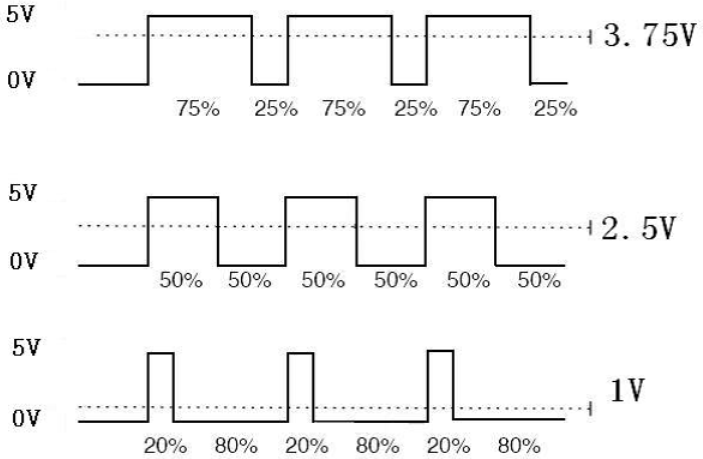
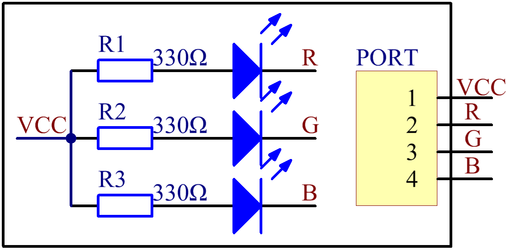

Lesson 2 RGB LED Module
=======================

**Introduction**

RGB LED modules can emit various colors of light. Three LEDs of red,
green, and blue are packaged into a transparent or semitransparent
plastic shell with four pins led out. The three primary colors of red,
green, and blue can be mixed and compose all kinds of colors by
brightness, so you can make an RGB LED emit colorful light by
controlling the circuit.

.. image:: media/image100.png
   :width: 1.74861in
   :height: 1.43889in

**Required Components**

- 1 \* Raspberry Pi

- 1 \* Breadboard

- Several Jumper wires

- 1 \* RGB LED module

- 1 \* 4-Pin anti-reverse cable

**Experimental Principle**

In this experiment, we will use PWM technology to control the brightness
of RGB.

Pulse Width Modulation, or PWM, is a technique for getting analog
results with digital means. Digital control is used to create a square
wave, a signal switched between on and off. This on-off pattern can
simulate voltages in between full on (5 Volts) and off (0 Volts) by
changing the portion of the time the signal spends on versus the time
that the signal spends off. The duration of \"on time\" is called the
pulse width. To get varying analog values, you change, or modulate, that
pulse width. If you repeat this on-off pattern fast enough with an LED
for example, the result is as if the signal is a steady voltage between
0 and 5v controlling the brightness of the LED.

We can see from the top oscillogram that the amplitude of DC voltage
output is 5V. However, the actual voltage output is only 3.75V through
PWM, for the high level only takes up 75% of the total voltage within a
period.

Here are the three basic parameters of PWM:

.. image:: media/image102.png
   :width: 5.55208in
   :height: 3.12431in

1. The term **duty cycle** describes the proportion of \"on\" time to the
regular interval or \"period\" of time

2. **Period** describes the reciprocal of pulses in one second.

3. The voltage amplitude here is 0V-5V.

Here we input any value between 0 and 255 to the three pins of the RGB
LED to make it display different colors.

RGB LEDs can be categorized into common anode LED and common cathode
LED. In this experiment, we use a common cathode RGB LED.

The schematic diagram of the module is as shown below:

**Experimental Procedures**

**Step 1:** Build the circuit according to the following method.

+-----------------------+----------------------+----------------------+
| **Raspberry Pi**      | **GPIO Extension     | **RGB LED Module**   |
|                       | Board**              |                      |
+-----------------------+----------------------+----------------------+
| **3.3V**              | **3V3**              | **VCC**              |
+-----------------------+----------------------+----------------------+
| **GPIO0**             | **GPIO17**           | **R**                |
+-----------------------+----------------------+----------------------+
| **GPIO1**             | **GPIO18**           | **G**                |
+-----------------------+----------------------+----------------------+
| **GPIO2**             | **GPIO27**           | **B**                |
+-----------------------+----------------------+----------------------+

.. image:: media/image104.png
   :alt: 02_RGB_LED_bb
   :width: 5.31458in
   :height: 5.09722in

**For C Users:**

**Step 2:** Change directory.

.. code-block::

    cd /home/pi/SunFounder_SensorKit_for_RPi2/C/02_rgb_led/

**Step 3:** Compile.

.. code-block::

    gcc rgb_led.c -lwiringPi

**Step 4:** Run.

**Code**

.. code-block::

    sudo ./a.out

.. code-block:: c

   #include <wiringPi.h>
   #include <softPwm.h>
   #include <stdio.h>

   #define uchar unsigned char

   #define LedPinRed    0
   #define LedPinGreen  1
   #define LedPinBlue   2

   void ledInit(void)
   {
      softPwmCreate(LedPinRed,  0, 100);
      softPwmCreate(LedPinGreen,0, 100);
      softPwmCreate(LedPinBlue, 0, 100);
   }

   void ledColorSet(uchar r_val, uchar g_val, uchar b_val)
   {
      softPwmWrite(LedPinRed,   r_val);
      softPwmWrite(LedPinGreen, g_val);
      softPwmWrite(LedPinBlue,  b_val);
   }

   int main(void)
   {
      int i;

      if(wiringPiSetup() == -1){ //when initialize wiring failed, print message to screen
         printf("setup wiringPi failed !");
         return 1; 
      }
      //printf("linker LedPin : GPIO %d(wiringPi pin)\n",LedPin); //when initialize wiring successfully,print message to screen

      ledInit();

      while(1){
         ledColorSet(0xff,0x00,0x00);   //red	
         delay(500);
         ledColorSet(0x00,0xff,0x00);   //green
         delay(500);
         ledColorSet(0x00,0x00,0xff);   //blue
         delay(500);

         ledColorSet(0xff,0xff,0x00);   //yellow
         delay(500);
         ledColorSet(0xff,0x00,0xff);   //pick
         delay(500);
         ledColorSet(0xc0,0xff,0x3e);
         delay(500);

         ledColorSet(0x94,0x00,0xd3);
         delay(500);
         ledColorSet(0x76,0xee,0x00);
         delay(500);
         ledColorSet(0x00,0xc5,0xcd);	
         delay(500);

      }

      return 0;
   }

**For Python Users:**

**Step 2:** Change directory.

.. code-block::

    cd /home/pi/SunFounder_SensorKit_for_RPi2/Python/

**Step 3:** Run.

.. code-block::

    sudo python3 02_rgb_led.py

**Code**

.. code-block:: python

   #!/usr/bin/env python3
   import RPi.GPIO as GPIO
   import time

   colors = [0xFF0000, 0x00FF00, 0x0000FF, 0xFFFF00, 0xFF00FF, 0x00FFFF]
   R = 11
   G = 12
   B = 13

   def setup(Rpin, Gpin, Bpin):
      global pins
      global p_R, p_G, p_B
      pins = {'pin_R': Rpin, 'pin_G': Gpin, 'pin_B': Bpin}
      GPIO.setmode(GPIO.BOARD)       # Numbers GPIOs by physical location
      for i in pins:
         GPIO.setup(pins[i], GPIO.OUT)   # Set pins' mode is output
         GPIO.output(pins[i], GPIO.HIGH) # Set pins to high(+3.3V) to off led
      
      p_R = GPIO.PWM(pins['pin_R'], 2000)  # set Frequece to 2KHz
      p_G = GPIO.PWM(pins['pin_G'], 1999)
      p_B = GPIO.PWM(pins['pin_B'], 5000)
      
      p_R.start(100)      # Initial duty Cycle = 0(leds off)
      p_G.start(100)
      p_B.start(100)

   def map(x, in_min, in_max, out_min, out_max):
      return (x - in_min) * (out_max - out_min) / (in_max - in_min) + out_min

   def off():
      GPIO.setmode(GPIO.BOARD)
      for i in pins:
         GPIO.setup(pins[i], GPIO.OUT)   # Set pins' mode is output
         GPIO.output(pins[i], GPIO.HIGH)    # Turn off all leds

   def setColor(col):   # For example : col = 0x112233
      R_val = (col & 0xff0000) >> 16
      G_val = (col & 0x00ff00) >> 8
      B_val = (col & 0x0000ff) >> 0

      R_val = map(R_val, 0, 255, 0, 100)
      G_val = map(G_val, 0, 255, 0, 100)
      B_val = map(B_val, 0, 255, 0, 100)
      
      p_R.ChangeDutyCycle(100-R_val)     # Change duty cycle
      p_G.ChangeDutyCycle(100-G_val)
      p_B.ChangeDutyCycle(100-B_val)

   def loop():
      while True:
         for col in colors:
            setColor(col)
            time.sleep(1)

   def destroy():
      p_R.stop()
      p_G.stop()
      p_B.stop()
      off()
      GPIO.cleanup()

   if __name__ == "__main__":
      try:
         setup(R, G, B)
         loop()
      except KeyboardInterrupt:
         destroy()

You will see the RGB LED light up, and display different colors in turn.

.. image:: media/image105.jpeg
   :width: 700
