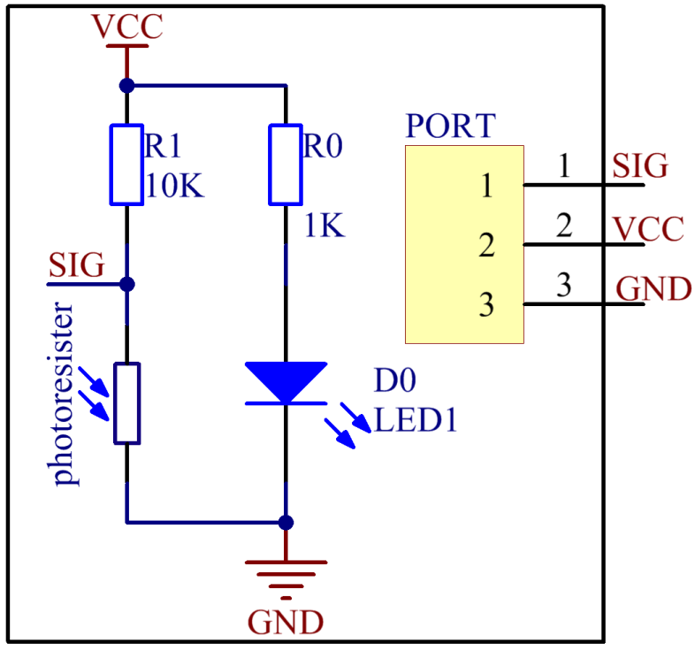

Lesson 20 Photoresistor Module
================================

**Introduction**

A photoresistor is a light-controlled variable resistor.
The resistance of a photoresistor decreases with increasing incident
light intensity.

.. image:: media/image189.png
   :width: 1.82847in
   :height: 1.45in

**Required Components**

- 1 \* Raspberry Pi

- 1 \* Breadboard

- 1 \* PCF8591

- 1 \* Photoresistor module

- 1 \* 3-Pin anti-reverse cable

- Several Jumper wires

**Experimental Principle**

With light intensity increasing, the resistance of a photoresistor will
decrease. Thus the output voltage changes. Analog signals collected by
the photoresistor are converted to digital signals through PCF8591. Then
these digital signals are transmitted to Raspberry Pi and printed on the
screen. The schematic diagram:

**Experimental Procedures**

**Step 1:** Build the circuit.

+-----------------------+----------------------+----------------------+
| **Raspberry Pi**      | **GPIO Extension     | **PCF8591 Module**   |
|                       | Board**              |                      |
+-----------------------+----------------------+----------------------+
| **SDA**               | **SDA1**             | **SDA**              |
+-----------------------+----------------------+----------------------+
| **SCL**               | **SCL1**             | **SCL**              |
+-----------------------+----------------------+----------------------+
| **3.3V**              | **3V3**              | **VCC**              |
+-----------------------+----------------------+----------------------+
| **GND**               | **GND**              | **GND**              |
+-----------------------+----------------------+----------------------+

+-----------------------+----------------------+----------------------+
| **Photoresistor**     | **GPIO Extension     | **PCF8591 Module**   |
|                       | Board**              |                      |
+-----------------------+----------------------+----------------------+
| **SIG**               | **\***               | **AIN0**             |
+-----------------------+----------------------+----------------------+
| **VCC**               | **3V3**              | **VCC**              |
+-----------------------+----------------------+----------------------+
| **GND**               | **GND**              | **GND**              |
+-----------------------+----------------------+----------------------+

.. image:: media/image191.png
   :alt: C:\Users\Daisy\Desktop\Fritzing(英语)\20_Photoresistor_bb.png20_Photoresistor_bb
   :width: 6.34444in
   :height: 6.02639in

**For C Users:**

**Step 2:** Change directory.

.. raw:: html

    <run></run>

.. code-block::

    cd /home/pi/SunFounder_SensorKit_for_RPi2/C/20_photoresistor/

**Step 3:** Compile.

.. raw:: html

    <run></run>

.. code-block::

    gcc photoresistor.c -lwiringPi

.. note::

    If it does not work after running, or there is an error prompt ``wiringPi.h: No such file or directory``, please refer to :ref:`install_wiringpi` to install it.

**Step 4:** Run.

.. raw:: html

    <run></run>

.. code-block::

    sudo ./a.out

**Code**

.. code-block:: c

    #include <stdio.h>
    #include <wiringPi.h>
    #include <pcf8591.h>
    #include <math.h>

    #define		PCF     120
    #define		DOpin	0

    int main()
    {
        int analogVal;
        
        if(wiringPiSetup() == -1){
            printf("setup wiringPi failed !");
            return 1;
        }
        // Setup pcf8591 on base pin 120, and address 0x48
        pcf8591Setup(PCF, 0x48);

        while(1) // loop forever
        {
            analogVal = analogRead(PCF + 0);
            printf("Value: %d\n", analogVal);

            delay (200);
        }
        return 0;
    }

**For Python Users:**

**Step 2:** Change directory.

.. raw:: html

    <run></run>

.. code-block::

    cd /home/pi/SunFounder_SensorKit_for_RPi2/Python/

**Step 3:** Run.

.. raw:: html

    <run></run>

.. code-block::

    sudo python3 20_photoresistor.py

**Code**

.. raw:: html

    <run></run>

.. code-block:: python

    #!/usr/bin/env python3
    import PCF8591 as ADC
    import RPi.GPIO as GPIO
    import time

    DO = 17
    GPIO.setmode(GPIO.BCM)

    def setup():
        ADC.setup(0x48)
        GPIO.setup(DO, GPIO.IN)

    def loop():
        status = 1
        while True:
            print ('Value: ', ADC.read(0))
            
            time.sleep(0.2)

    if __name__ == '__main__':
        try:
            setup()
            loop()
        except KeyboardInterrupt: 
            pass		

Now, change light intensity (e.g. cover the module with a pad), and the
value printed on the screen will change accordingly.

.. image:: media/image192.jpeg