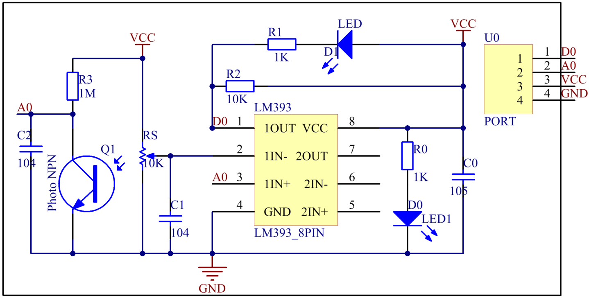

Lesson 21 Flame Sensor
=========================

**Introduction**

A flame sensor (as shown below) performs detection by capturing infrared
rays with specific wavelengths from flame. It can be used to detect and
warn of flames.

.. image:: media/image29.png
  :width: 250

**Required Components**

- 1 \* Raspberry Pi

- 1 \* Breadboard

- 1 \* Flame sensor module

- 1 \* PCF8591

- 1 \* 4-Pin anti-reverse cable

- Several Jumper wires

**Experimental Principle**

There are several types of flame sensors. In this experiment, we will
use a far-infrared flame sensor. It can detect infrared rays with
wavelength ranging from 700nm to 1000nm. A far-infrared flame probe
converts the strength changes of external infrared light into current
changes. And then it convert analog quantities into digital ones. In
this experiment, connect pin D0 of the Flame Sensor module to a GPIO of
Raspberry Pi to detect by programming whether any flame exists. The
schematic diagram:

**Experimental Procedures**

**Step 1:** Build the circuit.

+-----------------------+----------------------+----------------------+
| **Raspberry Pi**      | **GPIO Extension     | **PCF8591 Module**   |
|                       | Board**              |                      |
+-----------------------+----------------------+----------------------+
| **SDA**               | **SDA1**             | **SDA**              |
+-----------------------+----------------------+----------------------+
| **SCL**               | **SCL1**             | **SCL**              |
+-----------------------+----------------------+----------------------+
| **3.3V**              | **3V3**              | **VCC**              |
+-----------------------+----------------------+----------------------+
| **GND**               | **GND**              | **GND**              |
+-----------------------+----------------------+----------------------+

+----------------------+-----------------------+-----------------------+
| **Flame Sensor**     | **GPIO Extension      | **PCF8591 Module**    |
|                      | Board**               |                       |
+----------------------+-----------------------+-----------------------+
| **DO**               | **GPIO17**            | **\***                |
+----------------------+-----------------------+-----------------------+
| **AO**               | **\***                | **AIN0**              |
+----------------------+-----------------------+-----------------------+
| **VCC**              | **3V3**               | **VCC**               |
+----------------------+-----------------------+-----------------------+
| **GND**              | **GND**               | **GND**               |
+----------------------+-----------------------+-----------------------+

.. image:: media/image195.png
   :alt: C:\Users\Daisy\Desktop\Fritzing(英语)\21_Flame_Sensor_bb.png21_Flame_Sensor_bb
   :width: 5.33889in
   :height: 5.71319in

**For C Users:**

**Step 2:** Change directory.

.. raw:: html

    <run></run>

.. code-block::

    cd /home/pi/SunFounder_SensorKit_for_RPi2/C/21_flame_sensor/

**Step 3:** Compile.

.. raw:: html

    <run></run>

.. code-block::

    gcc flame_sensor.c -lwiringPi

**Step 4:** Run.

.. raw:: html

    <run></run>

.. code-block::

    sudo ./a.out

.. note::

   If it does not work after running, or there is an error prompt: \"wiringPi.h: No such file or directory\", please refer to :ref:`C code is not working?`.

**Code**

.. code-block:: c

    #include <stdio.h>
    #include <wiringPi.h>
    #include <pcf8591.h>
    #include <math.h>

    #define		PCF     120
    #define		DOpin	0

    void Print(int x)
    {
        switch(x)
        {
            case 1:
                printf("\n*********\n"  );
                printf(  "* Saft~ *\n"  );
                printf(  "*********\n\n");
            break;
            case 0:
                printf("\n*********\n"  );
                printf(  "* Fire! *\n"  );
                printf(  "*********\n\n");
            break;
            default:
                printf("\n**********************\n"  );
                printf(  "* Print value error. *\n"  );
                printf(  "**********************\n\n");
            break;
        }
    }

    int main()
    {
        int analogVal;
        int tmp, status;
        
        if(wiringPiSetup() == -1){
            printf("setup wiringPi failed !");
            return 1;
        }
        // Setup pcf8591 on base pin 120, and address 0x48
        pcf8591Setup(PCF, 0x48);

        pinMode(DOpin, INPUT);

        status = 0;
        while(1) // loop forever
        {
            analogVal = analogRead(PCF + 0);
            printf("%d\n", analogVal);

            tmp = digitalRead(DOpin);

            if (tmp != status)
            {
                Print(tmp);
                status = tmp;
            }

            delay (200);
        }
        return 0;
    }

**For Python Users:**

**Step 2:** Change directory.

.. raw:: html

    <run></run>

.. code-block::

    cd /home/pi/SunFounder_SensorKit_for_RPi2/Python/

**Step 3:** Run.

.. raw:: html

    <run></run>

.. code-block::

    sudo python3 21_flame_sensor.py

**Code**

.. raw:: html

    <run></run>

.. code-block:: python

    #!/usr/bin/env python3
    import PCF8591 as ADC
    import RPi.GPIO as GPIO
    import time
    import math

    DO = 17
    GPIO.setmode(GPIO.BCM)

    def setup():
        ADC.setup(0x48)
        GPIO.setup(DO, GPIO.IN)

    def Print(x):
        if x == 1:
            print ('')
            print ('   *********')
            print ('   * Safe~ *')
            print ('   *********')
            print ('')
        if x == 0:
            print ('')
            print ('   *********')
            print ('   * Fire! *')
            print ('   *********')
            print ('')

    def loop():
        status = 1
        while True:
            print (ADC.read(0))
            
            tmp = GPIO.input(DO);
            if tmp != status:
                Print(tmp)
                status = tmp
            
            time.sleep(0.2)

    if __name__ == '__main__':
        try:
            setup()
            loop()
        except KeyboardInterrupt: 
            pass	

Now, ignite a lighter near the sensor, within the range of 80cm, and
\"Fire!\" will be displayed on the screen. If you put out the lighter or
just move the flames away from the flame sensor, \"Safe~\" will be
displayed then.

.. image:: media/image196.jpeg