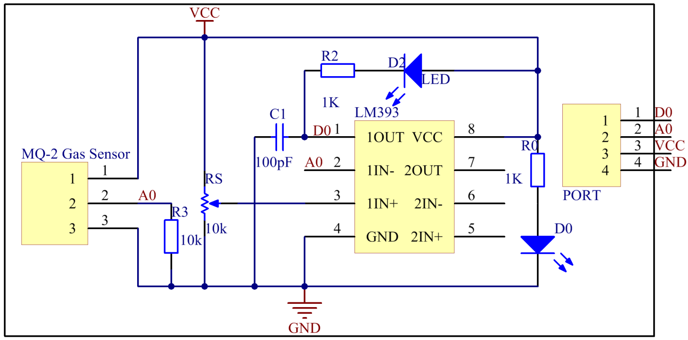

Lesson 22 Gas Sensor
======================

**Introduction**

Gas Sensor MQ-2 is a sensor for flammable gas and smoke by detecting the
concentration of combustible gas in the air. They are used in gas
detecting equipment for smoke and flammable gasses in household,
industry or automobile.

.. image:: media/image197.png
   :width: 2.39028in
   :height: 1.45833in

**Required Components**

- 1 \* Raspberry Pi

- 1 \* Breadboard

- 1 \* Active Buzzer module

- 1 \* PCF8591

- 1 \* Gas sensor module

- 1 \* 3-Pin anti-reverse cable

- 1 \* 4-Pin anti-reverse cable

- Several Jumper wires

**Experimental Principle**

MQ-2 gas sensor is a kind of surface ion type and N-type semiconductors,
which uses tin oxide semiconductor gas sensitive material. When ambient
temperature is in 200 ~ 300℃, tin oxide will adsorb oxygen in the air
and form oxygen anion adsorption to decrease electron density in
semiconductor so as to increase its resistance. When in contact with the
smoke, if grain boundary barrier is modulated by the smoke and changed,
it could cause surface conductivity change. So you can gain the
information of the smoke existence, The higher the smoke concentration
is, the more conductive the material becomes, thus the lower the output
resistance is.

In this experiment, if harmful gases reach a certain concentration, the
buzzer will beep to warn.

The schematic diagram of the module is as shown below:

**Experimental Procedures**

**Step 1:** Build the circuit.

+-----------------------+----------------------+----------------------+
| **Raspberry Pi**      | **GPIO Extension     | **PCF8591 Module**   |
|                       | Board**              |                      |
+-----------------------+----------------------+----------------------+
| **SDA**               | **SDA1**             | **SDA**              |
+-----------------------+----------------------+----------------------+
| **SCL**               | **SCL1**             | **SCL**              |
+-----------------------+----------------------+----------------------+
| **3.3V**              | **3V3**              | **VCC**              |
+-----------------------+----------------------+----------------------+
| **GND**               | **GND**              | **GND**              |
+-----------------------+----------------------+----------------------+

+----------------------+-----------------------+-----------------------+
| **Gas Sensor         | **GPIO Extension      | **PCF8591 Module**    |
| Module**             | Board**               |                       |
+----------------------+-----------------------+-----------------------+
| **DO**               | **GPIO17**            | **\***                |
+----------------------+-----------------------+-----------------------+
| **AO**               | **\***                | **AIN0**              |
+----------------------+-----------------------+-----------------------+
| **VCC**              | **3V3**               | **\***                |
+----------------------+-----------------------+-----------------------+
| **GND**              | **GND**               | **GND**               |
+----------------------+-----------------------+-----------------------+

+-----------------------+----------------------+----------------------+
| **Raspberry Pi**      | **GPIO Extension     | **Active Buzzer      |
|                       | Board**              | Module**             |
+-----------------------+----------------------+----------------------+
| **GPIO1**             | **GPIO18**           | **SIG**              |
+-----------------------+----------------------+----------------------+
| **3.3V**              | **3V3**              | **VCC**              |
+-----------------------+----------------------+----------------------+
| **GND**               | **GND**              | **GND**              |
+-----------------------+----------------------+----------------------+

.. image:: media/image199.png
   :width: 450

**For C Users:**

**Step 2:** Change directory.

.. code-block::

    cd /home/pi/SunFounder_SensorKit_for_RPi2/C/22_gas_sensor/

**Step 3:** Compile.

.. code-block::

    gcc gas_sensor.c -lwiringPi

**Step 4:** Run.

.. code-block::

    sudo ./a.out

**For Python Users:**

**Step 2:** Change directory.

.. code-block::

    cd /home/pi/SunFounder_SensorKit_for_RPi2/Python/

**Step 3:** Run.

.. code-block::

    sudo python3 22_gas_sensor.py

Place a lighter close to the MQ-2 gas sensor, and press the switch to
release gasses. A value between 0 and 255 will be displayed on the
screen. If harmful gases reach a certain concentration, the buzzer will
beep, and “Danger Gas!” will be printed on the screen.

You can also turn the shaft of the potentiometer on the module to raise
or reduce the concentration threshold.

The MQ-2 gas sensor needs to be heated up for a while. Wait until the
value printed on screen stays steady and the sensor gets warm, which
means it can work normally and sensitively at that time.

.. note:: 
    It is normal that the gas sensor generates heat. Actually, the higher the temperature is, the sensor is more sensitive.

.. image:: media/image200.jpeg