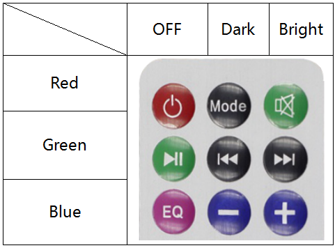

Lesson 23 IR Remote Control
=============================

**Introduction**

Each button of an IR remote control (as shown below) has a string of
specific encoding. When a button is pressed, the IR transmitter in the
remote control will send out the corresponding IR encoding signals. On
the other side, when the IR receiver receives certain encoding signals,
it will decode them to identify which button is pressed.

**Required Components**

- 1 \* Raspberry Pi

- 1 \* Breadboard

- 1 \* IR Receiver

- 1 \* RGB LED module

- 1 \* IR Remote Control

- 1 \* 3-Pin anti-reverse cable

- 1 \* 4-Pin anti-reverse cable

**Experimental Principle**

In this experiment, we use the lirc library to read infrared signals
returned by buttons of the remote control and translate them to button
values. Then use liblircclient-dev (C) and pylirc (Python) to simplify
the process for reading values from the remote control. In this
experiment use 9 buttons on the top of the remote to control the color
of the RGB LED module. Each row represents one color, and each column
represents the brightness.

**Experimental Procedures**

**Step 1:** Build the circuit.

+-----------------------+----------------------+----------------------+
| **Raspberry Pi**      | **GPIO Extension     | **IR Receiver        |
|                       | Board**              | Module**             |
+-----------------------+----------------------+----------------------+
| **GPIO4**             | **GPIO23**           | **SIG**              |
+-----------------------+----------------------+----------------------+
| **3.3V**              | **3V3**              | **VCC**              |
+-----------------------+----------------------+----------------------+
| **GND**               | **GND**              | **GND**              |
+-----------------------+----------------------+----------------------+

+-----------------------+----------------------+----------------------+
| **Raspberry Pi**      | **GPIO Extension     | **RGB LED Module**   |
|                       | Board**              |                      |
+-----------------------+----------------------+----------------------+
| **3.3V**              | **3V3**              | **VCC**              |
+-----------------------+----------------------+----------------------+
| **GPIO0**             | **GPIO17**           | **R**                |
+-----------------------+----------------------+----------------------+
| **GPIO1**             | **GPIO18**           | **G**                |
+-----------------------+----------------------+----------------------+
| **GPIO2**             | **GPIO27**           | **B**                |
+-----------------------+----------------------+----------------------+

.. image:: media/image202.png
   :width: 4.68125in
   :height: 4.37986in

**Step 2:** Install the lirc:

.. raw:: html

    <run></run>

.. code-block::

    sudo apt-get update
    sudo apt install lirc

**Step 3:** Set up lirc.

Open your ``/boot/config.txt`` file:

.. raw:: html

    <run></run>

.. code-block::

    sudo nano /boot/config.txt

Add this to the file:

.. code-block::

    # Uncomment this to enable the infrared communication
    dtoverlay=gpio-ir,gpio_pin=23
    dtoverlay=gpio-ir-tx,gpio_pin=22

Press Ctrl +O and Ctrl +X, save and exit .

**Step 4:** edit ``/etc/lirc/lirc_options.conf``.

Open the ``/etc/lirc/lirc_options.conf``

.. raw:: html

    <run></run>

.. code-block::

    sudo nano /etc/lirc/lirc_options.conf

Modify the file as below:

.. code-block::

    driver = default
    device = /dev/lirc1

**Step 5:** Copy the configuration file to ``/home/pi`` and ``/etc/lirc``:

.. raw:: html

    <run></run>

.. code-block::

    cd /home/pi/SunFounder_SensorKit_for_RPi2
    cp lircd.conf /home/pi
    sudo cp lircd.conf /etc/lirc/

**Step 6:** Reboot the Raspberry Pi after the change.

.. raw:: html

    <run></run>

.. code-block::

    sudo reboot

**Step 7:** Test the IR receiver.

Check if lirc module is loaded:

.. raw:: html

    <run></run>

.. code-block::

    ls /dev/li*

You should see this:

.. code-block::

    /dev/lirc0 /dev/lirc1

**Step 8:** Run the command to start outputting raw data from the IR
receiver:

.. raw:: html

    <run></run>

.. code-block::

    irw

When you press a button on the remote, you can see the button name
printed on the screen.

.. code-block::

    pi@raspberrypi:~ $ irw
    0000000000000001 00 KEY_CHANNELDOWN ./lircd.conf
    0000000000000003 00 KEY_CHANNELUP ./lircd.conf
    0000000000000002 00 KEY_CHANNEL ./lircd.conf
    0000000000000004 00 KEY_PREVIOUS ./lircd.conf
    0000000000000005 00 KEY_NEXT ./lircd.conf
    0000000000000006 00 KEY_PLAYPAUSE ./lircd.conf
    0000000000000008 00 KEY_VOLUMEDOWN ./lircd.conf
    0000000000000007 00 KEY_VOLUMEUP ./lircd.conf
    0000000000000009 00 KEY_EQUAL ./lircd.conf
    0000000000000015 00 BTN_1 ./lircd.conf
    0000000000000014 00 BTN_0 ./lircd.conf
    000000000000000a 00 KEY_NUMERIC_0 ./lircd.conf
    000000000000000b 00 KEY_NUMERIC_1 ./lircd.conf

If it does not appear, somewhere may be incorrectly configured. Check
again that you’ve connected everything and haven’t crossed any wires.

**For C Users:**

**Step 9:** Download LIRC client library:

.. raw:: html

    <run></run>

.. code-block::

    sudo apt-get install liblircclient-dev

**Step 10:** Change directory.

.. raw:: html

    <run></run>

.. code-block::

    cd /home/pi/SunFounder_SensorKit_for_RPi2/C/23_ircontrol/

**Step 11:** Copy the ``lircrc`` file to ``/etc/lirc/lirc/``:

.. raw:: html

    <run></run>

.. code-block::

    sudo cp lircrc /etc/lirc/

**Step 12:** Compile.

.. raw:: html

    <run></run>

.. code-block::

    gcc ircontrol.c -lwiringPi -llirc_client

.. note::

    If it does not work after running, or there is an error prompt ``wiringPi.h: No such file or directory``, please refer to :ref:`install_wiringpi` to install it.

**Step 13:** Run.

.. raw:: html

    <run></run>

.. code-block::

    sudo ./a.out

**Code**

.. code-block:: c

    #include <wiringPi.h>
    #include <softPwm.h>
    #include <stdio.h>
    #include <errno.h>
    #include <stdlib.h>
    #include <string.h>
    #include <lirc/lirc_client.h>
    #include <time.h>

    #define uchar unsigned char

    #define LedPinRed    0
    #define LedPinGreen  1
    #define LedPinBlue   2

    uchar color[3] = {0xff, 0xff, 0xff};
    uchar Lv[3]    = {0xff, 0x44, 0x00};

    char *keymap[21] ={
        " KEY_CHANNELDOWN ",
        " KEY_CHANNEL ",
        " KEY_CHANNELUP ",
        " KEY_PREVIOUS ",
        " KEY_NEXT ",
        " KEY_PLAYPAUSE ",
        " KEY_VOLUMEDOWN ",
        " KEY_VOLUMEUP ",
        " KEY_EQUAL ",
        " KEY_NUMERIC_0 ",
        " BTN_0 ",
        " BTN_1 ",
        " KEY_NUMERIC_1 ",
        " KEY_NUMERIC_2 ",
        " KEY_NUMERIC_3 ",
        " KEY_NUMERIC_4 ",
        " KEY_NUMERIC_5 ",
        " KEY_NUMERIC_6 ",
        " KEY_NUMERIC_7 ",
        " KEY_NUMERIC_8 ",
        " KEY_NUMERIC_9 "};

    void ledInit(void)
    {
        softPwmCreate(LedPinRed,  0, 100);
        softPwmCreate(LedPinGreen,0, 100);
        softPwmCreate(LedPinBlue, 0, 100);
    }

    void ledColorSet()
    {
        softPwmWrite(LedPinRed,   color[0]);
        softPwmWrite(LedPinGreen, color[1]);
        softPwmWrite(LedPinBlue,  color[2]);
    }

    int key(char *code){
        int i;
        int num;
        for (i=0; i<21; i++){
            if (strstr(code, keymap[i])){
                num = i;
            }
        }
        return num + 1;
    }

    int RGB(int i){
        switch(i){
            case 1: color[0] = Lv[0]; printf("Red OFF\n"); break;
            case 2: color[0] = Lv[1]; printf("Light Red\n"); break;
            case 3: color[0] = Lv[2]; printf("Dark Red\n"); break;
            case 4: color[1] = Lv[0]; printf("Green OFF\n"); break;
            case 5: color[1] = Lv[1]; printf("Light Green\n"); break;
            case 6: color[1] = Lv[2]; printf("Dark Green\n"); break;
            case 7: color[2] = Lv[0]; printf("Blue OFF\n"); break;
            case 8: color[2] = Lv[1]; printf("Light Blue\n"); break;
            case 9: color[2] = Lv[2]; printf("Dark Green\n"); break;
        }
    }

    int main(void)
    {
        struct lirc_config *config;
        int buttonTimer = millis();
        char *code;
        char *c;
        if(wiringPiSetup() == -1){
            printf("setup wiringPi failed !");
            return 1; 
        }

        if(lirc_init("lirc",1)==-1)
            exit(EXIT_FAILURE);

        ledInit();
        ledColorSet();
        
        if(lirc_readconfig(NULL,&config,NULL)==0)
        {
            while(lirc_nextcode(&code)==0)
            {
                if(code==NULL) continue;{
                    if (millis() - buttonTimer  > 400){
                        RGB(key(code));
                        ledColorSet(color);
                    }
                }
                free(code);
            }
            lirc_freeconfig(config);
        }
        lirc_deinit();
        exit(EXIT_SUCCESS);
        return 0;
    }

**For Python Users:**

**Step 9:** Install ``lirc`` Python packages:

.. raw:: html

    <run></run>

.. code-block::

    sudo pip3 install lirc

**Step 10:** Change directory:

.. raw:: html

    <run></run>

.. code-block::

    cd /home/pi/SunFounder_SensorKit_for_RPi2/Python/

**Step 11:** Run.

.. raw:: html

    <run></run>

.. code-block::

    sudo python3 23_ircontrol.py

**Code**

.. raw:: html

    <run></run>

.. code-block:: python

    import lirc
    import time
    import RPi.GPIO as GPIO

    # client = lirc.Client()
    # print(client.version())

    ''' RGB config'''
    Rpin = 17
    Gpin = 18
    Bpin = 27

    Lv = [0, 20, 90] # Light Level
    color = [0, 0, 0]

    p_R = None
    p_G = None
    p_B = None

    def setColor(color):
        # global p_R, p_G, p_B
        p_R.ChangeDutyCycle(100 - color[0])     # Change duty cycle
        p_G.ChangeDutyCycle(100 - color[1])
        p_B.ChangeDutyCycle(100 - color[2])

    def x():
        setColor(color)

    def setup():
        global p_R, p_G, p_B
        GPIO.setmode(GPIO.BCM)
        GPIO.setup(Rpin, GPIO.OUT)
        GPIO.setup(Gpin, GPIO.OUT)
        GPIO.setup(Bpin, GPIO.OUT)

        p_R = GPIO.PWM(Rpin, 2000) # Set Frequece to 2KHz
        p_G = GPIO.PWM(Gpin, 2000)
        p_B = GPIO.PWM(Bpin, 2000)

        p_R.start(100)
        p_G.start(100)
        p_B.start(100)

    def map(x, in_min, in_max, out_min, out_max):
        return (x - in_min) * (out_max - out_min) / (in_max - in_min) + out_min

    def key_handler(key:str):
        global color

        if key == 'KEY_CHANNELDOWN':
            color[0] = Lv[0]
            print ('Red OFF')

        elif key == 'KEY_CHANNEL':
            color[0] = Lv[1]
            print ('Dark Red')

        elif key == 'KEY_CHANNELUP':
            color[0] = Lv[2]
            print ('Bright Red')

        elif key == 'KEY_PREVIOUS':
            color[1] = Lv[0]
            print ('Green OFF')

        elif key == 'KEY_NEXT':
            color[1] = Lv[1]
            print ('Dark Green')

        elif key == 'KEY_PLAYPAUSE':
            color[1] = Lv[2]
            print ('Bright Green')

        elif key == 'KEY_VOLUMEDOWN':
            color[2] = Lv[0]
            print ('Blue OFF')

        elif key == 'KEY_VOLUMEUP':
            color[2] = Lv[1]
            print ('Dark Blue')

        elif key == 'KEY_EQUAL':
            color[2] = Lv[2]
            print ('Bright BLUE')

        setColor(color)

        
    def loop():
        with lirc.LircdConnection(timeout=5.0) as conn:
            conn.connect()
            while True:
                try: 
                    # print(conn.readline()) # 0000000000000001 00 KEY_CHANNELDOWN ./lircd.conf
                    key = conn.readline().split(' ')[2] #KEY_CHANNELDOWN
                    # print(key)
                    key_handler(key)
                except TimeoutError:
                    # print('Timeout')
                    pass 

    def destroy():
        p_R.stop()
        p_G.stop()
        p_B.stop()
        GPIO.output(Rpin, GPIO.HIGH)    # Turn off all leds
        GPIO.output(Gpin, GPIO.HIGH)
        GPIO.output(Bpin, GPIO.HIGH)
        GPIO.cleanup()

    if __name__ == "__main__":
        try:
            setup()
            loop()
        except KeyboardInterrupt:
            destroy()
            

Each of the top three rows of buttons on the remote control represents a
kind of color, i.e. red, green, and blue, top to bottom. Each column
represents off, light, and dark. For example, press the second button
(light) on the first row (red), and the LED will flash light red. You
can use the remote to generate 27 colors in total (including all the
LEDs off). Try to change the color of the RGB LED with the 9 buttons!

.. image:: media/image203.jpeg