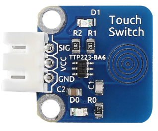
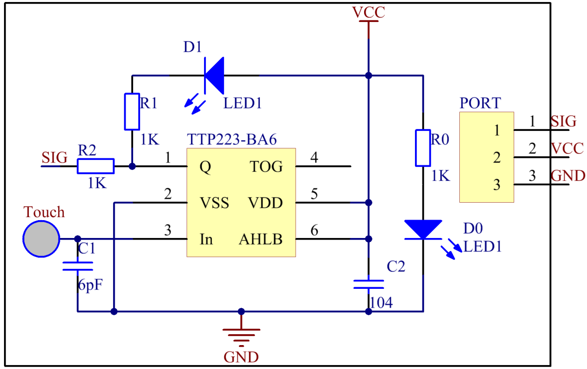
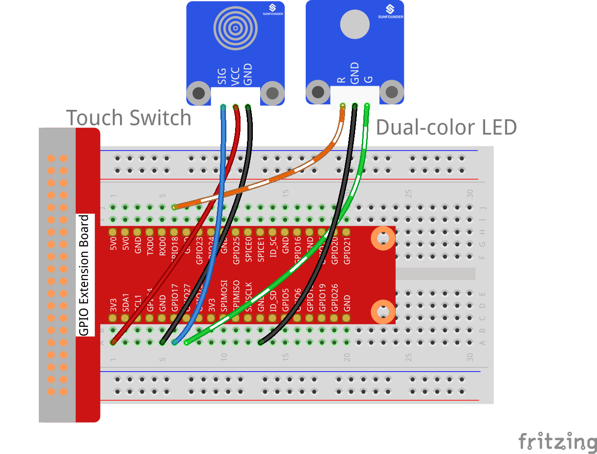
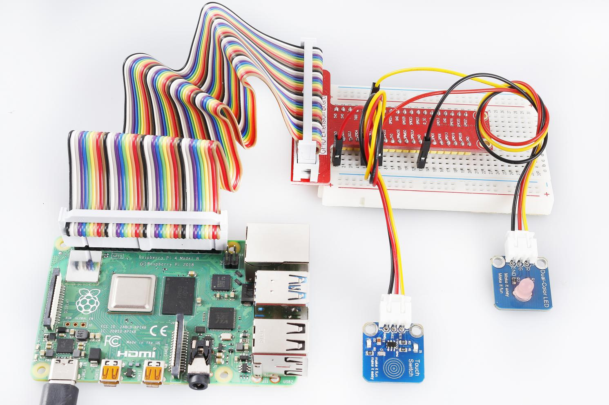

Lesson 24 Touch Switch
========================

**Introduction**

A touch sensor operate with the conductivity of human body. When you
touch the metal on the base electrode of the transistor, the level of
pin SIG will turn over.

**Required Components**

- 1 \* Raspberry Pi

- 1 \* Breadboard

- 1 \* Touch sensor module

- 1 \* Dual-Color LED module

- 2 \* 3-Pin anti-reverse cable

**Experimental Principle**

In this experiment, touch the base electrode of the transistor by
fingers to make it conduct as human body itself is a kind of conductor
and an antenna that can receive electromagnetic waves in the air. These
electromagnetic wave signals collected from the human body are amplified
by the transistor and processed by the comparator on the module to
output steady signals. The schematic diagram:

**Experimental Procedures**

**Step 1:** Build the circuit.

+-----------------------+----------------------+----------------------+
| **Raspberry Pi**      | **GPIO Extension     | **Touch Sensor       |
|                       | Board**              | Module**             |
+-----------------------+----------------------+----------------------+
| **GPIO0**             | **GPIO17**           | **SIG**              |
+-----------------------+----------------------+----------------------+
| **3.3V**              | **3V3**              | **VCC**              |
+-----------------------+----------------------+----------------------+
| **GND**               | **GND**              | **GND**              |
+-----------------------+----------------------+----------------------+

+-----------------------+----------------------+----------------------+
| **Raspberry Pi**      | **GPIO Extension     | **Dual-Color LED     |
|                       | Board**              | Module**             |
+-----------------------+----------------------+----------------------+
| **GPIO1**             | **GPIO18**           | **R**                |
+-----------------------+----------------------+----------------------+
| **GND**               | **GND**              | **GND**              |
+-----------------------+----------------------+----------------------+
| **GPIO2**             | **GPIO27**           | **G**                |
+-----------------------+----------------------+----------------------+

**For C Users:**

**Step 2:** Change directory.

.. raw:: html

    <run></run>

.. code-block::

    cd /home/pi/SunFounder_SensorKit_for_RPi2/C/24_touch_switch/

**Step 3:** Compile.

.. raw:: html

    <run></run>

.. code-block::

    gcc touch_switch.c -lwiringPi

**Step 4:** Run.

.. raw:: html

    <run></run>

.. code-block::

    sudo ./a.out

.. note::

   If it does not work after running, please refer to :ref:`C code is not working?`

**Code**

.. code-block:: c

    #include <wiringPi.h>
    #include <stdio.h>

    #define TouchPin	0
    #define Gpin		2
    #define Rpin		1

    int tmp = 0;

    void LED(int color)
    {
        pinMode(Gpin, OUTPUT);
        pinMode(Rpin, OUTPUT);
        if (color == 0)
        {
            digitalWrite(Rpin, HIGH);
            digitalWrite(Gpin, LOW);
        }
        else if (color == 1)
        {
            digitalWrite(Rpin, LOW);
            digitalWrite(Gpin, HIGH);
        }
        else
            printf("LED Error");
    }

    void Print(int x){
        if (x != tmp){
            if (x == 0)
                printf("...ON\n");
            if (x == 1)
                printf("OFF..\n");
            tmp = x;
        }
    }

    int main(void)
    {
        if(wiringPiSetup() == -1){ //when initialize wiring failed,print messageto screen
            printf("setup wiringPi failed !");
            return 1; 
        }

        pinMode(TouchPin, INPUT);
        
        while(1){
            LED(digitalRead(TouchPin));	
            Print(digitalRead(TouchPin));	
        }
        return 0;
    }

**For Python Users:**

**Step 2:** Change directory.

.. raw:: html

    <run></run>

.. code-block::

    cd /home/pi/SunFounder_SensorKit_for_RPi2/Python/

**Step 3:** Run.

.. raw:: html

    <run></run>

.. code-block::

    sudo python3 24_touch_switch.py

**Code**

.. raw:: html

    <run></run>

.. code-block:: python

    #!/usr/bin/env python3
    import RPi.GPIO as GPIO

    TouchPin = 11
    Gpin   = 13
    Rpin   = 12

    tmp = 0

    def setup():
        GPIO.setmode(GPIO.BOARD)       # Numbers GPIOs by physical location
        GPIO.setup(Gpin, GPIO.OUT)     # Set Green Led Pin mode to output
        GPIO.setup(Rpin, GPIO.OUT)     # Set Red Led Pin mode to output
        GPIO.setup(TouchPin, GPIO.IN, pull_up_down=GPIO.PUD_UP)    # Set BtnPin's mode is input, and pull up to high level(3.3V)

    def Led(x):
        if x == 0:
            GPIO.output(Rpin, 1)
            GPIO.output(Gpin, 0)
        if x == 1:
            GPIO.output(Rpin, 0)
            GPIO.output(Gpin, 1)
        
    def Print(x):
        global tmp
        if x != tmp:
            if x == 0:
                print ('    **********')
                print ('    *     ON *')
                print ('    **********')
        
            if x == 1:
                print ('    **********')
                print ('    * OFF    *')
                print ('    **********')
            tmp = x

    def loop():
        while True:
            Led(GPIO.input(TouchPin))
            Print(GPIO.input(TouchPin))

    def destroy():
        GPIO.output(Gpin, GPIO.HIGH)       # Green led off
        GPIO.output(Rpin, GPIO.HIGH)       # Red led off
        GPIO.cleanup()                     # Release resource

    if __name__ == '__main__':     # Program start from here
        setup()
        try:
            loop()
        except KeyboardInterrupt:  # When 'Ctrl+C' is pressed, the child program destroy() will be  executed.
            destroy()

Now, touch the metal disk, you can see the LED change its colors and
\"ON\" and \"OFF\" printed on the screen.

