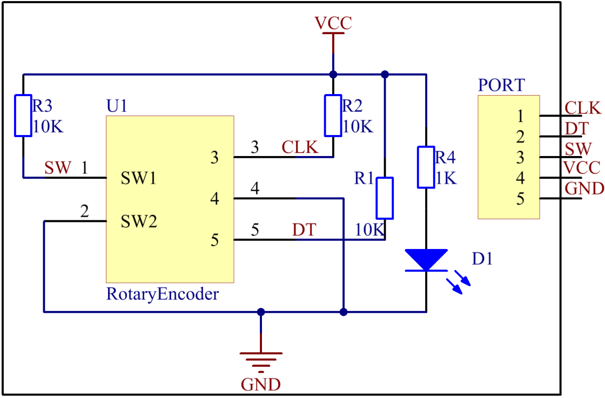

Lesson 27 Rotary Encoder Module
=================================

**Introduction**

A rotary encoder is an electro-mechanical device that converts the
angular position or motion of a shaft or axle to analog or digital code.
Rotary encoders are usually placed at the side which is perpendicular to
the shaft. They act as sensors for detecting angle, speed, length,
position, and acceleration in automation field.

.. image:: media/image214.png
   :width: 1.97361in
   :height: 1.54097in

**Required Components**

- 1 \* Raspberry Pi

- 1 \* Breadboard

- 1 \* Rotary Encoder module

- 1 \* 5-Pin anti-reverse cable

**Experimental Principle**

Most rotary encoders have 5 pins with three functions of turning left &
right and pressing down. Pin 1 and pin 2 are switch wiring terminals
used to press. They are similar to buttons previously mentioned, so we
will no longer discuss them in this experiment. Pin 4 is generally
connected to ground. Pin 3 and pin 5 are first connected to pull-up
resistor and then to the microprocessor. In this experiment, they are
connected to GPIO0 and GPIO1 of Raspberry Pi. When it is rotated left
and right, there will be pulse inputs in pin 1 and pin 3.

.. image:: media/image215.png
   :alt: E:\Sally's file\Processing\rotary.png
   :width: 3.03125in
   :height: 2.03889in

It shows that if output 1 is high and output 2 is high, then the switch
rotates clockwise; if output 1 is high and output 2 is low, then the
switch rotates counterclockwise. As a result, during SCM programming, if
output 1 is high, then you can tell whether the rotary encoder rotates
left or right as long as you know the state of output 2.

**Experimental Procedures**

**Step 1:** Build the circuit.

+-----------------------+---------------------+------------------------+
| **Raspberry Pi**      | **GPIO Extension    | **Rotary Encoder       |
|                       | Board**             | Module**               |
+-----------------------+---------------------+------------------------+
| **GPIO0**             | **GPIO17**          | **CLK**                |
+-----------------------+---------------------+------------------------+
| **GPIO1**             | **GPIO18**          | **DT**                 |
+-----------------------+---------------------+------------------------+
| **GPIO2**             | **GPIO27**          | **SW**                 |
+-----------------------+---------------------+------------------------+
| **3.3V**              | **3V3**             | **VCC**                |
+-----------------------+---------------------+------------------------+
| **GND**               | **GND**             | **GND**                |
+-----------------------+---------------------+------------------------+

.. image:: media/image217.png
   :width: 5.98194in
   :height: 5.53403in

**For C Users:**

**Step 2:** Change directory.

.. code-block::

    cd /home/pi/SunFounder_SensorKit_for_RPi2/C/27_rotary_encoder/

**Step 3:** Compile.

.. code-block::

    gcc rotary_encoder.c -lwiringPi

**Step 4:** Run.

.. code-block::

    sudo ./a.out

**Code**

.. code-block:: c

    #include <stdio.h>
    #include <string.h>
    #include <errno.h>
    #include <stdlib.h>
    #include <wiringPi.h>

    #define  RoAPin    0
    #define  RoBPin    1
    #define  SWPin     2

    static volatile int globalCounter = 0 ;

    unsigned char flag;
    unsigned char Last_RoB_Status;
    unsigned char Current_RoB_Status;

    void btnISR(void)
    {
        globalCounter = 0;
    }

    void rotaryDeal(void)
    {
        Last_RoB_Status = digitalRead(RoBPin);

        while(!digitalRead(RoAPin)){
            Current_RoB_Status = digitalRead(RoBPin);
            flag = 1;
        }

        if(flag == 1){
            flag = 0;
            if((Last_RoB_Status == 0)&&(Current_RoB_Status == 1)){
                globalCounter ++;	
            }
            if((Last_RoB_Status == 1)&&(Current_RoB_Status == 0)){
                globalCounter --;
            }
        }
    }

    int main(void)
    {
        if(wiringPiSetup() < 0){
            fprintf(stderr, "Unable to setup wiringPi:%s\n",strerror(errno));
            return 1;
        }

        pinMode(SWPin, INPUT);
        pinMode(RoAPin, INPUT);
        pinMode(RoBPin, INPUT);

        pullUpDnControl(SWPin, PUD_UP);

        if(wiringPiISR(SWPin, INT_EDGE_FALLING, &btnISR) < 0){
            fprintf(stderr, "Unable to init ISR\n",strerror(errno));	
            return 1;
        }
        
        int tmp = 0;

        while(1){
            rotaryDeal();
            if (tmp != globalCounter){
                printf("%d\n", globalCounter);
                tmp = globalCounter;
            }
        }

        return 0;
    }

**For Python Users:**

**Step 2:** Change directory.

.. code-block::

    cd /home/pi/SunFounder_SensorKit_for_RPi2/Python/

**Step 3:** Run.

.. code-block::

    sudo python3 27_rotary_encoder.py

**Code**

.. code-block:: python

    #!/usr/bin/env python3
    import RPi.GPIO as GPIO
    import time

    RoAPin = 11    # CLK Pin
    RoBPin = 12    # DT Pin
    BtnPin = 13    # Button Pin

    globalCounter = 0

    flag = 0
    Last_RoB_Status = 0
    Current_RoB_Status = 0

    def setup():
        GPIO.setmode(GPIO.BOARD)       # Numbers GPIOs by physical location
        GPIO.setup(RoAPin, GPIO.IN)    # input mode
        GPIO.setup(RoBPin, GPIO.IN)
        GPIO.setup(BtnPin, GPIO.IN, pull_up_down=GPIO.PUD_UP)

    def rotaryDeal():
        global flag
        global Last_RoB_Status
        global Current_RoB_Status
        global globalCounter
        Last_RoB_Status = GPIO.input(RoBPin)
        while(not GPIO.input(RoAPin)):
            Current_RoB_Status = GPIO.input(RoBPin)
            flag = 1
        if flag == 1:
            flag = 0
            if (Last_RoB_Status == 0) and (Current_RoB_Status == 1):
                globalCounter = globalCounter + 1
            if (Last_RoB_Status == 1) and (Current_RoB_Status == 0):
                globalCounter = globalCounter - 1

    def btnISR(channel):
        global globalCounter
        globalCounter = 0

    def loop():
        global globalCounter
        tmp = 0	# Rotary Temperary

        GPIO.add_event_detect(BtnPin, GPIO.FALLING, callback=btnISR)
        while True:
            rotaryDeal()
            if tmp != globalCounter:
                print ('globalCounter = %d' % globalCounter)
                tmp = globalCounter

    def destroy():
        GPIO.cleanup()             # Release resource

    if __name__ == '__main__':     # Program start from here
        setup()
        try:
            loop()
        except KeyboardInterrupt:  # When 'Ctrl+C' is pressed, the child program destroy() will be  executed.
            destroy()

Now rotate the shaft of the rotary encoder, and the value printed on the
screen will change. Rotate the rotary encoder clockwise, the value will
increase; Rotate it counterclockwise, the value will decrease; Press the
rotary encoder, the value will be reset to 0.

.. image:: media/image218.jpeg