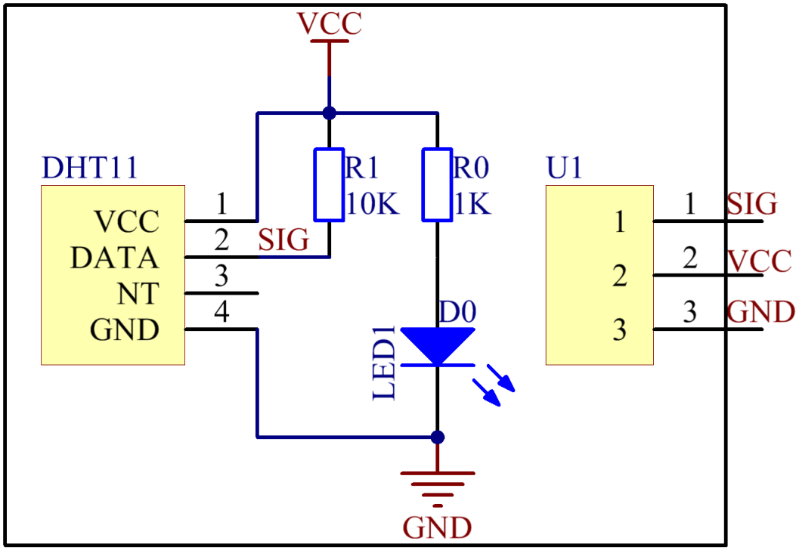

Lesson 28 Humiture Sensor
===========================

**Introduction**

The digital temperature and humidity sensor DHT11 is a composite sensor
that contains a calibrated digital signal output of temperature and
humidity. The technology of a dedicated digital modules collection and
the temperature and humidity sensing technology are applied to ensure
that the product has high reliability and excellent long-term stability.

.. image:: media/image219.png
   :width: 1.76111in
   :height: 1.47431in

**Required Components**

- 1 \* Raspberry Pi

- 1 \* Breadboard

- 1 \* Humiture module

- 1 \* 3-Pin anti-reverse cable

**Experimental Principle**

.. image:: media/image220.png
   :alt: DHT11_Pins
   :width: 2.70694in
   :height: 2.00069in

Only three pins are available for use: VCC, GND, and DATA. The
communication process begins with the DATA line sending start signal to
DHT11, and DHT11 receives the signal and returns an answer signal, then
the host receives the answer signal and begins to receive 40-bit
humiture data (8-bit humidity integer + 8-bit humidity decimal + 8-bit
temperature integer + 8-bit temperature decimal + 8-bit checksum). For
more information, please refer to the datasheet of DHT11.

**Experimental Procedures**

**Step 1:** Build the circuit.

+-----------------------+---------------------+------------------------+
| **Raspberry Pi**      | **GPIO Extension    | **Humiture Module**    |
|                       | Board**             |                        |
+-----------------------+---------------------+------------------------+
| **GPIO0**             | **GPIO17**          | **SIG**                |
+-----------------------+---------------------+------------------------+
| **3.3V**              | **3V3**             | **VCC**                |
+-----------------------+---------------------+------------------------+
| **GND**               | **GND**             | **GND**                |
+-----------------------+---------------------+------------------------+

.. image:: media/image222.png
   :width: 600

**For C Users:**

**Step 2:** Change directory.

.. raw:: html

    <run></run>

.. code-block::

    cd /home/pi/SunFounder_SensorKit_for_RPi2/C/28_humiture/

**Step 3:** Compile.

.. raw:: html

    <run></run>

.. code-block::

    gcc humiture.c -lwiringPi

.. note::

    If it does not work after running, or there is an error prompt ``wiringPi.h: No such file or directory``, please refer to :ref:`install_wiringpi` to install it.

**Step 4:** Run.

.. raw:: html

    <run></run>

.. code-block::

    sudo ./a.out

**Code**

.. code-block:: c

    #include <wiringPi.h>
    #include <stdio.h>
    #include <stdlib.h>
    #include <stdint.h>

    #define MAXTIMINGS 85

    #define DHTPIN 0

    int dht11_dat[5] = {0,0,0,0,0};

    void read_dht11_dat()
    {
        uint8_t laststate = HIGH;
        uint8_t counter = 0;
        uint8_t j = 0, i;
        float f; // fahrenheit

        dht11_dat[0] = dht11_dat[1] = dht11_dat[2] = dht11_dat[3] = dht11_dat[4] = 0;

        // pull pin down for 18 milliseconds
        pinMode(DHTPIN, OUTPUT);
        digitalWrite(DHTPIN, LOW);
        delay(18);
        // then pull it up for 40 microseconds
        digitalWrite(DHTPIN, HIGH);
        delayMicroseconds(40); 
        // prepare to read the pin
        pinMode(DHTPIN, INPUT);

        // detect change and read data
        for ( i=0; i< MAXTIMINGS; i++) {
            counter = 0;
            while (digitalRead(DHTPIN) == laststate) {
                counter++;
                delayMicroseconds(1);
                if (counter == 255) {
                    break;
                }
            }
            laststate = digitalRead(DHTPIN);

            if (counter == 255) break;

            // ignore first 3 transitions
            if ((i >= 4) && (i%2 == 0)) {
                // shove each bit into the storage bytes
                dht11_dat[j/8] <<= 1;
                if (counter > 16)
                    dht11_dat[j/8] |= 1;
                j++;
            }
        }

        if ((j >= 40) && 
                (dht11_dat[4] == ((dht11_dat[0] + dht11_dat[1] + dht11_dat[2] + dht11_dat[3]) & 0xFF)) ) {
            f = dht11_dat[2] * 9. / 5. + 32;
            printf("Humidity = %d.%d %% Temperature = %d.%d *C (%.1f *F)\n", 
                    dht11_dat[0], dht11_dat[1], dht11_dat[2], dht11_dat[3], f);
        }
    }

    int main (void)
    {

        printf ("Raspberry Pi wiringPi DHT11 Temperature test program\n") ;

        if (wiringPiSetup () == -1)
            exit (1) ;

        while (1) 
        {
            read_dht11_dat();
            delay(1000); // wait 1sec to refresh
        }

        return 0 ;
    }

**For Python Users:**

**Step 2:** Change directory.

.. raw:: html

    <run></run>

.. code-block::

    cd /home/pi/SunFounder_SensorKit_for_RPi2/Python/

**Step 3:** Run.

.. raw:: html

    <run></run>

.. code-block::

    sudo python3 28_humiture.py

**Code**

.. raw:: html

    <run></run>

.. code-block:: python

    #!/usr/bin/env python3
    import RPi.GPIO as GPIO
    import time

    DHTPIN = 17

    GPIO.setmode(GPIO.BCM)

    MAX_UNCHANGE_COUNT = 100

    STATE_INIT_PULL_DOWN = 1
    STATE_INIT_PULL_UP = 2
    STATE_DATA_FIRST_PULL_DOWN = 3
    STATE_DATA_PULL_UP = 4
    STATE_DATA_PULL_DOWN = 5

    def read_dht11_dat():
        GPIO.setup(DHTPIN, GPIO.OUT)
        GPIO.output(DHTPIN, GPIO.HIGH)
        time.sleep(0.05)
        GPIO.output(DHTPIN, GPIO.LOW)
        time.sleep(0.02)
        GPIO.setup(DHTPIN, GPIO.IN, GPIO.PUD_UP)

        unchanged_count = 0
        last = -1
        data = []
        while True:
            current = GPIO.input(DHTPIN)
            data.append(current)
            if last != current:
                unchanged_count = 0
                last = current
            else:
                unchanged_count += 1
                if unchanged_count > MAX_UNCHANGE_COUNT:
                    break

        state = STATE_INIT_PULL_DOWN

        lengths = []
        current_length = 0

        for current in data:
            current_length += 1

            if state == STATE_INIT_PULL_DOWN:
                if current == GPIO.LOW:
                    state = STATE_INIT_PULL_UP
                else:
                    continue
            if state == STATE_INIT_PULL_UP:
                if current == GPIO.HIGH:
                    state = STATE_DATA_FIRST_PULL_DOWN
                else:
                    continue
            if state == STATE_DATA_FIRST_PULL_DOWN:
                if current == GPIO.LOW:
                    state = STATE_DATA_PULL_UP
                else:
                    continue
            if state == STATE_DATA_PULL_UP:
                if current == GPIO.HIGH:
                    current_length = 0
                    state = STATE_DATA_PULL_DOWN
                else:
                    continue
            if state == STATE_DATA_PULL_DOWN:
                if current == GPIO.LOW:
                    lengths.append(current_length)
                    state = STATE_DATA_PULL_UP
                else:
                    continue
        if len(lengths) != 40:
            #print ("Data not good, skip")
            return False

        shortest_pull_up = min(lengths)
        longest_pull_up = max(lengths)
        halfway = (longest_pull_up + shortest_pull_up) / 2
        bits = []
        the_bytes = []
        byte = 0

        for length in lengths:
            bit = 0
            if length > halfway:
                bit = 1
            bits.append(bit)
        #print ("bits: %s, length: %d" % (bits, len(bits)))
        for i in range(0, len(bits)):
            byte = byte << 1
            if (bits[i]):
                byte = byte | 1
            else:
                byte = byte | 0
            if ((i + 1) % 8 == 0):
                the_bytes.append(byte)
                byte = 0
        #print (the_bytes)
        checksum = (the_bytes[0] + the_bytes[1] + the_bytes[2] + the_bytes[3]) & 0xFF
        if the_bytes[4] != checksum:
            #print ("Data not good, skip")
            return False

        return the_bytes[0], the_bytes[2]

    def main():
        print ("Raspberry Pi wiringPi DHT11 Temperature test program\n")
        while True:
            result = read_dht11_dat()
            if result:
                humidity, temperature = result
                print ("humidity: %s %%,  Temperature: %s C" % (humidity, temperature))
            time.sleep(1)

    def destroy():
        GPIO.cleanup()

    if __name__ == '__main__':
        try:
            main()
        except KeyboardInterrupt:
            destroy() 

Now, you can see humidity and temperature value printed on the screen.

.. image:: media/image223.jpeg