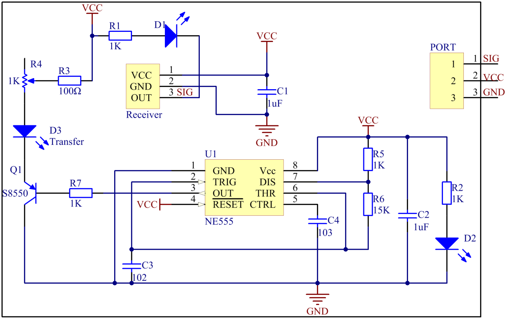

Lesson 29 IR Obstacle Avoidance Module
========================================

**Introduction**

An IR obstacle avoidance module (as shown below) is used in this Lesson.

.. image:: media/image224.png
   :width: 250

**Required Components**

- 1 \* Raspberry Pi

- 1 \* Breadboard

- 1 \* IR Obstacle module

- 1 \* 3-Pin anti-reverse cable

**Experimental Principle**

An obstacle avoidance sensor mainly consists of an infrared-transmitter,
an infrared-receiver and a potentiometer. According to the reflecting
feature of an object, if there is no obstacle, emitted infrared ray will
weaken with the propagation distance and finally disappear. If there is
an obstacle, when infrared ray encounters an obstacle, it will be
reflected back to the infrared-receiver. Then the infrared-receiver
detects this signal and confirms an obstacle exists ahead.

.. note:: 
    The detection distance of the infrared sensor is adjustable - you may adjust it by the potentiometer.

The schematic diagram of the module is as shown below:

**Experimental Procedures**

**Step 1:** Build the circuit.

.. image:: media/image226.png
   :width: 600

**For C Users:**

**Step 2:** Change directory.

.. raw:: html

    <run></run>

.. code-block::

    cd /home/pi/SunFounder_SensorKit_for_RPi2/C/29_ir_obstacle/

**Step 3:** Compile.

.. raw:: html

    <run></run>

.. code-block::

    gcc ir_obstacle.c -lwiringPi

**Step 4:** Run.

.. raw:: html

    <run></run>

.. code-block::

    sudo ./a.out

.. note::

   If it does not work after running, or there is an error prompt: \"wiringPi.h: No such file or directory\", please refer to :ref:`C code is not working?`.

**Code**

.. code-block:: c

    #include <wiringPi.h>
    #include <stdio.h>

    #define ObstaclePin      0

    void myISR(void)
    {
        printf("Detected Barrier !\n");
    }

    int main(void)
    {
        if(wiringPiSetup() == -1){ //when initialize wiring failed,print messageto screen
            printf("setup wiringPi failed !\n");
            return 1; 
        }
        
        if(wiringPiISR(ObstaclePin, INT_EDGE_FALLING, &myISR) < 0){
            printf("Unable to setup ISR !!!\n");
            return 1;
        }
        
        while(1){
            ;
        }

        return 0;
    }

**For Python Users:**

**Step 2:** Change directory.

.. raw:: html

    <run></run>

.. code-block::

    cd /home/pi/SunFounder_SensorKit_for_RPi2/Python/

**Step 3:** Run.

.. raw:: html

    <run></run>

.. code-block::

    sudo python3 29_ir_obstacle.py

**Code**

.. raw:: html

    <run></run>

.. code-block:: python

    #!/usr/bin/env python3
    import RPi.GPIO as GPIO

    ObstaclePin = 11

    def setup():
        GPIO.setmode(GPIO.BOARD)       # Numbers GPIOs by physical location
        GPIO.setup(ObstaclePin, GPIO.IN, pull_up_down=GPIO.PUD_UP)

    def loop():
        while True:
            if (0 == GPIO.input(ObstaclePin)):
                print ("Detected Barrier!")
                

    def destroy():
        GPIO.cleanup()                     # Release resource

    if __name__ == '__main__':     # Program start from here
        setup()
        try:
            loop()
        except KeyboardInterrupt:  # When 'Ctrl+C' is pressed, the child program destroy() will be  executed.
            destroy()

Now, if there is an obstacle ahead, a string \"Detected Barrier!\" will be
printed on the screen.

.. image:: media/image227.jpeg