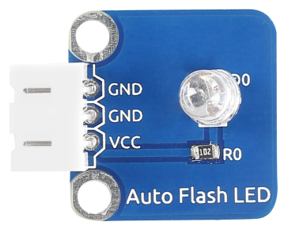
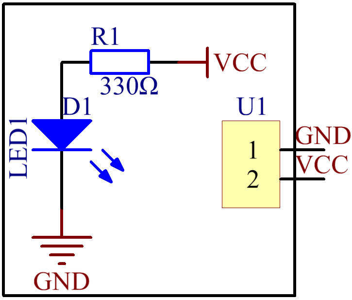
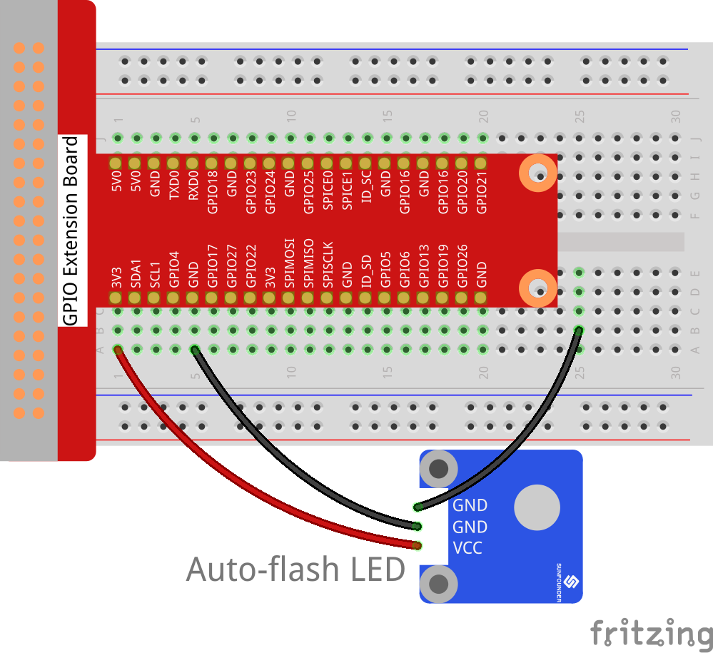
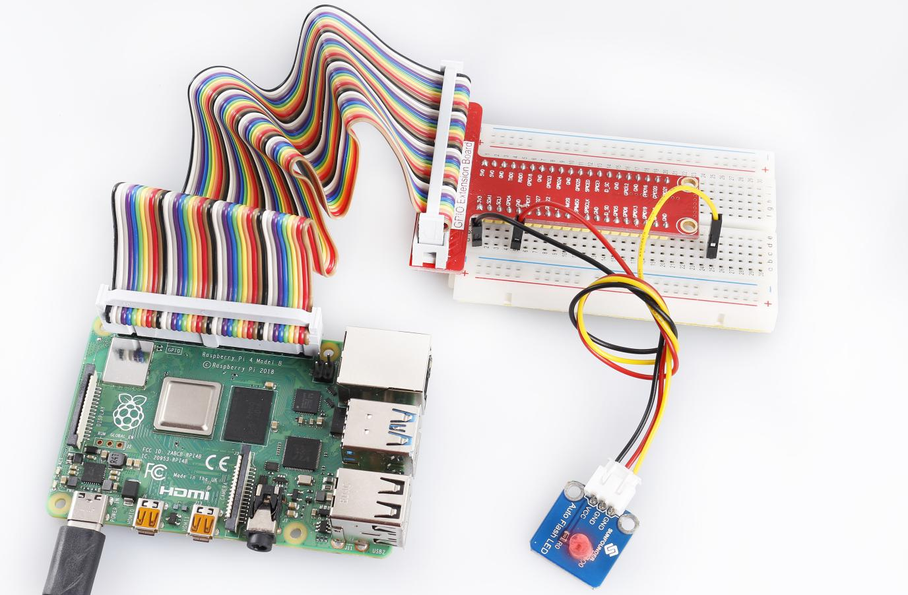

Lesson 3 7-Color Auto-flash LED
===============================

**Introduction**

On the 7-Color Auto-flash LED module, the LED can automatically flash
built-in colors after power on. It can be used to make quite fascinating
light effects.

**Required Components**

- 1 \* Raspberry Pi

- 1 \* Breadboard

- 1 \* 7-color auto-flash LED module

- 1 \* 3-Pin anti-reverse cable

**Experimental Principle**

When it is power on, the 7-color auto-flash LED will flash built-in
colors.

The schematic diagram of the module is as shown below:

**Experimental Procedures**

Build the circuit.

+-----------------------+----------------------+----------------------+
| **Raspberry Pi**      | **GPIO Extension     | **Auto-flash LED     |
|                       | Board**              | Module**             |
+-----------------------+----------------------+----------------------+
| **GND**               | **GND**              | **GND**              |
+-----------------------+----------------------+----------------------+
| **3.3V**              | **3V3**              | **VCC**              |
+-----------------------+----------------------+----------------------+

.. note::

    There are two \"GND\" pins on the module. You only need to connect one of them.

Now, you will see 7-color auto-flash LED flashing seven colors.

