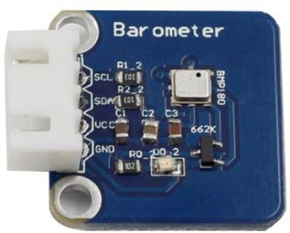
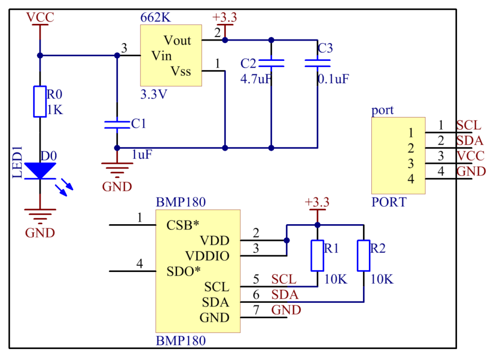
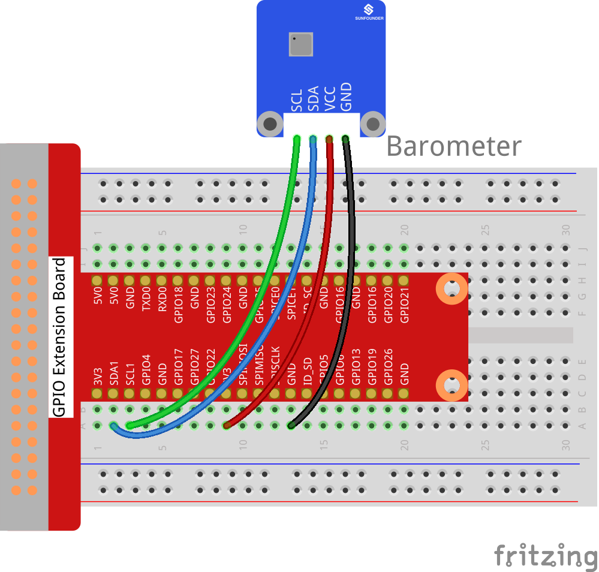
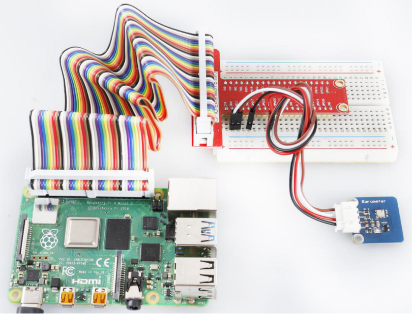

Lesson 31 Barometer-BMP180 Module
=================================

**Introduction**

The BMP180 barometer is the new digital barometric pressure sensor, with
a very high performance, which enables applications in advanced mobile
devices, such as smart phones, tablets and sports devices. It complies
with the BMP085 but boasts many improvements, like a smaller size and
more digital interfaces.

**Required Components**

- 1 \* Raspberry Pi

- 1 \* Breadboard

- 1 \* Barometer module

- 1 \* 4-Pin anti-reverse cable

**Experimental Principle**

Use a barometer to measure air pressure and temperature. The schematic
diagram of the module is as follows:

**Experimental Procedures**

**Step 1:** Build the circuit.

+----------------------+---------------------+------------------------+
| **Raspberry Pi**     | **GPIO Extension    | **Barometer**          |
|                      | Board**             |                        |
+----------------------+---------------------+------------------------+
| **SCL**              | **SCL1**            | **SCL**                |
+----------------------+---------------------+------------------------+
| **SDA**              | **SDA1**            | **SDA**                |
+----------------------+---------------------+------------------------+
| **3.3V**             | **3V3**             | **VCC**                |
+----------------------+---------------------+------------------------+
| **GND**              | **GND**             | **GND**                |
+----------------------+---------------------+------------------------+

**Step 2**: Setup I2C (see Appendix . If you have set I2C, skip this
step.)

**For C Users:**

**Step 3:** Download libi2c-dev.

.. code-block::
    
	sudo apt-get install libi2c-dev

**Step 4:** Change directory.

.. code-block::
    
	cd /home/pi/SunFounder_SensorKit_for_RPi2/C/31_barometer/

**Step 5:** Compile.

.. code-block::

    gcc barometer.c bmp180.c -lm -lwiringPi -lwiringPiDev

**Step 6:** Run.

.. code-block::

    sudo ./a.out

**Code**

.. code-block:: c

    #include "bmp180.h"
    #include <unistd.h>
    #include <stdio.h>

    int main(int argc, char **argv){
        char *i2c_device = "/dev/i2c-1";
        int address = 0x77;

        void *bmp = bmp180_init(address, i2c_device);

        if(bmp != NULL){
            int i;
            for(i = 0; i < 100; i++) {
                float t = bmp180_temperature(bmp);
                long p = bmp180_pressure(bmp);
                float alt = bmp180_altitude(bmp);
                printf("temperature = %.2f, pressure = %lu, altitude = %.2f\n", t, p, alt);
                usleep(2 * 1000 * 1000);
            }
        }
        return 0;
    }

**For Python Users:**

**Step 3:** Install smbus for I2C.

.. code-block::

    sudo apt-get install python3-smbus i2c-tools

**Step 4:** We'll need to install some utilities for the Raspberry Pi to
communicate over I2C.

.. code-block::

    git clone https://github.com/adafruit/Adafruit_Python_BMP.git
    cd Adafruit_Python_BMP
    sudo python3 setup.py install

**Step 5:** Change directory.

.. code-block::

    cd /home/pi/SunFounder_SensorKit_for_RPi2/Python/

**Step 6:** Run.

.. code-block::

    sudo python3 31_barometer.py

**Code**

.. code-block:: python

    import Adafruit_BMP.BMP085 as BMP085
    import time

    def setup():
        print ('\n Barometer begins...')

    def loop():
        while True:
            sensor = BMP085.BMP085()
            temp = sensor.read_temperature()	# Read temperature to veriable temp
            pressure = sensor.read_pressure()	# Read pressure to veriable pressure

            print ('')
            print ('      Temperature = {0:0.2f} C'.format(temp))		# Print temperature
            print ('      Pressure = {0:0.2f} Pa'.format(pressure))	# Print pressure
            time.sleep(1)			
            print ('')

    def destroy():
        pass

    if __name__ == '__main__':		# Program start from here
        setup()
        try:
            loop()
        except KeyboardInterrupt:
            destroy()

Now you can see the temperature and pressure value displayed on the
screen.

