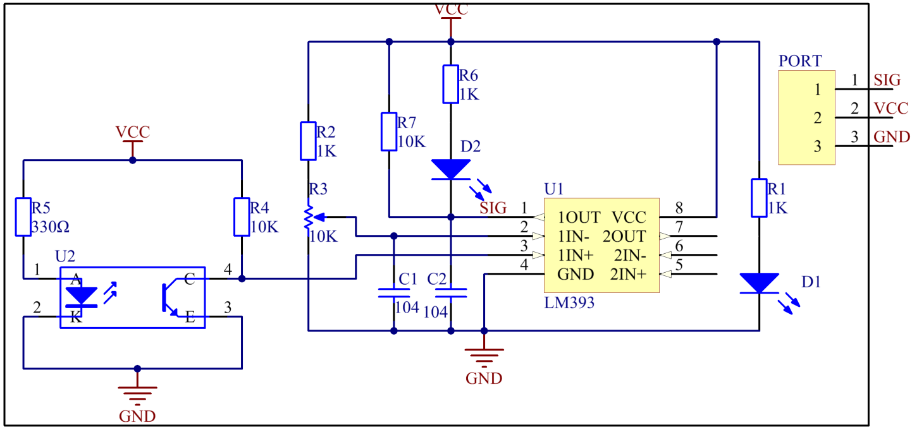

Lesson 34 Tracking Sensor
===========================

**Introduction**

The infrared tracking sensor uses a TRT5000 sensor. The blue LED of
TRT5000 is the emission tube and after electrified it emits infrared
light invisible to human eye. The black part of the sensor is for
receiving; the resistance of the resistor inside changes with the
infrared light received.

.. image:: media/image242.png
   :width: 2.46181in
   :height: 0.95903in

**Required Components**

- 1 \* Raspberry Pi

- 1 \* Breadboard

- 1 \* Tracking sensor module

- 1 \* 3-Pin anti-reverse cable

**Experimental Principle**

When the infrared transmitter emits rays to a piece of paper, if the
rays shine on a white surface, they will be reflected and received by
the receiver, and pin SIG will output low level; If the rays encounter
black lines, they will be absorbed, thus the receiver gets nothing, and
pin SIG will output high level. The schematic diagram of the module is
as shown below:

**Experimental Procedures**

**Step 1**: Build the circuit.

+-----------------------+---------------------+------------------------+
| **Raspberry Pi**      | **GPIO Extension    | **Tracking Sensor      |
|                       | Board**             | Module**               |
+-----------------------+---------------------+------------------------+
| **GPIO0**             | **GPIO17**          | **SIG**                |
+-----------------------+---------------------+------------------------+
| **3.3V**              | **3V3**             | **VCC**                |
+-----------------------+---------------------+------------------------+
| **GND**               | **GND**             | **GND**                |
+-----------------------+---------------------+------------------------+

.. image:: media/image244.png
   :alt: C:\Users\Daisy\Desktop\Fritzing(英语)\34_Tracking_bb.png34_Tracking_bb
   :width: 5.51181in
   :height: 5.99236in

**For C Users:**

**Step 2**: Change directory.

.. code-block::

    cd /home/pi/SunFounder_SensorKit_for_RPi2/C/34_tracking/

**Step 3**: Compile.

.. code-block::

    gcc tracking.c -lwiringPi

**Step 4**: Run.

.. code-block::

    sudo ./a.out

**Code**

.. code-block:: c

    #include <wiringPi.h>
    #include <stdio.h>

    #define TrackSensorPin    0
    #define LedPin            1

    int main(void)
    {
        if(wiringPiSetup() == -1){ //when initialize wiring failed,print messageto screen
            printf("setup wiringPi failed !");
            return 1; 
        }
        
        pinMode(TrackSensorPin, INPUT);
        pinMode(LedPin,  OUTPUT);

        while(1){
            if(digitalRead(TrackSensorPin) == LOW){
                printf("White line is detected\n");
                digitalWrite(LedPin, LOW);     //led on
                delay(100);
                digitalWrite(LedPin, HIGH);    //led off
            }	
            else{
                printf("...Black line is detected\n");
                delay(100);
            }
        }

        return 0;
    }

**For Python Users:**

**Step 2**: Change directory.

.. code-block::

    cd /home/pi/SunFounder_SensorKit_for_RPi2/Python/

**Step 3**: Run.

.. code-block::

    sudo python3 34_tracking.py

**Code**

.. code-block:: python

    #!/usr/bin/env python3
    import RPi.GPIO as GPIO

    TrackPin = 11
    LedPin   = 12

    def setup():
        GPIO.setmode(GPIO.BOARD)       # Numbers GPIOs by physical location
        GPIO.setup(LedPin, GPIO.OUT)   # Set LedPin's mode is output
        GPIO.setup(TrackPin, GPIO.IN, pull_up_down=GPIO.PUD_UP)
        GPIO.output(LedPin, GPIO.HIGH) # Set LedPin high(+3.3V) to off led

    def loop():
        while True:
            if GPIO.input(TrackPin) == GPIO.LOW:
                print ('White line is detected')
                GPIO.output(LedPin, GPIO.LOW)  # led on
            else:
                print ('...Black line is detected')
                GPIO.output(LedPin, GPIO.HIGH) # led off

    def destroy():
        GPIO.output(LedPin, GPIO.HIGH)     # led off
        GPIO.cleanup()                     # Release resource

    if __name__ == '__main__':     # Program start from here
        setup()
        try:
            loop()
        except KeyboardInterrupt:  # When 'Ctrl+C' is pressed, the child program destroy() will be  executed.
            destroy()

When the tracking sensor encounters black lines, a string \"Black Line is
detected\" will be printed on the screen.

.. image:: media/image245.jpeg