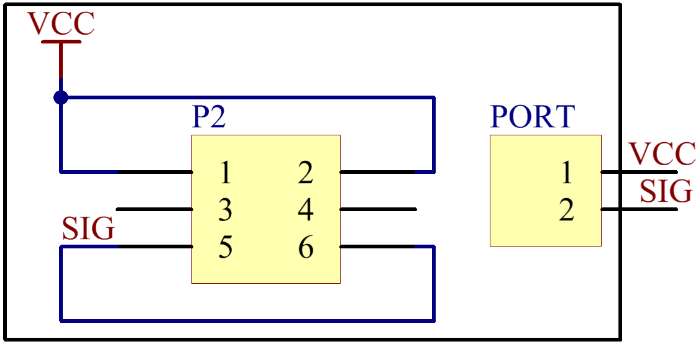
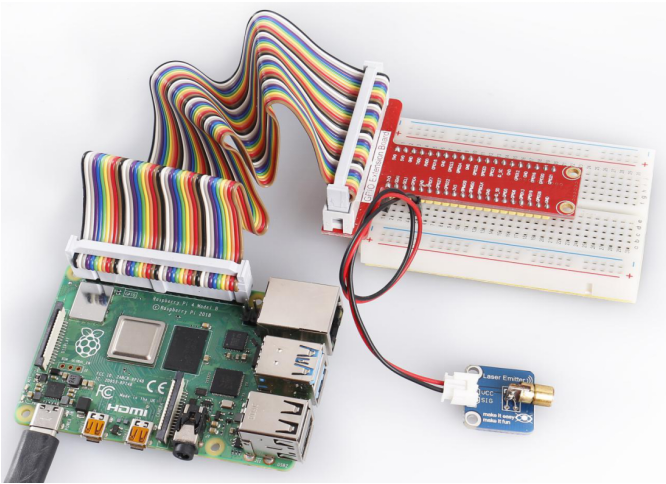

Lesson 5 Laser Emitter Module
=============================

**Introduction**

Laser is widely used in medical treatment, military, and other fields
due to its good directivity and energy concentration.

.. image:: media/image115.png
   :width: 1.83264in
   :height: 1.33194in

**Required Components**

- 1 \* Raspberry Pi

- 1 \* Breadboard

- 1 \* Laser Emitter module

- 1 \* 2-Pin anti-reverse cable

**Experimental Principle**

A laser is a device that emits light through a process of optical
amplification based on the stimulated emission of electromagnetic
radiation. Lasers differ from other sources of light because they emit
light coherently.

Spatial coherence allows a laser to be focused to a tight spot, enabling
applications like laser cutting and lithography, and a laser beam to
stay narrow over long distances (collimation), enabling applications
like laser pointers. Lasers can also have high temporal coherence which
allows them to have a very narrow spectrum, i.e., they only emit light
of a single color. And its temporal coherence can be used to produce
pulses of light—as short as a femtosecond.

The schematic diagram of the module is as shown below:

**Experimental Procedures**

**Step 1:** Build the circuit.

+----------------------+-----------------------+-----------------------+
| **Raspberry Pi**     | **GPIO Extension      | **Laser Emitter       |
|                      | Board**               | Module**              |
+----------------------+-----------------------+-----------------------+
| **3.3V**             | **3V3**               | **VCC**               |
+----------------------+-----------------------+-----------------------+
| **GPIO0**            | **GPIO17**            | **SIG**               |
+----------------------+-----------------------+-----------------------+

.. image:: media/image117.png
   :alt: C:\Users\Daisy\Desktop\Fritzing(英语)\05_Laser_bb.png05_Laser_bb
   :width: 6.40972in
   :height: 5.32292in

**For C Users:**

**Step 2:** Change directory.

.. raw:: html

    <run></run>

.. code-block::

    cd /home/pi/SunFounder_SensorKit_for_RPi2/C/05_laser/

**Step 3:** Compile.

.. raw:: html

    <run></run>

.. code-block::

    gcc laser.c -lwiringPi

**Step 4:** Run.

.. raw:: html

    <run></run>

.. code-block::

    sudo ./a.out

.. note::

   If it does not work after running, please refer to :ref:`C code is not working?`

**Code**

.. code-block:: c

    #include <wiringPi.h>
    #include <stdio.h>

    #define LaserPin    0

    int main(void)
    {
        if(wiringPiSetup() == -1){ //when initialize wiring failed,print messageto screen
            printf("setup wiringPi failed !");
            return 1; 
        }
        //printf("linker LedPin : GPIO %d(wiringPi pin)\n",LedPin); //when initialize wiring successfully,print message to screen

        pinMode(LaserPin, OUTPUT);

        while(1){
            digitalWrite(LaserPin, HIGH);
            delay(500);
            digitalWrite(LaserPin, LOW);
            delay(500);
        }

        return 0;
    }

**For Python Users:**

**Step 2:** Change directory.

.. raw:: html

    <run></run>

.. code-block::

    cd /home/pi/SunFounder_SensorKit_for_RPi2/Python/

**Step 3:** Run.

.. raw:: html

    <run></run>

.. code-block::

    sudo python3 05_laser.py

**Code**

.. raw:: html

    <run></run>

.. code-block:: python

    #!/usr/bin/env python3
    import RPi.GPIO as GPIO
    import time

    LedPin = 11    # pin11

    def setup():
        GPIO.setmode(GPIO.BOARD)       # Numbers GPIOs by physical location
        GPIO.setup(LedPin, GPIO.OUT)   # Set LedPin's mode is output
        GPIO.output(LedPin, GPIO.HIGH) # Set LedPin high(+3.3V) to off led

    def loop():
        while True:
            #'...Laser on'
            GPIO.output(LedPin, GPIO.LOW)  # led on
            time.sleep(0.5)
            #'Laser off...'
            GPIO.output(LedPin, GPIO.HIGH) # led off
            time.sleep(0.5)

    def destroy():
        GPIO.output(LedPin, GPIO.HIGH)     # led off
        GPIO.cleanup()                     # Release resource

    if __name__ == '__main__':     # Program start from here
        setup()
        try:
            loop()
        except KeyboardInterrupt:  # When 'Ctrl+C' is pressed, the child program destroy() will be  executed.
            destroy()

Now you can see the module send out Morse signals.

.. note:: 
    DO NOT look directly at the laser head. It can cause great harm to
    your eyes. You can point the laser beam to the table and see the light
    spot flashing on the table.

