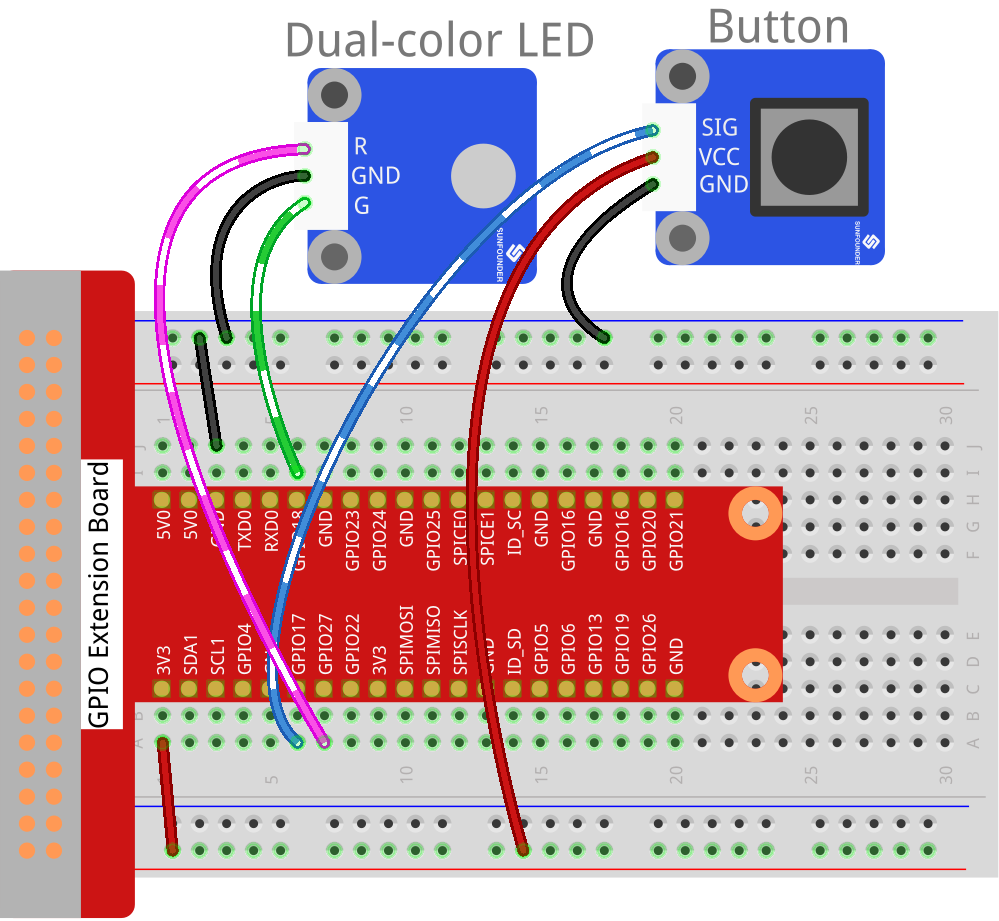

Lesson 6 Button Module
======================

**Introduction**

In this lesson, we will use button module to control a dual-color LED
module.

.. image:: media/image119.png
   :alt: C:\Users\sunfounder\Desktop\sensor pisd 抠图\Button.pngButton
   :width: 2.03889in
   :height: 1.52986in

**Required Components**

- 1 \* Raspberry Pi

- 1 \* Breadboard

- Several Jumper wires

- 1 \* Button module

- 1 \* Dual-color LED module

- 2 \* 3-Pin anti-reverse cable

**Experimental Principle**

Use a normally open button as an input device of Raspberry Pi. When the
button is pressed, the General Purpose Input/Output (GPIO) connected to
the button will change to low level (0V). You can detect the state of
the GPIO through programming. That is, if the GPIO turns into low level,
it means the button is pressed, so you can run the corresponding code.
In this experiment, we will print a string on the screen and control an
LED.

The schematic diagram of the module is as shown below:

.. image:: media/image120.png
   :width: 3.3375in
   :height: 2.69306in

**Experimental Procedures**

**Step 1:** Build the circuit.

+----------------------+----------------------+------------------------+
| **Raspberry Pi**     | **GPIO Extension     | **Button Module**      |
|                      | Board**              |                        |
+----------------------+----------------------+------------------------+
| **GPIO0**            | **GPIO17**           | **SIG**                |
+----------------------+----------------------+------------------------+
| **3.3V**             | **3V3**              | **VCC**                |
+----------------------+----------------------+------------------------+
| **GND**              | **GND**              | **GND**                |
+----------------------+----------------------+------------------------+

+----------------------+----------------------+------------------------+
| **Raspberry Pi**     | **GPIO Extension     | **Dual-Color LED       |
|                      | Board**              | Module**               |
+----------------------+----------------------+------------------------+
| **GPIO1**            | **GPIO18**           | **R**                  |
+----------------------+----------------------+------------------------+
| **GND**              | **GND**              | **GND**                |
+----------------------+----------------------+------------------------+
| **GPIO2**            | **GPIO27**           | **G**                  |
+----------------------+----------------------+------------------------+

**For C Users:**

**Step 2:** Change directory.

.. raw:: html

    <run></run>

.. code-block::

    cd /home/pi/SunFounder_SensorKit_for_RPi2/C/06_button/

**Step 3:** Compile.

.. raw:: html

    <run></run>

.. code-block::

    gcc button.c -lwiringPi

**Step 4:** Run.

.. raw:: html

    <run></run>

.. code-block::

    sudo ./a.out

.. note::

   If it does not work after running, please refer to :ref:`C code is not working?`

**Code**

.. code-block:: c

    #include <wiringPi.h>
    #include <stdio.h>

    #define BtnPin		0
    #define Gpin		1
    #define Rpin		2

    void LED(char* color)
    {
        pinMode(Gpin, OUTPUT);
        pinMode(Rpin, OUTPUT);
        if (color == "RED")
        {
            digitalWrite(Rpin, HIGH);
            digitalWrite(Gpin, LOW);
        }
        else if (color == "GREEN")
        {
            digitalWrite(Rpin, LOW);
            digitalWrite(Gpin, HIGH);
        }
        else
            printf("LED Error");
    }

    int main(void)
    {
        if(wiringPiSetup() == -1){ //when initialize wiring failed,print messageto screen
            printf("setup wiringPi failed !");
            return 1; 
        }

        pinMode(BtnPin, INPUT);
        LED("GREEN");
        
        while(1){
            if(0 == digitalRead(BtnPin)){
                delay(10);
                if(0 == digitalRead(BtnPin)){
                    LED("RED");	
                    printf("Button is pressed\n");	
                }
            }
            else if(1 == digitalRead(BtnPin)){
                delay(10);
                if(1 == digitalRead(BtnPin)){
                    while(!digitalRead(BtnPin));
                    LED("GREEN");
                }
            }
        }
        return 0;
    }

**For Python Users:**

**Step 2:** Change directory.

.. raw:: html

    <run></run>

.. code-block::

    cd /home/pi/SunFounder_SensorKit_for_RPi2/Python/

**Step 3:** Run.

.. raw:: html

    <run></run>

.. code-block::

    sudo python3 06_button.py

**Code**

.. raw:: html

    <run></run>

.. code-block:: python

    #!/usr/bin/env python3
    import RPi.GPIO as GPIO

    BtnPin = 11
    Gpin   = 12
    Rpin   = 13

    def setup():
        GPIO.setmode(GPIO.BOARD)       # Numbers GPIOs by physical location
        GPIO.setup(Gpin, GPIO.OUT)     # Set Green Led Pin mode to output
        GPIO.setup(Rpin, GPIO.OUT)     # Set Red Led Pin mode to output
        GPIO.setup(BtnPin, GPIO.IN, pull_up_down=GPIO.PUD_UP)    # Set BtnPin's mode is input, and pull up to high level(3.3V)
        GPIO.add_event_detect(BtnPin, GPIO.BOTH, callback=detect, bouncetime=200)

    def Led(x):
        if x == 0:
            GPIO.output(Rpin, 1)
            GPIO.output(Gpin, 0)
        if x == 1:
            GPIO.output(Rpin, 0)
            GPIO.output(Gpin, 1)

    def detect(chn):
        Led(GPIO.input(BtnPin))

    def loop():
        while True:
            pass

    def destroy():
        GPIO.output(Gpin, GPIO.HIGH)       # Green led off
        GPIO.output(Rpin, GPIO.HIGH)       # Red led off
        GPIO.cleanup()                     # Release resource

    if __name__ == '__main__':     # Program start from here
        setup()
        try:
            loop()
        except KeyboardInterrupt:  # When 'Ctrl+C' is pressed, the child program destroy() will be  executed.
            destroy()

The LED on the module will emit green light. If you press the button,
\"Button pressed\" will be printed on the screen and the LED will emit red
light. If you release the button, \"Button released\" will be printed on
the screen and the LED will flash green again.

.. image:: media/6.png
