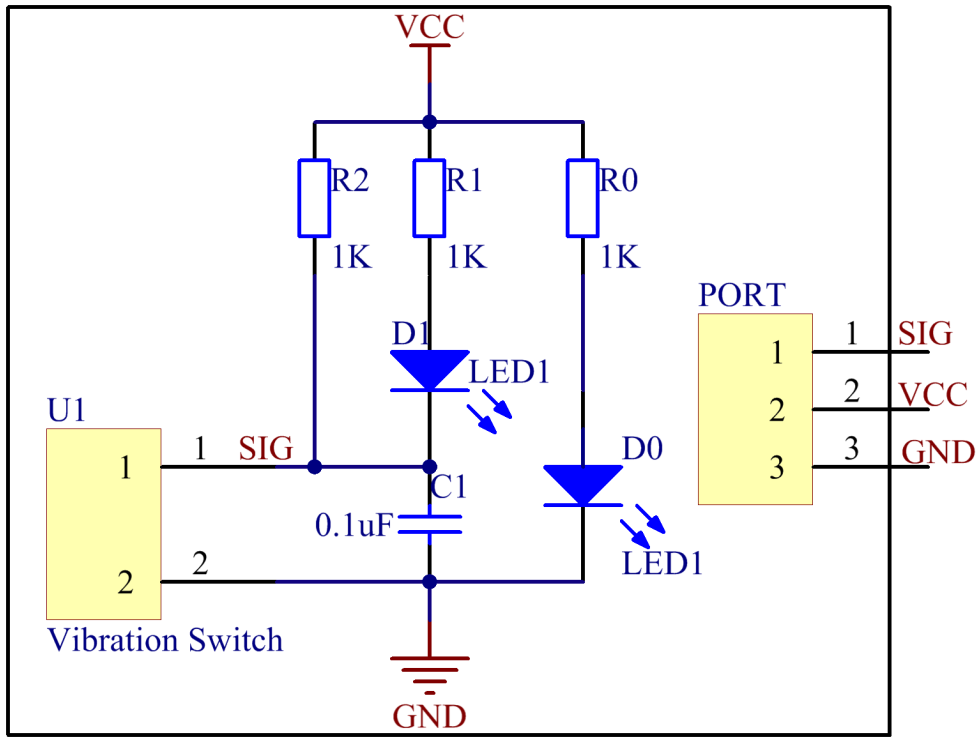

Lesson 8 Vibration Switch 
=========================

**Introduction**

A vibration switch, also called spring switch or shock sensor,
is an electronic switch which induces shock force and transfers the
result to a circuit device thus triggering it to work. It contains the
following parts: conductive vibration spring, switch body, trigger pin,
and packaging agent.

.. image:: media/image12.png
  :width: 200

**Required Components**

- 1 \* Raspberry Pi

- 1 \* Breadboard

- 1 \* Dual-color LED module

- 1 \* Vibration switch module

- 2 \* 3-Pin anti-reverse cable

**Experimental Principle**

In a vibration switch module, the conductive vibration spring and
trigger pin are precisely placed in the switch and fixed by adhesive.
Normally, the spring and the trigger pin are separated. Once the sensor
detects shock, the spring will vibrate and contact with the trigger pin,
thus conducting and generating trigger signals.

In this experiment, connect a dual-color LED module to the Raspberry Pi
to indicate the changes. When you knock or tap the vibration sensor, it
will get turned on and the dual-color LED will flash red. Tap it again
and the LED will change to green – just between the two colors for each
tap or knock. The schematic diagram:

**Experimental Procedures**

**Step 1:** Build the circuit.

+-----------------------+----------------------+-----------------------+
| **Raspberry Pi**      | **GPIO Extension     | **Vibration Switch    |
|                       | Board**              | Module**              |
+-----------------------+----------------------+-----------------------+
| **GPIO0**             | **GPIO17**           | **SIG**               |
+-----------------------+----------------------+-----------------------+
| **3.3V**              | **3V3**              | **VCC**               |
+-----------------------+----------------------+-----------------------+
| **GND**               | **GND**              | **GND**               |
+-----------------------+----------------------+-----------------------+

+-----------------------+----------------------+----------------------+
| **Raspberry Pi**      | **GPIO Extension     | **Dual-Color LED     |
|                       | Board**              | Module**             |
+-----------------------+----------------------+----------------------+
| **GPIO1**             | **GPIO18**           | **R**                |
+-----------------------+----------------------+----------------------+
| **GND**               | **GND**              | **GND**              |
+-----------------------+----------------------+----------------------+
| **GPIO2**             | **GPIO27**           | **G**                |
+-----------------------+----------------------+----------------------+

.. image:: media/image129.png
   :width: 5.2375in
   :height: 5.07778in

**For C Users:**

**Step 2:** Change directory.

.. code-block::

    cd /home/pi/SunFounder_SensorKit_for_RPi2/C/08_vibration_switch/

**Step 3:** Compile.

.. code-block::

    gcc vibration_switch.c -lwiringPi

**Step 4:** Run.

.. code-block::

    sudo ./a.out

**For Python Users:**

**Step 2:** Change directory.

.. code-block::

    cd /home/pi/SunFounder_SensorKit_for_RPi2/Python/

**Step 3:** Run.

.. code-block::

    sudo python3 08_vibration_switch.py

Now tap or knock the module and you can see the dual-color LED flash
red. Tap the sensor again, and the LED will change to green. Each tap or
knock would make it change between red and green.

.. image:: media/image130.jpeg
   :alt: \_MG_2224
   :width: 6.10556in
   :height: 4.52083in