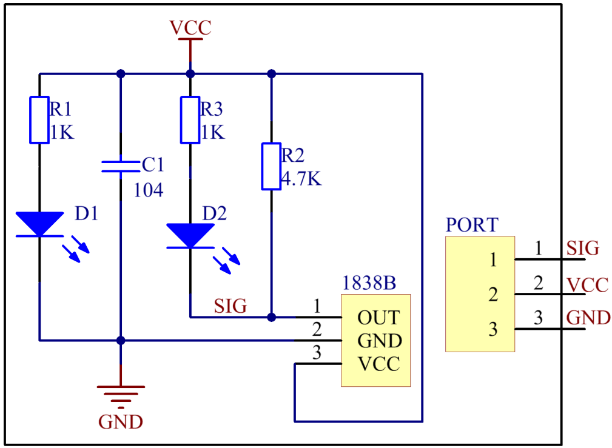

Lesson 9 IR Receiver Module
===========================

**Introduction**

An infrared-receiver (as shown below) is a component which receives
infrared signals and can independently receive infrared rays and output
signals compatible with TTL level. It is similar with a normal
plastic-packaged transistor in size and is suitable for all kinds of
infrared remote control and infrared transmission.

.. image:: media/image13.png
   :alt: IR Receiver
   :width: 1.57361in
   :height: 1.3in

**Required Components**

- 1 \* Raspberry Pi

- 1 \* Breadboard

- 1 \* IR receiver module

- 1 \* IR Remote Controller

- 1 \* 3-Pin anti-reverse cable

**Experimental Principle**

In this experiment, send signals to IR receiver by pressing buttons on
the IR remote controller. The counter will add 1 every time it receives
signals; in other words, the increased number indicates IR signals are
received.

The schematic diagram of the module is as shown below:

**Experimental Procedures**

**Step 1:** Build the circuit.

+-----------------------+----------------------+----------------------+
| **Raspberry Pi**      | **GPIO Extension     | **IR Receiver        |
|                       | Board**              | Module**             |
+-----------------------+----------------------+----------------------+
| **GPIO0**             | **GPIO17**           | **SIG**              |
+-----------------------+----------------------+----------------------+
| **3.3V**              | **3V3**              | **VCC**              |
+-----------------------+----------------------+----------------------+
| **GND**               | **GND**              | **GND**              |
+-----------------------+----------------------+----------------------+

.. image:: media/image132.png
   :width: 5.67292in
   :height: 5.01042in

**For C Users:**

**Step 2:** Change directory.

.. code-block::

    cd /home/pi/SunFounder_SensorKit_for_RPi2/C/09_ir_receiver/

**Step 3:** Compile.

.. code-block::

    gcc ir_receiver.c -lwiringPi

**Step 4:** Run.

.. code-block::

    sudo ./a.out

**For Python Users:**

**Step 2:** Change directory.

.. code-block::

    cd /home/pi/SunFounder_SensorKit_for_RPi2/Python/

**Step 3:** Run.

.. code-block::

    sudo python3 09_ir_receiver.py

Press any key of the remote. Then you can see the LED on the module
blinking, and "Received infrared. cnt = xxx" printed on the screen.
"xxx" means the time you pressed the key(s).

.. image:: media/image133.jpeg
   :alt: \_MG_2421
   :width: 6.72569in
   :height: 5.05347in
